# 3. Exploratory data analysis and visualisation

> Markdown edition of [`notebooks/03_exploratory_data_analysis_and_visualization.ipynb`](../notebooks/03_exploratory_data_analysis_and_visualization.ipynb). Code and outputs are from the notebook's last saved run; to experiment, run the notebook itself.
>
> ← [2. Mathematics essentials: linear algebra, calculus, probability, statistics and information theory](02_mathematics_essentials.md) · [all notebooks](README.md) · [4. Data preprocessing and feature engineering](04_data_preprocessing_and_feature_engineering.md) →

Before a single model is fitted, a data scientist spends hours — often days — simply
*looking* at the data. That is not procrastination; it is where most of the value of a
project is created or lost. Exploratory data analysis (EDA) is how you learn what a row
means, which columns are trustworthy, how the target behaves, which features carry
information about it, and which traps (duplicates, leaked columns, impossible values,
selection effects) are waiting for the unwary. A model trained on data you have not
looked at is a model whose failures you will not understand.

This notebook develops a disciplined EDA workflow and the visual vocabulary that goes with
it. We work through the raw customer-churn table that notebook 1 loaded, take a first look
at a multivariate data set (`load_wine`) and at a time series (`load_energy_demand()`), and
finish with the classic ways in which data and charts mislead. The tools are pandas,
Matplotlib (Hunter, 2007) and seaborn (Waskom, 2021); the attitude comes from Tukey (1977).

**Prerequisites:** notebook 1 (pandas: selection, `groupby`, `pivot_table`, `.dt`/`.str`
accessors) and the descriptive statistics of notebook 2 (mean, variance, quantiles,
correlation).

## Learning objectives

After working through this notebook you will be able to

- run a first-contact inspection of any table (shape, types, memory, summaries, cardinality, missingness, duplicates, inconsistent categories, impossible values) and write down the data-quality findings;
- choose the right univariate plot (histogram, KDE, box, violin, strip, swarm, bar) and know how bin width, log scales and robust statistics change what you see;
- build a kernel density estimate from scratch, choose its bandwidth, and recognise five ways a KDE misleads (hidden structure, invented modes, mass beyond hard limits, smeared point masses, heights read as probabilities);
- detect outliers with the IQR rule and $z$-scores, and explain when each fails;
- compare Pearson, Spearman and Kendall correlation, reproduce Anscombe's quartet, and explain why correlation is neither causation nor the whole story;
- analyse relationships between numeric and categorical variables (grouped box plots, conditional means with confidence intervals, cross-tabs, normalised stacked bars) and carry out target-oriented EDA;
- use pair plots, facets, parallel coordinates and PCA as multivariate lenses;
- explore a time series with resampling, rolling means and seasonal profiles;
- recognise Simpson's paradox, survivorship and selection bias, and misleading axes — and produce charts that follow the grammar of good graphics (Tufte, 2001; Wilke, 2019).

## Setup

```python
import numpy as np
import pandas as pd
import matplotlib.pyplot as plt
import seaborn as sns          # statistical plots on top of matplotlib (KDEs, box/violin plots, heatmaps, pair plots)
from scipy import stats        # correlation coefficients and statistical tests

# course helpers: plot style, colour list, and loaders for the churn table and the hourly energy-demand data
from course_utils import set_style, PALETTE, load_churn, load_energy_demand

RANDOM_STATE = 42
rng = np.random.default_rng(RANDOM_STATE)    # seeded random-number generator (used for jitter and simulations)
set_style()
```

## 1. Why EDA, and what a good chart looks like

John Tukey, who coined the term, described exploratory data analysis as detective work:
looking at the data with an open mind to see what they seem to say, *before* confirmatory
analysis tests specific hypotheses (Tukey, 1977). In a machine-learning project the
detective's questions are concrete:

1. **What is a row?** One customer, one transaction, one customer-month? Are rows
   independent, or grouped (several rows per customer) or ordered in time?
2. **What is the target,** how is it distributed, and could it have leaked into any feature
   (a column that is only known *after* the outcome)?
3. **What is each column** — its type, its unit, its meaning, its plausible range?
4. **What is missing,** how much, and *why* (at random, or for a reason that correlates
   with the target)?
5. **How is each variable distributed?** Skew, modes, outliers, impossible values.
6. **How do variables relate** to each other and to the target?
7. **Is the sample representative** of the population the model will be used on?

The answers drive every later decision: cleaning and imputation (notebook 4), the choice
of metric and validation scheme (notebook 5), feature engineering, and which model family
is even plausible.

### 1.1 The grammar of a good chart

A chart maps data to visual *encodings* — position along an axis, length, area, colour,
shape. Not all encodings are equal: people compare positions on a common scale most
accurately, lengths and angles less so, areas and colour intensities worst of all
(Cleveland & McGill, 1984). That single result explains most rules of thumb: bar charts
and dot plots beat pie charts; a shared axis beats a colour scale; small multiples beat one
crowded panel. Tufte (2001) adds the aesthetic discipline — maximise the *data–ink ratio*,
remove chart junk, do not distort (his "lie factor" is the ratio of the visual effect to the
effect in the data) — and Wilke (2019) is the modern, practical guide to choosing the right
plot for the question. Wickham (2010) formalised the idea of a *layered grammar* in which
data, aesthetic mappings, geometric marks, scales and facets are composed; seaborn's
figure-level functions follow this philosophy.

Every chart in this course follows the same conventions, set by `course_utils.set_style()`:
a colour-blind-safe categorical palette (`PALETTE`, related to the Okabe–Ito palette;
Okabe & Ito, 2008), `viridis` for sequential quantities, `RdBu_r` centred at zero for signed
ones, a title, labelled axes with units, a legend whenever there are two or more series,
and no dual $y$-axes.

> **Real-life examples.** All three kinds of colour scale are on the evening news. Party colours
> on an election map are *categorical*: they name groups and have no order. The shading of a
> rainfall or population-density map is *sequential*: darker means more. A map of temperature
> *anomalies* is *diverging*: blue for colder and red for warmer than the long-term average, with
> white for "normal" — exactly how `RdBu_r` shows negative and positive correlations.

```python
# three panels side by side; width_ratios makes the first one twice as wide as the others
fig, axes = plt.subplots(1, 3, figsize=(15, 1.6), gridspec_kw={"width_ratios": [2, 1, 1]})
axes[0].bar(range(len(PALETTE)), np.ones(len(PALETTE)), color=PALETTE, width=0.9)   # one equal-height bar per colour
axes[0].set_title("PALETTE: categorical (classes, groups)")
gradient = np.linspace(0, 1, 256)[None, :]     # [None, :] adds a first axis: shape (1, 256), a one-row "image"
axes[1].imshow(gradient, aspect="auto", cmap="viridis")    # aspect="auto" stretches the single row to fill the panel
axes[1].set_title("viridis: sequential (counts, magnitudes)")
axes[2].imshow(gradient, aspect="auto", cmap="RdBu_r")     # the "_r" suffix reverses a colour map (red = high)
axes[2].set_title("RdBu_r: diverging (correlations, signed effects)")
for ax in axes:
    ax.set_xticks([])
    ax.set_yticks([])
    ax.grid(False)
plt.show()
```

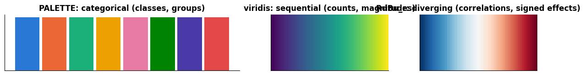

## 2. Data at first sight

We take the churn table exactly as it comes out of the export — `load_churn(raw=True)`,
the same file as `../data/customer_churn.csv` — and interrogate it before trusting it.

> **Real-life example.** Picture a broadband and TV provider with a few million subscribers. At
> the end of every month its data team exports one row per customer from the billing and CRM
> (customer-relationship management) systems, and the retention team asks: *who is about to
> cancel*, so that someone can call them with an offer before they leave? Our 5 000-row file is a
> small synthetic version of such an export. The same table exists in every subscription
> business — mobile contracts, streaming services, gyms, insurance policies, software licences.

What each column means in that setting:

| column | meaning in the business |
|---|---|
| `customer_id` | the account number printed on the invoice |
| `signup_date` | the day the contract started |
| `region` | the sales region of the customer's address |
| `senior_citizen`, `has_partner` | 1 if the customer is a senior citizen / lives with a partner (from the sign-up form) |
| `tenure_months` | how many months the customer has been paying |
| `contract` | month-to-month (can cancel any time), one-year or two-year commitment |
| `payment_method` | how the bill is paid: electronic check, bank transfer, credit card or mailed check |
| `internet_service` | the broadband plan: none, DSL (over the copper telephone line) or fibre optic |
| `tech_support`, `streaming` | 1 if the customer has booked the technical-support or streaming add-on |
| `monthly_charges` | the current monthly bill |
| `total_charges` | everything billed since sign-up |
| `support_tickets` | how often the customer contacted support (faults, complaints, billing questions) |
| `churned` | the target: 1 if the customer cancelled |

```python
raw = load_churn(raw=True)        # the CSV exactly as shipped, with all its problems
print("shape:", raw.shape)
# memory_usage(deep=True) also counts the text stored in string columns; .sum() adds up all columns (bytes -> kB)
print(f"memory: {raw.memory_usage(deep=True).sum() / 1e3:.0f} kB")
print(raw.dtypes.to_string())     # .to_string() prints every row instead of an abbreviated view
display(raw.head(3))              # display() renders a table even when it is not the last line of the cell
raw.sample(3, random_state=RANDOM_STATE)      # a random sample is often more revealing than the first rows
```

```text
shape: (5005, 15)
memory: 808 kB
customer_id                    str
signup_date         datetime64[us]
region                         str
senior_citizen               int64
has_partner                  int64
tenure_months                int64
contract                       str
payment_method                 str
internet_service               str
tech_support                 int64
streaming                    int64
monthly_charges            float64
total_charges              float64
support_tickets              int64
churned                      int64
```

|  | customer_id | signup_date | region | senior_citizen | has_partner | tenure_months | contract | payment_method | internet_service | tech_support | streaming | monthly_charges | total_charges | support_tickets | churned |
|---|---|---|---|---|---|---|---|---|---|---|---|---|---|---|---|
| 0 | C00001 | 2023-01-26 | North | 0 | 0 | 17 | One year | Bank transfer | DSL | 0 | 0 | 52.96 | 880.42 | 0 | 0 |
| 1 | C00002 | 2023-12-15 | South | 0 | 1 | 6 | Month-to-month | Bank transfer | Fiber optic | 1 | 0 | 92.90 | NaN | 1 | 1 |
| 2 | C00003 | 2023-11-02 | West | 1 | 1 | 8 | Two year | Electronic check | Fiber optic | 0 | 0 | 84.57 | 696.84 | 2 | 1 |

|  | customer_id | signup_date | region | senior_citizen | has_partner | tenure_months | contract | payment_method | internet_service | tech_support | streaming | monthly_charges | total_charges | support_tickets | churned |
|---|---|---|---|---|---|---|---|---|---|---|---|---|---|---|---|
| 3704 | C03705 | 2024-02-14 | North | 0 | 0 | 4 | Month-to-month | Electronic check | Fiber optic | 1 | 0 | 91.36 | 381.52 | 1 | 1 |
| 3253 | C03254 | 2024-03-27 | South | 0 | 1 | 3 | Month-to-month | Electronic check | No | 0 | 0 | 20.34 | 59.79 | 2 | 1 |
| 4420 | C04421 | 2024-04-29 | South | 0 | 1 | 2 | Month-to-month | Credit card | DSL | 0 | 1 | 69.76 | 138.55 | 1 | 1 |

`head()` shows the first rows, which are often unrepresentative (sorted by date, or by
ID); `sample()` gives a random glimpse; `tail()` catches trailing junk such as summary
rows. Next, the summaries — numeric columns with `describe()`, text columns with the number
of distinct values and the most frequent one:

```python
# describe() summarises every numeric (and date) column: count, mean, std, min, quartiles, max; .T puts columns in rows
display(raw.describe().T.round(2))
text_cols = raw.select_dtypes(include=["str", "object"]).columns    # the names of the text columns
# one row per text column: number of distinct values, most frequent value, its count, and up to four example values
summary = pd.DataFrame({
    "n_unique": raw[text_cols].nunique(),
    "top": raw[text_cols].mode().iloc[0],            # mode() lists the most frequent value(s); row 0 is the first
    "top_freq": [raw[c].value_counts().iloc[0] for c in text_cols],   # value_counts() is sorted, so .iloc[0] is the top
    # .unique() keeps the distinct values in order of appearance; map(str, ...) converts them so join() can glue them
    "examples": [", ".join(map(str, raw[c].unique()[:4])) for c in text_cols],
})
summary
```

|  | count | mean | min | 25% | 50% | 75% | max | std |
|---|---|---|---|---|---|---|---|---|
| signup_date | 5005 | 2022-02-07 02:48:01.438561 | 2018-07-03 00:00:00 | 2021-01-26 00:00:00 | 2022-07-14 00:00:00 | 2023-06-19 00:00:00 | 2024-06-30 00:00:00 | NaN |
| senior_citizen | 5005.0 | 0.158841 | 0.0 | 0.0 | 0.0 | 0.0 | 1.0 | 0.365564 |
| has_partner | 5005.0 | 0.483716 | 0.0 | 0.0 | 0.0 | 1.0 | 1.0 | 0.499785 |
| tenure_months | 5005.0 | 28.645954 | 0.0 | 12.0 | 23.0 | 41.0 | 72.0 | 20.637069 |
| tech_support | 5005.0 | 0.290709 | 0.0 | 0.0 | 0.0 | 1.0 | 1.0 | 0.454135 |
| streaming | 5005.0 | 0.367433 | 0.0 | 0.0 | 0.0 | 1.0 | 1.0 | 0.482154 |
| monthly_charges | 5005.0 | 69.474653 | 15.0 | 55.01 | 71.59 | 91.79 | 999.0 | 35.697261 |
| total_charges | 4851.0 | 1984.953354 | 15.54 | 647.255 | 1422.91 | 2846.665 | 9028.77 | 1734.292326 |
| support_tickets | 5005.0 | 1.00979 | 0.0 | 0.0 | 1.0 | 2.0 | 8.0 | 1.156129 |
| churned | 5005.0 | 0.326474 | 0.0 | 0.0 | 0.0 | 1.0 | 1.0 | 0.46897 |

|  | n_unique | top | top_freq | examples |
|---|---|---|---|---|
| customer_id | 5000 | C00706 | 2 | C00001, C00002, C00003, C00004 |
| region | 8 | West | 1267 | North, South, West, East |
| contract | 3 | Month-to-month | 2795 | One year, Month-to-month, Two year |
| payment_method | 4 | Electronic check | 1694 | Bank transfer, Electronic check, Mailed check,... |
| internet_service | 3 | Fiber optic | 2115 | DSL, Fiber optic, No |

Read summaries like a detective. `customer_id` has 5 000 distinct values in 5 005 rows —
duplicates. `region` has 8 distinct values where 4 are expected. `monthly_charges` has a
maximum of 999 while its 75th percentile is below 100. `total_charges` has 4 851 non-null
values out of 5 005. `tenure_months` runs from 0 to 72 — is 72 a real maximum or a cap?
Each of these is a lead to follow.

> **Real-life example.** Each of these leads has an everyday cause in a real company. Duplicated
> rows appear when an export job runs twice, or when two customer databases are merged after an
> acquisition. "South" and "south" appear when staff type a field by hand instead of picking it
> from a list. 999 is a typical placeholder that an old billing system writes for "unknown"
> (surveys and medical records use 99, 999 or −1 the same way). And a hard maximum of 72 months
> suggests that the system keeps only six years of history, or that older contracts were migrated
> with a capped start date.

### 2.1 Missingness

Counting missing values is the first step; the second is finding out **whether the
missingness has structure**. A *missingness matrix* — rows × columns, coloured where a
value is absent — makes patterns visible, especially after sorting the rows by a candidate
explanatory variable. Whether values are missing completely at random (MCAR), at random
given the observed data (MAR), or not at random (MNAR; Rubin, 1976) decides which
imputation strategies are valid (notebook 4).

> **Real-life examples.**
> - *MCAR:* a laboratory drops a few blood samples at random, so those results are missing for
>   reasons unrelated to anything about the patients.
> - *MAR:* in an online health survey, older people skip the question about daily screen time more
>   often. Age is recorded, and among people of the same age the gaps are random.
> - *MNAR:* people with very high incomes leave the income field empty more often than others —
>   the missingness depends on the very value that is missing, and no other column explains it.

```python
missing = raw.isna()                      # a True/False frame: True where a value is missing
counts = missing.sum()                    # True counts as 1, so this is the number of missing values per column
print("missing values per column:")
print(counts[counts > 0].to_string())
# .any(axis=1) is True for rows with at least one missing value; its .mean() is the share of such rows
print(f"rows with any missing value: {missing.any(axis=1).sum()} ({missing.any(axis=1).mean():.1%})")

# np.argsort returns the row positions that would sort the column; "stable" keeps tied rows in their original order
order = np.argsort(raw["tenure_months"].to_numpy(), kind="stable")          # sort rows by tenure
fig, axes = plt.subplots(1, 2, figsize=(14, 3.6), gridspec_kw={"width_ratios": [3, 1]})
# reorder the rows, then transpose so that every column of the table becomes one horizontal line of pixels
axes[0].imshow(missing.to_numpy()[order].T, aspect="auto", cmap="Greys", interpolation="nearest")
axes[0].set_yticks(range(raw.shape[1]))
axes[0].set_yticklabels(raw.columns, fontsize=8)
axes[0].set_xlabel("rows, sorted by tenure_months (ascending)")
axes[0].set_title("Missingness matrix (black = missing)")
axes[0].grid(False)
# [::-1] reverses the order, so that barh (which draws from the bottom up) lists the first column at the top
axes[1].barh(counts.index[::-1], (counts / len(raw) * 100)[::-1], color=PALETTE[1])
axes[1].set_xlabel("% missing")
axes[1].set_title("Missing values per column")
axes[1].tick_params(axis="y", labelsize=8)
plt.show()

# pd.crosstab counts the rows for each combination of the two True/False conditions
print(pd.crosstab(raw["tenure_months"] == 0, raw["total_charges"].isna(),
                  rownames=["tenure == 0"], colnames=["total_charges missing"]))
```

```text
missing values per column:
total_charges    154
rows with any missing value: 154 (3.1%)
```

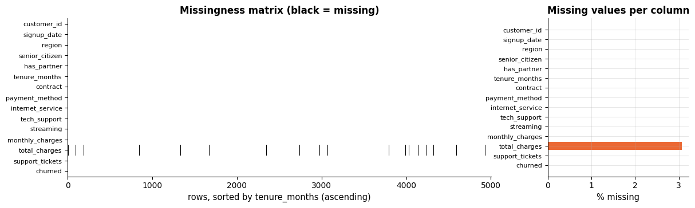

```text
total_charges missing  False  True 
tenure == 0                        
False                   4851    138
True                       0     16
```

Only `total_charges` is affected, but not at random: *every* customer with zero tenure has
no total charge (no invoice has been issued yet — a structural, perfectly explainable gap),
plus about 3 % of the others, scattered evenly. The two mechanisms deserve different
treatment: the first is really "0 so far", the second is a random gap that can be imputed.

### 2.2 Duplicates, inconsistent categories and impossible values

```python
# .duplicated() marks rows that repeat an earlier row (whole row, or here also just the customer_id column)
print(f"exact duplicate rows: {raw.duplicated().sum()}; duplicated customer_id: {raw['customer_id'].duplicated().sum()}")
print("\nregion spellings:", raw["region"].value_counts().to_dict())    # {value: count} for every distinct value
print("\ncustomers with monthly_charges > 200:")
display(raw.loc[raw["monthly_charges"] > 200, ["customer_id", "internet_service", "monthly_charges", "total_charges", "tenure_months"]])
print("tenure of 72 months (the maximum):", (raw["tenure_months"] == 72).sum(), "customers -> a cap, not a coincidence")
# a cross-column check: the total bill should be roughly monthly charge x months; keep three entries of describe()
consistency = (raw["total_charges"] / (raw["monthly_charges"] * raw["tenure_months"])).describe()[["min", "50%", "max"]]
print("\ntotal_charges / (monthly_charges x tenure) — should be about 1:", consistency.round(3).to_dict())
```

```text
exact duplicate rows: 5; duplicated customer_id: 5

region spellings: {'West': 1267, 'East': 1259, 'North': 1242, 'South': 1187, 'south': 17, 'east': 12, 'west': 12, 'north': 9}

customers with monthly_charges > 200:
```

|  | customer_id | internet_service | monthly_charges | total_charges | tenure_months |
|---|---|---|---|---|---|
| 1111 | C01112 | DSL | 999.0 | 143.07 | 2 |
| 1821 | C01822 | No | 999.0 | 171.87 | 8 |
| 3616 | C03617 | Fiber optic | 999.0 | 279.44 | 3 |

```text
tenure of 72 months (the maximum): 370 customers -> a cap, not a coincidence

total_charges / (monthly_charges x tenure) — should be about 1: {'min': 0.022, '50%': 1.001, 'max': 1.05}
```

Every finding goes into a **data-quality log**: what was found, how it was diagnosed,
what was decided. For the rest of this notebook we apply the three fixes that are beyond
doubt — drop the exact duplicates, normalise the spelling of `region`, and treat the
impossible `monthly_charges` values as missing — which is exactly what `load_churn()`
does. Everything else (imputation, the tenure cap, type conversions) is the business of
notebook 4.

```python
# a method chain, one step per line (the outer brackets let the expression span several lines):
#   drop_duplicates(subset=...) keeps the first row of each customer_id
#   assign(...) replaces two columns: .str.strip() removes surrounding spaces and .str.title() capitalises
#   ("south" -> "South"); .mask(cond) replaces the values where cond is True with NaN
#   reset_index(drop=True) renumbers the rows 0..n-1 and discards the old row numbers
df = (raw.drop_duplicates(subset="customer_id")
         .assign(region=lambda d: d["region"].str.strip().str.title(),
                 monthly_charges=lambda d: d["monthly_charges"].mask(d["monthly_charges"] > 200))
         .reset_index(drop=True))
print("after light cleaning:", df.shape, "| regions:", sorted(df["region"].unique()),
      "| max monthly_charges:", df["monthly_charges"].max())
print(f"churn rate (the base rate every later comparison is measured against): {df['churned'].mean():.3f}")
```

```text
after light cleaning: (5000, 15) | regions: ['East', 'North', 'South', 'West'] | max monthly_charges: 120.16
churn rate (the base rate every later comparison is measured against): 0.326
```

## 3. Univariate analysis

### 3.1 Histograms and density estimates

A histogram counts observations in bins; its shape depends on the bin width more than most
people expect. Too few bins hide structure, too many show noise. Always try several — the
default (`bins="auto"`, a compromise between the Sturges and Freedman–Diaconis rules) is a
starting point, not an answer. A **kernel density estimate** (KDE) smooths the histogram
with a Gaussian kernel; its bandwidth plays the role of the bin width, and it can invent
mass where none exists (negative charges, values beyond a hard boundary). Section 3.6
builds a KDE from scratch and shows what it hides and what it invents.

```python
x = df["monthly_charges"].dropna()        # .dropna() removes the missing values
fig, axes = plt.subplots(1, 4, figsize=(17, 3.5), sharey=False)
for ax, bins in zip(axes[:3], [5, 30, 200]):      # the same data with three different numbers of bins
    ax.hist(x, bins=bins, color=PALETTE[0], alpha=0.85)
    ax.set_title(f"{bins} bins")
    ax.set_xlabel("monthly charges")
axes[0].set_ylabel("count")
# sns.kdeplot draws a smoothed density curve; bw_adjust multiplies the automatically chosen bandwidth
sns.kdeplot(x, ax=axes[3], color=PALETTE[1], lw=2, label="KDE (default bandwidth)")
sns.kdeplot(x, ax=axes[3], color=PALETTE[2], lw=2, bw_adjust=0.3, label="KDE, bandwidth x 0.3")
axes[3].set_title("kernel density estimates")
axes[3].set_xlabel("monthly charges")
axes[3].legend(fontsize=8)
plt.show()
```

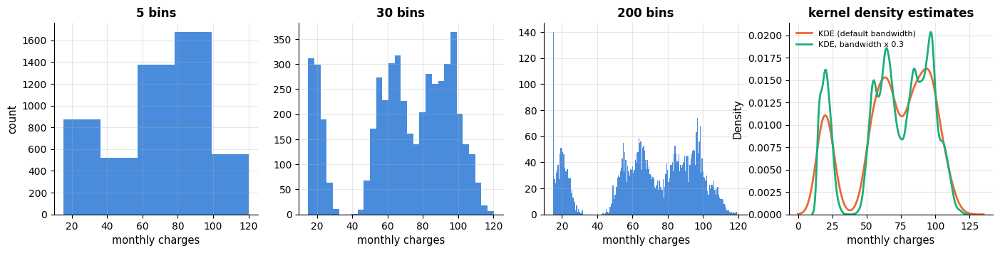

With 5 bins the distribution looks like one broad hump; with 30 it is clearly **trimodal**,
with modes near 20, 65 and 95 — one per internet plan (none, DSL, fibre). The DSL and fibre
modes sit about 10 above those plans' base prices of 55 and 85, because most of their
customers also pay for add-ons; section 3.6 takes the prices apart. A summary statistic such
as "mean 69" would have described no actual customer.

> **Real-life examples.** Several modes appear whenever a variable mixes groups: the ages of
> visitors to a playground (young children and their parents, almost nobody in between), or the
> times at which a café sells coffee (a morning and a lunchtime peak). In each case the average
> describes nobody, and the useful next step is to find the variable that defines the groups —
> here, the internet plan.

### 3.2 Skewed data and log scales

Many quantities — incomes, charges accumulated over time, counts, file sizes — are
**right-skewed**: most values are small, a few are huge, and the mean is dragged above the
median. On a linear axis such data pile up at the left; a **logarithmic axis** (or a
log-transformed variable) spreads them out and often reveals a roughly symmetric shape.
Notebook 4 uses log and Box–Cox transforms as preprocessing for exactly this reason.
Counts with a small range (support tickets: 0 to 8) are discrete and belong in a bar chart
of value counts, not a histogram with arbitrary bins.

> **Real-life example.** Total charges are skewed for the same reason as household wealth: they
> *accumulate over time*, so the many recent customers have small totals and the few long-standing
> ones have large totals. Support tickets behave like the number of goals in a football match or
> the number of children in a family: a small whole number, best shown as one bar per value.

```python
total = df["total_charges"].dropna()
fig, axes = plt.subplots(1, 3, figsize=(16, 3.5))
axes[0].hist(total, bins=40, color=PALETTE[0])
axes[0].axvline(total.mean(), color=PALETTE[1], label=f"mean {total.mean():.0f}")      # vertical reference lines
axes[0].axvline(total.median(), color=PALETTE[2], label=f"median {total.median():.0f}")
# .skew() is the sample skewness: > 0 means a long right tail
axes[0].set_title(f"total charges — linear scale (skewness {total.skew():.2f})")
axes[0].set_xlabel("total charges")
axes[0].legend()
# bins can also be a list of edges: np.logspace(1, 4, 40) gives 40 edges from 10 to 10 000, evenly spaced on a log scale
axes[1].hist(total[total > 0], bins=np.logspace(1, 4, 40), color=PALETTE[0])
axes[1].set_xscale("log")
axes[1].set_title("total charges — log-spaced bins on a log axis")
axes[1].set_xlabel("total charges (log scale)")
tickets = df["support_tickets"].value_counts().sort_index()     # customers per number of tickets, ordered 0, 1, 2, ...
axes[2].bar(tickets.index, tickets.values, color=PALETTE[0])
axes[2].set_title("support tickets — a discrete count")
axes[2].set_xlabel("tickets")
for ax in axes:
    ax.set_ylabel("customers")
plt.show()
```

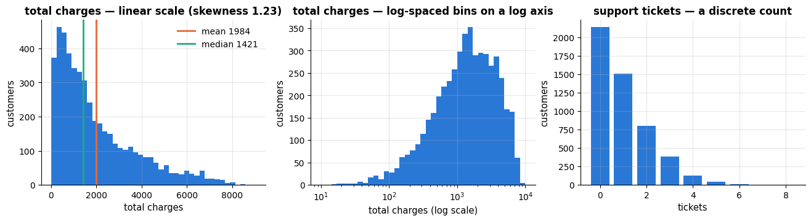

### 3.3 Box, violin, strip and swarm plots

A **box plot** summarises a distribution with five numbers: the median (line), the first
and third quartiles (box edges — the box spans the interquartile range, IQR), whiskers to
the most extreme points within $1.5 \times$ IQR of the box, and individual markers beyond
that ("outliers" by this convention). It is compact and excellent for comparing many
groups side by side — but it cannot show *shape*. A **violin plot** draws a KDE (built from
scratch in section 3.6) on each side and reveals modes. Use the box for many groups, the
violin when shape matters, and overlay the raw points (`stripplot`/`swarmplot`) when there
are few observations.

> **Real-life example.** A delivery company compares the delivery times of its 40 depots with 40
> box plots side by side — median and spread at a glance. But if one depot sends half its parcels
> by express (1 day) and half by standard post (4 days), its median sits around 2–3 days,
> where hardly any parcel actually arrives; only a violin (or a histogram) shows the two peaks.

```python
fig, axes = plt.subplots(1, 2, figsize=(12, 3.6))
sns.boxplot(x=x, ax=axes[0], color=PALETTE[0], width=0.4)    # passing the data as x= draws a horizontal box
axes[0].set_title("box plot: the three modes are invisible")
# inner="quartile" draws the quartiles as lines inside the violin; cut=0 stops the density at the data's min and max
sns.violinplot(x=x, ax=axes[1], color=PALETTE[2], inner="quartile", cut=0)
axes[1].set_title("violin plot: the same data, with its shape")
for ax in axes:
    ax.set_xlabel("monthly charges")
plt.show()
```

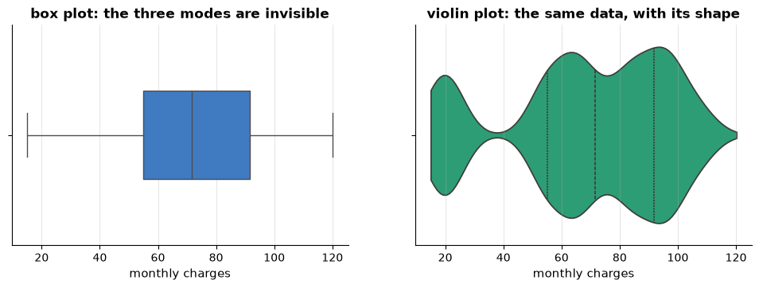

**Reading a violin.** The value axis is the same as the box plot's: in the horizontal violin
above it is the x-axis, monthly charges. The other axis — here the y-axis — is the *thickness*
axis: at every charge value the violin is as thick as the estimated density of customers at
that value, drawn once above and once below the centre line. The outline is therefore the KDE
of section 3.1, laid along the value axis and mirrored (Hintze & Nelson, 1998). The thickness
axis carries no numbers: it is seaborn's *category* axis, one slot per group labelled with the
group's name, and with `x=x` and no grouping column there is a single unnamed group, hence the
one blank tick mark at its centre. Numbers would not help anyway, because the curve is
rescaled to fit the slot: its widest point spans 0.8 of the slot (the default `width=0.8`,
±0.4 around the centre line; the box plot above was given `width=0.4` and is half as thick).
Read the thickness as "how crowded is it here": the violin is widest around 93, in the fibre
bulge — above that plan's base price of 85, because most fibre customers also pay for add-ons
(section 3.6) — and pinched to almost nothing near 38, where hardly anybody pays; the three
bulges are the three internet plans of section 3.1. The dashed lines are the quartiles
(`inner="quartile"`; the middle one is the median, 71.6), and `cut=0` ends the outline at the
smallest and largest charge instead of letting the smoothing run past them. Three details of
the smoothing matter:

- the thickness is a *density*, not a count or a probability — a rate per currency unit, so
  probabilities are areas (section 3.6);
- violins drawn side by side are each scaled to the same area by default
  (`density_norm="area"`), so a group of 50 customers looks as fat as one of 5 000;
  `density_norm="count"` makes the width grow with the group size;
- the outline is only as good as its bandwidth: Scott's rule gives about 5 currency units
  here, which smears the 116 customers at exactly 15.00 into the first bulge (`bw_adjust`
  changes it; section 3.6).

The next cell builds the depot of the example above — half express, half standard post — and
draws its box plot, its violin and the KDE curve the violin is made of.

> **Real-life example.** An airline draws the arrival delays of 10 000 flights as a violin: a
> fat bulge around zero, where most flights land within a few minutes of schedule, and a thin
> stem reaching up to several hours. The length of the stem says how late a flight *can* be,
> its thinness how rare that is — what the operations team needs to decide how many spare
> crews to keep on standby. A box plot gives the same range, but not how thin the stem is.

```python
# e.g. one depot's parcels: half go by express (about 1 day), half by standard post (about 4 days)
toy_rng = np.random.default_rng(RANDOM_STATE)    # a generator of its own, so the notebook's rng stays untouched
days = np.concatenate([toy_rng.normal(1.0, 0.25, 50),   # 50 express parcels: mean 1 day, standard deviation 0.25 days
                       toy_rng.normal(4.0, 0.40, 50)])  # 50 standard parcels: mean 4 days, standard deviation 0.4 days

fig, axes = plt.subplots(1, 3, figsize=(14, 3.8), sharey=True)  # sharey=True: delivery days on one common y-axis
# y= (instead of x= as above) draws a vertical box: the y-axis is now the value axis
sns.boxplot(y=days, ax=axes[0], color=PALETTE[0], width=0.4)
axes[0].set_title("box plot: the box spans the empty gap")
sns.violinplot(y=days, ax=axes[1], color=PALETTE[2], inner="quartile", cut=0)
axes[1].set_title("violin: width = density of parcels")
# the violin's outline is this curve, drawn once on each side: kdeplot with y= puts the values on the y-axis
# and the density on the x-axis; fill=True shades the area under the curve
sns.kdeplot(y=days, ax=axes[2], color=PALETTE[2], lw=2, cut=0, fill=True)
axes[2].set_title("the KDE behind the violin, rotated")
axes[2].set_xlabel("density (per day)")
axes[0].set_ylabel("delivery time (days)")
plt.tight_layout()
plt.show()

# the numbers behind the picture: the box plot's median sits in the violin's neck
q1, median, q3 = np.percentile(days, [25, 50, 75])   # the values below which 25 %, 50 % and 75 % of the parcels lie
print(f"median {median:.1f} days, quartiles {q1:.1f} and {q3:.1f} days")
# stats.gaussian_kde is the estimator inside violinplot and kdeplot; its default bandwidth is Scott's rule
# (called toy_kde rather than kde, because section 3.6 defines a kde() function of its own)
toy_kde = stats.gaussian_kde(days)
peak = toy_kde(np.linspace(days.min(), days.max(), 200)).max()  # largest density on a fine grid: the widest point
for t in [1.0, median, 4.0]:    # at the two services' means (the bulges) and at the median (the neck)
    density = toy_kde(t)[0]     # toy_kde(t) returns a one-element array: the estimated density at t
    share = density / peak      # relative to the peak, the density is the violin's width at t
    print(f"density at {t:.1f} days: {density:.3f}  ->  the violin is {share:.0%} as wide as at its widest point")
```

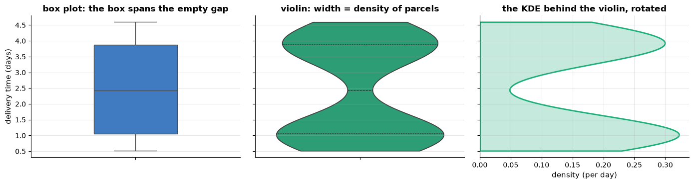

```text
median 2.4 days, quartiles 1.0 and 3.9 days
density at 1.0 days: 0.322  ->  the violin is 100% as wide as at its widest point
density at 2.4 days: 0.048  ->  the violin is 15% as wide as at its widest point
density at 4.0 days: 0.298  ->  the violin is 92% as wide as at its widest point
```

The depot's box plot puts the median at 2.4 days and the box from 1.0 to 3.9 days — the same
three numbers as the dashed lines inside the violin. The median sits in the violin's neck,
where the density is 15 % of its peak and hardly a parcel arrives; the box spans the empty
gap, from one bulge to the other. The violin itself is a dumbbell: widest at 1 day, almost as
wide (92 %) at 4 days, thin in between. The third panel is the violin's recipe: the KDE curve
of the delivery times with the values on the y-axis; the violin is that curve drawn twice,
mirrored around its centre line. The box plot is not wrong here, only mute — its five numbers
do not show whether the parcels form two peaks or one broad hump, and that difference is
exactly what the violin adds.

**Strip and swarm plots** give up summarising altogether and draw *every observation* as a dot.
A **strip plot** places the dots along the value axis and spreads them sideways by a random
*jitter*, so that equal values do not hide each other. A **swarm plot** (also called a
*beeswarm*) moves each dot sideways just far enough that no two overlap, so the width of the
swarm traces the shape of the distribution, like a violin made of points. Because every dot is
one row, it can also carry a colour for a third variable. Both are meant for tens to a few
hundred points per group, so we draw a random sample of 150 customers and split them by internet
plan — the variable behind the three modes of section 3.1.

> **Real-life example.** A clinical pilot study with 25 patients per treatment group: with so few
> patients every individual counts, and a box plot of 25 values hides how many of them actually
> improved. A strip or swarm plot shows each patient — and colouring the dots by sex or age group
> shows at a glance whether the patients who responded have something in common.

```python
# 150 random customers: strip and swarm plots draw every point, so they suit tens to a few hundred points per group;
# .assign adds a text column "status", so that the legend reads "stayed"/"churned" instead of 0/1
few = (df.dropna(subset=["monthly_charges"])
         .sample(150, random_state=RANDOM_STATE)
         .assign(status=lambda d: d["churned"].map({0: "stayed", 1: "churned"})))
plans = ["No", "DSL", "Fiber optic"]                 # order of the groups along the x-axis, cheapest plan first
fig, axes = plt.subplots(1, 3, figsize=(16, 4.2), sharey=True)    # sharey=True: all three panels use the same y-range

# sns.stripplot: one dot per customer; jitter=0.25 moves each dot sideways by a random amount of up to ±0.25
# (neighbouring groups are 1 apart); alpha=0.7 makes dots that still overlap show up darker
sns.stripplot(data=few, x="internet_service", y="monthly_charges", order=plans, ax=axes[0],
              color=PALETTE[0], jitter=0.25, size=4, alpha=0.7)
axes[0].set_title("strip plot: one dot per customer, jittered sideways")

# sns.swarmplot: moves the dots just far enough apart that none overlap; hue= colours each dot by the status column
sns.swarmplot(data=few, x="internet_service", y="monthly_charges", order=plans, ax=axes[1],
              hue="status", palette={"stayed": PALETTE[0], "churned": PALETTE[1]}, size=4)
axes[1].set_title("swarm plot: no overlap, coloured by churn")
axes[1].legend(title="")

# the most common combination: a box plot for the summary with the raw points on top; fill=False draws only the
# outline, showfliers=False leaves out the box plot's own outlier markers, as the strip plot shows every point anyway
sns.boxplot(data=few, x="internet_service", y="monthly_charges", order=plans, ax=axes[2],
            color="gray", fill=False, showfliers=False, width=0.5)
sns.stripplot(data=few, x="internet_service", y="monthly_charges", order=plans, ax=axes[2],
              color=PALETTE[2], jitter=0.15, size=3.5, alpha=0.7)
axes[2].set_title("box plot + strip plot: summary and raw data")

for ax in axes:
    ax.set_xlabel("internet service")
axes[0].set_ylabel("monthly charges")
plt.tight_layout()
plt.show()
```

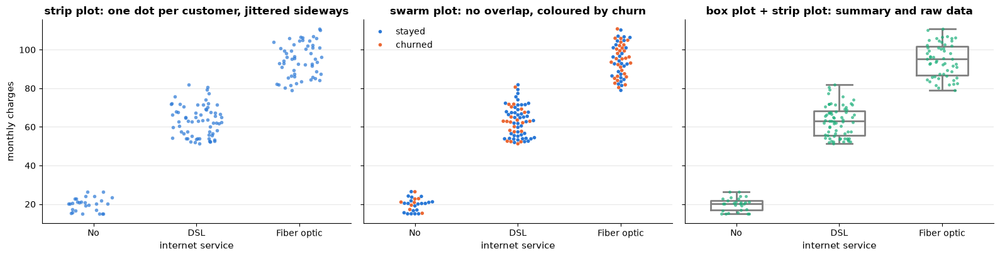

The three clouds are the three modes of section 3.1, now explained: each plan has its own price
band, and on DSL and fibre the add-ons spread the charges over about 30 units. The swarm plot adds
what no box plot can show — the individual customers, coloured: churned customers are far more
frequent on the fibre plan (about half of the 55 fibre customers in this sample, against fewer
than a third on DSL or without internet). The price of the strip plot's random jitter is that
the sideways position means nothing and crowded dots still overlap; the width of the swarm, by
contrast, shows where the values are dense. Try either with all 5 000 customers and it breaks
down: the strip turns into solid bars, and seaborn warns that it cannot place most of the
swarm's points. For large groups go back to box plots, violins or histograms — or overlay the
points of a sample, as here.

### 3.4 Categorical variables

For a categorical variable the "distribution" is a table of counts. Bar charts with
categories sorted by frequency (or in their natural order for ordinal variables) are the
right display; horizontal bars leave room for long labels. Pie charts encode the same
information as angles and areas, which readers judge poorly — avoid them.

> **Real-life example.** A city council plans its bus timetable from a survey question: "How do
> you usually get to work?" — car, bus, bicycle, on foot, train. A sorted bar chart with the share
> written next to each bar reads instantly; the same answers as a pie chart force readers to
> compare five slice angles, which they do badly.

```python
cat_cols = ["contract", "internet_service", "payment_method", "region"]
fig, axes = plt.subplots(1, 4, figsize=(17, 3.4))
for ax, col in zip(axes, cat_cols):
    vc = df[col].value_counts()                       # counts per category, largest first
    ax.barh(vc.index[::-1], vc.values[::-1], color=PALETTE[0])   # reversed, so the largest bar ends up at the top
    ax.set_title(col)
    ax.set_xlabel("customers")
    for i, v in enumerate(vc.values[::-1]):
        ax.text(v, i, f" {v / len(df):.0%}", va="center", fontsize=9)   # the share, written just right of each bar
    ax.set_xlim(0, vc.max() * 1.25)                   # room for the labels
plt.tight_layout()
plt.show()
```

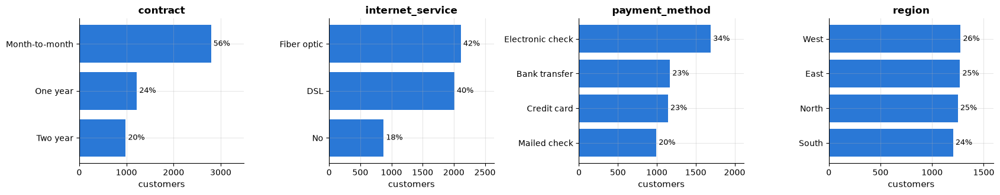

### 3.5 Robust statistics and outlier detection

The mean and the standard deviation are the right summaries for roughly symmetric,
well-behaved data — and the wrong ones as soon as a few extreme values appear, because a
single point can move them arbitrarily far. **Robust** alternatives have a *breakdown
point*: the median and the IQR are unaffected until more than 25 % (median: 50 %) of the
data are corrupted, and the **median absolute deviation** $`\operatorname{MAD} = \operatorname{median}(|x_i - \operatorname{median}(x)|)`$ (multiplied by 1.4826 to estimate
$\sigma$ for Gaussian data) is a robust scale. Compare the raw column, with its three
values of 999, to the cleaned one:

> **Real-life example.** Ten people in a café each own about 100 000 in savings and property.
> When a billionaire walks in, the *mean* wealth in the room jumps to about 91 million, while the
> *median* — the sixth richest of the eleven — stays at about 100 000. This is why statistics
> offices report median household income and wealth, not the mean.

```python
def summarise(s):
    """Classical and robust summaries of a numeric Series (missing values ignored), returned as a Series."""
    s = s.dropna()
    return pd.Series({"mean": s.mean(), "median": s.median(), "std": s.std(),
                      "IQR": s.quantile(0.75) - s.quantile(0.25),        # interquartile range Q3 - Q1
                      "MAD x 1.4826": 1.4826 * (s - s.median()).abs().median()})   # median absolute deviation, scaled

# a dict of Series becomes a DataFrame with one column per key
pd.DataFrame({"raw (3 values of 999)": summarise(raw["monthly_charges"]),
              "cleaned": summarise(df["monthly_charges"])}).round(2)
```

|  | raw (3 values of 999) | cleaned |
|---|---|---|
| mean | 69.47 | 68.92 |
| median | 71.59 | 71.59 |
| std | 35.70 | 27.51 |
| IQR | 36.78 | 36.69 |
| MAD x 1.4826 | 27.03 | 27.03 |

Three bad values out of 5 005 shift the mean by half a unit and inflate the standard
deviation by 30 %; the median, IQR and MAD do not move. The same logic applies to
**outlier detection**:

- The **IQR rule** flags $`x < Q_1 - 1.5\,\mathrm{IQR}`$ or $`x > Q_3 + 1.5\,\mathrm{IQR}`$
  (the box-plot convention). Robust, but blind to what "normal" means for discrete or
  multimodal data.
- The **<span></span>$z$-score rule** flags $`|x - \bar{x}| / s > 3`$. It uses the very statistics that
  outliers corrupt: a few extreme points inflate $s$ so much that they *mask* each other
  (and everything else). A robust $z$-score, $`(x - \operatorname{median}) / (1.4826\,\mathrm{MAD})`$,
  avoids the masking.

Neither rule knows the domain. A value of 999 is impossible for a monthly charge — the
data dictionary, not a statistic, tells us that. A customer with 8 support tickets is
unusual but real, and dropping such rows would remove exactly the customers a churn model
must learn about. Outlier detection as a *modelling* task (isolation forests, local
outlier factor) is the subject of notebook 13.

> **Real-life example.** In hospital records, a body temperature of 98.6 in a column measured in
> °C is a Fahrenheit value typed into the wrong field — impossible, whatever a statistic says. A
> value of 35.0 °C is unusual but real (a patient with hypothermia), and exactly the kind of case
> a model must not lose.

```python
def iqr_flags(s, k=1.5):
    """True for the values of s below Q1 - k IQR or above Q3 + k IQR (the box-plot rule)."""
    q1, q3 = s.quantile([0.25, 0.75])        # quantile with a list returns two values, unpacked into q1 and q3
    return (s < q1 - k * (q3 - q1)) | (s > q3 + k * (q3 - q1))     # | is the element-wise "or"

def z_flags(s, threshold=3.0):
    """True for the values more than `threshold` standard deviations from the mean."""
    return ((s - s.mean()) / s.std()).abs() > threshold

def robust_z_flags(s, threshold=3.0):
    """Like z_flags, but centred on the median and scaled by 1.4826 x MAD, which outliers cannot inflate."""
    return ((s - s.median()) / (1.4826 * (s - s.median()).abs().median())).abs() > threshold

for name, s in [("monthly_charges, raw", raw["monthly_charges"]), ("monthly_charges, cleaned", df["monthly_charges"].dropna()),
                ("support_tickets", df["support_tickets"].astype(float))]:
    # summing a True/False Series counts the flagged values; :3d pads each count to 3 characters
    print(f"{name:26s} IQR rule: {iqr_flags(s).sum():3d}   z-score: {z_flags(s).sum():3d}   robust z: {robust_z_flags(s).sum():3d}")
```

```text
monthly_charges, raw       IQR rule:   3   z-score:   3   robust z:   3
monthly_charges, cleaned   IQR rule:   0   z-score:   0   robust z:   0
support_tickets            IQR rule:  14   z-score:  54   robust z:  14
```

On the raw column the $z$-score catches the three 999s (they are far enough out even with
the inflated $s$), the IQR rule catches them too; on the cleaned, trimodal column nothing is
flagged. For support tickets the IQR rule flags every customer with five or more tickets,
while the robust $z$-score divides by a MAD of zero (more than half the customers have 0
or 1 ticket) and flags everything above the median — a reminder that these rules are
heuristics for continuous data, not oracles.

### 3.6 Kernel density estimation from scratch

Sections 3.1 and 3.3 used kernel density estimates as black boxes: `sns.kdeplot` drew a
smooth curve, and every violin is one drawn twice, mirrored. This section opens the box. It builds a KDE
from a few lines of NumPy, shows what the bandwidth really controls, and then lists five
fallacies of reading a KDE — all five are present in the churn data.

**The problem.** We have a sample $`x_1, \dots, x_n`$ from an unknown density $p(x)$ and want
the whole shape of $p$, not just its centre and spread. A *parametric* estimate assumes a
shape (say, a normal distribution) and fits a few numbers; it is wrong whenever the shape
is wrong — a normal curve fitted to the trimodal charges would put its peak where few
customers are. A *non-parametric* estimate lets the data decide the shape. The histogram is
the simplest one; the KDE is its smooth relative (Rosenblatt, 1956; Parzen, 1962).

**From a window count to a smooth curve.** A density is probability per unit length: for a
small half-width $h$,

```math
p(x) \approx \frac{P(x - h < X < x + h)}{2h}.
```

Estimate the probability by the fraction of the sample inside the window and you already
have a density estimator, a *moving window*:

```math
\hat{p}(x) = \frac{\text{number of points within } h \text{ of } x}{2hn} = \frac{1}{nh} \sum_{i=1}^{n} K\!\left(\frac{x - x_i}{h}\right),
```

with the *box kernel* $K(u) = 1/2$ for $\lvert u \rvert \le 1$ and $K(u) = 0$ otherwise. Its
one flaw: a point at distance $0.99h$ counts fully and one at $1.01h$ not at all, so the
estimate jumps whenever the window passes a data point. Replace the hard window by a weight
that fades smoothly with distance — the standard normal density
$K(u) = e^{-u^2/2} / \sqrt{2\pi}$ — and the jumps disappear. That is the **kernel density
estimate**:

```math
\hat{p}(x) = \frac{1}{n} \sum_{i=1}^{n} \frac{1}{h}\, K\!\left(\frac{x - x_i}{h}\right).
```

| piece | meaning |
|---|---|
| $`x_i`$ | the data points: the centres of the bumps |
| $`(x - x_i)/h`$ | the distance from $x$ to point $i$, measured in units of $h$ |
| $K$ | the kernel: a symmetric bump with $K(u) \ge 0$ and area $`\int K(u)\,du = 1`$ |
| $h$ | the **bandwidth**: the width of every bump |
| $1/h$ | stretching a bump $h$ times wider multiplies its area by $h$; dividing by $h$ restores area 1 |
| $1/n$ | the average of $n$ bumps of area 1 has area 1 |

It is a valid density: each term $`\frac{1}{h} K\big((x - x_i)/h\big)`$ is a density on its own
(substitute $`u = (x - x_i)/h`$, so $`dx = h\,du`$, and its area becomes $`\int K(u)\,du = 1`$),
and an average of densities is a density.

**A worked example.** For the four points 1, 2, 2.5 and 6, with $h = 1$ and the Gaussian
kernel, the estimate at $x = 2$ adds one kernel value per point:

| $`x_i`$ | $`u = (2 - x_i)/1`$ | $K(u)$ |
|---|---|---|
| 1 | 1 | 0.24197 |
| 2 | 0 | 0.39894 |
| 2.5 | −0.5 | 0.35207 |
| 6 | −4 | 0.00013 |
| | **sum** | **0.99311** |

so $\hat{p}(2) = 0.99311 / (nh) = 0.99311 / 4 = 0.248$. The point at 6 contributes almost
nothing: the kernel encodes *locality* — only nearby points matter. The next cell writes the
estimator as a NumPy function, checks it against this calculation and against
scikit-learn, and draws the estimate with both kernels.

> **Real-life example.** A bike-sharing scheme logs the start time of 50 000 rentals. A KDE of
> the start times turns them into two smooth hills, the morning and the evening commute: every
> rental adds one small bump, and the hills are where the bumps pile up. The planners read the
> height of each hill as "how busy", and the width as "how long the rush hour lasts".

```python
def gaussian_kernel(u):
    """Standard normal density: a smooth bump of area 1 centred on 0."""
    return np.exp(-0.5 * u**2) / np.sqrt(2 * np.pi)


def box_kernel(u):
    """Box ("top-hat") kernel: height 1/2 on [-1, 1] and 0 elsewhere — area 1, but with hard edges."""
    return 0.5 * (np.abs(u) <= 1)              # the True/False array counts as 1/0 when multiplied


def kde(x_eval, data, h, kernel=gaussian_kernel):
    """Kernel density estimate of `data` with bandwidth h, evaluated at every point of `x_eval`."""
    x_eval = np.asarray(x_eval, dtype=float)   # np.asarray accepts lists, Series and arrays alike
    data = np.asarray(data, dtype=float)
    # u[j, i] = (x_eval[j] - data[i]) / h, the distance from evaluation point j to data point i in units of h;
    # [:, None] turns x_eval into a column and [None, :] turns data into a row, so broadcasting builds the full table
    u = (x_eval[:, None] - data[None, :]) / h
    # add up the n bumps at each evaluation point (axis=1 sums across the data points), then divide by n*h for area 1
    return kernel(u).sum(axis=1) / (len(data) * h)


toy = np.array([1, 2, 2.5, 6])                 # e.g. four parcels' delivery times in days: three on time, one late
print("kernel values at x = 2:          ", gaussian_kernel((2 - toy) / 1).round(5))
print("p_hat(2), p_hat(4) from scratch: ", kde([2, 4], toy, h=1).round(5))

from sklearn.neighbors import KernelDensity    # scikit-learn's KDE (notebook 8 uses it for anomaly scores)

sk_kde = KernelDensity(kernel="gaussian", bandwidth=1).fit(toy[:, None])   # it expects a 2-D array: (n_samples, 1)
# score_samples returns the logarithm of the density (logs avoid underflow far from the data), hence np.exp
print("p_hat(2), p_hat(4) from sklearn: ", np.exp(sk_kde.score_samples([[2], [4]])).round(5))

grid_toy = np.linspace(-2, 9, 1101)            # 1101 evaluation points between -2 and 9
fig, axes = plt.subplots(1, 2, figsize=(14, 3.8), sharey=True)
for ax, kernel, name in zip(axes, [box_kernel, gaussian_kernel], ["box kernel", "Gaussian kernel"]):
    for i, xi in enumerate(toy):              # each point's own bump, already divided by n
        ax.plot(grid_toy, kernel((grid_toy - xi) / 1) / (len(toy) * 1), color=PALETTE[0], lw=1, ls="--",
                label="one bump per point (divided by n)" if i == 0 else None)    # label only the first bump
    ax.plot(grid_toy, kde(grid_toy, toy, h=1, kernel=kernel), color=PALETTE[1], lw=2.5, label="KDE = sum of the bumps")
    # a "rug": a vertical tick mark at every data point
    ax.plot(toy, np.zeros_like(toy), "|", color="black", markersize=18, markeredgewidth=2, label="data points")
    ax.set_title(f"{name}, h = 1")
    ax.set_xlabel("x")
p2 = kde([2], toy, h=1)[0]
axes[1].plot([2], [p2], "o", color="black")    # the value computed by hand above
# annotate writes a text at xytext with an arrow pointing to the data coordinates (2, p2)
axes[1].annotate(rf"$\hat{{p}}(2) = {p2:.3f}$", (2, p2), xytext=(3.3, 0.25), arrowprops={"arrowstyle": "->"})
axes[0].set_ylabel("density")
axes[0].legend(loc="upper right", fontsize=9)
plt.show()
```

```text
kernel values at x = 2:           [2.4197e-01 3.9894e-01 3.5207e-01 1.3000e-04]
p_hat(2), p_hat(4) from scratch:  [0.24828 0.06048]
p_hat(2), p_hat(4) from sklearn:  [0.24828 0.06048]
```

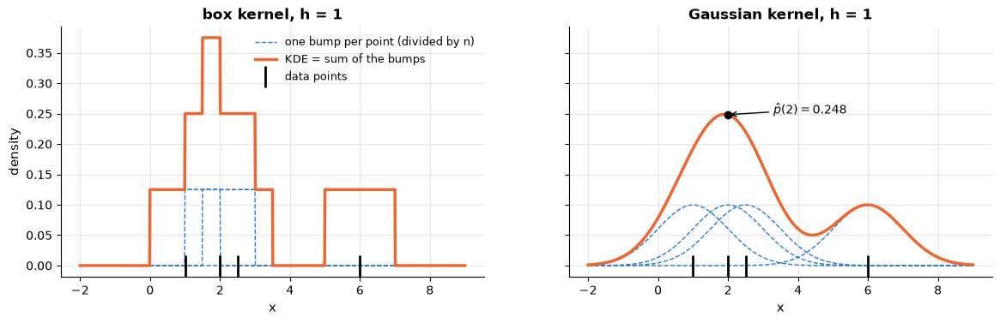

Both estimates are averages of the same four bumps. The box kernel gives a staircase that
jumps at every $`x_i \pm h`$; the Gaussian kernel gives a smooth curve. Our ten-line function and
scikit-learn's `KernelDensity` agree to the last digit — there is no magic in a KDE.

Three equivalent readings of the formula are worth keeping apart:

1. **A bump on every data point** (the picture above): where points crowd together, the
   bumps pile up into a peak.
2. **A weighted count around $x$<span></span>** (the computation): to evaluate at $x$, count the nearby
   points, the closer ones with more weight. The KDE fixes the window width and counts the
   points; notebook 8 turns this around — fix the number of neighbours and measure the
   window — and obtains the nearest-neighbour density estimate.
3. **A mixture model**: a Gaussian KDE is a mixture of $n$ normal distributions with equal
   weights $1/n$, means $`x_i`$ and standard deviation $h$. Sampling from it is therefore easy
   (pick a data point at random and add normal noise with standard deviation $h$; that is
   what `KernelDensity.sample` does), and it is the extreme case of the Gaussian mixture
   models of notebook 13: one component per data point and nothing to fit except $h$.
   "Fitting" a KDE just stores the data.

**The kernel matters little.** Any symmetric $K \ge 0$ with area 1 will do. The usual choices
differ in *efficiency*: the share of the data that would give the optimal kernel the same
accuracy, when each kernel is used with its own best bandwidth (Silverman, 1986, §3.3).

| kernel | $K(u)$ | non-zero for | efficiency |
|---|---|---|---|
| Epanechnikov | $\frac{3}{4}(1 - u^2)$ | $\lvert u \rvert \le 1$ | 100 % (the optimum) |
| cosine | $\frac{\pi}{4} \cos(\pi u / 2)$ | $\lvert u \rvert \le 1$ | 99.9 % |
| triangular | $1 - \lvert u \rvert$ | $\lvert u \rvert \le 1$ | 98.6 % |
| Gaussian | $e^{-u^2/2} / \sqrt{2\pi}$ | every $u$ | 95.1 % |
| box (top-hat) | $\frac{1}{2}$ | $\lvert u \rvert \le 1$ | 93.0 % |
| exponential | $\frac{1}{2} e^{-\lvert u \rvert}$ | every $u$ | 76 % |

Switching from the Gaussian to the optimal kernel is worth about 5 % more data; getting $h$
wrong by a factor of two costs far more. The Gaussian is the default everywhere because it
is smooth and convenient. One trap: "bandwidth" does not mean the same thing for every
kernel. In scikit-learn a Gaussian with bandwidth $h$ has standard deviation $h$, while a box
kernel with bandwidth $h$ has half-width $h$ and standard deviation $h/\sqrt{3}$ — never
compare kernels at the same $h$.

**The bandwidth matters most.** A small $h$ gives each point a narrow spike, so every point
becomes its own peak (high variance: overfitting). A large $h$ blurs everything into one hill
and real modes merge (high bias: underfitting). The trade-off can be made precise. The
expected value of the estimate is

```math
\mathbb{E}\big[\hat{p}(x)\big] = \int \frac{1}{h} K\!\left(\frac{x - y}{h}\right) p(y)\, dy,
```

the true density *blurred by the kernel* (a convolution): a KDE does not estimate $p$ itself
but a smoothed copy of it. A Taylor expansion of $p$ for small $h$ gives the bias and the
variance at a point (Silverman, 1986, §3.3):

```math
\operatorname{bias}(x) \approx \frac{h^2}{2}\, \mu_2(K)\, p''(x), \qquad \operatorname{Var}(x) \approx \frac{p(x)\, R(K)}{nh},
```

where $`\mu_2(K) = \int u^2 K(u)\, du`$ is the variance of the kernel and $`R(K) = \int K(u)^2\, du`$
measures how peaked it is.

- The **bias** grows with $h^2$ and with the *curvature* $p''(x)$: peaks ($`p'' < 0`$) are
  flattened and valleys ($`p'' > 0`$) filled in, while straight stretches are estimated
  without bias. That is why a large $h$ merges modes.
- The **variance** shrinks with $nh$, roughly the number of points inside the window: fewer
  points, a noisier estimate. More data lets you afford a smaller $h$.

Integrating squared bias plus variance over $x$ gives the asymptotic mean integrated squared
error (AMISE); setting its derivative with respect to $h$ to zero gives the best bandwidth

```math
h^{*} = \left(\frac{R(K)}{\mu_2(K)^2\, R(p'')\, n}\right)^{1/5} \propto n^{-1/5}, \qquad \operatorname{AMISE}(h^{*}) \propto n^{-4/5}.
```

Three consequences. The best bandwidth shrinks very slowly: 32 times more data only halves
it ($32^{1/5} = 2$). The error falls like $n^{-4/5}$ — slower than a correctly specified
parametric model ($n^{-1}$), the price of assuming no shape, but faster than a histogram
($n^{-2/3}$). And $`h^{*}`$ depends on $`R(p'') = \int p''(x)^2\, dx`$, the curvature of the very
density we are trying to estimate. Every practical bandwidth selector is a way out of that
chicken-and-egg problem:

- **Rules of thumb** pretend that $p$ is normal. **Scott's rule**, $`h = \hat{\sigma}\, n^{-1/5}`$,
  is the default of SciPy and therefore of `sns.kdeplot` (whose `bw_adjust` multiplies it).
  **Silverman's rule**, $`h = 0.9 \min(\hat{\sigma}, \mathrm{IQR}/1.34)\, n^{-1/5}`$, uses the
  robust IQR of section 3.5 (for normal data $`\mathrm{IQR} \approx 1.34\,\sigma`$) and comes out a
  little smaller. Both *oversmooth multimodal data*: $\hat{\sigma}$ then measures the distance
  between the modes, not the width of any of them.
- **Likelihood cross-validation** fits the KDE on part of the data and picks the $h$ under
  which the held-out points are most probable (highest mean $\log \hat{p}$). Notebooks 5 and
  12 develop cross-validation properly; in scikit-learn it is
  `GridSearchCV(KernelDensity(), {"bandwidth": ...})`.
- **Plug-in selectors** (Sheather & Jones, 1991) estimate $R(p'')$ from a pilot KDE and plug
  it into the formula for $`h^{*}`$ — usually the best automatic choice in one dimension (R's
  `bw.SJ`; in Python, `bw="ISJ"` in the KDEpy package).

A last trap: scikit-learn's `KernelDensity(bandwidth="scott")` is just $n^{-1/5}$, *without* the
factor $\hat{\sigma}$ — it assumes standardised data. The next cell applies the rules and a
held-out likelihood to the monthly charges and counts the modes each bandwidth produces.

> **Real-life example.** An online shop draws the KDE of its basket values with the default
> bandwidth and sees one broad hump around 45. At a third of that bandwidth the hump splits in
> two, with a sharp peak just above 50 — the free-shipping threshold, where customers add one
> more item to avoid the fee. Rules of thumb are tuned to smooth single humps, so the most
> actionable feature of the data is exactly what the default curve smooths away.

```python
charges = df["monthly_charges"].dropna().to_numpy()   # the cleaned charges of section 2.2, as a NumPy array
n_c = len(charges)
sigma = charges.std(ddof=1)                    # ddof=1: the sample standard deviation (divides by n - 1)
charges_q1, charges_q3 = np.percentile(charges, [25, 75])    # first and third quartiles
h_scott = sigma * n_c ** (-1 / 5)
h_silverman = 0.9 * min(sigma, (charges_q3 - charges_q1) / 1.34) * n_c ** (-1 / 5)
print(f"n = {n_c}, std = {sigma:.2f}, IQR = {charges_q3 - charges_q1:.2f}  ->  Scott h = {h_scott:.2f}, Silverman h = {h_silverman:.2f}")

# seaborn's default curve should be our KDE with Scott's h: draw it on a throw-away figure and compare the values
fig_tmp, ax_tmp = plt.subplots()
sns.kdeplot(charges, ax=ax_tmp)
sns_x, sns_y = ax_tmp.lines[0].get_data()      # the x and y coordinates of the drawn curve
plt.close(fig_tmp)                             # discard the figure without showing it
print(f"largest difference between kde(..., h_scott) and sns.kdeplot: {np.abs(kde(sns_x, charges, h_scott) - sns_y).max():.1e}")


def n_modes(density):
    """Number of local maxima of a density evaluated on a grid (grid points higher than both neighbours)."""
    return int(np.sum((density[1:-1] > density[:-2]) & (density[1:-1] > density[2:])))


def heldout_loglik(data, bandwidths, seed=RANDOM_STATE):
    """Mean log density of a random half of `data` under a KDE fitted on the other half, for every bandwidth."""
    split_rng = np.random.default_rng(seed)    # a generator of its own, so the notebook's rng is left untouched
    shuffled = split_rng.permutation(len(data))    # the row positions in random order
    fit_half, held_out = data[shuffled[: len(data) // 2]], data[shuffled[len(data) // 2:]]
    return np.array([np.log(kde(held_out, fit_half, h)).mean() for h in bandwidths])


bandwidths = np.geomspace(0.25, 20, 31)        # 31 bandwidths, evenly spaced on a log scale
grid_c = np.linspace(0, 135, 1351)             # evaluation grid with a step of 0.1
modes = np.array([n_modes(kde(grid_c, charges, h)) for h in bandwidths])
loglik = heldout_loglik(charges, bandwidths)
h_loglik = bandwidths[loglik.argmax()]         # argmax gives the position of the largest value
at_floor = charges == 15                       # customers at exactly the lowest possible charge
h_loglik_no_floor = bandwidths[heldout_loglik(charges[~at_floor], bandwidths).argmax()]   # ~ negates a mask
print(f"held-out likelihood picks h = {h_loglik:.2f}, which gives {n_modes(kde(grid_c, charges, h_loglik))} modes")
print(f"customers at exactly 15.00: {at_floor.sum()}; without them the held-out likelihood picks h = {h_loglik_no_floor:.2f}")
print("number of modes per bandwidth:")
print(pd.Series(modes, index=bandwidths.round(2)).to_frame("modes").T.to_string())

h_mid = 2.0                                    # the middle of the five-mode plateau (see the last panel)
fig, axes = plt.subplots(2, 2, figsize=(15, 7.5))
choices = [(h_scott, f"Scott's rule (seaborn's default), h = {h_scott:.1f}"),
           (h_mid, f"h = {h_mid:.1f}, inside the five-mode plateau"),
           (h_loglik, f"held-out likelihood, h = {h_loglik:.2f}")]
for ax, (h, title), colour in zip(axes.flat, choices, PALETTE[1:4]):     # axes.flat runs through the 2 x 2 panels
    density = kde(grid_c, charges, h)
    # density=True scales the histogram to area 1, so it is comparable with the KDE
    ax.hist(charges, bins=np.arange(14, 122, 1), density=True, color="lightgray", label="histogram, 1-unit bins")
    ax.plot(grid_c, density, color=colour, lw=2, label="KDE")
    ax.set_title(f"{title}: {n_modes(density)} modes")
    ax.set_xlabel("monthly charges")
    ax.set_ylabel("density")
    ax.legend(fontsize=8)
ax = axes[1, 1]
ax.plot(bandwidths, modes, "o-", color=PALETTE[0])
for h, name, colour in [(h_scott, "Scott", PALETTE[1]), (h_silverman, "Silverman", PALETTE[4]),
                        (h_mid, "h = 2", PALETTE[2]), (h_loglik, "held-out likelihood", PALETTE[3])]:
    ax.axvline(h, color=colour, ls="--", lw=1.5, label=name)
ax.set_xscale("log")
ax.set_yscale("log")
ax.set_xlabel("bandwidth h (log scale)")
ax.set_ylabel("number of modes (log scale)")
ax.set_title("mode count: plateaus at 3 and 5 modes, noise below h ≈ 1")
ax.legend(fontsize=8)
plt.tight_layout()
plt.show()
```

```text
n = 4997, std = 27.51, IQR = 36.69  ->  Scott h = 5.01, Silverman h = 4.49
largest difference between kde(..., h_scott) and sns.kdeplot: 8.2e-17
held-out likelihood picks h = 0.45, which gives 35 modes
customers at exactly 15.00: 116; without them the held-out likelihood picks h = 1.08
number of modes per bandwidth:
       0.25   0.29   0.33   0.39   0.45   0.52   0.60   0.70   0.80   0.93   1.08   1.25   1.44   1.67   1.93   2.24   2.59   2.99   3.47   4.01   4.64   5.37   6.22   7.19   8.33   9.63   11.15  12.90  14.93  17.28  20.00
modes     74     62     51     42     35     27     20     13     11      9      8      8      5      5      5      5      4      4      3      3      3      3      3      3      3      3      2      2      1      1      1
```

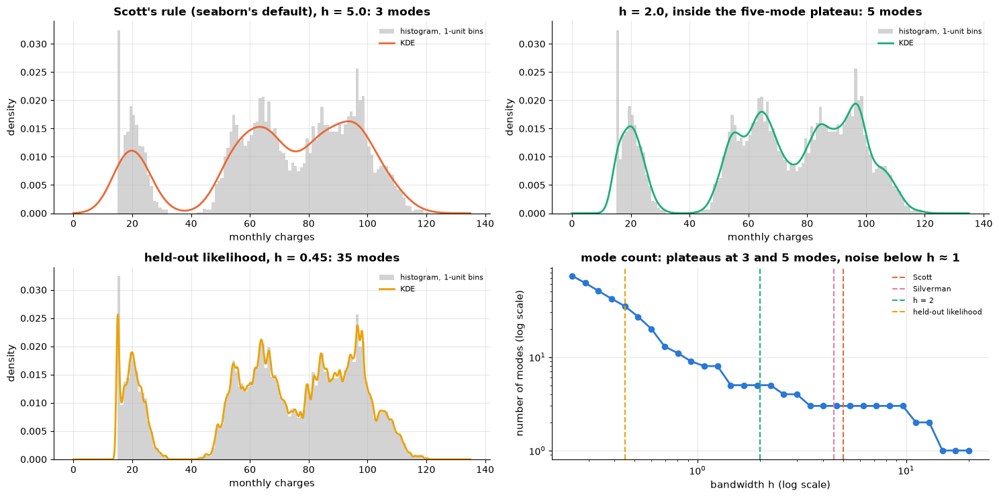

Our function reproduces `sns.kdeplot` to rounding error: seaborn's default *is* Scott's rule,
here $h \approx 5$. Read the four panels together.

- **Scott's and Silverman's rules** ($h \approx 5.0$ and $4.5$) show three smooth modes — the
  three plans of section 3.1. The 1-unit histogram behind the curve has more structure than
  that: the standard deviation of 27.5 measures the distance *between* the plans, so the rules
  of thumb choose a bandwidth far wider than any single peak.
- **The held-out likelihood** goes to the other extreme: at $h \approx 0.45$ the curve has 35
  modes, almost all of them noise. The culprit is a data-quality feature: the
  116 customers at exactly 15.00 (the floor of the charges). A pile of identical values is a
  point mass, and a likelihood rewards narrow spikes on it without limit; without these
  values the same procedure picks $h \approx 1.1$. An automatic bandwidth is not
  automatically right.
- **The mode count** (last panel) is the most honest summary. The number of modes stays at
  3 for every $h$ between about 3.5 and 10, stays at 5 between about 1.4 and 2.2, and grows
  quickly below $h \approx 1$. Structure that survives over a wide range of bandwidths is worth
  believing; a bump that exists at one $h$ only is not (Silverman, 1981, turned this idea into
  a test for the number of modes).

So which five modes does $h = 2$ reveal? Because a KDE is an *average* over points, the KDE of
all customers is exactly the share-weighted sum of the KDEs of any partition into groups
(with the same $h$). Splitting the customers by plan and number of add-ons explains every
bump:

```python
priced = df.dropna(subset=["monthly_charges"]).assign(add_ons=lambda d: d["tech_support"] + d["streaming"])
by_group = priced.groupby(["internet_service", "add_ons"])["monthly_charges"]
print(by_group.agg(["size", "mean", "std"]).round(1).T.to_string())       # .T: one column per group

# each group's own KDE, weighted by the group's share of the customers, in order of the group's mean charge
parts = {f"{plan}, {k} add-on{'' if k == 1 else 's'}": kde(grid_c, g, h_mid) * len(g) / n_c
         for (plan, k), g in sorted(by_group, key=lambda item: item[1].mean())}
total_density = kde(grid_c, charges, h_mid)
print(f"\nlargest difference between the sum of the group curves and the KDE of all customers: "
      f"{np.abs(sum(parts.values()) - total_density).max():.1e}")

fig, ax = plt.subplots(figsize=(15, 3.8))
# stackplot piles the curves on top of each other, so the top edge of the pile is their sum
ax.stackplot(grid_c, *parts.values(), labels=parts.keys(), colors=PALETTE[:7], alpha=0.8)
ax.plot(grid_c, total_density, color="black", lw=1.5, ls="--", label="KDE of all customers")
ax.set_xlim(5, 125)
ax.set_xlabel("monthly charges")
ax.set_ylabel("density")
ax.set_title(f"the KDE (h = {h_mid:.0f}) is the sum of the group KDEs: plan price + about 11 per add-on")
ax.legend(fontsize=8, ncol=2, loc="upper left")
plt.show()
```

```text
internet_service    DSL               Fiber optic                    No
add_ons               0      1      2           0       1      2      0
size              725.0  975.0  310.0       762.0  1007.0  344.0  874.0
mean               55.1   66.0   77.3        85.3    96.1  107.1   20.1
std                 4.1    4.2    3.9         4.0     4.0    4.1    3.7

largest difference between the sum of the group curves and the KDE of all customers: 6.9e-18
```

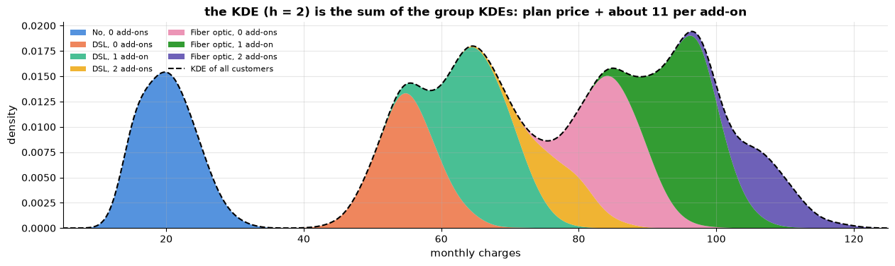

The bumps are prices: each plan's base price (about 20, 55 and 85) plus roughly 11 per
add-on (tech support, streaming), with a spread of about 4 around each combination. At
$h = 2$ the zero- and one-add-on groups of DSL and fibre form separate modes, and the smaller
two-add-on groups (77 and 107) show as shoulders. The three-hump picture of the default
bandwidth is not *wrong* — it is the same data at a coarser scale — but it hides a pricing
structure that a churn model will care about (notebook 4 turns the add-ons into an
`n_services` feature).

**Five fallacies of reading a KDE.** The figures above showed the first two; the next cell
measures the other three on the churn data.

1. **"The curve is the shape of the data."** It is the data blurred by the kernel, at one
   particular scale. Seaborn's default shows three plans and hides the add-on pricing
   inside each — the bias term at work, flattening peaks and filling valleys.
2. **"Every bump is a group."** Too small a bandwidth turns noise into modes: more than
   thirty "groups" at the held-out-likelihood choice. Trust the plateaus of the mode count,
   not a bump that appears at one $h$.
3. **"Where the curve is, the data can be."** Every bump spills over hard limits: the KDE
   puts customers at negative tenure, beyond the 72-month cap, below the floor of the
   charges, and at negative numbers of support tickets.
4. **"A smooth curve means smooth data."** A KDE smears point masses — the customers at the
   tenure cap and at a charge of exactly 15.00, the integer ticket counts — into gentle
   bumps, and the data-quality signals of section 2.2 disappear with them.
5. **"The height is a probability."** A density is probability *per unit of x*. Only areas
   are probabilities, and heights change with the unit of measurement.

For the Gaussian kernel the area to the left of any point $a$ has a closed form — each bump
is a normal distribution with mean $`x_i`$ and standard deviation $h$ — so
$`\hat{P}(X \le a) = \frac{1}{n} \sum_{i} \Phi\big((a - x_i)/h\big)`$, where $\Phi$ is the standard
normal CDF. That makes the leaked mass easy to measure.

> **Real-life example.** An insurer's policy pays at most 10 000 per claim, so several hundred
> claims sit at exactly 10 000. A KDE of the claim amounts draws a smooth tail running past 10 000
> into payments that cannot exist, shows the cap as a barely visible shoulder, and puts a little
> mass below zero. The cap — the one fact the pricing team most needs to see — is visible only in
> `value_counts()` or a fine-binned histogram.

```python
def kde_cdf(a, data, h):
    """Probability that a Gaussian KDE of `data` with bandwidth h puts at or below a."""
    # bump i is a normal distribution N(x_i, h^2): its mass below a is Phi((a - x_i) / h); stats.norm.cdf is Phi
    return stats.norm.cdf((a - np.asarray(data, dtype=float)) / h).mean()


def scott(data):
    """Scott's rule of thumb, the bandwidth sns.kdeplot uses by default."""
    return np.std(data, ddof=1) * len(data) ** (-1 / 5)


tenure = df["tenure_months"].to_numpy()
ticket_values = df["support_tickets"].to_numpy()
h_tenure, h_tickets = scott(tenure), scott(ticket_values)

print("fallacy 3: mass where no data can be")
below0, above72 = kde_cdf(0, tenure, h_tenure), 1 - kde_cdf(72, tenure, h_tenure)
print(f"  tenure (h = {h_tenure:.2f}): {below0:.1%} below 0 months, {above72:.1%} above the 72-month cap")
print(f"  monthly charges (h = {h_scott:.2f}): {kde_cdf(15, charges, h_scott):.1%} below the floor of 15.00")
print(f"  support tickets (h = {h_tickets:.2f}): {kde_cdf(0, ticket_values, h_tickets):.1%} at negative counts")

print("fallacy 4: point masses smeared out")
near72 = kde_cdf(72.5, tenure, h_tenure) - kde_cdf(71.5, tenure, h_tenure)
print(f"  tenure exactly 72: {(tenure == 72).mean():.1%} of customers; KDE mass within half a month of 72: {near72:.1%}")
# the KDE mass in the middle half of every gap between whole numbers (from k + 0.25 to k + 0.75), added up
between = sum(kde_cdf(k + 0.75, ticket_values, h_tickets) - kde_cdf(k + 0.25, ticket_values, h_tickets)
              for k in range(-3, 12))
print(f"  support tickets: {between:.1%} of the KDE mass lies more than a quarter-ticket away from any whole number")

print("fallacy 5: heights are not probabilities")
p85 = kde([85], charges, h_scott)[0]
area = kde_cdf(90, charges, h_scott) - kde_cdf(80, charges, h_scott)
print(f"  density at 85: {p85:.4f} per currency unit; area between 80 and 90: {area:.3f} "
      f"(share of customers: {((charges >= 80) & (charges <= 90)).mean():.3f})")
print(f"  the same customers measured in hundreds: density at 0.85 = {kde([0.85], charges / 100, h_scott / 100)[0]:.2f}")

# the fix for hard limits: add the mirror images of the data at both boundaries, so the spilled mass comes back
mirrored = np.concatenate([tenure, -tenure, 2 * 72 - tenure])    # the data, mirrored at 0 and at 72
grid_t = np.linspace(-15, 90, 1051)
plain = kde(grid_t, tenure, h_tenure)
inside = (grid_t >= 0) & (grid_t <= 72)
# kde() divides by the length of its data, 3n here, so multiply by 3; outside [0, 72] the density is 0
reflected = np.where(inside, 3 * kde(grid_t, mirrored, h_tenure), 0)
print(f"\narea inside [0, 72]: plain KDE {np.trapezoid(plain[inside], grid_t[inside]):.3f}, "
      f"reflected KDE {np.trapezoid(reflected[inside], grid_t[inside]):.3f}")    # np.trapezoid: area under a curve

fig, axes = plt.subplots(1, 3, figsize=(17, 4.2))
ax = axes[0]
ax.hist(tenure, bins=np.arange(-0.5, 73.5, 1), density=True, color="lightgray", label="histogram, 1-month bins")
ax.plot(grid_t, plain, color=PALETTE[1], label="KDE (Scott)")
# fill_between shades the area under the curve wherever `where` is True
ax.fill_between(grid_t, plain, where=~inside, color=PALETTE[7], alpha=0.5,
                label=f"impossible tenure: {below0 + above72:.1%} of the area")
ax.plot(grid_t, reflected, color=PALETTE[2], ls="--", label="reflected KDE")
ax.annotate(f"{(tenure == 72).sum()} customers at the cap", (72, 0.07), xytext=(30, 0.065), arrowprops={"arrowstyle": "->"})
ax.set_title("tenure: leaks past 0 and 72, hides the cap")
ax.set_xlabel("tenure (months)")
ax.set_ylabel("density")
ax.legend(fontsize=8, loc="center right")

ax = axes[1]
grid_low = np.linspace(0, 45, 451)
low = kde(grid_low, charges, h_scott)
ax.hist(charges[charges < 45], bins=np.arange(0, 45.5, 0.5), color="lightgray",
        weights=np.full((charges < 45).sum(), 1 / (n_c * 0.5)),   # each customer adds 1/(n * bin width): density units
        label="histogram, 0.5-unit bins")
ax.plot(grid_low, low, color=PALETTE[1], label="KDE (Scott, seaborn's default)")
ax.fill_between(grid_low, low, where=grid_low < 15, color=PALETTE[7], alpha=0.5, label="below the floor of 15.00")
ax.set_title(f"charges: {at_floor.sum()} customers at exactly 15.00")
ax.set_xlabel("monthly charges")
ax.legend(fontsize=8)

ax = axes[2]
shares = pd.Series(ticket_values).value_counts(normalize=True).sort_index()   # normalize=True: shares instead of counts
ax.bar(shares.index, shares.values, width=0.9, color="lightgray", label="share of customers per count")
grid_k = np.linspace(-2, 9, 1101)
dens_k = kde(grid_k, ticket_values, h_tickets)
ax.plot(grid_k, dens_k, color=PALETTE[1], label="KDE (Scott)")
ax.fill_between(grid_k, dens_k, where=grid_k < 0, color=PALETTE[7], alpha=0.5, label="negative numbers of tickets")
ax.set_title("tickets: a smooth curve over whole numbers")
ax.set_xlabel("support tickets")
ax.legend(fontsize=8)
plt.tight_layout()
plt.show()
```

```text
fallacy 3: mass where no data can be
  tenure (h = 3.76): 2.2% below 0 months, 4.1% above the 72-month cap
  monthly charges (h = 5.01): 3.7% below the floor of 15.00
  support tickets (h = 0.21): 21.3% at negative counts
fallacy 4: point masses smeared out
  tenure exactly 72: 7.4% of customers; KDE mass within half a month of 72: 0.9%
  support tickets: 23.5% of the KDE mass lies more than a quarter-ticket away from any whole number
fallacy 5: heights are not probabilities
  density at 85: 0.0144 per currency unit; area between 80 and 90: 0.142 (share of customers: 0.148)
  the same customers measured in hundreds: density at 0.85 = 1.44

area inside [0, 72]: plain KDE 0.937, reflected KDE 1.000
```

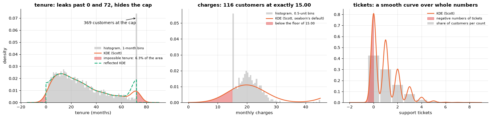

Each panel is a different fallacy, and each is invisible unless you compare the curve with
the data:

- **Hard limits.** More than 6 % of the tenure curve's area sits at impossible values (2.2 %
  below zero, 4.1 % beyond the cap), and 21 % of the ticket curve lies at *negative* counts —
  half of every bump of the 2 134 customers with zero tickets. Fixes: **reflect** the data at the boundary, as the dashed
  curve does (the area inside $`[0, 72]`$ is back to 1); or **transform** — fit the KDE to
  $y = \log x$ and map back with $`\hat{p}_X(x) = \hat{p}_Y(\log x) / x`$, the factor $1/x$
  being the change-of-variables correction; or use boundary kernels (Wand & Jones, 1995).
  Seaborn's `cut=0` and `clip=` (and the `cut=0` of the violin in section 3.3) only stop
  *drawing* the curve at the limits; the lost area is not put back.
- **Point masses.** 7.4 % of all customers have a tenure of exactly 72 months, but the curve
  shows only a gentle shoulder there (0.9 % of its area lies within half a month of 72); the 116 customers at 15.00 vanish into the left flank
  of the first mode. A KDE assumes a continuous density, so a cap, a floor or a default value
  — exactly the data-quality findings of section 2.2 — is smeared away. Look at
  `value_counts()` and a fine-binned histogram first; report a capped value separately ("7 %
  at the cap") and estimate the density of the rest.
- **Counts.** Support tickets are whole numbers; the KDE puts about a quarter of its area
  (23.5 %) more than a quarter-ticket away from any of them and draws a comb of bumps. Counts belong in a bar chart (section 3.2).
- **Heights.** The density at 85 is about 0.014 — not a probability, but a rate per currency
  unit: the *area* between 80 and 90 is 0.142, close to the 14.8 % of customers who actually
  pay that much. Measure the same customers in hundreds and the height becomes 1.44, above
  1 without anything being wrong. When you need probabilities, read areas, or plot the
  empirical CDF (`sns.ecdfplot`), which needs no bandwidth at all.

**Beyond one dimension.** In $d$ dimensions the bump becomes a $d$-dimensional kernel whose
shape is set by a bandwidth *matrix* $H$ (the covariance matrix of each Gaussian bump):

```math
\hat{p}(\mathbf{x}) = \frac{1}{n} \sum_{i=1}^{n} \det(H)^{-1/2}\, K\!\left(H^{-1/2} (\mathbf{x} - \mathbf{x}_i)\right),
```

where $\det(H)^{-1/2}$ plays the role of $1/h$ and keeps every bump's volume at 1. Libraries
differ in their choice of $H$. scikit-learn uses $h^2 I$, round bumps with the same width in
every direction, so features must be **standardised first** — a bump one unit wide in both
"currency" and "months" is meaningless. statsmodels' `KDEMultivariate` uses one bandwidth per
feature. SciPy's `gaussian_kde`, and hence the 2-D `sns.kdeplot(x=..., y=...)`, uses
$h^2 \hat{\Sigma}$, elliptical bumps shaped like the data's covariance $\hat{\Sigma}$.

Two limits apply in every dimension. The **curse of dimensionality**: the best achievable
error falls like $n^{-4/(d+4)}$, and Silverman (1986, Table 4.2) computed that the accuracy
4 points give in one dimension needs 19 points in two, 768 in five and about 842 000 in ten.
KDE is excellent in one to three dimensions and hopeless in a raw high-dimensional feature
space (notebooks 8 and 14). And **cost**: "fitting" is free, but evaluating $m$ points takes
$n \times m$ kernel evaluations, which is why scikit-learn uses trees with tolerances
(`atol`, `rtol`) and 1-D libraries bin the data and use the fast Fourier transform.

**Where KDEs reappear.** Violin plots and `pairplot(diag_kind="kde")` in this notebook;
density-based anomaly scores and the non-parametric Bayes classifier of notebook 8 (Parzen
windows); the Gaussian mixtures of notebook 13, which replace one bump per point by a few
fitted ones; mean-shift clustering (scikit-learn's `MeanShift`), which lets every point climb
uphill on a KDE until it reaches a mode; and the tree-structured Parzen estimator of
notebook 12, which models good and bad hyper-parameter settings with two KDEs.

## 4. Bivariate analysis

### 4.1 Scatter plots: overplotting, transparency, jitter

The scatter plot is the fundamental display of a relationship between two numeric
variables. With thousands of points it suffers from **overplotting**: dense regions become
solid blobs. Remedies: transparency (`alpha`), smaller markers, **jitter** (a small random
offset, essential when one variable is discrete), or switching to a density display
(`hexbin`, 2-D histogram, contour KDE).

> **Real-life example.** A ride-hailing company that plots trip distance against fare for a
> million trips gets a solid blob; transparency or a hexbin shows where the bulk of the trips lie
> (short city rides) and reveals a horizontal streak of fixed-price airport trips. Jitter is
> needed when one axis is discrete: hotel star ratings (1 to 5) against room price would
> otherwise stack all hotels of a rating on one vertical line.

```python
fig, axes = plt.subplots(1, 3, figsize=(16, 4))
axes[0].scatter(df["tenure_months"], df["total_charges"], s=8, alpha=0.25, color=PALETTE[0])   # s: marker size
axes[0].set_xlabel("tenure (months)")
axes[0].set_ylabel("total charges")
axes[0].set_title("tenure vs. total charges (alpha = 0.25)")

jitter = rng.uniform(-0.3, 0.3, len(df))    # a small random shift per customer, so equal ticket counts do not overlap
axes[1].scatter(df["support_tickets"] + jitter, df["monthly_charges"], s=6, alpha=0.2, color=PALETTE[0])
axes[1].set_xlabel("support tickets (jittered)")
axes[1].set_ylabel("monthly charges")
axes[1].set_title("a discrete x-variable needs jitter")

# hexbin counts the points in hexagonal cells: gridsize = number of hexagons across, mincnt=1 leaves empty cells blank;
# .fillna(0) treats a missing total charge as 0
hb = axes[2].hexbin(df["tenure_months"], df["total_charges"].fillna(0), gridsize=30, cmap="viridis", mincnt=1)
axes[2].set_xlabel("tenure (months)")
axes[2].set_ylabel("total charges")
axes[2].set_title("hexbin: density instead of points")
plt.colorbar(hb, ax=axes[2], label="customers")     # the colour scale for the hexagon counts
plt.tight_layout()
plt.show()
```

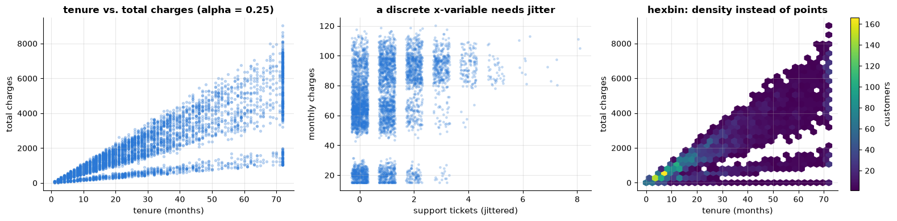

The fan shape in the first panel is exactly what `total ≈ monthly × tenure` predicts:
customers on different plans accumulate charges at different rates. The third panel shows
where most customers actually are — the two-dimensional analogue of a histogram.

### 4.2 Correlation: Pearson, Spearman, Kendall

**Pearson's** $r$ measures *linear* association:

```math
r = \frac{\sum_i (x_i - \bar{x})(y_i - \bar{y})}{\sqrt{\sum_i (x_i - \bar{x})^2}\,\sqrt{\sum_i (y_i - \bar{y})^2}} \in [-1, 1].
```

It is $\pm 1$ only for a perfect straight line, it is sensitive to outliers, and it can be
near zero for a perfectly deterministic but non-linear relation. **Spearman's** $\rho$ is
Pearson's $r$ computed on the *ranks* of the values: it measures *monotonic* association,
is robust to outliers and to monotone transformations (a log transform does not change
it). **Kendall's** $\tau$ counts *concordant* minus *discordant* pairs — pairs of
observations ordered the same way on both variables minus those ordered oppositely, as a
fraction of all pairs — and is the most robust and most interpretable of the three, at
the price of $O(n \log n)$ computation and smaller absolute values.

> **Real-life examples.** The demonstration below uses two artificial data sets with real-life
> counterparts. The curve $y = e^{2x}$ behaves like money growing at compound interest, or a
> bacterial culture that doubles at a fixed rate: perfectly monotone, but far from a straight
> line. The second set mimics sixty unrelated pairs — say, the shoe sizes and the maths marks of
> sixty pupils — plus one record in which both values were mistyped far outside the normal range.

```python
num_cols = ["tenure_months", "monthly_charges", "total_charges", "support_tickets"]
# .corr(method=...) gives the (4, 4) matrix of pairwise correlations; the dict comprehension builds one per method
corr_methods = {m: df[num_cols].corr(method=m) for m in ["pearson", "spearman", "kendall"]}
# from each matrix take the total_charges row (three columns) and put the three methods side by side
pd.DataFrame({m: c.loc["total_charges", ["tenure_months", "monthly_charges", "support_tickets"]] for m, c in corr_methods.items()}).round(3)
```

|  | pearson | spearman | kendall |
|---|---|---|---|
| tenure_months | 0.821 | 0.830 | 0.678 |
| monthly_charges | 0.468 | 0.480 | 0.332 |
| support_tickets | 0.174 | 0.156 | 0.117 |

```python
# where the three disagree: a curved but monotone relation, and one with an outlier
t = np.linspace(0, 3, 200)                                 # e.g. time in years
curved = np.exp(2 * t)                                     # monotone, strongly non-linear (e.g. compound interest)
with_outlier = np.append(rng.normal(size=60), 8)          # e.g. maths marks of 60 pupils (standardised) + 1 typo
x_out = np.append(rng.normal(size=60), 8)                 # e.g. their shoe sizes; np.append adds 8 at the end
for name, a, b in [("y = exp(2x) (monotone, curved)", t, curved), ("60 unrelated points + 1 outlier", x_out, with_outlier)]:
    # each scipy function returns (coefficient, p-value); [0] keeps the coefficient
    print(f"{name:36s} Pearson {stats.pearsonr(a, b)[0]:+.3f}   Spearman {stats.spearmanr(a, b)[0]:+.3f}   Kendall {stats.kendalltau(a, b)[0]:+.3f}")
```

```text
y = exp(2x) (monotone, curved)       Pearson +0.818   Spearman +1.000   Kendall +1.000
60 unrelated points + 1 outlier      Pearson +0.544   Spearman +0.076   Kendall +0.039
```

### 4.3 Anscombe's quartet: why we plot

Anscombe (1973) constructed four data sets of eleven points with *identical* means,
variances, correlation and regression line — and completely different structure. Matejka &
Fitzmaurice (2017) went further, morphing a scatter plot into a dinosaur while holding the
same statistics fixed. The lesson has not aged: a correlation coefficient describes a
straight-line summary, and only the plot tells you whether a straight line was the right
summary.

> **Real-life examples.** Each of the four shapes below turns up in practice:
> - I, a noisy straight line: advertising spend against sales in eleven shops;
> - II, a smooth curve: fertiliser dose against crop yield — more helps, until too much starts to
>   harm the plants;
> - III, a perfect line with one outlier: a thermometer checked against a reference instrument,
>   where one reading was copied down wrongly;
> - IV, one point decides everything: ten employees with the same years of experience and one
>   senior colleague, whose salary alone creates the "trend".

```python
# the four data sets: name -> (x values, y values)
anscombe = {
    "I":   ([10, 8, 13, 9, 11, 14, 6, 4, 12, 7, 5], [8.04, 6.95, 7.58, 8.81, 8.33, 9.96, 7.24, 4.26, 10.84, 4.82, 5.68]),
    "II":  ([10, 8, 13, 9, 11, 14, 6, 4, 12, 7, 5], [9.14, 8.14, 8.74, 8.77, 9.26, 8.10, 6.13, 3.10, 9.13, 7.26, 4.74]),
    "III": ([10, 8, 13, 9, 11, 14, 6, 4, 12, 7, 5], [7.46, 6.77, 12.74, 7.11, 7.81, 8.84, 6.08, 5.39, 8.15, 6.42, 5.73]),
    "IV":  ([8, 8, 8, 8, 8, 8, 8, 19, 8, 8, 8], [6.58, 5.76, 7.71, 8.84, 8.47, 7.04, 5.25, 12.50, 5.56, 7.91, 6.89]),
}
rows = []
fig, axes = plt.subplots(1, 4, figsize=(16, 3.6), sharex=True, sharey=True)   # all panels use the same axis ranges
for ax, (name, (ax_, ay_)) in zip(axes, anscombe.items()):    # nested unpacking: (name, (x list, y list))
    ax_, ay_ = np.array(ax_, float), np.array(ay_, float)
    # np.polyfit(x, y, 1) fits a straight line by least squares and returns [slope, intercept] (highest power first)
    slope, intercept = np.polyfit(ax_, ay_, 1)
    rows.append({"set": name, "mean x": ax_.mean(), "var x": ax_.var(ddof=1), "mean y": ay_.mean(), "var y": ay_.var(ddof=1),
                 "corr": np.corrcoef(ax_, ay_)[0, 1], "slope": slope, "intercept": intercept})
    ax.scatter(ax_, ay_, color=PALETTE[0], zorder=3)
    xs = np.array([3, 20])
    ax.plot(xs, intercept + slope * xs, color=PALETTE[1], lw=1.5)   # the fitted line, drawn between x = 3 and x = 20
    ax.set_title(f"Anscombe {name}: r = {np.corrcoef(ax_, ay_)[0, 1]:.3f}")
    ax.set_xlabel("x")
axes[0].set_ylabel("y")
plt.show()
pd.DataFrame(rows).set_index("set").round(2)     # a list of dicts becomes one row per dict
```

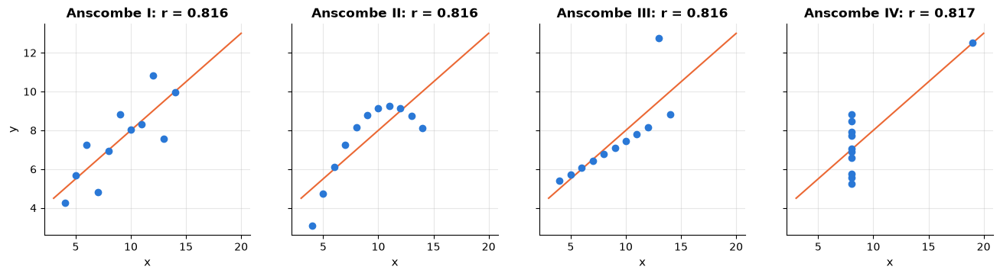

| set | mean x | var x | mean y | var y | corr | slope | intercept |
|---|---|---|---|---|---|---|---|
| I | 9.0 | 11.0 | 7.5 | 4.13 | 0.82 | 0.5 | 3.0 |
| II | 9.0 | 11.0 | 7.5 | 4.13 | 0.82 | 0.5 | 3.0 |
| III | 9.0 | 11.0 | 7.5 | 4.12 | 0.82 | 0.5 | 3.0 |
| IV | 9.0 | 11.0 | 7.5 | 4.12 | 0.82 | 0.5 | 3.0 |

### 4.4 Correlation is not causation

Two variables can be correlated because one causes the other, because the other causes
the one, because a third variable — a **confounder** — drives both, or by selection of the
sample. The data alone cannot tell these apart. A tiny simulation shows the confounder
case: a hidden variable $Z$ drives both $X$ and $Y$, which have no causal link, yet they
are strongly correlated; conditioning on $Z$ (here: correlating the residuals after
regressing each on $Z$, the *partial correlation*) removes the association.

> **Real-life examples.** The number of firefighters sent to a fire correlates with the damage
> done — both are driven by the size of the fire. Among schoolchildren, shoe size correlates with
> reading ability — both grow with age. Sending fewer firefighters, or buying bigger shoes, would
> change nothing.

```python
n = 2000
z = rng.normal(size=n)                          # e.g. daily temperature
x_ice = 2.0 * z + rng.normal(size=n)            # ice-cream sales, driven by temperature
y_swim = 1.0 * z + rng.normal(size=n)           # swimming-pool incidents, driven by temperature
# what is left of v after removing the straight-line fit on z; np.polyval(coeffs, z) evaluates that line at z
residual = lambda v: v - np.polyval(np.polyfit(z, v, 1), z)
print(f"corr(ice cream, incidents)             = {np.corrcoef(x_ice, y_swim)[0, 1]:+.3f}")
print(f"partial correlation given temperature  = {np.corrcoef(residual(x_ice), residual(y_swim))[0, 1]:+.3f}")
```

```text
corr(ice cream, incidents)             = +0.639
partial correlation given temperature  = +0.002
```

For a predictive model a spurious correlation can still be *useful* — the model does not
need to know why ice-cream sales predict pool incidents — but it is fragile (it breaks the
moment the confounder's behaviour changes) and it is fatal for any *causal* claim ("reduce
ice-cream sales to prevent incidents"). Notebooks 17 and 19 return to the difference
between explaining a model and explaining the world.

### 4.5 The correlation heatmap

For many numeric columns, a heatmap of the correlation matrix — diverging colour map
centred at zero, fixed range $`[-1, 1]`$, annotated, with the redundant upper triangle
masked — is the standard overview. Here we include the binary columns as 0/1 numbers
(their Pearson correlation with a numeric variable is the *point-biserial* correlation,
which is legitimate). Notebook 4 uses this view to find redundant features, notebook 6 to
diagnose multicollinearity.

> **Real-life example.** A bank preparing a credit-risk model puts forty customer columns into one
> heatmap and finds pairs correlated at 0.95 or more — age and years since the first account,
> income and a credit limit that was computed from it. Such pairs carry the same information twice.
> In the churn data, tenure and total charges (Spearman 0.83) come close.

```python
heat_cols = ["churned", "tenure_months", "monthly_charges", "total_charges", "support_tickets",
             "senior_citizen", "has_partner", "tech_support", "streaming"]
corr = df[heat_cols].corr(method="spearman")          # (9, 9) correlation matrix
# np.triu(..., k=1) keeps the part above the diagonal: True there, so the heatmap hides the redundant upper triangle
mask = np.triu(np.ones_like(corr, dtype=bool), k=1)
fig, ax = plt.subplots(figsize=(8, 6))
# center=0 puts the neutral colour at zero; annot/fmt write the values with 2 decimals; square=True makes square cells
sns.heatmap(corr, mask=mask, cmap="RdBu_r", vmin=-1, vmax=1, center=0, annot=True, fmt=".2f",
            square=True, linewidths=0.5, cbar_kws={"label": "Spearman correlation"}, ax=ax)
ax.set_title("Correlation matrix of the churn data (lower triangle)")
ax.grid(False)
plt.show()
```

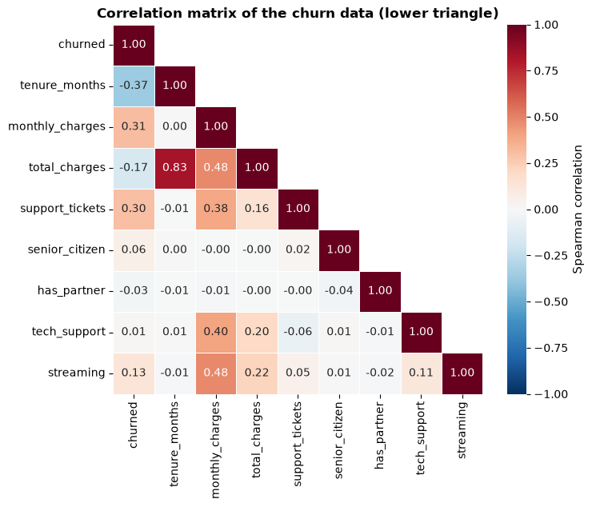

### 4.6 Categorical versus numeric

How does a numeric variable behave in each category? Grouped box plots (or violins) answer
it for the whole distribution; a **conditional mean with a confidence interval** answers it
for the average. For a binary target the conditional mean *is* the churn rate in the group,
and its standard error is $\sqrt{p(1-p)/n}$ — small groups get wide intervals, which is
exactly the warning one needs before reading meaning into a difference.

> **Real-life example.** A hospital group compares the 30-day readmission rates of its wards. A
> large ward with 2 000 patients and a rate of 12 % has a 95 % interval of about ±1.4 percentage
> points. A small ward with 25 patients, 3 of them readmitted, also shows 12 %, but its interval
> is about ±13 points: it could be the best ward in the group or the worst, and nobody should be
> praised or blamed on that evidence.

```python
tenure_bins = [-1, 0, 6, 12, 24, 36, 48, 60, 72]
# pd.cut assigns each value to an interval (a, b] between consecutive edges, so (-1, 0] holds exactly tenure 0
df = df.assign(tenure_bucket=pd.cut(df["tenure_months"], bins=tenure_bins))
# churn rate and number of customers per bucket; observed=True keeps only buckets that actually occur
grp = df.groupby("tenure_bucket", observed=True)["churned"].agg(["mean", "size"])
grp["se"] = np.sqrt(grp["mean"] * (1 - grp["mean"]) / grp["size"])     # standard error of a proportion

fig, axes = plt.subplots(1, 2, figsize=(14, 4))
# data= plus column names: x groups, y values, hue splits each group into one box per contract type
sns.boxplot(data=df, x="internet_service", y="monthly_charges", hue="contract", ax=axes[0], palette=PALETTE[:3], width=0.7)
axes[0].set_title("monthly charges by internet service and contract")
axes[0].set_xlabel("internet service")
axes[0].set_ylabel("monthly charges")
axes[0].legend(title="contract", fontsize=8)
# errorbar: points with vertical bars of half-length yerr; fmt="o-" = dots joined by a line, capsize = bar-end width
axes[1].errorbar(range(len(grp)), grp["mean"], yerr=1.96 * grp["se"], fmt="o-", color=PALETTE[1], capsize=4, lw=2, label="churn rate ± 95% CI")
axes[1].axhline(df["churned"].mean(), color="gray", ls="--", label=f"overall rate {df['churned'].mean():.2f}")
axes[1].set_xticks(range(len(grp)))
axes[1].set_xticklabels([str(b) for b in grp.index], rotation=30, fontsize=8)   # the intervals as text, e.g. "(0, 6]"
axes[1].set_xlabel("tenure bucket (months)")
axes[1].set_ylabel("churn rate")
axes[1].set_title("conditional mean of the target with confidence intervals")
axes[1].legend()
plt.tight_layout()
plt.show()
```

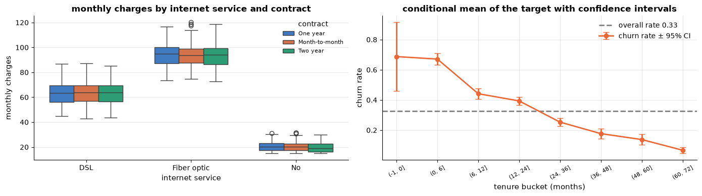

Monthly charges depend on the internet plan and barely on the contract; churn depends on
tenure with a sharp early-life spike and a steady decline. The tiny bucket of brand-new
customers (`tenure == 0`) has the widest interval: eleven or twelve customers cannot pin a
rate down.

### 4.7 Categorical versus categorical

Two categorical variables meet in a **contingency table** (`pd.crosstab`). Normalising each
row turns counts into conditional distributions, which a **normalised stacked bar chart**
displays directly. A $\chi^2$ test of independence (`scipy.stats.chi2_contingency`) tells
whether the association could plausibly be chance — with 5 000 rows almost everything is
"significant", so the *size* of the difference matters more than the $p$-value.

> **Real-life example.** An online shop runs an A/B test: half the visitors see the old checkout
> page, half a new one, and every visit ends in "bought" or "did not buy". The 2 × 2 contingency
> table, normalised by row, gives the two conversion rates, and the χ² test says whether the gap
> could be chance. With two million visits even a difference of 0.1 percentage points is
> "significant" — the business question is whether it is worth the cost of the change.

```python
ct = pd.crosstab(df["contract"], df["churned"])                              # counts
ct_norm = pd.crosstab(df["contract"], df["churned"], normalize="index")      # normalize="index": each row sums to 1
# chi2_contingency returns (statistic, p-value, degrees of freedom, expected counts); _ discards the last one
chi2, p_value, dof, _ = stats.chi2_contingency(ct)
display(ct.assign(churn_rate=ct_norm[1].round(3)))    # ct_norm[1] is the column churned = 1
print(f"chi-square test of independence: chi2 = {chi2:.1f}, dof = {dof}, p = {p_value:.2g}")

fig, ax = plt.subplots(figsize=(7, 3.4))
# pandas' own .plot(): one horizontal bar per row, with the two columns stacked end to end
ct_norm.plot(kind="barh", stacked=True, color=[PALETTE[0], PALETTE[1]], ax=ax, width=0.7)
for i, (stay, churn) in enumerate(ct_norm.to_numpy()):      # each row is (share stayed, share churned)
    ax.text(stay / 2, i, f"{stay:.0%}", va="center", ha="center", color="white", fontsize=9)   # centre of each segment
    ax.text(stay + churn / 2, i, f"{churn:.0%}", va="center", ha="center", color="white", fontsize=9)
ax.set_xlim(0, 1)
ax.set_xlabel("share of customers")
ax.set_ylabel("")
ax.set_title("Churn by contract type (normalised stacked bars)")
ax.legend(["stayed", "churned"], loc="lower right")
plt.show()
```

| contract \\ churned | 0 | 1 | churn_rate |
|---|---|---|---|
| Month-to-month | 1469 | 1325 | 0.474 |
| One year | 986 | 236 | 0.193 |
| Two year | 913 | 71 | 0.072 |

```text
chi-square test of independence: chi2 = 665.7, dof = 2, p = 2.7e-145
```

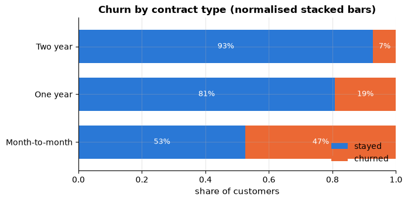

### 4.8 Target-oriented EDA: churn rate by segment

In a supervised project the most productive bivariate analysis is *every feature against
the target*. For categorical features, plot the churn rate per level with the base rate as a
reference line; for numeric features, bin into quantiles (deciles) and plot the rate per
bin. Levels far from the base rate, and monotone or strongly curved profiles, are where a
model will find its signal — and where a feature that predicts *too* well should make you
suspicious of leakage.

> **Real-life example.** A bank's credit-risk team plots the default rate per job type, per loan
> purpose and per income decile against the overall rate. If a column such as "passed to debt
> collection" shows a default rate of 100 %, it is not a great feature but a leak: it is filled
> in *after* a customer has defaulted and does not exist yet when a new application is scored. In
> churn data the equivalent is a "cancellation reason" column.

```python
seg_cols = ["contract", "internet_service", "payment_method", "tech_support", "senior_citizen", "region"]
base_rate = df["churned"].mean()
fig, axes = plt.subplots(2, 4, figsize=(17, 7))
for ax, col in zip(axes.ravel()[:6], seg_cols):      # .ravel() flattens the 2 x 4 grid; the first six panels
    rate = df.groupby(col, observed=True)["churned"].agg(["mean", "size"]).sort_values("mean")
    ax.barh([str(i) for i in rate.index], rate["mean"], color=PALETTE[0])   # str(): show 0/1 labels as categories
    ax.axvline(base_rate, color=PALETTE[1], ls="--", lw=1.5)
    ax.set_xlim(0, 0.8)
    ax.set_title(f"churn rate by {col}", fontsize=10)
    ax.tick_params(axis="y", labelsize=8)
for ax, col in zip(axes.ravel()[6:], ["monthly_charges", "tenure_months"]):    # the last two panels
    # pd.qcut cuts into q bins with (about) equal numbers of rows; duplicates="drop" merges bins whose edges coincide
    deciles = pd.qcut(df[col], q=10, duplicates="drop")
    rate = df.groupby(deciles, observed=True)["churned"].mean()
    mids = [iv.mid for iv in rate.index]             # .mid is the midpoint of each interval, used as its x position
    ax.plot(mids, rate.values, marker="o", color=PALETTE[0])
    ax.axhline(base_rate, color=PALETTE[1], ls="--", lw=1.5, label="base rate")
    ax.set_ylim(0, 0.8)
    ax.set_xlabel(col)
    ax.set_title(f"churn rate by decile of {col}", fontsize=10)
    ax.legend(fontsize=8)
plt.tight_layout()
plt.show()
```

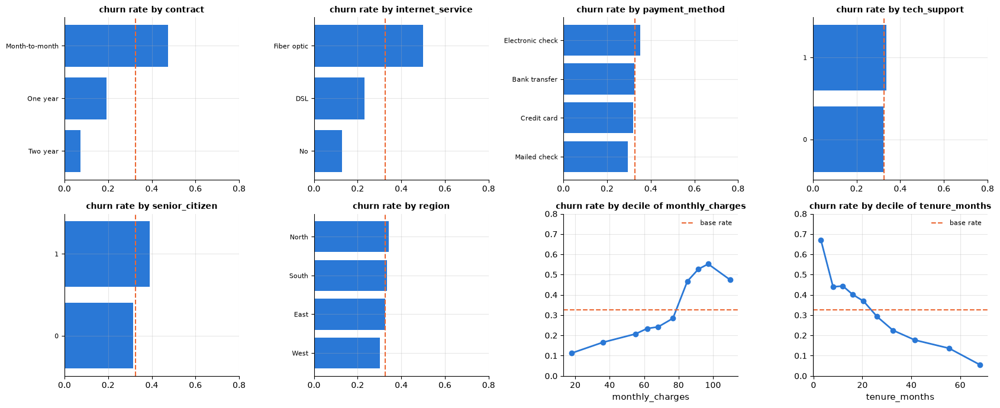

Contract type, internet service, payment method, tech support and tenure carry strong
signal; region carries none (the four bars sit on the base rate); senior citizens churn
somewhat more. Monthly charges show a *rising* profile — in the raw data they are
confounded with the plan (fibre customers pay more *and* churn more), which is the kind of
entanglement that a model, unlike a single-variable plot, can disentangle.

## 5. Multivariate views

### 5.1 Pair plots

A pair plot draws every scatter plot of a set of numeric columns, with distributions on
the diagonal, coloured by a category. It is the fastest way to see all pairwise structure
at once — and it scales badly: $d$ columns give $d^2$ panels, so choose a handful of
features and subsample the rows.

> **Real-life example.** A cardiology study records age, blood pressure, cholesterol and body-mass
> index for a few thousand patients and colours each point by whether the patient had a heart
> attack within five years. One pair plot shows which pairs of measurements separate the two
> groups and which are nearly redundant.

```python
pair_cols = ["tenure_months", "monthly_charges", "total_charges", "support_tickets"]
sample = df.dropna(subset=pair_cols).sample(800, random_state=RANDOM_STATE)   # 800 random complete rows
# sns.pairplot: a grid of scatter plots for every pair of `vars`, coloured by `hue`; plot_kws goes to the scatter calls,
# diag_kind="kde" puts density curves on the diagonal, height is each panel's size, corner=True drops the upper half
g = sns.pairplot(sample, vars=pair_cols, hue="churned", palette={0: PALETTE[0], 1: PALETTE[1]},
                 plot_kws={"s": 12, "alpha": 0.5}, diag_kind="kde", height=2.2, corner=True)
g.figure.suptitle("Pair plot of four numeric features, coloured by churn (800 sampled customers)", y=1.02)
plt.show()
```

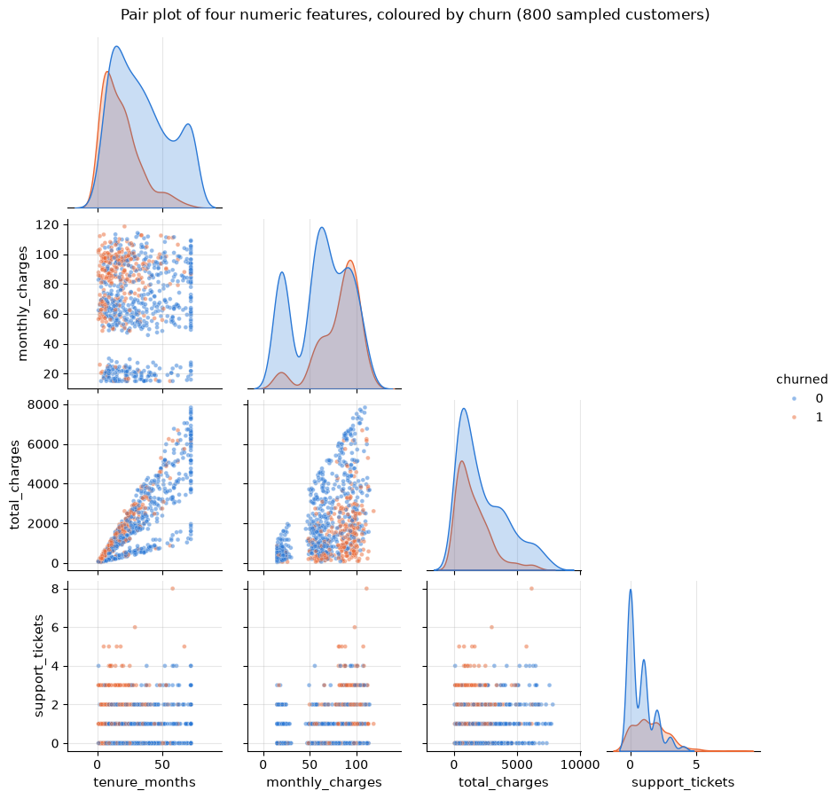

### 5.2 Small multiples and facets

When a relationship might differ between groups, draw it once *per group*, on shared
axes: **small multiples**. seaborn's figure-level functions (`catplot`, `relplot`,
`displot`) do this with `col=` and `row=`. The panels below show that the effect of the
internet plan on churn is present *within every contract type* — the two effects are
additive rather than one masquerading as the other.

> **Real-life example.** During the COVID-19 pandemic many newspapers showed the case curves of
> dozens of countries as small multiples — one small panel per country, all on the same axes —
> because thirty lines in a single panel are unreadable, and shared axes keep the comparison
> honest.

```python
# sns.catplot(kind="bar"): bar height = mean of y per group (here the churn rate); errorbar=("ci", 95) adds 95 %
# bootstrap confidence intervals; col= draws one panel per value; height and aspect set each panel's size and shape
g = sns.catplot(data=df, x="contract", y="churned", hue="internet_service", col="senior_citizen",
                kind="bar", errorbar=("ci", 95), palette=PALETTE[:3], height=3.6, aspect=1.2)
g.set_axis_labels("contract", "churn rate")
g.set_titles("senior citizen = {col_name}")      # {col_name} is a placeholder that seaborn fills in for each panel
g.figure.suptitle("Churn rate by contract and internet service, faceted by senior-citizen status", y=1.04)
plt.show()
```

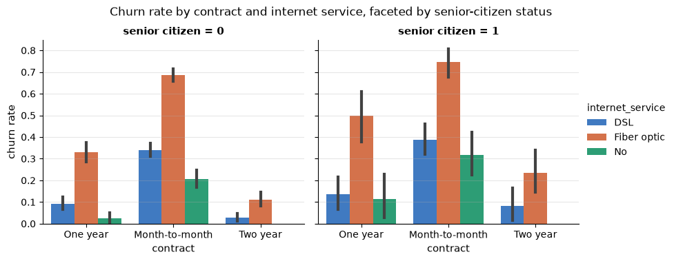

### 5.3 Parallel coordinates and a first look at PCA

Beyond three or four dimensions, scatter plots run out of axes. **Parallel coordinates**
draw one vertical axis per variable and one polyline per observation; with standardised
variables and a class colour they show which variables separate the classes. **Principal
component analysis** (PCA) instead projects the data onto the directions of largest
variance (the eigenvectors of the covariance matrix, notebook 2) and lets us draw a
high-dimensional cloud in two dimensions. We try both on the wine data (178 wines,
13 chemical measurements, 3 cultivars) bundled with scikit-learn. Standardising first is
essential: PCA measures variance, and a variable measured in large units would dominate
otherwise. Notebook 14 develops PCA properly.

> **Real-life example.** The wine data are a real chemical analysis of 178 wines grown in the
> same region of Italy from three grape cultivars. Food-authenticity laboratories work this way:
> they measure dozens of chemical markers of a wine, a honey or an olive oil, and a PCA plot
> shows whether a sample sits in the cloud of its claimed origin. A bottle labelled as one
> variety that lands in another variety's cloud deserves a closer look.

```python
from sklearn.datasets import load_wine
from sklearn.decomposition import PCA
from sklearn.preprocessing import StandardScaler

wine = load_wine(as_frame=True)          # 178 wines x 13 measurements; wine.target holds the cultivar 0, 1 or 2
# fit_transform rescales every column to mean 0 and standard deviation 1 and returns a NumPy array, wrapped back here
X_wine = pd.DataFrame(StandardScaler().fit_transform(wine.data), columns=wine.data.columns)
X_wine["cultivar"] = wine.target_names[wine.target]     # index the array of names with the labels: one name per wine

fig, axes = plt.subplots(1, 2, figsize=(16, 4.4), gridspec_kw={"width_ratios": [1.6, 1]})
pc_cols = ["alcohol", "malic_acid", "ash", "flavanoids", "color_intensity", "hue", "proline"]
# one vertical axis per column and one line per wine, coloured by the class column given as the second argument
pd.plotting.parallel_coordinates(X_wine[pc_cols + ["cultivar"]], "cultivar", color=PALETTE[:3], alpha=0.35, ax=axes[0])
axes[0].set_title("parallel coordinates (standardised features)")
axes[0].set_ylabel("standardised value")
axes[0].tick_params(axis="x", labelsize=8)

# PCA(n_components=2) finds the two directions of largest variance; .fit learns them on the 13 feature columns
pca = PCA(n_components=2, random_state=RANDOM_STATE).fit(X_wine[wine.data.columns])
scores = pca.transform(X_wine[wine.data.columns])    # coordinates of every wine on those two directions: (178, 2)
for i, name in enumerate(wine.target_names):
    m = wine.target == i                             # boolean mask: the wines of cultivar i
    axes[1].scatter(scores[m, 0], scores[m, 1], s=18, color=PALETTE[i], label=name, alpha=0.8)
# explained_variance_ratio_[k] is the share of the total variance captured by component k
axes[1].set_xlabel(f"PC 1 ({pca.explained_variance_ratio_[0]:.0%} of variance)")
axes[1].set_ylabel(f"PC 2 ({pca.explained_variance_ratio_[1]:.0%} of variance)")
axes[1].set_title("PCA projection of all 13 features")
axes[1].legend(title="cultivar")
plt.tight_layout()
plt.show()
```

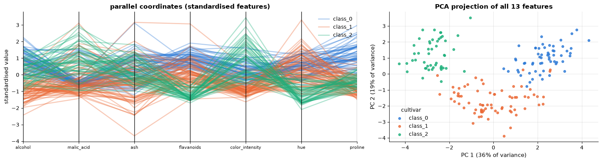

Two principal components — a specific linear combination of thirteen measurements — are
enough to separate the three cultivars almost completely; flavanoids, colour intensity and
proline do most of the work, as the parallel coordinates show.

## 6. Time-indexed EDA

Time series need their own toolkit: the *order* of rows carries information, and the
questions are about trend, seasonality (at several periods at once) and anomalies. We
use two years of hourly electricity demand with temperature and a holiday flag. Setting the
timestamp as the index unlocks pandas' time-series machinery: `resample` aggregates to
coarser frequencies, `rolling` computes moving windows, and `.index.hour` / `.dayofweek` /
`.month` extract calendar components for seasonal profiles. Notebook 16 builds forecasting
models on top of exactly these views.

> **Real-life example.** The (synthetic) data mimic what the grid operator of a large city sees:
> hourly demand in megawatts, the outside temperature, and a public-holiday flag. Every day the
> operator forecasts the next day's 24 hourly values to schedule power plants; a forecast that is
> a few percent off means buying expensive power at short notice. The same mix of daily, weekly
> and yearly cycles appears in hourly bike-hire counts, website traffic and the call volume of a
> customer-service centre.

```python
energy = load_energy_demand().set_index("timestamp")    # the timestamps become the row index (a DatetimeIndex)
# pd.infer_freq guesses the regular spacing of the index ("h" = hourly)
print(energy.index.min(), "->", energy.index.max(), "|", len(energy), "hourly rows | frequency:", pd.infer_freq(energy.index))
display(energy.describe().round(1))

daily = energy["demand_mw"].resample("D").mean()    # resample("D") groups the hours by calendar day; .mean() per day
fig, ax = plt.subplots(figsize=(14, 3.8))
ax.plot(energy.index, energy["demand_mw"], lw=0.3, alpha=0.5, color=PALETTE[0], label="hourly")
ax.plot(daily.index, daily, lw=1.2, color=PALETTE[1], label="daily mean")
# rolling(28, center=True).mean(): the average of a 28-day window centred on each day (NaN where it is incomplete)
ax.plot(daily.index, daily.rolling(28, center=True).mean(), lw=2.5, color="black", label="28-day rolling mean")
ax.set_xlabel("date")
ax.set_ylabel("demand (MW)")
ax.set_title("Hourly electricity demand, two years")
ax.legend(loc="upper left", ncol=3)
plt.show()
```

```text
2022-01-01 00:00:00 -> 2023-12-31 23:00:00 | 17520 hourly rows | frequency: h
```

|  | demand_mw | temperature_c | is_holiday |
|---|---|---|---|
| count | 17520.0 | 17520.0 | 17520.0 |
| mean | 602.6 | 9.9 | 0.0 |
| std | 84.1 | 9.1 | 0.1 |
| min | 316.1 | -15.3 | 0.0 |
| 25% | 543.2 | 2.8 | 0.0 |
| 50% | 598.0 | 9.9 | 0.0 |
| 75% | 659.4 | 17.0 | 0.0 |
| max | 920.2 | 33.1 | 1.0 |


Three time scales are visible at once: the hourly wiggle (a daily cycle), the weekly
pattern in the daily means, and an annual cycle with winter and summer peaks plus a slight
upward trend. **Seasonal profiles** isolate each cycle by averaging over the others — the
hour-of-day × day-of-week heatmap is the standard view for load data:

```python
# calendar parts of the index as new columns: hour 0-23, dayofweek 0 (Monday) to 6 (Sunday), month 1-12
profile = energy.assign(hour=energy.index.hour, weekday=energy.index.dayofweek, month=energy.index.month)
heat = profile.pivot_table(values="demand_mw", index="hour", columns="weekday", aggfunc="mean")   # (24, 7) table
heat.columns = ["Mon", "Tue", "Wed", "Thu", "Fri", "Sat", "Sun"]    # rename the columns 0..6

fig, axes = plt.subplots(1, 2, figsize=(15, 4.6), gridspec_kw={"width_ratios": [1, 1.4]})
sns.heatmap(heat, cmap="viridis", ax=axes[0], cbar_kws={"label": "mean demand (MW)"})
axes[0].set_title("hour-of-day x weekday profile")
axes[0].set_xlabel("")
axes[0].set_ylabel("hour of day")
axes[0].grid(False)
# one box per month; fliersize is the size of the dots drawn for outliers
sns.boxplot(data=profile, x="month", y="demand_mw", ax=axes[1], color=PALETTE[0], fliersize=1, width=0.6)
axes[1].set_title("annual cycle: demand by calendar month")
axes[1].set_xlabel("month")
axes[1].set_ylabel("demand (MW)")
plt.tight_layout()
plt.show()
```


The heatmap shows the double daily peak (morning and early evening), the weekend dip, and
that Saturday and Sunday lose the morning peak entirely; the monthly boxes show the winter
and summer maxima with mild shoulder seasons. The relationship to temperature is the
bivariate view a forecasting model will exploit:

```python
temp_bins = pd.cut(energy["temperature_c"], bins=np.arange(-12, 36, 2))    # 2 °C bins with edges -12, -10, ..., 34
binned = energy.groupby(temp_bins, observed=True)["demand_mw"].agg(["mean", "size"])
binned = binned[binned["size"] >= 20]                 # keep only bins with at least 20 hours of data
# Monday to Friday only (weekday < 5), then mean demand for is_holiday = 0 and is_holiday = 1
holiday_effect = energy.assign(weekday=energy.index.dayofweek).query("weekday < 5").groupby("is_holiday")["demand_mw"].mean()

fig, ax = plt.subplots(figsize=(8, 4))
hb = ax.hexbin(energy["temperature_c"], energy["demand_mw"], gridsize=45, cmap="Blues", mincnt=1)
ax.plot([iv.mid for iv in binned.index], binned["mean"], color=PALETTE[1], lw=2.5, label="mean demand per 2 °C bin")
ax.set_xlabel("temperature (°C)")
ax.set_ylabel("demand (MW)")
ax.set_title("Demand vs. temperature: heating below ~15 °C, cooling above ~22 °C")
ax.legend()
plt.colorbar(hb, ax=ax, label="hours")
plt.show()
# holiday_effect[1] / [0] select by label (is_holiday = 1 / 0); :+.1% prints a signed percentage
print(f"mean weekday demand: holidays {holiday_effect[1]:.0f} MW vs. other weekdays {holiday_effect[0]:.0f} MW "
      f"({holiday_effect[1] / holiday_effect[0] - 1:+.1%})")
```

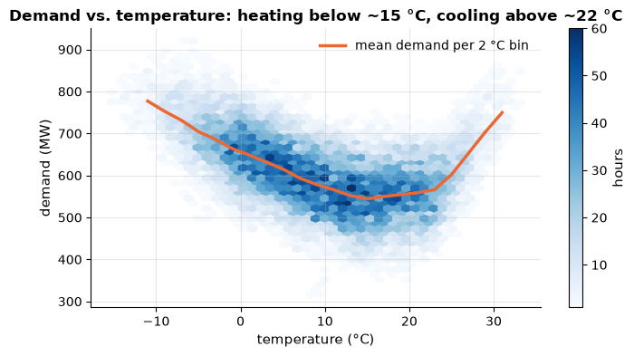

```text
mean weekday demand: holidays 556 MW vs. other weekdays 620 MW (-10.4%)
```

## 7. Pitfalls

### 7.1 Simpson's paradox

An association that holds in every subgroup can reverse when the subgroups are pooled
(Simpson, 1951). It happens whenever group membership is correlated with *both* the
treatment and the outcome. We construct the classic version: a retention offer that
*lowers* churn within every contract type, yet appears to *raise* it overall, because the
offer was targeted at the segment most likely to churn anyway.

> **Real-life examples.**
> - Graduate admissions at the University of California, Berkeley, in 1973: 44 % of the male but
>   only 35 % of the female applicants were admitted, yet in most departments women were admitted
>   at an equal or higher rate. Women had applied more often to the departments that rejected
>   most applicants (Bickel, Hammel & O'Connell, 1975).
> - Kidney stones: open surgery had a higher success rate than a less invasive procedure for
>   small stones *and* for large stones, but a lower one overall, because surgeons used it mostly
>   on the large, harder stones (Charig et al., 1986).

```python
segments = {  # contract: (customers, share who received the offer, churn rate with offer, churn rate without)
    "Month-to-month": (3000, 0.70, 0.40, 0.52),
    "Two year":       (2000, 0.15, 0.04, 0.08),
}
rows = []
for contract, (n, offer_share, churn_offer, churn_none) in segments.items():
    got_offer = rng.random(n) < offer_share          # True for about offer_share of the customers
    # np.where(cond, a, b) picks from a where cond is True and from b elsewhere: each customer churns with the rate
    # of their group
    churned = np.where(got_offer, rng.random(n) < churn_offer, rng.random(n) < churn_none)
    # the single value `contract` is repeated for every row of the frame
    rows.append(pd.DataFrame({"contract": contract, "offer": np.where(got_offer, "offer", "no offer"), "churned": churned.astype(int)}))
campaign = pd.concat(rows, ignore_index=True)        # stack the frames; ignore_index renumbers the rows 0..n-1

by_segment = campaign.pivot_table(values="churned", index="contract", columns="offer", aggfunc="mean")
# pooled churn rate per offer group, turned into a one-row frame: .to_frame() gives one column, .T makes it a row,
# and .rename(index=...) changes that row's label
overall = campaign.groupby("offer")["churned"].mean().to_frame().T.rename(index={"churned": "ALL customers"})
table = pd.concat([by_segment, overall])             # append the pooled row under the two segment rows
display(table.round(3))

fig, ax = plt.subplots(figsize=(7, 3.6))
table[["no offer", "offer"]].plot(kind="bar", ax=ax, color=[PALETTE[0], PALETTE[1]], width=0.7, rot=0)   # rot=0: flat labels
ax.set_ylabel("churn rate")
ax.set_title("Simpson's paradox: the offer helps in every segment but 'hurts' overall")
ax.legend(title="")
plt.show()
```

| \\ offer | no offer | offer |
|---|---|---|
| Month-to-month | 0.495 | 0.391 |
| Two year | 0.080 | 0.046 |
| ALL customers | 0.222 | 0.348 |


The resolution is not statistical but *causal*: the pooled comparison compares mostly
month-to-month customers (who got the offer) with mostly two-year customers (who did not).
Whenever you compare groups, ask what else differs between them — and stratify.

### 7.2 Survivorship and selection bias

A data set is a *sample*, and how it was sampled shapes every pattern in it. The best
known story is Wald's analysis of returning WWII bombers: armour was proposed for the
places with the most bullet holes, until he pointed out that the sample contained only the
planes that *survived* their hits — the unmarked areas were the fatal ones. Our churn table
has the same structure in miniature: it contains only customers who existed at extraction
time (the signup histogram of notebook 1 showed the 72-month cap), `total_charges` exists
only for customers who have been billed, and any model trained on it learns about *these*
customers, under *these* prices and competitors. A classifier trained on loan applicants
who were *approved* (notebook 19) knows nothing about those who were rejected. The
question "who is missing from this table, and why?" belongs in every EDA report.

### 7.3 Misleading axes

The same numbers can be made to tell opposite stories with an axis. A bar chart's $y$-axis
must start at zero — bars encode *length*, and truncating the axis exaggerates differences
(Wainer, 1984, catalogues this and eleven other ways to display data badly). Dual
$y$-axes let the author choose which two scales make the lines cross; area and 3-D
effects distort perceived magnitudes. The churn rates by region below differ by a few
points and are statistically indistinguishable — one axis says so, the other shouts.

> **Real-life example.** A widely shared US television graphic compared a top income-tax rate of
> 35 % with a planned 39.6 % using bars on an axis that started at 34 %: the second bar looked
> more than five times as tall as the first, for a rise of 13 %. Drawn from zero, the second bar
> is only about an eighth taller.

```python
region_rate = df.groupby("region")["churned"].agg(["mean", "size"])
region_rate["se"] = np.sqrt(region_rate["mean"] * (1 - region_rate["mean"]) / region_rate["size"])
fig, axes = plt.subplots(1, 2, figsize=(11, 3.6))
for ax, (title, ylim) in zip(axes, [("MISLEADING: truncated y-axis", (0.29, 0.35)), ("honest: axis from zero, with 95% CIs", (0, 0.45))]):
    # error bars only in the honest panel: the "... if condition else None" expression passes None otherwise
    ax.bar(region_rate.index, region_rate["mean"], color=PALETTE[0], yerr=1.96 * region_rate["se"] if ylim[0] == 0 else None, capsize=4)
    ax.set_ylim(*ylim)                 # *ylim unpacks the (bottom, top) pair into two arguments
    ax.set_ylabel("churn rate")
    ax.set_title(title)
plt.show()
```

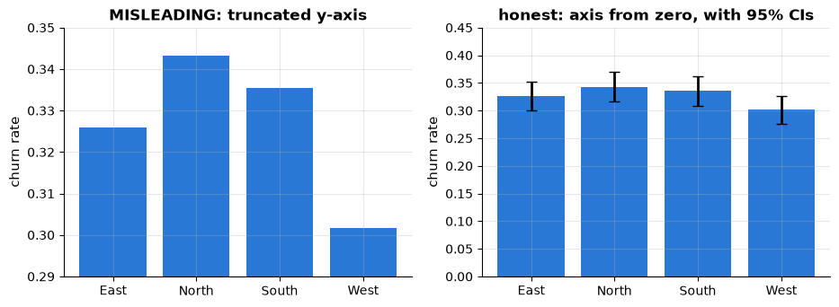

### 7.4 A checklist for an EDA report

1. **Provenance**: where the data come from, what a row is, the time span, how the sample
   was selected, and who is *not* in it.
2. **Schema**: every column with type, unit, meaning, plausible range and cardinality.
3. **Quality log**: duplicates, missing values (with their mechanism), inconsistent
   categories, impossible values, the tenure-cap type of artefact — and the decision for
   each.
4. **Target**: its distribution and base rate; candidate leaks.
5. **Univariate**: a distribution plot per variable, with robust summaries; skew and
   suggested transforms.
6. **Bivariate**: correlations among features, every feature against the target, at least
   one stratified view to guard against Simpson-type reversals.
7. **Multivariate / temporal**: pair plots or a PCA view; seasonal profiles for time series.
8. **Open questions** for the domain expert, and the implications for modelling (metric,
   validation scheme, features to engineer).

## Summary

- EDA is detective work with a fixed list of questions: what is a row, what is the target,
  what is each column, what is missing and why, how is everything distributed and related,
  who is not in the sample.
- First contact: `shape`, `dtypes`, `memory_usage`, `describe`, `nunique`, `sample`,
  `isna` (with a missingness matrix), `duplicated`, `value_counts` — and a written
  data-quality log. In the churn file: 5 duplicates, 8 spellings of 4 regions, 3
  impossible charges, structured missingness in `total_charges`, a tenure cap.
- Univariate: histograms with several bin widths, KDEs, log axes for skew, violins where
  box plots hide modes, strip and swarm plots to show every point of a small sample; robust statistics (median, IQR, MAD) resist outliers; the IQR and
  $z$-score rules are heuristics that fail on multimodal and discrete data.
- Kernel density estimates: an average of one kernel bump per data point. The kernel hardly
  matters; the bandwidth decides what you see — rules of thumb oversmooth multimodal data,
  likelihood-based choices chase spikes. Trust modes that survive a range of bandwidths, and
  check the curve against the raw data for hard limits, point masses and counts.
- Bivariate: scatter plots with `alpha`/jitter/hexbin; Pearson (linear), Spearman
  (monotone), Kendall (concordance); Anscombe's quartet says *plot it*; correlation is
  not causation; conditional means with confidence intervals; cross-tabs and normalised
  stacked bars; churn rate by segment against the base rate.
- Multivariate: pair plots on a subset, facets to check that effects hold within groups,
  parallel coordinates and PCA to see high-dimensional structure.
- Time series: `resample`, `rolling`, seasonal profiles by hour × weekday and by month,
  the driver relationship (temperature).
- Pitfalls: Simpson's paradox (stratify!), survivorship/selection bias (who is missing?),
  truncated axes and other lie factors.

| Question | Plot / tool |
|---|---|
| distribution of one numeric variable | `ax.hist` (try several `bins`), `sns.kdeplot`, `sns.violinplot`, `sns.stripplot`/`sns.swarmplot` for small samples; log axis if skewed |
| shape and number of modes | KDE at several bandwidths (`bw_adjust=`) and a mode count; `value_counts()` for caps and floors; `sns.ecdfplot` to read probabilities |
| distribution of one categorical variable | sorted `barh` of `value_counts()` |
| outliers | IQR rule, robust $z$-score, and the data dictionary |
| two numeric variables | `scatter(alpha=…)`, jitter, `hexbin`; `df.corr(method=…)` |
| many numeric variables | `sns.heatmap(corr, cmap="RdBu_r", vmin=-1, vmax=1)`, `sns.pairplot` (subset), PCA |
| numeric by category | grouped `sns.boxplot`/`violinplot`, raw points with `stripplot`/`swarmplot`; conditional means ± CI |
| category by category | `pd.crosstab(normalize="index")`, normalised stacked bars, $\chi^2$ |
| feature vs. binary target | rate per level / per decile vs. base rate |
| effect within subgroups | `sns.catplot(col=…)` facets — the Simpson check |
| time series | `resample("D").mean()`, `rolling(k)`, `pivot_table(index=hour, columns=weekday)` |
| missing data | `isna().sum()`, missingness matrix sorted by a candidate cause |

**Next steps:** notebook 4 (preprocessing and feature engineering) turns the quality log
into a cleaning pipeline and the target-oriented findings into features; notebook 13
(anomaly detection) treats outliers as a modelling problem; notebook 14 (dimensionality
reduction) develops PCA and non-linear alternatives for visualisation; notebook 16 (time
series) builds forecasting models on the energy data; notebook 19 discusses selection bias
and its consequences for fairness.

## Exercises

### Exercise 1 — EDA of the penguins (easy)
Load `course_utils.load_penguins()` (Palmer penguins; a synthetic stand-in appears when
offline). Run the first-contact checks of section 2, plot the distribution of each numeric
measurement per species (grouped box or violin plots), and draw the scatter plot of
`flipper_length_mm` against `body_mass_g` coloured by species and with `sex` as the marker
style. Which single measurement separates the species best?

<details><summary>Solution sketch</summary>

`penguins.isna().sum()` shows a few missing measurements and sexes; `sns.pairplot(penguins,
hue="species")` and `sns.scatterplot(..., hue="species", style="sex")`. Flipper length
(and bill depth) separate Gentoo from the other two almost perfectly; bill length separates
Adelie from Chinstrap.
</details>

### Exercise 2 — Find every data-quality issue in the churn file (easy)
Write a function `quality_report(df)` that returns a table with, for every column: dtype,
number and share of missing values, number of distinct values, and — for numeric columns —
min, max and the number of values flagged by the IQR rule. Run it on `load_churn(raw=True)`
and list every issue it surfaces, plus at least one issue it *cannot* surface (hint: think
about consistency between columns, and about the cap on tenure).

<details><summary>Solution sketch</summary>

Build the table with `df.dtypes`, `df.isna().sum()`, `df.nunique()`, `df.describe()` and
`iqr_flags`. It finds the missing `total_charges`, the 999s and the 8 region spellings (via
`nunique`), but not the duplicated rows (needs `duplicated()`), the tenure cap (needs domain
knowledge or the signup-date histogram), or the `total ≈ monthly × tenure` consistency
check (needs a cross-column rule).
</details>

### Exercise 3 — Simpson's paradox in the churn data (medium)
Using `load_churn()`, compute the churn rate of customers with and without `tech_support`
(a) overall, (b) within each `internet_service` level. Then do the same for `streaming`.
Do you find a reversal, an attenuation, or neither? Explain the pattern with a stratified
bar chart, and explain which variable plays the role of the confounder.

<details><summary>Solution sketch</summary>

`df.groupby(["internet_service", "tech_support"])["churned"].mean().unstack()`. Customers
without internet have neither tech support nor streaming *and* churn least, so the pooled
"no tech support" group is diluted by them: the overall effect of tech support is smaller
than the within-plan effect (attenuation rather than reversal); for streaming the pooled
comparison can even suggest streaming *increases* churn while within fibre/DSL the effect is
negligible. The internet plan is the confounder.
</details>

### Exercise 4 — Temperature profiles of the energy data (medium)
Reproduce the hour × weekday heatmap of section 6 for *temperature* instead of demand, and
then compute a heatmap of the demand *residual* after subtracting the hour-of-day × weekday
mean profile. Which structure remains in the residual (plot it against temperature and
against the date)?

<details><summary>Solution sketch</summary>

`profile.groupby(["hour", "weekday"])["demand_mw"].transform("mean")` gives the profile
value for every row; the residual `demand - profile` still shows the annual cycle and the
U-shaped temperature dependence — the calendar profile explains the daily/weekly cycles but
not the weather. That is the decomposition a forecasting model (notebook 16) must learn.
</details>

### Exercise 5 — A dashboard-like figure (hard)
Design a single figure with `plt.subplots` and `gridspec_kw` (or `fig.add_gridspec`) that
summarises the churn data for a manager: the base rate as a large number, churn rate by
contract and by internet plan, the tenure profile with confidence intervals, and the
monthly-charge distribution of churned vs. retained customers. Apply the rules of section
1.1: one message per panel, axes from zero for bars, a shared colour meaning across panels,
no chart junk. Then write three sentences of findings a manager could act on.

<details><summary>Solution sketch</summary>

```py
fig = plt.figure(figsize=(14, 8))
gs = fig.add_gridspec(2, 3)
ax_big = fig.add_subplot(gs[0, 0]); ax_big.text(0.5, 0.5, f"{base_rate:.0%}", fontsize=48, ha="center"); ax_big.axis("off")
ax1 = fig.add_subplot(gs[0, 1]); ...
```
Findings: month-to-month fibre customers paying by electronic check churn at more than
twice the base rate; the first six months are decisive; tech support halves churn within
each plan — a retention offer should target new month-to-month fibre customers.
</details>

### Exercise 6 — Kernel density estimation, done properly (hard)
Use the `kde()` function of section 3.6.
(a) Write `epanechnikov_kernel(u)`, $K(u) = \frac{3}{4}(1 - u^2)$ for $\lvert u \rvert \le 1$
and 0 otherwise, and pass it to `kde()`. Its standard deviation is $1/\sqrt{5}$ of its
half-width, so it matches a Gaussian kernel with bandwidth $h$ when its own bandwidth is
$`\sqrt{5}\, h`$. Plot both for the monthly charges with $h = 2$: can you tell them apart?
(b) Estimate the density of `total_charges` twice: with `kde()` on the raw values (Scott's
rule), and by applying `kde()` to `np.log(total_charges)` and transforming back with the
factor $1/x$. How much of each estimate lies below zero? Compare both with a fine histogram
of the totals below 500.
(c) Write `loo_loglik(data, h)`, the leave-one-out log-likelihood: the mean of
$`\log \hat{p}_{-i}(x_i)`$, where $`\hat{p}_{-i}`$ is the KDE of all points *except* $`x_i`$. Use it to
choose $h$ from `np.geomspace(0.1, 10, 30)` for a random sample of 2 000 tenure values. Why
does it pick the smallest bandwidth on the grid? Add uniform noise between −0.5 and 0.5 to
the values (undoing the rounding to whole months) and repeat; then repeat once more without
the customers at the 72-month cap.

<details><summary>Solution sketch</summary>

```py
def epanechnikov_kernel(u):
    return 0.75 * (1 - u**2) * (np.abs(u) <= 1)

def loo_loglik(data, h, kernel=gaussian_kernel):
    u = (data[:, None] - data[None, :]) / h
    # remove each point's own bump, kernel(0), from its density, and divide by n - 1 instead of n
    return np.log((kernel(u).sum(axis=1) - kernel(0)) / ((len(data) - 1) * h)).mean()
```
(a) The two curves differ by at most about 0.0007 against a peak of 0.019 — indistinguishable
by eye: the shape of the kernel matters far less than its width. (b) The raw KDE
($h \approx 318$) puts about 4 % of its area below zero and blurs the small totals (too high
below about 30, too low between 50 and 500); the log-scale estimate
$`\hat{p}_Y(\log x) / x`$ has no mass below zero by construction and follows the histogram of
small totals closely. (c) Tenure is a whole number, so every value has exact duplicates: as
$h \to 0$ each point's leave-one-out density, carried by its duplicates, grows without limit,
and the likelihood keeps asking for a smaller $h$. With the noise added the choice is about
0.3 — still tiny, because the cap remains a spike of about 150 sampled customers within one
month; without them it is about 0.7, against 4.5 for Scott's rule. Likelihood-based selectors
chase whatever is spiky in the data — ties, caps, rounding — which is why section 3.6
recommends looking at a range of bandwidths and at the raw values.
</details>

## References and further reading

### Textbooks

- Tukey, J. W. (1977). *Exploratory Data Analysis*. Addison-Wesley. — The book that named the field; stem-and-leaf displays and box plots were introduced here, and its attitude — look first, hypothesise later — is the point of this notebook.
- Tufte, E. R. (2001). *The Visual Display of Quantitative Information* (2nd ed.). Graphics Press. — Data–ink ratio, chart junk, the lie factor, small multiples; the classic on graphical integrity.
- Wilke, C. O. (2019). *Fundamentals of Data Visualization*. O'Reilly. (free at https://clauswilke.com/dataviz/) — A practical, opinionated guide to choosing and designing charts; chapters 7–9 (distributions), 12 (associations), 19 (colour pitfalls) map directly onto this notebook.
- Silverman, B. W. (1986). *Density Estimation for Statistics and Data Analysis*. Chapman & Hall. — The classic short introduction to kernel density estimation: kernels and their efficiencies, the bias–variance trade-off, the rules of thumb, and the table on the curse of dimensionality used in section 3.6.
- Wand, M. P., & Jones, M. C. (1995). *Kernel Smoothing*. Chapman & Hall. — The mathematical treatment: AMISE, bandwidth selectors, boundary corrections.
- McKinney, W. (2022). *Python for Data Analysis* (3rd ed.). O'Reilly. (free) — Chapters 7 (data cleaning), 9 (plotting), 10 (aggregation) and 11 (time series) are the pandas mechanics used here.
- VanderPlas, J. (2023). *Python Data Science Handbook* (2nd ed.). O'Reilly. (free) — Part 4 (Matplotlib) and the seaborn chapter; part 3 for `groupby`/`pivot_table`.

### Papers

- Anscombe, F. J. (1973). Graphs in statistical analysis. *The American Statistician*, 27(1), 17–21. — The quartet of section 4.3.
- Matejka, J., & Fitzmaurice, G. (2017). Same stats, different graphs: generating datasets with varied appearance and identical statistics through simulated annealing. *Proceedings of CHI 2017*, 1290–1294. — The "datasaurus dozen", Anscombe's idea taken to its logical conclusion.
- Cleveland, W. S., & McGill, R. (1984). Graphical perception: theory, experimentation, and application to the development of graphical methods. *Journal of the American Statistical Association*, 79(387), 531–554. — The experiments behind "position beats length beats area beats colour".
- Wainer, H. (1984). How to display data badly. *The American Statistician*, 38(2), 137–147. — Twelve rules for bad graphics, each illustrated; funny and instructive.
- Hintze, J. L., & Nelson, R. D. (1998). Violin plots: a box plot–density trace synergism. *The American Statistician*, 52(2), 181–184. — The paper that introduced the violin plot of section 3.3: a box plot with the density trace drawn mirrored around it.
- Simpson, E. H. (1951). The interpretation of interaction in contingency tables. *Journal of the Royal Statistical Society: Series B*, 13(2), 238–241. — The paradox of section 7.1.
- Bickel, P. J., Hammel, E. A., & O'Connell, J. W. (1975). Sex bias in graduate admissions: data from Berkeley. *Science*, 187(4175), 398–404. — The best-known real Simpson's paradox (section 7.1).
- Charig, C. R., Webb, D. R., Payne, S. R., & Wickham, J. E. (1986). Comparison of treatment of renal calculi by open surgery, percutaneous nephrolithotomy, and extracorporeal shockwave lithotripsy. *British Medical Journal*, 292(6524), 879–882. — The kidney-stone example of section 7.1.
- Rosenblatt, M. (1956). Remarks on some nonparametric estimates of a density function. *The Annals of Mathematical Statistics*, 27(3), 832–837. — The first kernel density estimator.
- Parzen, E. (1962). On estimation of a probability density function and mode. *The Annals of Mathematical Statistics*, 33(3), 1065–1076. — The general kernel estimator and its properties, hence "Parzen windows".
- Silverman, B. W. (1981). Using kernel density estimates to investigate multimodality. *Journal of the Royal Statistical Society: Series B*, 43(1), 97–99. — Counting modes as the bandwidth shrinks: the idea behind the mode-count panel of section 3.6.
- Sheather, S. J., & Jones, M. C. (1991). A reliable data-based bandwidth selection method for kernel density estimation. *Journal of the Royal Statistical Society: Series B*, 53(3), 683–690. — The plug-in bandwidth selector.
- Rubin, D. B. (1976). Inference and missing data. *Biometrika*, 63(3), 581–592. — The MCAR/MAR/MNAR taxonomy of missingness mechanisms.
- Wickham, H. (2010). A layered grammar of graphics. *Journal of Computational and Graphical Statistics*, 19(1), 3–28. — The grammar behind ggplot2, and the mental model behind seaborn's figure-level functions.
- Hunter, J. D. (2007). Matplotlib: a 2D graphics environment. *Computing in Science & Engineering*, 9(3), 90–95. — The library behind every figure in this course.
- Waskom, M. L. (2021). seaborn: statistical data visualization. *Journal of Open Source Software*, 6(60), 3021.
- Okabe, M., & Ito, K. (2008). Color universal design (CUD): how to make figures and presentations that are friendly to colorblind people. https://jfly.uni-koeln.de/color/ — The reasoning behind colour-blind-safe palettes such as the course `PALETTE`.

### Documentation and online resources (all free)

- pandas user guide, *Visualization*, *Group by* and *Time series / date functionality* — https://pandas.pydata.org/docs/user_guide/
- seaborn tutorial, *An introduction to seaborn* and the *API overview* (figure-level vs. axes-level functions) — https://seaborn.pydata.org/tutorial.html
- Matplotlib, *Choosing colormaps* (why `viridis` and `RdBu_r`) — https://matplotlib.org/stable/users/explain/colors/colormaps.html
- scikit-learn user guide, *Density estimation* (`KernelDensity`, its kernels and bandwidth) — https://scikit-learn.org/stable/modules/density.html
- VanderPlas, J., *Python Data Science Handbook*, "In Depth: Kernel Density Estimation" — https://jakevdp.github.io/PythonDataScienceHandbook/05.13-kernel-density-estimation.html — The same ideas with scikit-learn, including bandwidth choice by cross-validation and a KDE-based classifier.
- The *Datasaurus Dozen* page — https://www.research.autodesk.com/publications/same-stats-different-graphs/ — Animated companion to Matejka & Fitzmaurice (2017).

---

← [2. Mathematics essentials: linear algebra, calculus, probability, statistics and information theory](02_mathematics_essentials.md) · [all notebooks](README.md) · [4. Data preprocessing and feature engineering](04_data_preprocessing_and_feature_engineering.md) →
