# 5. Machine learning fundamentals: the learning problem, generalisation and evaluation

> Markdown edition of [`notebooks/05_ml_fundamentals_generalization_and_evaluation.ipynb`](../notebooks/05_ml_fundamentals_generalization_and_evaluation.ipynb). Code and outputs are from the notebook's last saved run; to experiment, run the notebook itself.
>
> ← [4. Data preprocessing and feature engineering](04_data_preprocessing_and_feature_engineering.md) · [all notebooks](README.md) · [6. Linear regression and regularisation](06_linear_regression_and_regularization.md) →

Everything in this course rests on one question: **how can a program that has only seen a
finite sample of data make good predictions about data it has never seen?** This notebook
develops the vocabulary and the mental model needed to answer it. We formalise what a
"learning problem" is, meet the three fundamental families of tasks, see why fitting the
training data well is *not* the goal, derive the bias–variance decomposition, and learn the
evaluation protocols — hold-out sets, cross-validation, learning curves — that every later
notebook relies on.

The methods used here (polynomial regression, nearest neighbours, logistic regression) are
treated as black boxes; each gets its own notebook later. What matters now is the
*methodology* that surrounds any model.

**Prerequisites:** notebooks 1 (NumPy/pandas) and 2 (mathematics essentials). Notebook 4
(preprocessing) is helpful but not required.

## Learning objectives

After working through this notebook you will be able to

- state the supervised learning problem formally (data, hypothesis space, loss, risk) and explain *empirical risk minimisation*;
- distinguish supervised, unsupervised and reinforcement learning, and regression from classification;
- explain underfitting and overfitting, and diagnose them with training/validation curves;
- derive the bias–variance decomposition of the expected squared error and reproduce it in a simulation;
- use train/validation/test splits and $k$-fold cross-validation correctly, including stratification and repeated CV;
- read learning curves and validation curves to decide whether to collect more data, use a bigger model, or regularise;
- use the scikit-learn estimator API (`fit`, `predict`, `transform`, `score`) and sensible baselines;
- recognise data leakage and the "no free lunch" theorem as the two most important caveats in practice.

## Setup

```python
import numpy as np
import pandas as pd
import matplotlib.pyplot as plt
import seaborn as sns          # statistical plots on top of matplotlib (not used in this notebook)

# course helpers: plot style, colour list, and plot_decision_boundary(model, X, y, ...), which shades the class
# a fitted 2-D classifier predicts over the plane and draws the data points on top (used in section 7.2)
from course_utils import set_style, PALETTE, plot_decision_boundary

RANDOM_STATE = 42
rng = np.random.default_rng(RANDOM_STATE)    # the seeded random-number generator behind every simulated data set
set_style()
```

## 1. What is machine learning?

Tom Mitchell's often-quoted definition (Mitchell, 1997) is operational rather than
philosophical:

> A computer program is said to **learn** from experience $E$ with respect to some class of
> tasks $T$ and performance measure $P$, if its performance at tasks in $T$, as measured by
> $P$, improves with experience $E$.

Three ingredients, then: a *task* (predict house prices, recognise spoken words), a
*performance measure* (mean squared error, accuracy, revenue), and *experience* (data).
Machine learning is the discipline of building programs whose behaviour is determined by
data rather than by hand-written rules. That is a good idea exactly when the rules are hard
to write down explicitly — nobody can write the `if` statements that recognise a cat in a
photo — but examples are plentiful.

### 1.1 The three families of learning problems

| Family | What the data look like | Goal | Examples |
|---|---|---|---|
| **Supervised learning** | pairs $`(\mathbf{x}_i, y_i)`$ of inputs and targets | learn a function $f$ with $f(\mathbf{x}) \approx y$ on *new* inputs | spam filtering, price prediction, medical diagnosis |
| **Unsupervised learning** | inputs $`\mathbf{x}_i`$ only | find structure: clusters, low-dimensional representations, densities, anomalies | customer segmentation, topic discovery, compression |
| **Reinforcement learning** | an *agent* acts in an environment and receives rewards | learn a policy that maximises long-run reward | game playing, robotics, recommendation with feedback loops |

Between these sit *semi-supervised* learning (a few labels, many unlabelled points) and
*self-supervised* learning (labels manufactured from the data itself, as in modern language
models). This course concentrates on supervised learning (notebooks 5–12 and 15–16) and unsupervised learning (notebooks 13–14); reinforcement learning is only sketched in the
outlook.

Within supervised learning, the type of the target decides the task:

- **Regression** — $y \in \mathbb{R}$ (or $\mathbb{R}^k$): predict a quantity.
- **Classification** — $`y \in \{1, \dots, K\}`$: predict a category. $K=2$ is *binary*,
  $`K>2`$ *multi-class*; when several labels can be true at once it is *multi-label*.

Many other problems (ranking, structured prediction, forecasting) are reductions to these
two.

### 1.2 The supervised learning problem, formally

Let us fix notation that will be used throughout the course (see also the notation table in
notebook 0):

- An input (feature vector) $\mathbf{x} \in \mathcal{X} \subseteq \mathbb{R}^d$ and a target $y \in \mathcal{Y}$.
- A training set $`\mathcal{D} = \{(\mathbf{x}_i, y_i)\}_{i=1}^n`$, which we assume to be drawn
  **independently and identically distributed (i.i.d.)** from an unknown joint distribution
  $P(\mathbf{x}, y)$.
- A **hypothesis space** $\mathcal{H}$: the set of functions our learning algorithm can
  produce (all linear functions, all decision trees of depth $\le 5$, all neural networks
  of a given architecture, …).
- A **loss function** $\ell(y, \hat{y}) \ge 0$ that measures how bad the prediction
  $\hat{y} = f(\mathbf{x})$ is when the truth is $y$: squared error $(y - \hat{y})^2$ for
  regression, the 0–1 loss $`\mathbb{1}[y \ne \hat{y}]`$ for classification, and many others.

What we actually care about is the **risk** (expected loss, generalisation error) of a
hypothesis $f$:

```math
R(f) \;=\; \mathbb{E}_{(\mathbf{x}, y) \sim P}\big[\ell(y, f(\mathbf{x}))\big].
```

The best possible predictor $`f^\star = \arg\min_f R(f)`$ over *all* functions is called the
**Bayes predictor**, and its risk $R(f^\star)$ the **Bayes error** — the irreducible error
caused by noise in $y$ that no model can remove. For squared error the Bayes predictor is
the conditional mean $`f^\star(\mathbf{x}) = \mathbb{E}[y \mid \mathbf{x}]`$; for the 0–1 loss
it is the most probable class $`\arg\max_k P(y = k \mid \mathbf{x})`$.

We cannot compute $R(f)$ because $P$ is unknown. What we *can* compute is the
**empirical risk** on the training data,

```math
\hat{R}_n(f) \;=\; \frac{1}{n} \sum_{i=1}^n \ell\big(y_i, f(\mathbf{x}_i)\big),
```

and the most important learning principle in this course is simply

```math
\hat{f} \;=\; \arg\min_{f \in \mathcal{H}} \hat{R}_n(f) \qquad \text{(empirical risk minimisation, ERM).}
```

> **Key idea.** Learning = choosing a hypothesis space $\mathcal{H}$ and picking the member of
> $\mathcal{H}$ that fits the training data best. Almost every algorithm in this course is ERM
> for some $\mathcal{H}$ and some loss, often with an added *regularisation* term that
> discourages complex hypotheses (notebook 6).

The catch, and the reason this notebook exists: $`\hat{R}_n(\hat{f})`$ is an **optimistically
biased** estimate of $R(\hat{f})$, because $\hat{f}$ was chosen to make $`\hat{R}_n`$ small.
The larger and more flexible $\mathcal{H}$, the larger the gap can be. Statistical learning
theory (Vapnik, 1995; Shalev-Shwartz & Ben-David, 2014) makes this precise with bounds of
the form

```math
R(\hat{f}) \;\le\; \hat{R}_n(\hat{f}) \;+\; \underbrace{\text{complexity}(\mathcal{H}, n, \delta)}_{\text{shrinks with } n,\ \text{grows with } |\mathcal{H}|}
\qquad \text{with probability } \ge 1-\delta .
```

We will not use such bounds numerically — they are far too loose in practice — but they
carry the right message: *generalisation improves with more data and with a hypothesis
space that is no richer than necessary.*

### 1.3 Seeing $P$, the risk and the empirical risk

Those three objects are easy to write down and hard to picture, so let us draw them in a
world where we know everything. Take $x$ uniform on $`[-3, 3]`$ and $`y = 1 + 0.8\,x + \varepsilon`$ with $\varepsilon \sim \mathcal{N}(0, \sigma^2)$, $\sigma = 1$. The joint
distribution $P(\mathbf{x}, y)$ is then the cloud in the left panel below; the Bayes
predictor is the straight line $f^\star(x) = 1 + 0.8x$ and the Bayes risk is $\sigma^2 = 1$.
A *training set* is one i.i.d. draw of $n$ points from that cloud — the middle panel shows
three of them, and they are visibly different objects. The right panel draws the
consequence: the empirical risk of one **fixed** predictor, recomputed on 2 000 independent
training sets of $n = 25$, is itself a random quantity scattered around the risk.

```python
def sample_population(n, rng=rng):
    """One i.i.d. draw of n points from P(x, y):  y = 1 + 0.8 x + N(0, 1).

    Returns the arrays (x, y), each of length n. The default rng=rng is evaluated once, when the
    function is defined, so it is the notebook's seeded generator.
    """
    x = rng.uniform(-3, 3, n)                # n x-values, uniform on [-3, 3)
    return x, 1.0 + 0.8 * x + rng.normal(0, 1.0, n)

def bayes_predictor(x):
    """The best possible prediction for this population: the true line 1 + 0.8 x (works on arrays too)."""
    return 1.0 + 0.8 * x

x_pop, y_pop = sample_population(4000)          # a stand-in for the (infinite) population
n_small = 25
draws = [sample_population(n_small) for _ in range(3)]    # three training sets: a list of (x, y) pairs

emp_risk = np.empty(2000)                        # empirical risk of f* on 2000 fresh training sets
for i in range(2000):
    xs, ys = sample_population(n_small)
    emp_risk[i] = np.mean((ys - bayes_predictor(xs)) ** 2)   # mean squared error of f* on this training set

grid = np.linspace(-3, 3, 100)
fig, axes = plt.subplots(1, 3, figsize=(15.5, 4.2))
axes[0].scatter(x_pop, y_pop, s=4, color=PALETTE[0], alpha=0.15)
axes[0].plot(grid, bayes_predictor(grid), color="black", lw=2, label="Bayes predictor $f^\\star$")
axes[0].set_title("$P(x, y)$: the population we never see")
axes[0].legend(loc="upper left")

axes[1].scatter(x_pop, y_pop, s=4, color="0.8", alpha=0.3)      # the population in light grey as a backdrop
for j, (xs, ys) in enumerate(draws):
    axes[1].scatter(xs, ys, s=40, color=PALETTE[j], edgecolor="white", lw=0.5, label=f"training set {j + 1}")
axes[1].plot(grid, bayes_predictor(grid), color="black", lw=1.5)
axes[1].set_title(f"three i.i.d. training sets of n = {n_small}")
axes[1].legend(loc="upper left", fontsize=9)

axes[2].hist(emp_risk, bins=45, color=PALETTE[0], alpha=0.85)
axes[2].axvline(1.0, color="black", lw=2, label="risk $R(f^\\star) = \\sigma^2 = 1$")
# inside an f-string, {{ and }} produce literal braces (needed by the LaTeX \hat{R})
axes[2].axvline(emp_risk.mean(), color=PALETTE[1], ls="--", lw=2,
                label=f"mean of $\\hat{{R}}_n(f^\\star)$ = {emp_risk.mean():.2f}")
axes[2].set_title("$\\hat{R}_n(f^\\star)$ over 2 000 training sets:\nunbiased, but noisy at n = 25")
axes[2].set_xlabel("empirical risk $\\hat{R}_n(f^\\star)$")
axes[2].set_ylabel("count")
axes[2].legend(fontsize=9)
for ax in axes[:2]:
    ax.set_xlabel("x")
    ax.set_ylabel("y")
plt.tight_layout()
plt.show()
print(f"risk of the Bayes predictor = 1.00;  empirical risk over 2000 draws: "
      f"mean {emp_risk.mean():.2f}, sd {emp_risk.std():.2f}, range [{emp_risk.min():.2f}, {emp_risk.max():.2f}]")
```

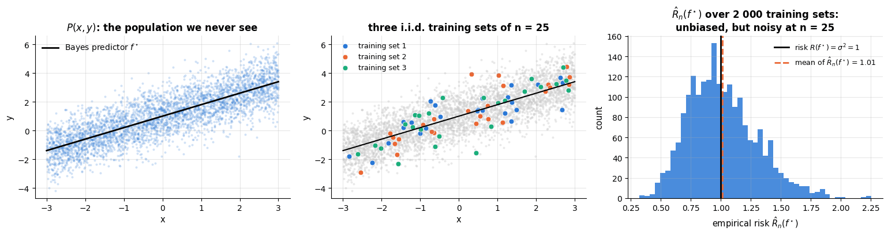

```text
risk of the Bayes predictor = 1.00;  empirical risk over 2000 draws: mean 1.01, sd 0.29, range [0.32, 2.25]
```

Empirical risk is an *unbiased* estimate of risk for a predictor chosen **before** seeing the
data — the histogram is centred on 1 — but a noisy one. ERM, however, does not use a
predictor chosen in advance: it picks the minimiser of that noisy quantity. The next figure
shows what that does. For a two-parameter hypothesis space $`f(x) = w_0 + w_1 x`$ we can draw
the whole objective as a surface over $`(w_0, w_1)`$: the risk $R$ on the left (computed on the
population), and the empirical risk $`\hat{R}_n`$ of two different training sets of $n = 25$
beside it. ERM returns the star; the truth is the black cross.

```python
def mse_surface(x, y, W0, W1):
    """Mean squared error of f(x) = w0 + w1 x on a grid of (w0, w1), in closed form.

    x, y are the data; W0, W1 are equally shaped grids of candidate weights. Expanding
    mean((y - w0 - w1 x)^2) needs only five averages of the data, so the whole grid is computed at once.
    Returns an array with the shape of W0.
    """
    my, mx, mxy, mx2, my2 = y.mean(), x.mean(), (x * y).mean(), (x ** 2).mean(), (y ** 2).mean()
    return my2 - 2 * W0 * my - 2 * W1 * mxy + W0 ** 2 + 2 * W0 * W1 * mx + W1 ** 2 * mx2

# a 200 x 200 grid of candidate (intercept, slope) pairs
W0, W1 = np.meshgrid(np.linspace(0.0, 2.0, 200), np.linspace(0.2, 1.4, 200))
# one (title, x, y) tuple per panel; *draws[j] unpacks the (x, y) pair of training set j into the tuple,
# and the backslash continues the statement on the next line
panels = [("risk $R(w)$ (whole population)", x_pop, y_pop)] + \
         [(f"empirical risk $\\hat{{R}}_n(w)$, training set {j + 1}", *draws[j]) for j in range(2)]

fig, axes = plt.subplots(1, 3, figsize=(15.5, 4.4), sharex=True, sharey=True)
for ax, (title, xs, ys) in zip(axes, panels):
    Z = mse_surface(xs, ys, W0, W1)
    cs = ax.contourf(W0, W1, Z, levels=25, cmap="viridis")          # contourf fills the bands between 25 levels
    ax.contour(W0, W1, Z, levels=12, colors="white", linewidths=0.4)  # thin white contour lines on top
    # least-squares fit (the ERM solution): a column of ones for the intercept next to x; [0] is the solution
    w_hat = np.linalg.lstsq(np.column_stack([np.ones(len(xs)), xs]), ys, rcond=None)[0]
    # *w_hat unpacks (w0, w1) into the x and y arguments; mec / mew are the marker's edge colour and width
    ax.plot(*w_hat, marker="*", ms=20, color=PALETTE[1], mec="white", mew=1.2,
            label=f"minimiser ({w_hat[0]:.2f}, {w_hat[1]:.2f})")
    ax.plot(1.0, 0.8, marker="X", ms=11, color="black", mec="white", mew=1.0, label="truth (1.00, 0.80)")
    ax.set_title(title, fontsize=11)
    ax.set_xlabel("$w_0$ (intercept)")
    ax.legend(loc="lower left", fontsize=8, frameon=True, facecolor="white", framealpha=0.9)   # a white legend box
    fig.colorbar(cs, ax=ax, label="MSE")
axes[0].set_ylabel("$w_1$ (slope)")
fig.suptitle("ERM minimises a noisy copy of the risk surface — so its minimiser moves with the sample", y=1.02)
plt.tight_layout()
plt.show()
```

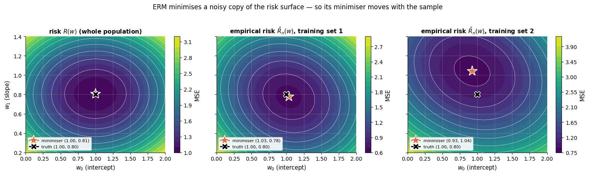

The three bowls have the same shape but different bottoms. Minimising the empirical bowl is
the best we can do, and it is a good idea — the minimisers are close to the truth — but the
value at the minimum is *lower* than the risk there, and the location wanders from sample to
sample. Those two facts are exactly the optimism and the variance that the rest of this
notebook is about.

## 2. A first look at underfitting and overfitting

Let us make the abstract concrete with a one-dimensional regression problem where we know
the truth. We generate data from

```math
y = \sin(2\pi x) + \varepsilon, \qquad \varepsilon \sim \mathcal{N}(0, \sigma^2), \quad \sigma = 0.3,
```

with $x$ uniform on $`[0, 1]`$. The Bayes predictor is $\sin(2\pi x)$ and the Bayes error
(for squared loss) is $\sigma^2 = 0.09$.

```python
def true_function(x):
    """The noise-free target sin(2 pi x), i.e. the Bayes predictor of this problem."""
    return np.sin(2 * np.pi * x)

def make_sine_data(n, noise=0.3, rng=rng):
    """Draw n points with x uniform on [0, 1) and y = sin(2 pi x) + N(0, noise^2); returns the arrays (x, y)."""
    x = rng.uniform(0, 1, n)
    y = true_function(x) + rng.normal(0, noise, n)
    return x, y

x_train, y_train = make_sine_data(30)
x_test, y_test = make_sine_data(1000)   # a large test set approximates the true risk well

x_grid = np.linspace(0, 1, 300)          # x positions at which curves are drawn
fig, ax = plt.subplots()
ax.plot(x_grid, true_function(x_grid), color="black", lw=1.5, label="true function $\\sin(2\\pi x)$")
ax.scatter(x_train, y_train, color=PALETTE[0], label=f"training data (n={len(x_train)})", zorder=3)   # zorder: on top
ax.set_xlabel("x")
ax.set_ylabel("y")
ax.set_title("A regression problem with known ground truth")
ax.legend()
plt.show()
```

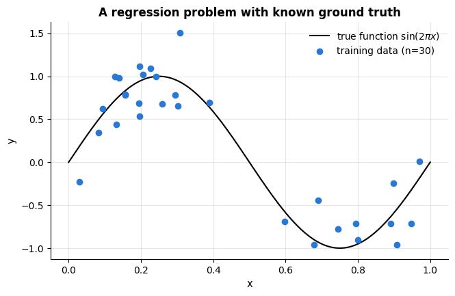

Our hypothesis spaces will be **polynomials of degree $p$<span></span>**,
$`f(x) = w_0 + w_1 x + w_2 x^2 + \dots + w_p x^p`$, fitted by least squares. Degree $p$ is a
*hyper-parameter*: it is not learned from the data by the fitting procedure but chosen by us
— and it controls the size of $\mathcal{H}$. We build the model as a scikit-learn
**pipeline** (feature expansion followed by a linear model); pipelines are explained in
detail in notebook 4 and are used everywhere from here on.

```python
from sklearn.pipeline import make_pipeline
from sklearn.preprocessing import PolynomialFeatures
from sklearn.linear_model import LinearRegression
from sklearn.metrics import mean_squared_error

def poly_model(degree):
    """An unfitted polynomial-regression model of the given degree.

    PolynomialFeatures(degree) turns the single input column x into the columns 1, x, x^2, ..., x^degree,
    and LinearRegression then fits them by least squares; make_pipeline chains the two steps.
    """
    return make_pipeline(PolynomialFeatures(degree), LinearRegression())

degrees = [0, 1, 3, 9, 15]
fig, axes = plt.subplots(1, len(degrees), figsize=(16, 3.4), sharey=True)
for ax, p in zip(axes, degrees):
    # scikit-learn expects X with shape (n_samples, n_features): x_train[:, None] turns (30,) into (30, 1)
    model = poly_model(p).fit(x_train[:, None], y_train)     # .fit returns the fitted model, so it can be chained
    mse_train = mean_squared_error(y_train, model.predict(x_train[:, None]))   # mean of (y - prediction)^2
    mse_test = mean_squared_error(y_test, model.predict(x_test[:, None]))
    ax.plot(x_grid, true_function(x_grid), color="black", lw=1, alpha=0.6)
    ax.scatter(x_train, y_train, s=15, color=PALETTE[0])
    ax.plot(x_grid, model.predict(x_grid[:, None]), color=PALETTE[1], lw=2)
    ax.set_ylim(-2, 2)
    ax.set_title(f"degree {p}\ntrain MSE {mse_train:.2f} | test MSE {mse_test:.2f}", fontsize=10)
    ax.set_xlabel("x")
axes[0].set_ylabel("y")
plt.show()
```

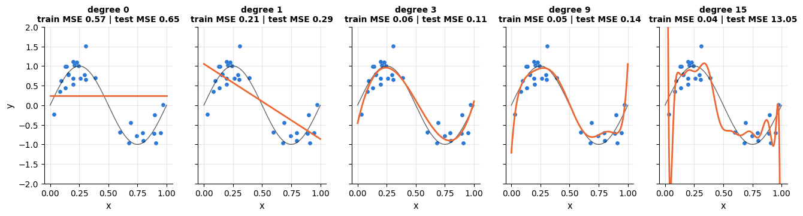

Three regimes are visible:

- **Underfitting** (degree 0–1): the hypothesis space is too small to represent the truth.
  Training *and* test error are high. More data would not help — the model has high
  **bias**.
- **A good fit** (degree 3): captures the shape; test error close to the Bayes error 0.09.
- **Overfitting** (degree 9–15): the polynomial wiggles through the noise. Training error
  keeps falling, but test error explodes. The model has high **variance**: a different
  sample of 30 points would give a completely different curve.

The standard picture summarises this as a U-shaped test error against model complexity.
Let us draw it — and, because a single training set is noisy, average over several
training sets.

```python
degrees = np.arange(0, 16)                     # degrees 0, 1, ..., 15
n_repeats = 20
train_err = np.zeros((n_repeats, len(degrees)))   # one row per training set, one column per degree
test_err = np.zeros((n_repeats, len(degrees)))

for r in range(n_repeats):
    xtr, ytr = make_sine_data(30)               # a fresh training set of 30 points for each repeat
    for j, p in enumerate(degrees):
        model = poly_model(p).fit(xtr[:, None], ytr)
        train_err[r, j] = mean_squared_error(ytr, model.predict(xtr[:, None]))
        test_err[r, j] = mean_squared_error(y_test, model.predict(x_test[:, None]))

fig, ax = plt.subplots()
ax.plot(degrees, train_err.mean(0), marker="o", label="training error")   # .mean(0): average over the 20 repeats
ax.plot(degrees, test_err.mean(0), marker="o", label="test error")
ax.axhline(0.09, color="gray", ls="--", label="Bayes error $\\sigma^2$")
ax.set_yscale("log")
ax.set_xlabel("polynomial degree (model complexity)")
ax.set_ylabel("mean squared error (log scale)")
ax.set_title("Training vs. test error as a function of complexity (n = 30, averaged over 20 draws)")
ax.legend()
plt.show()
best = degrees[test_err.mean(0).argmin()]       # argmin: position of the smallest average test error
print(f"Lowest average test error at degree {best}: {test_err.mean(0).min():.3f}")
```

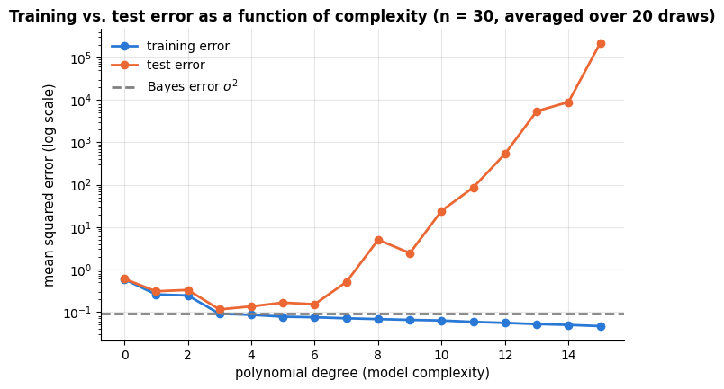

```text
Lowest average test error at degree 3: 0.114
```

> **Key idea.** Training error is not a measure of quality; it decreases monotonically with
> complexity. Only error on data that the model has *not* seen tells us how well it
> generalises. Every evaluation protocol in this notebook is a way of obtaining an honest
> estimate of that quantity.

> **Going deeper — double descent.** The U-shape is the classical story, and it holds for
> the models in this notebook. For very over-parameterised models (huge neural networks,
> or polynomials with degree ≫ $n$ fitted with minimum-norm least squares) the test error
> can *decrease again* beyond the interpolation threshold — the "double descent" phenomenon
> (Belkin et al., 2019; Nakkiran et al., 2020). It does not contradict anything here, but it
> shows that "complexity" is subtler than the number of parameters.

## 3. The bias–variance decomposition

Why exactly does test error behave this way? For squared loss there is an exact answer.
Fix a test input $\mathbf{x}$ and let $y = f^\star(\mathbf{x}) + \varepsilon$ with
$`\mathbb{E}[\varepsilon] = 0`$, $`\operatorname{Var}[\varepsilon] = \sigma^2`$. Our learning
algorithm, applied to a random training set $\mathcal{D}$, produces a prediction
$`\hat{f}_\mathcal{D}(\mathbf{x})`$ — a random variable, because $\mathcal{D}$ is random.
Write $`\bar{f}(\mathbf{x}) = \mathbb{E}_\mathcal{D}[\hat{f}_\mathcal{D}(\mathbf{x})]`$ for
the *average* prediction over training sets. Then the expected squared error at
$\mathbf{x}$ decomposes as

```math
\mathbb{E}_{\mathcal{D}, \varepsilon}\Big[\big(y - \hat{f}_\mathcal{D}(\mathbf{x})\big)^2\Big]
\;=\;
\underbrace{\big(f^\star(\mathbf{x}) - \bar{f}(\mathbf{x})\big)^2}_{\text{bias}^2}
\;+\;
\underbrace{\mathbb{E}_\mathcal{D}\Big[\big(\hat{f}_\mathcal{D}(\mathbf{x}) - \bar{f}(\mathbf{x})\big)^2\Big]}_{\text{variance}}
\;+\;
\underbrace{\sigma^2}_{\text{noise}} .
```

**Derivation.** Add and subtract $\bar f(\mathbf{x})$ inside the square, expand
$`\big((f^\star - \bar f) + (\bar f - \hat f_\mathcal{D}) + \varepsilon\big)^2`$, and take
expectations. All three cross terms vanish: $`\mathbb{E}[\varepsilon] = 0`$ and $\varepsilon$
is independent of $\mathcal{D}$, and $`\mathbb{E}_\mathcal{D}[\bar f - \hat f_\mathcal{D}] = 0`$
by definition of $\bar f$. (Geman, Bienenstock & Doursat, 1992, is the classic reference;
Hastie, Tibshirani & Friedman, 2009, §7.3 gives the textbook treatment.)

Interpretation:

- **Bias** measures how far the *average* model is from the truth — the systematic error
  caused by a hypothesis space that cannot represent $f^\star$ (degree-1 polynomials for a
  sine wave).
- **Variance** measures how much the fitted model fluctuates from one training set to
  another — sensitivity to the particular noise in the sample (degree-15 polynomials).
- **Noise** is the Bayes error; no algorithm can go below it.

Simple models: high bias, low variance. Flexible models: low bias, high variance. The
optimal complexity balances the two — the *bias–variance trade-off*. Increasing $n$ reduces
variance (the fit is anchored by more points) but leaves bias unchanged, which is exactly
why a bigger dataset lets us afford a more flexible model.

Let us verify the decomposition numerically: draw many training sets, fit polynomials of
each degree, and measure bias and variance on a grid of test points.

```python
x_eval = np.linspace(0.05, 0.95, 50)          # evaluation points
n_sets, n_train, sigma = 200, 30, 0.3
degrees = [1, 2, 3, 4, 5, 6, 7, 8]
rows = []
for p in degrees:
    preds = np.zeros((n_sets, len(x_eval)))   # (200, 50): the predictions of each fitted model at each point
    for s in range(n_sets):
        xtr, ytr = make_sine_data(n_train, noise=sigma)
        preds[s] = poly_model(p).fit(xtr[:, None], ytr).predict(x_eval[:, None])
    mean_pred = preds.mean(axis=0)            # the average prediction f-bar at each point, over the 200 training sets
    bias2 = np.mean((mean_pred - true_function(x_eval)) ** 2)   # squared bias, averaged over the 50 points
    var = np.mean(preds.var(axis=0))          # spread across training sets at each point, averaged over the points
    rows.append({"degree": p, "bias^2": bias2, "variance": var, "noise": sigma**2,
                 "bias^2+var+noise": bias2 + var + sigma**2})
bv = pd.DataFrame(rows).set_index("degree")   # a list of dicts -> one row per degree
bv.round(3)
```

| degree | bias^2 | variance | noise | bias^2+var+noise |
|---|---|---|---|---|
| 1 | 0.155 | 0.023 | 0.09 | 0.268 |
| 2 | 0.147 | 0.047 | 0.09 | 0.284 |
| 3 | 0.003 | 0.014 | 0.09 | 0.107 |
| 4 | 0.002 | 0.021 | 0.09 | 0.114 |
| 5 | 0.000 | 0.026 | 0.09 | 0.116 |
| 6 | 0.000 | 0.088 | 0.09 | 0.179 |
| 7 | 0.001 | 0.082 | 0.09 | 0.172 |
| 8 | 0.000 | 0.121 | 0.09 | 0.211 |

```python
fig, ax = plt.subplots()
ax.plot(bv.index, bv["bias^2"], marker="o", label="bias$^2$")
ax.plot(bv.index, bv["variance"], marker="o", label="variance")
ax.plot(bv.index, bv["bias^2+var+noise"], marker="o", color="black", label="total expected error")
ax.axhline(sigma**2, color="gray", ls="--", label="noise $\\sigma^2$")
ax.set_yscale("log")
ax.set_xlabel("polynomial degree")
ax.set_ylabel("error (log scale)")
ax.set_title("Bias–variance decomposition, estimated from 200 training sets of size 30")
ax.legend()
plt.show()
```

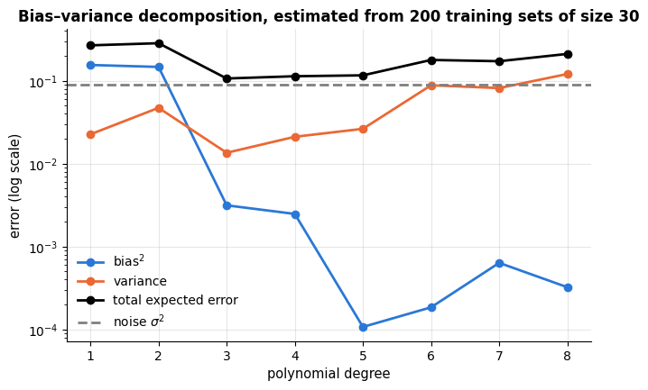

Let us also *see* variance: the spread of fitted curves across training sets.

```python
fig, axes = plt.subplots(1, 3, figsize=(15, 3.6), sharey=True)
for ax, p in zip(axes, [1, 3, 12]):
    for s in range(25):                        # 25 fits of the same degree, each on a new training set
        xtr, ytr = make_sine_data(n_train, noise=sigma)
        ax.plot(x_grid, poly_model(p).fit(xtr[:, None], ytr).predict(x_grid[:, None]),
                color=PALETTE[1], alpha=0.25, lw=1)
    ax.plot(x_grid, true_function(x_grid), color="black", lw=1.5, label="truth")
    ax.set_ylim(-2.5, 2.5)
    ax.set_title(f"degree {p}")
    ax.set_xlabel("x")
axes[0].set_ylabel("y")
axes[0].legend()
fig.suptitle("Variance made visible: 25 fits of the same model on 25 different training sets", y=1.02)
plt.tight_layout()
plt.show()
```

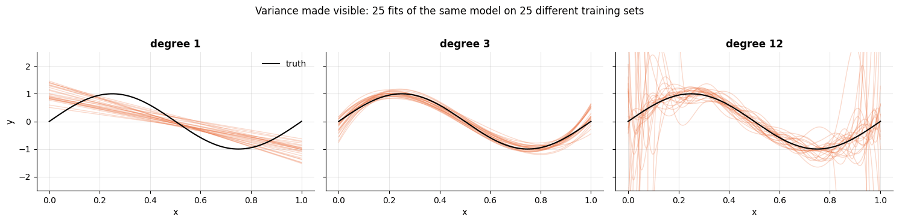

The degree-1 fits all look alike but are all wrong (bias); the degree-12 fits are, on
average, close to the truth but scatter wildly (variance). (Beyond degree 8 the variance
of unregularised polynomial fits on 30 points explodes by orders of magnitude, which is
why the table stops there; regularisation, notebook 6, is the cure.)

> **Why it matters.** Nearly every design decision in machine learning is a bias–variance
> decision: regularisation strength, tree depth, the number of neighbours $k$, the number of
> boosting rounds, network size, dropout, early stopping, and ensembling all move a model
> along this trade-off. When a model performs poorly, the first diagnostic question is
> always: *is the problem bias (underfitting) or variance (overfitting)?* — because the
> remedies are opposite (bigger model / more features vs. more data / regularisation /
> simpler model).

## 4. Evaluation protocols: hold-out sets and cross-validation

The polynomial example used a large synthetic test set. In practice we have one finite
dataset and must carve an honest estimate of generalisation error out of it.

### 4.1 Train / validation / test

The basic protocol splits the data into three disjoint parts:

1. **Training set** — used to fit the model parameters (ERM).
2. **Validation set** (development set) — used to *choose* between models and
   hyper-parameters (polynomial degree, $k$, regularisation strength …).
3. **Test set** — touched *once*, at the very end, to report the final performance.

Why three and not two? Because choosing hyper-parameters by looking at an error estimate is
itself a form of fitting: if we try 100 configurations and keep the one with the best
validation score, that score is optimistically biased in exactly the same way as training
error (Cawley & Talbot, 2010). The untouched test set protects us from fooling ourselves.

This is worth a picture, because the whole discipline of honest evaluation is contained in
it: every row of the data set belongs to exactly one part, and each part answers exactly one
question.

```python
def draw_blocks(ax, spans, y=0, height=0.55, fontsize=10):
    """Draw a horizontal row of labelled coloured blocks: spans = [(label, start, width, colour), ...].

    The blocks are drawn on the axes `ax` at height y, with the label written in white in the middle of each.
    """
    for label, start, width, colour in spans:
        # barh(y, width, left=start) draws a horizontal bar from x = start to x = start + width
        ax.barh(y, width, left=start, height=height, color=colour, edgecolor="white", lw=1.5)
        ax.text(start + width / 2, y, label, ha="center", va="center", color="white",
                fontweight="bold", fontsize=fontsize)

fig, axes = plt.subplots(2, 1, figsize=(12, 5.2))      # two rows, one column
draw_blocks(axes[0], [("training  60 %", 0, 60, PALETTE[0]),
                      ("validation  20 %", 60, 20, PALETTE[1]),
                      ("test  20 %", 80, 20, PALETTE[4])])
for text, xpos in [("fit the parameters\n(empirical risk minimisation)", 30),
                   ("choose model and\nhyper-parameters", 70),
                   ("touch ONCE, at the end:\nthe number you report", 90)]:
    # annotate places `text` at xytext and draws an arrow from it to the point xy (just below the block)
    axes[0].annotate(text, xy=(xpos, -0.32), xytext=(xpos, -1.05), ha="center", va="top", fontsize=9,
                     arrowprops={"arrowstyle": "->", "lw": 1.2})
axes[0].set_title("Correct: three disjoint parts, one question each")

draw_blocks(axes[1], [("training  80 %", 0, 80, PALETTE[0]), ("test  20 %", 80, 20, PALETTE[4])])
axes[1].annotate("used to CHOOSE the model\nand then to REPORT its score\n→ the reported number is optimistic",
                 xy=(90, -0.32), xytext=(70, -1.05), ha="center", va="top", fontsize=9, color=PALETTE[7],
                 arrowprops={"arrowstyle": "->", "lw": 1.2, "color": PALETTE[7]})
axes[1].set_title("Wrong: the same held-out data used for selection and for reporting")

for ax in axes:
    ax.set_xlim(-1, 101)
    ax.set_ylim(-1.6, 0.5)
    ax.set_yticks([])
    ax.set_xlabel("share of the rows (%)")
    ax.grid(False)
plt.tight_layout()
plt.show()
```

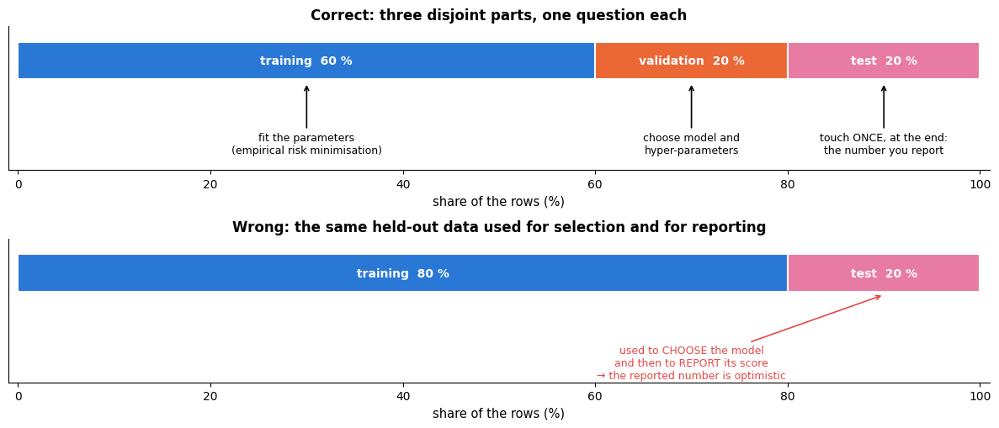

Typical proportions are 60/20/20 or 80/10/10 for medium-sized data; with millions of rows
the validation and test sets can be a much smaller fraction. For **classification**, split
*stratified* so that each part has the same class proportions (`stratify=y`); for
**time-ordered** data, split by time (notebook 16); for **grouped** data (several rows per
patient/customer/session) split by group (`GroupKFold`) so that no group appears on both
sides.

We use the breast cancer Wisconsin data (Street, Wolberg & Mangasarian, 1993; 569 tumours,
30 features computed from cell-nucleus images, binary target malignant/benign), bundled with
scikit-learn.

```python
from sklearn.datasets import load_breast_cancer
from sklearn.model_selection import train_test_split

cancer = load_breast_cancer(as_frame=True)    # as_frame=True: features as a DataFrame, target as a Series
X, y = cancer.data, cancer.target          # target: 0 = malignant, 1 = benign
print(f"{X.shape[0]} samples, {X.shape[1]} features; class balance: {y.mean():.1%} benign")

# train_test_split shuffles and splits the rows; test_size is the share held out, and stratify=y keeps
# the class proportions equal in both parts. Split twice: first off the test set, then train vs. validation
X_trainval, X_test, y_trainval, y_test = train_test_split(
    X, y, test_size=0.2, stratify=y, random_state=RANDOM_STATE)
X_train, X_val, y_train, y_val = train_test_split(
    X_trainval, y_trainval, test_size=0.25, stratify=y_trainval, random_state=RANDOM_STATE)  # 0.25 x 0.8 = 0.2
for name, part in [("train", y_train), ("validation", y_val), ("test", y_test)]:
    # :11s pads the name to 11 characters, :3d the count to 3 digits, so the columns line up
    print(f"{name:11s} n = {len(part):3d}   benign fraction = {part.mean():.3f}")
```

```text
569 samples, 30 features; class balance: 62.7% benign
train       n = 341   benign fraction = 0.628
validation  n = 114   benign fraction = 0.623
test        n = 114   benign fraction = 0.632
```

### 4.2 The scikit-learn estimator API

scikit-learn (Pedregosa et al., 2011; Buitinck et al., 2013) has a small, uniform interface
that makes swapping models trivial:

| Method | Meaning | Who has it |
|---|---|---|
| `est.fit(X, y)` | learn parameters from data; returns `est` | every estimator |
| `est.predict(X)` | predictions (labels or values) | predictors |
| `est.predict_proba(X)` | class probabilities, shape `(n, K)` | probabilistic classifiers |
| `est.decision_function(X)` | raw scores (e.g. signed distance to the boundary) | many classifiers |
| `est.transform(X)` | transformed features | transformers (scalers, encoders, PCA …) |
| `est.fit_transform(X)` | `fit` then `transform`, sometimes faster | transformers |
| `est.score(X, y)` | default metric ($R^2$ for regressors, accuracy for classifiers) | predictors |
| `est.get_params()` / `set_params(...)` | hyper-parameters | every estimator |

Learned quantities end in an underscore (`coef_`, `feature_importances_`, `classes_`),
hyper-parameters are constructor arguments. Let us use $k$-nearest-neighbours as our
black-box model. (Notebook 8 explains it; for now: a point is classified by a majority
vote among its $k$ closest training points.) Because kNN uses Euclidean distances, features
must be on comparable scales, so we standardise them first — inside a pipeline, so that the
scaler is fitted on training data only.

```python
from sklearn.neighbors import KNeighborsClassifier
from sklearn.preprocessing import StandardScaler
from sklearn.pipeline import Pipeline

# Pipeline([(name, step), ...]) chains named steps: StandardScaler rescales each feature to mean 0 and
# standard deviation 1 (learned from the data passed to fit), then kNN votes among the 5 nearest training points
knn = Pipeline([("scale", StandardScaler()), ("knn", KNeighborsClassifier(n_neighbors=5))])
knn.fit(X_train, y_train)
print(f"train accuracy      {knn.score(X_train, y_train):.3f}")     # .score() of a classifier is its accuracy
print(f"validation accuracy {knn.score(X_val, y_val):.3f}")
print("first five predicted probabilities (malignant, benign):")
# predict_proba gives one column per class (0, then 1); for kNN it is the share of the k neighbours in each class
print(knn.predict_proba(X_val.iloc[:5]).round(2))
```

```text
train accuracy      0.974
validation accuracy 0.956
first five predicted probabilities (malignant, benign):
[[0. 1.]
 [1. 0.]
 [1. 0.]
 [0. 1.]
 [0. 1.]]
```

Now the hyper-parameter search that motivated the validation set: which $k$<span></span>?

```python
ks = [1, 2, 3, 5, 7, 9, 11, 15, 21, 31, 51, 75, 101]
# an empty table (filled with NaN): one row per k, two columns, filled in by the loop
scores = pd.DataFrame(index=ks, columns=["train", "validation"], dtype=float)
for k in ks:
    model = Pipeline([("scale", StandardScaler()), ("knn", KNeighborsClassifier(n_neighbors=k))]).fit(X_train, y_train)
    scores.loc[k] = [model.score(X_train, y_train), model.score(X_val, y_val)]   # fill the row whose label is k

fig, ax = plt.subplots()
ax.plot(scores.index, scores["train"], marker="o", label="training accuracy")
ax.plot(scores.index, scores["validation"], marker="o", label="validation accuracy")
ax.set_xscale("log")
ax.set_xlabel("k (number of neighbours) — note: complexity DEcreases to the right")
ax.set_ylabel("accuracy")
ax.set_title("Choosing k on the validation set")
ax.legend()
plt.show()
best_k = int(scores["validation"].idxmax())    # idxmax returns the row label (here k) of the largest value
print(f"best k on validation: {best_k}  (validation accuracy {scores.loc[best_k, 'validation']:.3f})")
```

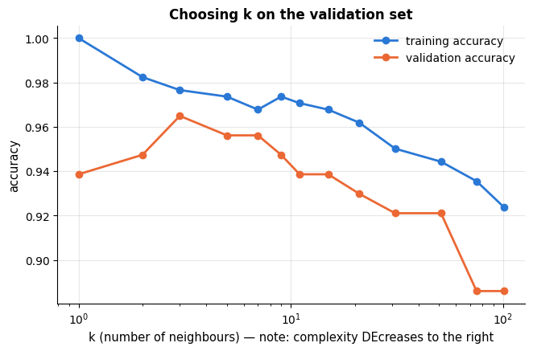

```text
best k on validation: 3  (validation accuracy 0.965)
```

For $k=1$ the training accuracy is 100 % (every point is its own nearest neighbour) — a
textbook overfit. Very large $k$ underfits: the prediction tends to the majority class.
Notice how *noisy* the validation curve is with only 114 validation points: neighbouring
values of $k$ differ by one or two misclassified samples. This noise is the motivation for
cross-validation.

### 4.3 $k$-fold cross-validation

A single validation split wastes data (the model is trained on less) and gives a noisy
estimate (it depends on which points happened to land in the validation set).
**<span></span>$k$-fold cross-validation** (Stone, 1974; Kohavi, 1995) fixes both:

1. Split the (training + validation) data into $k$ equal folds.
2. For $j = 1, \dots, k$: train on all folds except fold $j$, evaluate on fold $j$.
3. Report the mean (and standard deviation) of the $k$ scores.

Every sample is used for validation exactly once and for training $k-1$ times. The
estimate has lower variance than a single split, at the cost of $k$ fits. $k = 5$ or $10$
are the usual choices; $k = n$ is *leave-one-out* (LOO), which is nearly unbiased but
expensive and, perhaps surprisingly, has *high* variance because the $n$ training sets are
almost identical (Hastie et al., 2009, §7.10). Use `StratifiedKFold` for classification
(scikit-learn does this automatically when you pass an integer `cv` to a classifier), and
`shuffle=True` unless the data are ordered on purpose.

```python
from sklearn.model_selection import StratifiedKFold, cross_val_score, cross_validate

# 5 folds with the same class proportions; shuffle=True shuffles the rows before they are dealt into folds
cv = StratifiedKFold(n_splits=5, shuffle=True, random_state=RANDOM_STATE)
model = Pipeline([("scale", StandardScaler()), ("knn", KNeighborsClassifier(n_neighbors=5))])
# cross_val_score fits a fresh copy of the model on 4 folds, scores it on the 5th, and returns the 5 scores
fold_scores = cross_val_score(model, X_trainval, y_trainval, cv=cv, scoring="accuracy")
print("fold accuracies:", fold_scores.round(3))
print(f"mean = {fold_scores.mean():.3f}, std = {fold_scores.std():.3f}")
```

```text
fold accuracies: [0.967 0.967 0.945 0.956 0.978]
mean = 0.963, std = 0.011
```

Drawn as blocks, the scheme is immediately clear. Each row is one fit: the orange block is
the fold held out for evaluation, the blue blocks are the folds used for training. (The rows
are ordered by fold so that the held-out block is contiguous; `shuffle=True` means the actual
row indices are scattered.) The right panel shows the five resulting accuracies, their mean
and the standard error of that mean — the number we will quote from now on.

```python
fold_of = np.empty(len(y_trainval), dtype=int)       # will hold the fold number of every row
# cv.split yields (training row positions, validation row positions) once per fold; _ discards the training part
for f, (_, va) in enumerate(cv.split(X_trainval, y_trainval)):
    fold_of[va] = f
sizes = np.bincount(fold_of)                          # np.bincount counts how many rows have fold 0, 1, 2, ...
# where each fold's block starts when the rows are laid out fold by fold: 0, size0, size0 + size1, ...
starts = np.concatenate([[0], np.cumsum(sizes)[:-1]])

fig, axes = plt.subplots(1, 2, figsize=(14, 3.8), gridspec_kw={"width_ratios": [2.1, 1]})
for f in range(cv.get_n_splits()):                    # get_n_splits() is the number of folds (5)
    axes[0].barh(f, len(fold_of), color=PALETTE[0], height=0.62, edgecolor="white")   # the whole row: training
    axes[0].barh(f, sizes[f], left=starts[f], color=PALETTE[1], height=0.62, edgecolor="white")   # held-out fold
    axes[0].text(len(fold_of) + 6, f, f"accuracy {fold_scores[f]:.3f}", va="center", fontsize=9)
axes[0].text(sizes[0] / 2, 0, "evaluated\non", ha="center", va="center", color="white", fontweight="bold", fontsize=8)
axes[0].text((sizes[0] + len(fold_of)) / 2, 0, "trained on", ha="center", va="center",
             color="white", fontweight="bold", fontsize=9)
axes[0].set_yticks(range(cv.get_n_splits()))
axes[0].set_yticklabels([f"fit {f + 1}" for f in range(cv.get_n_splits())])
axes[0].invert_yaxis()                                # fit 1 at the top
axes[0].set_xlim(0, len(fold_of) * 1.22)
axes[0].set_xlabel("rows of the train+validation data (ordered by fold)")
axes[0].set_title("5-fold cross-validation: every row is held out exactly once")
axes[0].grid(False)

se = fold_scores.std(ddof=1) / np.sqrt(len(fold_scores))    # standard error of the mean of the 5 scores
axes[1].bar(np.arange(1, 6), fold_scores, color=PALETTE[1], alpha=0.85)
axes[1].axhline(fold_scores.mean(), color="black", lw=1.5, label=f"mean {fold_scores.mean():.3f}")
# fill_between(x, low, high) shades the area between two heights: here a band of +-1 standard error
axes[1].fill_between([0.4, 5.6], fold_scores.mean() - se, fold_scores.mean() + se,
                     color="black", alpha=0.12, label=f"± 1 standard error ({se:.3f})")
axes[1].set_ylim(0.9, 1.0)
axes[1].set_xlim(0.4, 5.6)
axes[1].set_xticks(np.arange(1, 6))
axes[1].set_xlabel("fold")
axes[1].set_ylabel("accuracy")
axes[1].set_title("The five fold scores and their mean")
axes[1].legend(loc="upper left", fontsize=9)
plt.tight_layout()
plt.show()
```

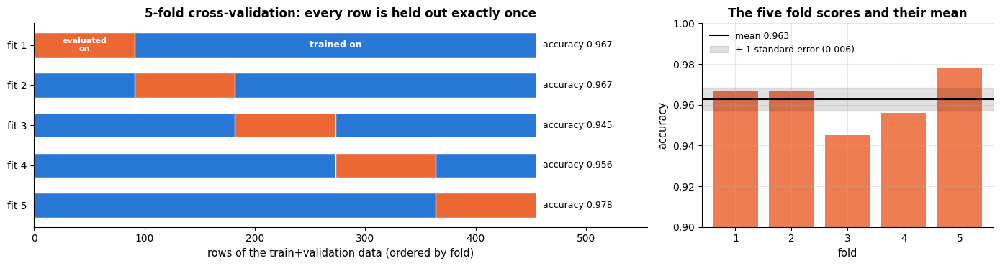

`cross_validate` returns more: several metrics at once, training scores, fit times and the
fitted estimators.

```python
# cross_validate returns a dict of arrays (one value per fold): fit_time, score_time, and test_<metric> for each
# metric in `scoring`, plus train_<metric> when return_train_score=True
res = cross_validate(model, X_trainval, y_trainval, cv=cv,
                     scoring=["accuracy", "roc_auc", "f1"], return_train_score=True)
pd.DataFrame(res).round(3)
```

|  | fit_time | score_time | test_accuracy | train_accuracy | test_roc_auc | train_roc_auc | test_f1 | train_f1 |
|---|---|---|---|---|---|---|---|---|
| 0 | 0.003 | 0.009 | 0.967 | 0.978 | 0.980 | 0.998 | 0.974 | 0.983 |
| 1 | 0.003 | 0.007 | 0.967 | 0.973 | 0.997 | 0.997 | 0.974 | 0.978 |
| 2 | 0.003 | 0.007 | 0.945 | 0.978 | 0.984 | 0.998 | 0.956 | 0.983 |
| 3 | 0.003 | 0.007 | 0.956 | 0.978 | 0.981 | 0.998 | 0.966 | 0.983 |
| 4 | 0.003 | 0.007 | 0.978 | 0.975 | 0.999 | 0.997 | 0.982 | 0.980 |

Let us redo the choice of $k$ with cross-validation instead of a single validation split
and compare the two curves. We add the *standard error* of the mean as a shaded band: a
difference between two configurations that is smaller than the band is not a real
difference.

```python
cv_mean, cv_se = [], []
for k in ks:
    m = Pipeline([("scale", StandardScaler()), ("knn", KNeighborsClassifier(n_neighbors=k))])
    s = cross_val_score(m, X_trainval, y_trainval, cv=cv)    # without scoring=, a classifier is scored by accuracy
    cv_mean.append(s.mean())
    cv_se.append(s.std(ddof=1) / np.sqrt(len(s)))
cv_mean, cv_se = np.array(cv_mean), np.array(cv_se)     # lists -> arrays, so they support arithmetic below

fig, ax = plt.subplots()
ax.plot(ks, scores["validation"], marker="o", alpha=0.6, label="single validation split")
ax.plot(ks, cv_mean, marker="o", label="5-fold CV mean")
ax.fill_between(ks, cv_mean - cv_se, cv_mean + cv_se, alpha=0.2, color=PALETTE[1], label="± 1 standard error")
ax.set_xscale("log")
ax.set_xlabel("k")
ax.set_ylabel("accuracy")
ax.set_title("Cross-validation gives a smoother, more reliable model-selection curve")
ax.legend()
plt.show()
best_k_cv = ks[int(np.argmax(cv_mean))]        # np.argmax: position of the highest CV mean
print(f"best k by CV: {best_k_cv}   (CV accuracy {cv_mean.max():.3f} ± {cv_se[np.argmax(cv_mean)]:.3f})")
```

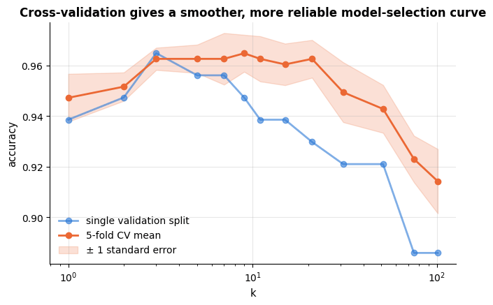

```text
best k by CV: 9   (CV accuracy 0.965 ± 0.007)
```

> **Warning — the one-standard-error rule.** When several configurations are within one
> standard error of the best, prefer the *simplest* one (here: the largest $k$, i.e. the
> smoothest model). This heuristic (Breiman et al., 1984) trades a negligible amount of
> estimated accuracy for lower variance and better interpretability.

The rule is easiest to apply by drawing it. Mark the best CV score, drop a horizontal line
one standard error below it, and shade everything above that line: those configurations are
statistically indistinguishable from the winner, so pick the simplest of them.

```python
best_idx = int(np.argmax(cv_mean))
threshold = cv_mean[best_idx] - cv_se[best_idx]    # best score minus one standard error
within = np.flatnonzero(cv_mean >= threshold)      # np.flatnonzero: the positions where the condition is True
k_1se = ks[within[-1]]                       # largest k = smoothest model that is still within 1 SE

fig, ax = plt.subplots(figsize=(9, 4.6))
ax.errorbar(ks, cv_mean, yerr=cv_se, marker="o", capsize=3, color=PALETTE[0], label="5-fold CV accuracy ± 1 SE")
ax.axhline(threshold, color=PALETTE[1], ls="--", lw=1.5,
           label=f"best − 1 SE = {threshold:.3f}")
ax.fill_between([min(ks), max(ks)], threshold, cv_mean[best_idx] + 2 * cv_se[best_idx],
                color=PALETTE[1], alpha=0.10)          # shade the band above the threshold
# s is the marker area; "*" is a star, "P" a filled plus; zorder=5 draws them above the other lines
ax.scatter([ks[best_idx]], [cv_mean[best_idx]], s=170, marker="*", color=PALETTE[3], zorder=5,
           edgecolor="black", linewidth=0.6, label=f"best CV score: k = {ks[best_idx]}")
ax.scatter([k_1se], [cv_mean[within[-1]]], s=140, marker="P", color=PALETTE[2], zorder=5,
           edgecolor="black", linewidth=0.6, label=f"one-standard-error choice: k = {k_1se}")
ax.annotate("everything in the band is\nwithin one standard error\nof the best — take the simplest",
            xy=(k_1se, cv_mean[within[-1]]), xytext=(4, cv_mean.min() + 0.004), fontsize=9,
            arrowprops={"arrowstyle": "->", "lw": 1.1})
ax.set_xscale("log")
ax.set_xlabel("k (number of neighbours) — complexity decreases to the right")
ax.set_ylabel("cross-validated accuracy")
ax.set_title("The one-standard-error rule: prefer the simplest model inside the band")
ax.legend(loc="lower left", fontsize=9)
plt.show()
print(f"best k = {ks[best_idx]} (CV {cv_mean[best_idx]:.3f}); one-standard-error choice k = {k_1se} "
      f"(CV {cv_mean[within[-1]]:.3f}) — {len(within)} of the {len(ks)} values tried are inside the band")
```

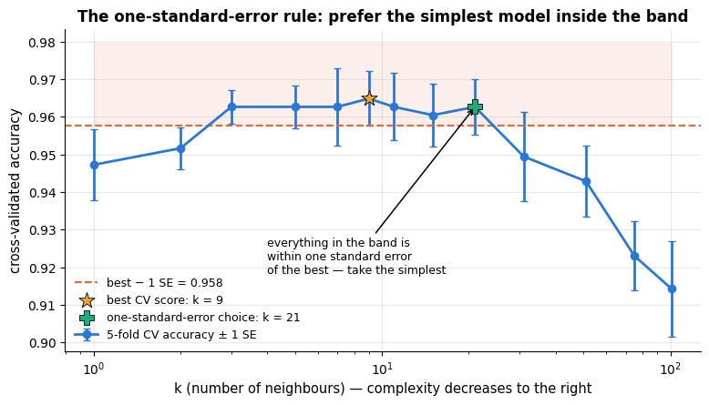

```text
best k = 9 (CV 0.965); one-standard-error choice k = 21 (CV 0.963) — 7 of the 13 values tried are inside the band
```

### 4.4 Repeated CV, nested CV and the final test score

Even $k$-fold CV depends on the random fold assignment. For small datasets,
`RepeatedStratifiedKFold` (e.g. 5 folds × 5 repetitions) averages that away. And when CV is
used to select hyper-parameters, the selected model's CV score is again optimistic; an
honest estimate requires **nested cross-validation** — an outer loop for evaluation, an
inner loop for selection (Varma & Simon, 2006). Notebook 12 shows nested CV with
`GridSearchCV` inside `cross_val_score`. For now we follow the simplest honest protocol:
select $k$ by CV on the train+validation data, refit on all of it, and evaluate **once** on
the held-out test set.

```python
# refit the chosen configuration on all train+validation rows, then score it once on the untouched test set
final_model = Pipeline([("scale", StandardScaler()), ("knn", KNeighborsClassifier(n_neighbors=best_k_cv))])
final_model.fit(X_trainval, y_trainval)
print(f"final kNN (k={best_k_cv}) test accuracy: {final_model.score(X_test, y_test):.3f}")
```

```text
final kNN (k=9) test accuracy: 0.974
```

Report this number, and *do not* go back and tune further after seeing it — every
adjustment made in response to the test score leaks information from the test set into
the model and makes the reported number optimistic.

### 4.5 When plain $k$-fold is the wrong picture

Shuffled $k$-fold assumes the rows are exchangeable — that any row could equally well have
been in any fold. Two common situations break that assumption, and each has its own splitter.
When several rows belong to the same *entity* (visits of one patient, sessions of one
customer, augmented copies of one image), a shuffled split puts siblings on both sides and
the model is graded on rows it has half-memorised: `GroupKFold` keeps every group whole.
When the rows are *ordered in time*, training on later rows to predict earlier ones is a
rehearsal that production will never allow: `TimeSeriesSplit` only ever trains on the past
(notebook 16). Side by side the three schemes look like this — 40 rows, five splits each.

```python
from matplotlib.colors import ListedColormap      # a colour map built from an explicit list of colours
# three splitters: KFold ignores the classes, GroupKFold keeps groups together, TimeSeriesSplit keeps time order
from sklearn.model_selection import KFold, GroupKFold, TimeSeriesSplit

n_demo = 40
groups = np.repeat(np.arange(8), 5)               # 8 entities with 5 rows each
X_demo, y_demo = np.zeros((n_demo, 1)), np.zeros(n_demo)   # dummy data: the splitters only need the number of rows
# one (title, splitter, groups or None) tuple per panel
schemes = [("KFold(5, shuffle=True)\nrows are exchangeable", KFold(5, shuffle=True, random_state=RANDOM_STATE), None),
           ("GroupKFold(5)\nno entity on both sides", GroupKFold(n_splits=5), groups),
           ("TimeSeriesSplit(5)\nnever train on the future", TimeSeriesSplit(n_splits=5), None)]

fig, axes = plt.subplots(1, 3, figsize=(16, 3.9))
cmap = ListedColormap(["0.88", PALETTE[0], PALETTE[1]])       # unused / train / validate
for ax, (title, splitter, g) in zip(axes, schemes):
    grid_img = np.zeros((5, n_demo))                 # one row per split, one column per data row; 0 = unused
    # splitter.split yields (training rows, validation rows) per split; KFold and TimeSeriesSplit ignore groups
    for s, (tr, va) in enumerate(splitter.split(X_demo, y_demo, groups=g)):
        grid_img[s, tr] = 1                          # mark the training rows of split s
        grid_img[s, va] = 2                          # and its validation rows
    ax.imshow(grid_img, aspect="auto", cmap=cmap, vmin=0, vmax=2, interpolation="nearest")
    if g is not None:                                          # show where the entities start
        # np.diff is non-zero where the group id changes; + 0.5 puts the line between two pixel columns
        for b in np.flatnonzero(np.diff(groups)) + 0.5:
            ax.axvline(b, color="white", lw=1.4)
    ax.set_yticks(range(5))
    ax.set_yticklabels([f"split {s + 1}" for s in range(5)])
    ax.set_xlabel("row index" + ("  (vertical lines = entity boundaries)" if g is not None else ""))
    ax.set_title(title, fontsize=11)
    ax.grid(False)
# a legend built by hand from three coloured squares; bbox_to_anchor places it below the first panel
axes[0].legend(handles=[plt.Rectangle((0, 0), 1, 1, color=PALETTE[0]),
                        plt.Rectangle((0, 0), 1, 1, color=PALETTE[1]),
                        plt.Rectangle((0, 0), 1, 1, color="0.88")],
               labels=["train", "validate", "unused"], loc="upper center",
               bbox_to_anchor=(0.5, -0.28), ncol=3, fontsize=9)
fig.suptitle("Three cross-validation schemes: the split must respect how the data were generated", y=1.04)
plt.tight_layout()
plt.show()
```

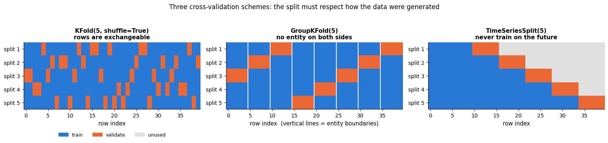

Notice that `TimeSeriesSplit` trains on a growing prefix and therefore uses fewer rows in its
early splits — the price of not peeking at the future. Choosing the splitter is not a detail:
using the wrong one is the single most common way a pipeline that cross-validates beautifully
fails in production.

## 5. Baselines: what does "good" mean?

An accuracy of 0.95 sounds impressive — until you learn that 95 % of the e-mails are not
spam, and "always predict not-spam" also scores 0.95. Every experiment needs a
**baseline** that any real model must beat:

- `DummyClassifier(strategy="most_frequent")` / `strategy="stratified"` for classification;
- `DummyRegressor(strategy="mean")` / `"median"` for regression;
- a simple, well-understood model (logistic regression, a shallow tree) as a *strong
  baseline* before trying anything complex;
- for time series: "predict the last value" (notebook 16).

```python
from sklearn.dummy import DummyClassifier     # baseline classifiers that ignore the features

baselines = {}
for strategy in ["most_frequent", "stratified"]:
    # "most_frequent" always predicts the majority class; "stratified" guesses at random with the class proportions
    dummy = DummyClassifier(strategy=strategy, random_state=RANDOM_STATE)
    baselines[f"Dummy({strategy})"] = cross_val_score(dummy, X_trainval, y_trainval, cv=cv)
    # the label is built by string concatenation inside the braces, then padded to 35 characters by :35s
    print(f"{'DummyClassifier(' + strategy + ')':35s} CV accuracy = {baselines[f'Dummy({strategy})'].mean():.3f}")
print(f"{'kNN (k=' + str(best_k_cv) + ')':35s} CV accuracy = {cv_mean.max():.3f}")
```

```text
DummyClassifier(most_frequent)      CV accuracy = 0.626
DummyClassifier(stratified)         CV accuracy = 0.503
kNN (k=9)                           CV accuracy = 0.965
```

A baseline is only useful if you can see how far above it the model sits, so plot the three
together. The distance from the majority-class bar to the model bar — not the height of the
model bar — is the achievement.

```python
# {**baselines, key: value} copies the baselines dict and adds one entry: the CV scores of the chosen kNN
scores_to_plot = {**baselines, f"kNN (k = {best_k_cv})": cross_val_score(
    Pipeline([("scale", StandardScaler()), ("knn", KNeighborsClassifier(n_neighbors=best_k_cv))]),
    X_trainval, y_trainval, cv=cv)}

fig, ax = plt.subplots(figsize=(9, 4.2))
names = list(scores_to_plot)                     # list(dict) gives the keys in insertion order
means = np.array([scores_to_plot[n].mean() for n in names])
ses = np.array([scores_to_plot[n].std(ddof=1) / np.sqrt(len(scores_to_plot[n])) for n in names])   # standard errors
# yerr draws error bars on the bars; error_kw styles them (colour, cap width, line width)
ax.bar(names, means, yerr=ses, color=[PALETTE[3], PALETTE[3], PALETTE[0]],
       error_kw={"ecolor": "black", "capsize": 4, "lw": 1.4})
for i, m in enumerate(means):
    ax.text(i, m + ses[i] + 0.02, f"{m:.3f}", ha="center", fontsize=10)    # the value above each bar
ax.axhline(y_trainval.mean(), color="black", ls=":", lw=1.4,
           label=f"share of the majority class ({y_trainval.mean():.3f})")
# a double-headed arrow ("<->") at the kNN bar, from the majority-class height up to the kNN height
ax.annotate("", xy=(2, means[2]), xytext=(2, means[0]),
            arrowprops={"arrowstyle": "<->", "lw": 1.6, "color": PALETTE[1]})
ax.text(1.55, (means[0] + means[2]) / 2, f"+{means[2] - means[0]:.2f}\naccuracy over the\nmajority-class rule",
        ha="right", va="center", fontsize=9.5, color=PALETTE[1])
ax.set_ylim(0, 1.12)
ax.set_ylabel("5-fold CV accuracy (± 1 standard error)")
ax.set_title("A score means nothing without a baseline to compare it with")
ax.legend(loc="lower right", fontsize=9)
ax.grid(axis="x", visible=False)
plt.show()
```

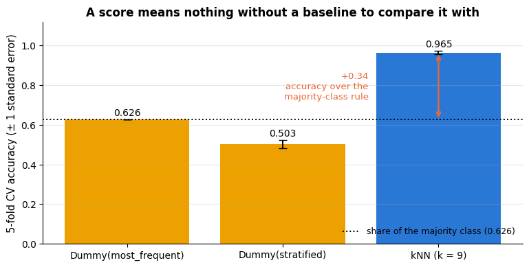

The majority-class baseline already gets 63 %; our model's 97 % is a real improvement.
Accuracy is also not always the right metric — on imbalanced problems precision, recall,
$`F_1`$ and ROC-AUC tell a very different story. Notebook 7 is devoted to classification
metrics and notebook 6 to regression metrics; here we only note that `scoring=` accepts
any of them.

## 6. Learning curves: do I need more data or a better model?

A **learning curve** plots training and validation scores as a function of the *training
set size*. It is the single most useful diagnostic for the bias/variance question:

- Both curves converge to a *low* score → **high bias**: the model cannot represent the
  data; more data will not help; use a more flexible model or better features.
- A large gap between a high training score and a lower validation score that is *still
  closing* → **high variance**: more data will help, as will regularisation.
- Curves have converged with a small gap at a good score → you are done; a bigger model
  might help, more data will not.

```python
# learning_curve returns the raw numbers; LearningCurveDisplay computes and plots them (only the Display is used)
from sklearn.model_selection import learning_curve, LearningCurveDisplay
from sklearn.linear_model import LogisticRegression

models = {
    "kNN, k = 1 (flexible)": Pipeline([("scale", StandardScaler()), ("knn", KNeighborsClassifier(n_neighbors=1))]),
    "kNN, k = 15": Pipeline([("scale", StandardScaler()), ("knn", KNeighborsClassifier(n_neighbors=15))]),
    "logistic regression": Pipeline([("scale", StandardScaler()), ("lr", LogisticRegression(max_iter=1000))]),
}
train_sizes = np.linspace(0.1, 1.0, 8)          # 8 training-set sizes, as fractions of the largest possible one
fig, axes = plt.subplots(1, 3, figsize=(16, 4), sharey=True)
for ax, (name, m) in zip(axes, models.items()):
    # for each size, cross-validate on that many training rows and plot the mean training and validation scores
    # (score_type="both"); line_kw styles the mean lines, std_display_style shades +-1 standard deviation over folds
    LearningCurveDisplay.from_estimator(m, X_trainval, y_trainval, train_sizes=train_sizes, cv=cv,
                                        scoring="accuracy", score_type="both", ax=ax,
                                        line_kw={"marker": "o"}, std_display_style="fill_between")
    ax.set_title(name)
    ax.set_ylim(0.85, 1.01)
    ax.set_xlabel("training set size (number of rows)")
    ax.set_ylabel("")                       # one shared y-axis: no repeated label
axes[0].set_ylabel("accuracy (5-fold CV)")
fig.suptitle("Learning curves: a wide, still-closing gap means more data will help", y=1.02)
plt.tight_layout()
plt.show()
```

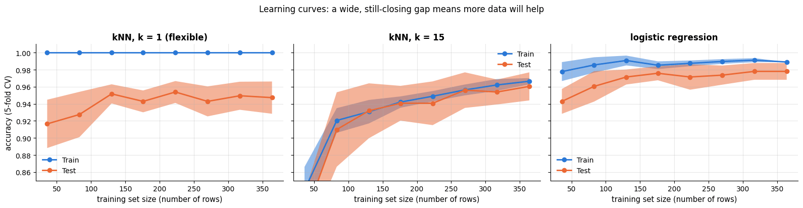

kNN with $k=1$ shows the variance signature (training score 1.0, validation score below
and rising); logistic regression converges quickly with a small gap — on this dataset a
linear model is close to the best one can do.

### 6.1 Validation curves

A **validation curve** is the complexity plot from section 2, computed by CV for one
hyper-parameter: `validation_curve` or `ValidationCurveDisplay`. Here for the regularisation
parameter `C` of logistic regression (small `C` = strong regularisation = simpler model;
notebook 7 explains the parameter).

```python
from sklearn.model_selection import ValidationCurveDisplay

lr = Pipeline([("scale", StandardScaler()), ("lr", LogisticRegression(max_iter=2000))])
fig, ax = plt.subplots()
# cross-validates the model once per value in param_range and plots training and validation scores;
# "lr__C" means "parameter C of the pipeline step named lr" (step name, two underscores, parameter name);
# np.logspace(-4, 3, 15) gives 15 values from 0.0001 to 1000, evenly spaced on a log scale
ValidationCurveDisplay.from_estimator(lr, X_trainval, y_trainval, param_name="lr__C",
                                      param_range=np.logspace(-4, 3, 15), cv=cv, scoring="accuracy",
                                      ax=ax, std_display_style="fill_between")
ax.set_xscale("log")
ax.set_xlabel(r"$C = 1/\lambda$  (small $C$ = strong regularisation = simpler model)")   # r"..." keeps the backslashes
ax.set_ylabel("accuracy (5-fold CV)")
ax.set_title("Validation curve: too much regularisation underfits, too little overfits")
ax.set_ylim(0.85, 1.01)
plt.show()
```

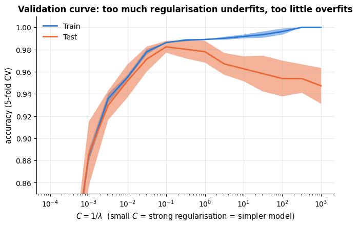

## 7. Two caveats every practitioner must know

### 7.1 Data leakage

**Leakage** is the use, at training time, of information that will not be available at
prediction time — or, more generally, any contamination of the training process by the
evaluation data (Kaufman et al., 2012). It is the most common reason for "too good to be
true" results, and Kapoor & Narayanan (2023) document it in hundreds of published papers.
Typical forms:

1. **Preprocessing on the full dataset** — fitting a scaler, an imputer, a feature
   selector or PCA on train + test before splitting. The transformation "sees" the test
   distribution. *Fix:* put every preprocessing step in a `Pipeline`, which is fitted on
   training folds only.
2. **Target leakage** — features that are consequences of the target (a "treatment
   started" flag when predicting a diagnosis; "account closed" when predicting churn).
3. **Duplicate or near-duplicate rows** across train and test (the same patient, the same
   image slightly cropped). *Fix:* `GroupKFold`.
4. **Temporal leakage** — training on the future to predict the past (notebook 16).

Let us demonstrate form 1 in a setting where it bites hard: *feature selection* on a
dataset with many pure-noise features. Selecting the features most correlated with the
target on the whole data, and *then* cross-validating, produces a phantom accuracy of
~80 % where the truth is 50 %.

```python
# SelectKBest(score_func, k) keeps the k features with the highest score; f_classif scores each feature by the
# ANOVA F-statistic, i.e. by how much its mean differs between the classes
from sklearn.feature_selection import SelectKBest, f_classif

from sklearn.model_selection import RepeatedStratifiedKFold

n, d = 200, 2000
X_noise = rng.normal(size=(n, d))                 # pure noise …
y_noise = rng.integers(0, 2, n)                   # … and labels unrelated to it
rcv = RepeatedStratifiedKFold(n_splits=5, n_repeats=4, random_state=RANDOM_STATE)   # 5 folds x 4 repeats = 20 scores

# WRONG: select the 20 "best" features using all the data, then cross-validate
selector = SelectKBest(f_classif, k=20).fit(X_noise, y_noise)
X_selected = selector.transform(X_noise)          # keep only the 20 selected columns: shape (200, 20)
leaky = cross_val_score(LogisticRegression(), X_selected, y_noise, cv=rcv)

# RIGHT: selection happens inside the pipeline, i.e. inside each training fold
honest_pipe = Pipeline([("select", SelectKBest(f_classif, k=20)), ("lr", LogisticRegression())])
honest = cross_val_score(honest_pipe, X_noise, y_noise, cv=rcv)

print(f"leaky protocol   CV accuracy = {leaky.mean():.3f}   <- impossible: the data are pure noise")
print(f"honest protocol  CV accuracy = {honest.mean():.3f}   <- chance level, as it should be")
```

```text
leaky protocol   CV accuracy = 0.771   <- impossible: the data are pure noise
honest protocol  CV accuracy = 0.490   <- chance level, as it should be
```

The two numbers are worth seeing as two *distributions*, because the point is not only that
the leaky mean is too high but that **every single one** of its 20 fold scores is far above
chance: nothing in the leaky protocol's own output would warn you. The honest protocol sits
on the chance line, exactly where a model trained on noise belongs.

```python
fig, ax = plt.subplots(figsize=(9.5, 4.4))
bins = np.linspace(0.3, 1.0, 36)                  # the same 35 bins for both histograms, so they are comparable
ax.hist(honest, bins=bins, color=PALETTE[0], alpha=0.85,
        label=f"honest: selection inside the pipeline (mean {honest.mean():.3f})")
ax.hist(leaky, bins=bins, color=PALETTE[1], alpha=0.85,
        label=f"leaky: selection before cross-validation (mean {leaky.mean():.3f})")
ax.axvline(0.5, color="black", ls="--", lw=2, label="chance level (the labels are random)")
ax.set_ylim(0, 7.6)
ax.annotate("2 000 noise features, 20 of them picked\nbecause they happened to match the labels",
            xy=(leaky.mean() + 0.03, 3.0), xytext=(0.295, 6.0), fontsize=9,
            arrowprops={"arrowstyle": "->", "lw": 1.2})
ax.set_xlabel("accuracy on a held-out fold")
ax.set_ylabel("number of folds (5 folds × 4 repetitions)")
ax.set_title(f"Feature selection before cross-validation invents "
             f"{100 * (leaky.mean() - honest.mean()):.0f} accuracy points out of noise")
ax.legend(loc="upper right", fontsize=9)
plt.show()
```

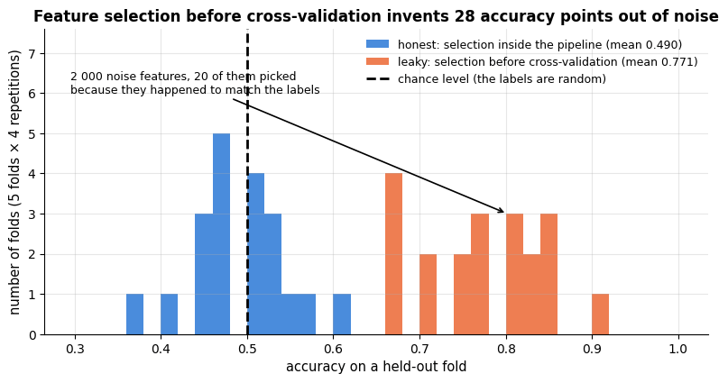

> **Warning.** *Anything* fitted to data belongs inside the cross-validated pipeline —
> scalers, imputers, encoders, feature selection, dimensionality reduction, target
> encoding, and hyper-parameter search itself. If you remember one rule from this notebook,
> make it this one.

### 7.2 No free lunch

The **no-free-lunch theorem** (Wolpert, 1996) states, loosely, that averaged over *all*
possible data-generating distributions, every learning algorithm has the same expected
performance. No algorithm is universally best; an algorithm works well on a problem
because its **inductive bias** — the assumptions built into $\mathcal{H}$ and the
learning rule (smoothness, linearity, locality, sparsity, translation invariance …) —
matches the structure of that problem. This is why we learn many algorithms in this course
and evaluate them empirically on every new dataset, why "which model is best?" has no
context-free answer, and why understanding the assumptions of each method matters more than
memorising its API. Domingos (2012) is a wonderful essay on this and eleven other lessons.

A quick illustration: a linear model and a nearest-neighbour model on two datasets whose
structure favours one or the other. The first dataset has a *linear* Bayes boundary
($y$ depends on the sign of $\mathbf{w}^\top\mathbf{x}$ plus noise), the second is the
"two moons" toy problem whose classes interleave.

```python
from sklearn.datasets import make_moons     # generates the "two moons" toy data set

def make_linear_data(n, d, noise=0.3, rng=rng):
    """Labels depend only on the sign of a linear function of x (plus label noise).

    Returns X of shape (n, d) with standard-normal features, and 0/1 labels y = [x.w / ||w|| + noise > 0]
    for a random direction w.
    """
    Xl = rng.normal(size=(n, d))
    w = rng.normal(size=d)
    # dividing by ||w|| makes x.w the coordinate along a unit vector, so `noise` is on the same scale for any d
    yl = (Xl @ w / np.linalg.norm(w) + rng.normal(0, noise, n) > 0).astype(int)
    return Xl, yl

datasets = {
    "linear boundary (favours linear models)": make_linear_data(300, 2),
    # make_moons returns (X, y): 300 points on two interleaving half-circles, with Gaussian noise of std 0.25
    "two moons (favours local models)": make_moons(n_samples=300, noise=0.25, random_state=RANDOM_STATE),
}
clfs = {"logistic regression": LogisticRegression(), "kNN (k = 15)": KNeighborsClassifier(15)}   # 15 = n_neighbors
fig, axes = plt.subplots(2, 2, figsize=(11, 8))
for i, (dname, (Xd, yd)) in enumerate(datasets.items()):      # rows of the grid: data sets
    for j, (cname, clf) in enumerate(clfs.items()):           # columns: classifiers
        acc = cross_val_score(clf, Xd, yd, cv=cv).mean()
        clf.fit(Xd, yd)                 # cross_val_score fits copies, so fit the model itself before plotting it
        plot_decision_boundary(clf, Xd, yd, ax=axes[i, j], title=f"{cname}\n{dname}\nCV accuracy {acc:.3f}")
plt.tight_layout()
plt.show()
```

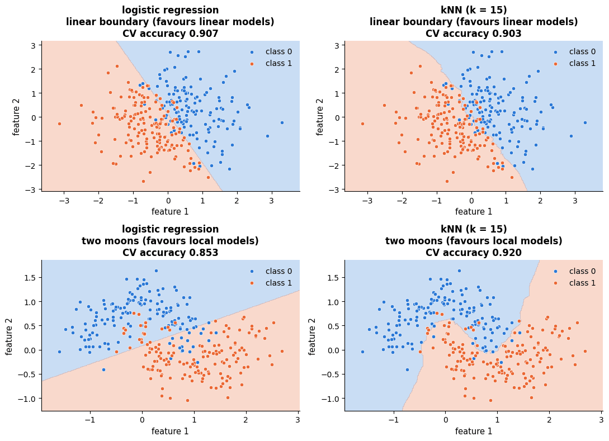

In two dimensions the linear problem is easy for both models. The inductive bias of the
linear model pays off when the number of features grows while the boundary stays linear:
nearest-neighbour distances become less and less informative in high dimensions (the
*curse of dimensionality*, notebook 8), whereas logistic regression only has to estimate
one direction $\mathbf{w}$.

```python
print("linear boundary, n = 300 samples:")
for d in [2, 10, 30, 100]:                      # the same kind of problem with more and more features
    Xd, yd = make_linear_data(300, d)
    acc_lr = cross_val_score(LogisticRegression(max_iter=2000), Xd, yd, cv=cv).mean()
    acc_knn = cross_val_score(KNeighborsClassifier(15), Xd, yd, cv=cv).mean()
    print(f"  d = {d:3d}   logistic regression {acc_lr:.3f}   kNN {acc_knn:.3f}")
```

```text
linear boundary, n = 300 samples:
  d =   2   logistic regression 0.897   kNN 0.883
  d =  10   logistic regression 0.900   kNN 0.830
  d =  30   logistic regression 0.900   kNN 0.747
  d = 100   logistic regression 0.827   kNN 0.700
```

## 8. Putting it together: an evaluation recipe

Every supervised-learning project in this course follows the same skeleton; later
notebooks fill in the model-specific details.

```py
# 1. Split off a test set FIRST and never look at it until the end.
X_trainval, X_test, y_trainval, y_test = train_test_split(X, y, test_size=0.2, stratify=y, random_state=42)

# 2. Put ALL preprocessing into a Pipeline.
pipe = Pipeline([("prep", preprocessing), ("model", model)])

# 3. Establish baselines (Dummy*, a simple model).
# 4. Select hyper-parameters with (repeated, stratified/grouped/time-aware) cross-validation,
#    reading learning and validation curves to decide between more data / more capacity / more regularisation.
# 5. Refit the chosen configuration on train+validation, evaluate ONCE on the test set,
#    and report the metric that matches the business goal together with its uncertainty.
```

## Summary

- Supervised learning = **empirical risk minimisation** over a hypothesis space
  $\mathcal{H}$; the quantity we care about is the **risk** on unseen data, which training
  error estimates *optimistically*.
- **Underfitting** (high bias) and **overfitting** (high variance) are the two failure
  modes; the **bias–variance decomposition**
  $\text{error} = \text{bias}^2 + \text{variance} + \text{noise}$ explains the U-shaped
  test-error curve and why more data helps variance but not bias.
- Honest evaluation needs data the model has not seen: a **hold-out test set** used once,
  and **cross-validation** (stratified, grouped, or time-aware as appropriate) for model
  selection; report means *and* standard errors, apply the one-standard-error rule.
- **Learning curves** tell you whether to get more data or a better model; **validation
  curves** locate the sweet spot of a hyper-parameter.
- Always compare against **baselines**; put every data-dependent step inside a
  **pipeline** to avoid **leakage**; remember there is **no free lunch** — model choice is
  empirical and depends on the match between inductive bias and problem structure.

| Question | Tool |
|---|---|
| Honest performance estimate | held-out test set (once), `cross_val_score`, `cross_validate` |
| Choose a hyper-parameter | `ValidationCurveDisplay`, `GridSearchCV` (notebook 12) |
| More data or bigger model? | `LearningCurveDisplay` |
| Small dataset, noisy estimates | `RepeatedStratifiedKFold`, report ± standard error |
| Rows share a group / time order | `GroupKFold`, `TimeSeriesSplit` |
| Avoid leakage | `Pipeline`, `ColumnTransformer`; split before anything else |
| Is the model any good at all? | `DummyClassifier`, `DummyRegressor`, a simple strong baseline |

**Next steps:** notebook 6 (linear regression) makes the least-squares machinery behind the
polynomial fits explicit and introduces regularisation as a direct handle on the
bias–variance trade-off; notebook 7 covers classification metrics beyond accuracy;
notebook 12 returns to model selection with grid/random search and nested CV.

## Exercises

### Exercise 1 — Bayes error (easy)
In the sine example, change the noise level to `noise=0.6`. Re-run the complexity plot of
section 2. How does the optimal degree change, and where does the test-error curve now
flatten out? Explain using the bias–variance decomposition.

<details><summary>Solution sketch</summary>

The floor of the test error moves from $0.09$ to $0.36 = 0.6^2$ (the Bayes error). With
more noise, variance grows faster with degree, so the optimum shifts to a *lower* degree:
noisier data call for simpler models (or more data).
</details>

### Exercise 2 — More data (easy)
Repeat the bias–variance simulation of section 3 with `n_train=300` instead of 30. Which
of the three terms changes, and which does not?

<details><summary>Solution sketch</summary>

Variance drops by roughly a factor of 10 for every degree; bias<span></span>$^2$ and noise are
unchanged. Consequently the optimal degree increases — with more data we can afford a more
flexible model.
</details>

### Exercise 3 — Leave-one-out vs. 5-fold (medium)
Using `LeaveOneOut()` and `StratifiedKFold(5)` as `cv`, estimate the accuracy of the
kNN pipeline ($k=5$) on the breast cancer training data 30 times with different random
subsamples of 150 rows. Compare the mean and the standard deviation of the two estimators
across the 30 repetitions.

<details><summary>Solution sketch</summary>

```py
from sklearn.model_selection import LeaveOneOut
loo_scores, kf_scores = [], []
for r in range(30):
    idx = rng.choice(len(X_trainval), 150, replace=False)
    Xs, ys = X_trainval.iloc[idx], y_trainval.iloc[idx]
    loo_scores.append(cross_val_score(model, Xs, ys, cv=LeaveOneOut()).mean())
    kf_scores.append(cross_val_score(model, Xs, ys, cv=StratifiedKFold(5, shuffle=True, random_state=r)).mean())
```
Both means are similar; LOO is slightly less biased (it trains on 149 rather than 120 rows)
but its standard deviation across repetitions is *not* smaller — and it costs 30× more fits.
</details>

### Exercise 4 — Leakage hunt (medium)
The following protocol has a leak. Find it, explain why it inflates the score, and fix it.

```py
scaler = StandardScaler().fit(X)
X_scaled = scaler.transform(X)
pca = PCA(n_components=5).fit(X_scaled)
Z = pca.transform(X_scaled)
print(cross_val_score(LogisticRegression(), Z, y, cv=5).mean())
```

<details><summary>Solution sketch</summary>

Both the scaler and the PCA are fitted on all rows, including the ones that later serve as
validation folds, so the validation representation depends on validation data. On this
dataset the effect is small (PCA is unsupervised), but the protocol is wrong in principle
and can be badly wrong with supervised steps. Fix: `make_pipeline(StandardScaler(),
PCA(5), LogisticRegression())` inside `cross_val_score`.
</details>

### Exercise 5 — Learning curve for a regression problem (medium)
Load `sklearn.datasets.load_diabetes(as_frame=True)`. Plot learning curves (metric:
`neg_root_mean_squared_error`) for `LinearRegression` and for
`KNeighborsRegressor(n_neighbors=3)` inside a scaling pipeline. Which model suffers from
variance, which from bias, and would you invest in collecting more patients?

<details><summary>Solution sketch</summary>

Linear regression: the two curves meet quickly at an RMSE around 55 — bias-limited (or
noise-limited: the diabetes target is very noisy). kNN with $k=3$: a large train/validation
gap that closes slowly — variance-limited; more data would help it, but probably not
beyond the linear model. Collecting more data is unlikely to pay off; better features would.
</details>

### Exercise 6 — Nested cross-validation (hard)
Implement nested CV by hand: an outer `StratifiedKFold(5)`; inside each outer training
fold, choose $`k \in \{1, 3, 5, 9, 15, 31\}`$ by an inner 5-fold CV, refit, and score on the
outer validation fold. Compare the nested estimate with the (optimistic) "best inner CV
score" and with the non-nested estimate from section 4.3.

<details><summary>Solution sketch</summary>

```py
outer = StratifiedKFold(5, shuffle=True, random_state=0)
nested, inner_best = [], []
for tr, va in outer.split(X_trainval, y_trainval):
    Xtr, ytr = X_trainval.iloc[tr], y_trainval.iloc[tr]
    inner_scores = {k: cross_val_score(make_knn(k), Xtr, ytr, cv=5).mean() for k in [1, 3, 5, 9, 15, 31]}
    k_best = max(inner_scores, key=inner_scores.get)
    inner_best.append(inner_scores[k_best])
    nested.append(make_knn(k_best).fit(Xtr, ytr).score(X_trainval.iloc[va], y_trainval.iloc[va]))
```
The nested estimate is typically a little lower than the best inner score; the difference
is the selection bias. With only 6 candidate values the bias is small here; it grows with
the number of configurations tried.
</details>

## References and further reading

### Textbooks

- James, G., Witten, D., Hastie, T., Tibshirani, R., & Taylor, J. (2023). *An Introduction to Statistical Learning with Applications in Python*. Springer. (free at https://www.statlearning.com) — Chapters 2 and 5 cover this notebook's material at the same level, with excellent figures.
- Hastie, T., Tibshirani, R., & Friedman, J. (2009). *The Elements of Statistical Learning* (2nd ed.). Springer. (free) — Chapter 7 ("Model Assessment and Selection") is the definitive treatment of bias–variance, cross-validation and the bootstrap.
- Mitchell, T. M. (1997). *Machine Learning*. McGraw-Hill. — Source of the definition of learning quoted in section 1.
- Shalev-Shwartz, S., & Ben-David, S. (2014). *Understanding Machine Learning: From Theory to Algorithms*. Cambridge University Press. (free) — Chapters 2–6 develop ERM, PAC learning and the bias–complexity trade-off rigorously.
- Vapnik, V. N. (1995). *The Nature of Statistical Learning Theory*. Springer. — The origin of statistical learning theory and structural risk minimisation.
- Murphy, K. P. (2022). *Probabilistic Machine Learning: An Introduction*. MIT Press. (free) — Chapter 4 on statistics and chapter 5 on decision theory complement the risk-based view.
- Géron, A. (2022). *Hands-On Machine Learning with Scikit-Learn, Keras, and TensorFlow* (3rd ed.). O'Reilly. — Chapters 1–2: a gentle practical walk through the same workflow.

### Papers

- Geman, S., Bienenstock, E., & Doursat, R. (1992). Neural networks and the bias/variance dilemma. *Neural Computation*, 4(1), 1–58. — The classic exposition of the decomposition derived in section 3.
- Kohavi, R. (1995). A study of cross-validation and bootstrap for accuracy estimation and model selection. *Proceedings of IJCAI 1995*, 1137–1143. — Empirical comparison that established stratified 10-fold CV as the default.
- Stone, M. (1974). Cross-validatory choice and assessment of statistical predictions. *Journal of the Royal Statistical Society: Series B*, 36(2), 111–147. — The original cross-validation paper.
- Cawley, G. C., & Talbot, N. L. C. (2010). On over-fitting in model selection and subsequent selection bias in performance evaluation. *Journal of Machine Learning Research*, 11, 2079–2107. — Why validation scores of tuned models are optimistic.
- Varma, S., & Simon, R. (2006). Bias in error estimation when using cross-validation for model selection. *BMC Bioinformatics*, 7, 91. — Motivates nested cross-validation.
- Kaufman, S., Rosset, S., Perlich, C., & Stitelman, O. (2012). Leakage in data mining: formulation, detection, and avoidance. *ACM Transactions on Knowledge Discovery from Data*, 6(4), 1–21.
- Kapoor, S., & Narayanan, A. (2023). Leakage and the reproducibility crisis in machine-learning-based science. *Patterns*, 4(9). — A taxonomy of leakage with a survey of affected fields.
- Wolpert, D. H. (1996). The lack of a priori distinctions between learning algorithms. *Neural Computation*, 8(7), 1341–1390. — The no-free-lunch theorem for supervised learning.
- Domingos, P. (2012). A few useful things to know about machine learning. *Communications of the ACM*, 55(10), 78–87. — Twelve pages of hard-won wisdom; read it now and again in a year.
- Belkin, M., Hsu, D., Ma, S., & Mandal, S. (2019). Reconciling modern machine-learning practice and the classical bias–variance trade-off. *PNAS*, 116(32), 15849–15854. — Double descent.
- Nakkiran, P., Kaplun, G., Bansal, Y., Yang, T., Barak, B., & Sutskever, I. (2020). Deep double descent: where bigger models and more data hurt. *ICLR 2020*.
- Breiman, L., Friedman, J. H., Olshen, R. A., & Stone, C. J. (1984). *Classification and Regression Trees*. Wadsworth. — Introduces the one-standard-error rule (chapter 3).
- Pedregosa, F., et al. (2011). Scikit-learn: machine learning in Python. *Journal of Machine Learning Research*, 12, 2825–2830; and Buitinck, L., et al. (2013). API design for machine learning software: experiences from the scikit-learn project. *ECML PKDD Workshop*. — The library and the design of its estimator API.
- Street, W. N., Wolberg, W. H., & Mangasarian, O. L. (1993). Nuclear feature extraction for breast tumor diagnosis. *Proceedings of SPIE 1905*, 861–870. — The breast cancer Wisconsin data.

### Documentation and online resources

- scikit-learn user guide, *Cross-validation: evaluating estimator performance* — https://scikit-learn.org/stable/modules/cross_validation.html
- scikit-learn user guide, *Validation curves: plotting scores to evaluate models* — https://scikit-learn.org/stable/modules/learning_curve.html
- scikit-learn, *Common pitfalls and recommended practices* (data leakage, randomness) — https://scikit-learn.org/stable/common_pitfalls.html
- Google, *Rules of Machine Learning* — https://developers.google.com/machine-learning/guides/rules-of-ml — Rule #1: "Don't be afraid to launch a product without machine learning"; the rest is about evaluation discipline.

---

← [4. Data preprocessing and feature engineering](04_data_preprocessing_and_feature_engineering.md) · [all notebooks](README.md) · [6. Linear regression and regularisation](06_linear_regression_and_regularization.md) →
