# 7. Logistic regression and classification metrics

> Markdown edition of [`notebooks/07_logistic_regression_and_classification_metrics.ipynb`](../notebooks/07_logistic_regression_and_classification_metrics.ipynb). Code and outputs are from the notebook's last saved run; to experiment, run the notebook itself.
>
> ← [6. Linear regression and regularisation](06_linear_regression_and_regularization.md) · [all notebooks](README.md) · [8. k-nearest neighbours, naive Bayes and the curse of dimensionality](08_knn_naive_bayes_and_the_curse_of_dimensionality.md) →

Notebook 6 built a complete theory of the linear model for a *real-valued* target. This
notebook does the same for a **categorical** one. The workhorse is **logistic regression**:
a linear model of the log-odds, fitted by maximum likelihood. It is the default first model
for classification everywhere from clinical medicine to credit scoring — fast, convex,
calibrated, and interpretable as a set of odds ratios — and it is the reference against
which every fancier classifier in notebooks 8–11 should be measured.

The second half of the notebook is the course's **reference on classification metrics**.
Accuracy is almost never the number you want, and the alternatives (precision, recall,
$`F_\beta`$, MCC, balanced accuracy, ROC-AUC, average precision, log loss, the Brier score)
each answer a different question. We derive them from the confusion matrix, verify the
probabilistic interpretation of AUC numerically, and — most importantly — treat the
**decision threshold** as what it actually is: a business decision that follows from a cost
matrix, not a constant handed down at 0.5. Later notebooks evaluate their classifiers with
the vocabulary built here.

**Prerequisites:** notebook 5 (generalisation, cross-validation, baselines), notebook 6
(linear models, gradient descent, regularisation), and the probability sections of
notebook 2. Notebook 4 supplies the preprocessing pipeline used in section 5.

## Learning objectives

After working through this notebook you will be able to

- explain why least squares on 0/1 labels fails and how the logistic model fixes it, in terms of odds and log-odds;
- derive the cross-entropy loss from the Bernoulli likelihood, compute its gradient and Hessian, and show that it is convex;
- implement binary and multinomial (softmax) logistic regression from scratch in NumPy and verify them against scikit-learn;
- choose `C`, the penalty (`l1_ratio`), `class_weight` and the solver deliberately, using validation curves and a 2-D CV heat-map;
- read a confusion matrix and compute precision, recall, $`F_\beta`$, balanced accuracy, MCC and the likelihood ratios from it, including micro/macro/weighted averaging;
- pick an operating point from a cost matrix using ROC, precision–recall and cost curves, with `TunedThresholdClassifierCV`;
- diagnose and repair miscalibrated probabilities with reliability diagrams, the Brier score, Platt scaling and isotonic regression;
- state where logistic regression fails (non-linear boundaries, perfectly separable data) and what to do about it.

## Setup

```python
import numpy as np                 # arrays and fast numerical maths
import pandas as pd                # DataFrames: labelled tables built on top of NumPy
import matplotlib.pyplot as plt    # the plotting library behind every figure in the course
import seaborn as sns              # statistical plots on top of matplotlib (used for the heat-map in section 10.2)

# course helpers: set_style() applies the shared plot style, PALETTE is the list of course colours,
# plot_decision_boundary(model, X, y, ...) shades the region a fitted 2-D classifier assigns to each class,
# load_churn() returns the customer-churn table with notebook 4's cleaning applied
from course_utils import set_style, PALETTE, plot_decision_boundary, load_churn

RANDOM_STATE = 42                          # one fixed seed so every run produces the same results
rng = np.random.default_rng(RANDOM_STATE)  # a seeded random-number generator
set_style()                                # apply the course-wide matplotlib settings once
```

## 1. From a line to a probability

### 1.1 Why least squares on 0/1 labels is the wrong tool

The obvious idea is to encode the two classes as $`y \in \{0, 1\}`$ and run linear
regression. The fitted value $\hat{y} = \mathbf{w}^\top\mathbf{x} + b$ would then be read as
"the probability of class 1". Two things go wrong:

1. **The output is not a probability.** A line is unbounded, so $\hat{y}$ leaves $`[0,1]`$ as
   soon as $\mathbf{x}$ moves far enough. "This patient has a $-0.4$ probability of
   relapse" is not a sentence we can act on.
2. **Squared loss is the wrong loss.** It penalises being *confidently right*. A point far
   inside its own class has a large residual under squared loss, so least squares tilts the
   line to reduce it — even though that point was never in danger of being misclassified.

The second point is the more damaging one. Let us see it: a one-dimensional problem, and
then the same problem with a group of extra positives placed far to the right — points that
any sensible classifier handles correctly.

```python
def make_binary_1d(n, slope=1.6, rng=rng):
    """x uniform on [-4, 4]; P(y=1 | x) = sigmoid(slope * x).

    Returns two arrays of length n: the inputs x and their 0/1 labels y drawn with that probability.
    """
    x = rng.uniform(-4, 4, n)
    p = 1 / (1 + np.exp(-slope * x))             # the true probability of class 1 at each x
    y = (rng.random(n) < p).astype(int)          # True with probability p: one biased coin flip per point
    return x, y

# LinearRegression: ordinary least squares | LogisticRegression: the classifier this notebook is about
from sklearn.linear_model import LinearRegression, LogisticRegression

x_bin, y_bin = make_binary_1d(200)            # e.g. x = a pump's vibration level, y = 1 if it failed within a week
# e.g. 30 pumps that vibrate so violently that their failure is obvious
x_ext = np.concatenate([x_bin, rng.uniform(7, 9, 30)])          # 30 "easy" positives, far right
y_ext = np.concatenate([y_bin, np.ones(30, dtype=int)])         # ... all labelled 1

grid = np.linspace(-4.5, 9.5, 400)[:, None]      # 400 x-positions as a (400, 1) column: scikit-learn expects a 2-D X
fig, axes = plt.subplots(1, 2, figsize=(13, 4.4), sharey=True)   # sharey: both panels use the same y-axis
# zip pairs each panel with one (x, y, title) data set
for ax, (xx, yy, title) in zip(axes, [(x_bin, y_bin, "original data"),
                                      (x_ext, y_ext, "same data + 30 far-away positives")]):
    ols = LinearRegression().fit(xx[:, None], yy)        # .fit(X, y) learns the parameters; X is (n, n_features)
    logit = LogisticRegression().fit(xx[:, None], yy)    # default settings, which include a mild L2 penalty (C=1)
    # adding a little noise ("jitter") to the 0/1 labels keeps overlapping dots visible
    ax.scatter(xx, yy + rng.normal(0, 0.02, len(yy)), s=18, alpha=0.5, color=PALETTE[0], label="labels (jittered)")
    ax.plot(grid, ols.predict(grid), color=PALETTE[1], lw=2, label="least squares on 0/1")
    # predict_proba returns an (n, 2) array of [P(y=0), P(y=1)]; [:, 1] keeps the probability of class 1
    ax.plot(grid, logit.predict_proba(grid)[:, 1], color=PALETTE[2], lw=2, label="logistic regression")
    ax.axhline(0.5, color="gray", lw=0.8, ls=":")
    # each model's decision boundary: where the straight line reaches 0.5, and where the logistic score b + w x is 0
    x_ols = (0.5 - ols.intercept_) / ols.coef_[0]
    x_log = -logit.intercept_[0] / logit.coef_[0, 0]     # LogisticRegression stores coef_ as (1, n_features)
    ax.axvline(x_ols, color=PALETTE[1], ls="--", lw=1.2)
    ax.axvline(x_log, color=PALETTE[2], ls="--", lw=1.2)
    ax.set_title(f"{title}\nboundary: least squares x={x_ols:.2f}, logistic x={x_log:.2f}")
    ax.set_xlabel("x")
    ax.set_ylim(-0.25, 1.25)
axes[0].set_ylabel("y  /  P(y = 1 | x)")
axes[0].legend(loc="upper left", fontsize=9)
fig.suptitle("Least squares on labels is dragged around by points it already classifies correctly", y=1.03)
plt.tight_layout()
plt.show()
```

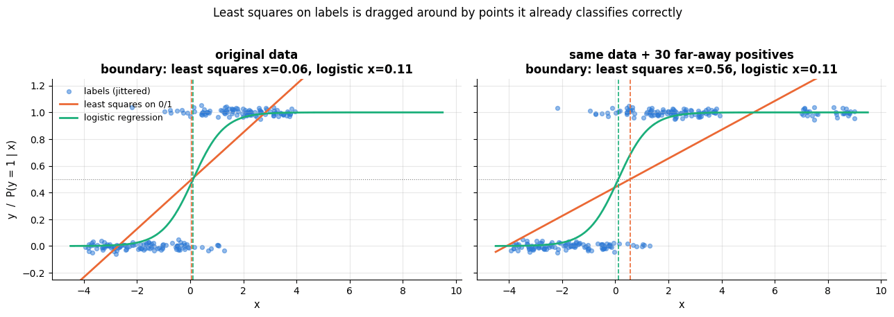

The least-squares line leaves the unit interval on both sides, and the extra positives —
which are *not* errors under any threshold — swing its 0.5-crossing to the right. The
logistic fit barely moves: its loss saturates, so a point that is already confidently
correct contributes almost nothing more.

> **Real-life example.** A water company predicts from a vibration reading whether a pump will
> fail within a week. Adding 30 pumps that vibrate so violently that any model calls them
> failures moves the least-squares line's 0.5 crossing to the right, so some borderline pumps
> are no longer sent for maintenance — a decision changed by cases that were never in doubt.

> **Going deeper.** For two classes, least squares on $`\{0,1\}`$ labels is *linear
> discriminant analysis* in disguise up to a scale factor; the failure above is the
> multi-class "masking" problem in miniature (Hastie et al., 2009, §4.2). The cure is to
> keep the linear function but pass it through a squashing function and change the loss.

### 1.2 Odds, log-odds and the logistic function

Instead of modelling $P(y=1 \mid \mathbf{x})$ directly with a line, model its **log-odds**.
The *odds* of an event with probability $p$ are $p / (1-p)$: "3 to 1" means $p = 0.75$.
Odds live in $(0, \infty)$; their logarithm, the **logit**,

```math
\operatorname{logit}(p) \;=\; \log\frac{p}{1-p},
```

lives in $(-\infty, \infty)$ — exactly the range of a linear function. So we posit

```math
\log \frac{P(y = 1 \mid \mathbf{x})}{P(y = 0 \mid \mathbf{x})} \;=\; \mathbf{w}^\top\mathbf{x} + b \;=:\; z ,
```

and invert the logit to recover the probability. The inverse is the **logistic (sigmoid)
function**

```math
\sigma(z) \;=\; \frac{1}{1 + e^{-z}}, \qquad \sigma: \mathbb{R} \to (0,1),
```

with the two properties we will use constantly:

```math
\sigma(-z) = 1 - \sigma(z), \qquad \sigma'(z) = \sigma(z)\,\big(1 - \sigma(z)\big).
```

The derivative identity is what makes the gradient of the loss so simple. Note also that
$\sigma$ is *steepest at $z = 0$<span></span>* (slope $1/4$) and flattens out in both tails: moving the
score from 3 to 4 changes the probability much less than moving it from 0 to 1.

> **Real-life example.** A bank's default model might add 0.7 to the log-odds for every missed
> payment in the past year, which multiplies the odds of default by about 2. For a customer at
> 1 % (odds 1 to 99) one missed payment means about 2 %; for a customer at 50 % (odds 1 to 1) it
> means 67 % (odds 2 to 1). The same step on the log-odds scale is a small or a large step in
> probability, depending on where the customer starts.

```python
def sigmoid(z):
    """Numerically stable logistic function 1 / (1 + e^(-z)): no overflow for large |z|.

    Accepts a number, list or array and returns a float array of the same shape with values in (0, 1).
    """
    z = np.asarray(z, dtype=float)           # convert lists and numbers to a float array
    out = np.empty_like(z)                   # an unfilled array with z's shape; both halves are written below
    pos = z >= 0                             # boolean mask; ~pos is its negation
    out[pos] = 1.0 / (1.0 + np.exp(-z[pos]))   # for z >= 0, e^(-z) <= 1 cannot overflow
    e = np.exp(z[~pos])                      # for z < 0 use e^z / (1 + e^z)
    out[~pos] = e / (1.0 + e)
    return out

z_grid = np.linspace(-6, 6, 400)               # scores z
p_grid = np.linspace(0.001, 0.999, 400)        # probabilities, stopping short of 0 and 1 where the logit is infinite
fig, axes = plt.subplots(1, 2, figsize=(12.5, 4.2))
axes[0].plot(z_grid, sigmoid(z_grid), color=PALETTE[0], lw=2.5)
axes[0].axhline(0.5, color="gray", lw=0.8, ls=":")
axes[0].axvline(0, color="gray", lw=0.8, ls=":")
# the tangent at z = 0, where sigma(0) = 0.5 and sigma'(0) = 0.25
axes[0].plot(z_grid, 0.5 + 0.25 * z_grid, color=PALETTE[1], lw=1.4, ls="--", label="tangent at z=0, slope 1/4")
# annotate(text, xy=point, xytext=text position, arrowprops=...) writes text with an arrow pointing at xy
axes[0].annotate("saturation:\ngradient ≈ 0", xy=(4.4, 0.985), xytext=(1.4, 0.72), fontsize=9,
                 arrowprops=dict(arrowstyle="->", color="gray"))
axes[0].set_ylim(-0.05, 1.12)
axes[0].set_xlabel("z = wᵀx + b   (log-odds)")
axes[0].set_ylabel("σ(z) = P(y = 1)")
axes[0].set_title("The logistic function maps scores to probabilities")
axes[0].legend(loc="lower right", fontsize=9)

axes[1].plot(p_grid, np.log(p_grid / (1 - p_grid)), color=PALETTE[2], lw=2.5)    # the logit log(p / (1 - p))
for p_mark in [0.1, 0.5, 0.9]:
    # label three points of the curve with their p and logit values
    axes[1].annotate(f"p={p_mark}\nlogit={np.log(p_mark/(1-p_mark)):.1f}",
                     xy=(p_mark, np.log(p_mark / (1 - p_mark))), xytext=(p_mark - 0.05, np.log(p_mark/(1-p_mark)) + 1.3),
                     fontsize=9, arrowprops=dict(arrowstyle="->", color="gray"))
axes[1].axhline(0, color="gray", lw=0.8, ls=":")
axes[1].set_xlabel("p = P(y = 1)")
axes[1].set_ylabel("logit(p) = log[p/(1−p)]")
axes[1].set_title("…and the logit maps probabilities back to scores")
plt.tight_layout()
plt.show()
```

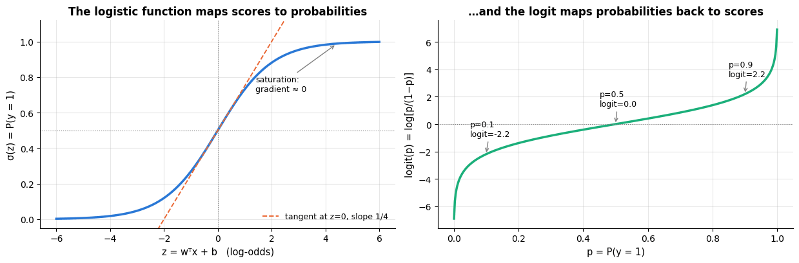

> **Key idea.** Logistic regression is a **linear model of the log-odds**. Everything you
> learned about linear models in notebook 6 — coefficients, scaling, collinearity,
> regularisation — carries over; only the link function and the loss change. In the
> generalised-linear-model table of notebook 6, §9, this is the Bernoulli row with the logit
> link.

### 1.3 The model, and why its decision boundary is a line

Written out, the model is

```math
P(y = 1 \mid \mathbf{x}) \;=\; \sigma(\mathbf{w}^\top\mathbf{x} + b), \qquad
P(y = 0 \mid \mathbf{x}) \;=\; 1 - \sigma(\mathbf{w}^\top\mathbf{x} + b) = \sigma(-(\mathbf{w}^\top\mathbf{x} + b)).
```

Predicting the more probable class means predicting $1$ whenever $`\sigma(z) > 0.5`$, i.e.
whenever $`z > 0`$. The **decision boundary** is therefore the set
$`\{\mathbf{x} : \mathbf{w}^\top\mathbf{x} + b = 0\}`$ — a hyperplane (a line in 2-D, a plane
in 3-D). Contours of constant probability are hyperplanes *parallel* to it, and $\mathbf{w}$
points in the direction of increasing probability; $`\|\mathbf{w}\|`$ controls how quickly the
probability changes as we cross the boundary. A large $`\|\mathbf{w}\|`$ means a sharp,
confident transition, a small one a gentle ramp.

Each coefficient has a clean reading: **increasing $`x_j`$ by one unit multiplies the odds by
$`e^{w_j}`$<span></span>**, holding the other features fixed. That is the odds ratio we use in section 11.

```python
from sklearn.datasets import make_classification     # generates a random synthetic classification data set

# 300 points with 2 informative features (n_redundant=0: no extra features made from them) and one cluster per class;
# class_sep sets how far apart the classes are, flip_y=0.06 gives 6 % of the points a randomly assigned label (noise)
# e.g. x1, x2 = a web-shop visitor's (standardised) time on site and pages viewed, y = 1 if they bought
X2, y2 = make_classification(n_samples=300, n_features=2, n_redundant=0, n_informative=2,
                             n_clusters_per_class=1, class_sep=1.1, flip_y=0.06,
                             random_state=RANDOM_STATE)
clf2 = LogisticRegression().fit(X2, y2)

fig, axes = plt.subplots(1, 2, figsize=(13.5, 4.8))
# proba=True shades P(y=1 | x) instead of the hard class and draws the 0.5 contour in black
plot_decision_boundary(clf2, X2, y2, ax=axes[0], proba=True,
                       title="Predicted probability P(y=1 | x)", feature_names=("$x_1$", "$x_2$"))
plot_decision_boundary(clf2, X2, y2, ax=axes[1],
                       title="The hard decision: a straight boundary", feature_names=("$x_1$", "$x_2$"))
w, b = clf2.coef_[0], clf2.intercept_[0]       # the weight vector, shape (2,), and the intercept (a number)
# an arrow from the origin in the direction of w; dividing by np.linalg.norm(w) (its length) gives it length 0.9
axes[1].annotate("", xy=(0.9 * w[0] / np.linalg.norm(w), 0.9 * w[1] / np.linalg.norm(w)),
                 xytext=(0, 0), arrowprops=dict(arrowstyle="->", color="black", lw=2))
axes[1].text(0.15, -0.55, "w", fontsize=13, fontweight="bold")
plt.tight_layout()
plt.show()
# np.exp(w[0]) is the odds ratio: the factor by which the odds change when x1 grows by one unit
print(f"w = {w.round(2)}, b = {b:.2f}   -> odds multiply by {np.exp(w[0]):.2f} per unit of x1")
```

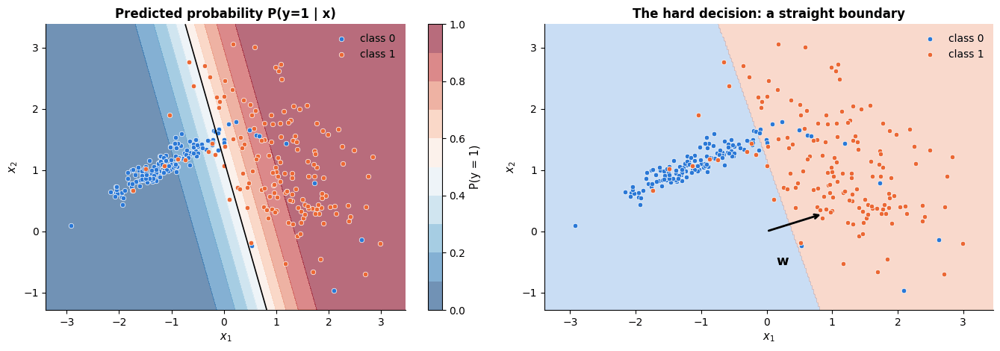

```text
w = [2.3  0.77], b = -0.90   -> odds multiply by 10.00 per unit of x1
```

The left panel shows the probability field: parallel bands, steepest across the boundary.
The right panel shows the hard prediction and the weight vector $\mathbf{w}$, orthogonal to
the boundary.

## 2. Maximum likelihood, the cross-entropy loss, and how to minimise it

### 2.1 From likelihood to loss

Each observation is a Bernoulli trial with success probability $`p_i = \sigma(z_i)`$,
$`z_i = \mathbf{w}^\top\mathbf{x}_i + b`$. Assuming the $n$ observations are independent given
the features, the likelihood of the parameters is

```math
L(\mathbf{w}, b) \;=\; \prod_{i=1}^n p_i^{\,y_i}\,(1-p_i)^{\,1-y_i}.
```

Taking $-\frac{1}{n}\log$ turns the product into an average and the maximisation into a
minimisation. The result is the **binary cross-entropy** (or **log loss**):

```math
\mathcal{L}(\mathbf{w}, b) \;=\; -\frac{1}{n}\sum_{i=1}^n \Big[\, y_i \log p_i + (1-y_i)\log(1-p_i) \Big].
```

Substituting $`p_i = \sigma(z_i)`$ and using $\log \sigma(z) = -\log(1+e^{-z})$ gives the form
we actually compute with, which never overflows:

```math
\mathcal{L} \;=\; \frac{1}{n}\sum_{i=1}^n \Big[\log\big(1 + e^{z_i}\big) - y_i z_i\Big]
\;=\; \frac{1}{n}\sum_{i=1}^n \Big[\operatorname{logaddexp}(0, z_i) - y_i z_i\Big].
```

Per-sample, the loss is $-\log(\text{probability assigned to the true class})$: it is $0$
for a perfect confident prediction and $\to \infty$ for a confident mistake. **Log loss is
unbounded**, which is why a single over-confident error can dominate it — a fact we return
to in section 7.

> **Real-life example.** A tennis-prediction site gives the underdog a 1 % chance of winning. If
> the underdog wins, that one match costs −log(0.01) ≈ 4.6 in log loss — as much as almost seven
> honest 50 % predictions (0.69 each). A prediction of 0 % that goes wrong makes the average log
> loss infinite, however good all the other predictions were.

### 2.2 The gradient, the Hessian and convexity

Differentiate. With $\sigma'(z) = \sigma(z)(1-\sigma(z))$, the chain rule collapses
beautifully:

```math
\frac{\partial \mathcal{L}}{\partial z_i} = \frac{1}{n}\big(p_i - y_i\big)
\quad\Longrightarrow\quad
\nabla_{\mathbf{w}} \mathcal{L} = \frac{1}{n}\,\mathbf{X}^\top(\mathbf{p} - \mathbf{y}),
\qquad
\frac{\partial \mathcal{L}}{\partial b} = \frac{1}{n}\sum_i (p_i - y_i).
```

This is *exactly* the gradient of least squares with the residual $\mathbf{p} - \mathbf{y}$
in place of $\hat{\mathbf{y}} - \mathbf{y}$ — a general property of generalised linear
models with the canonical link (notebook 6, §9). Unlike least squares, however, there is no
closed-form solution: setting the gradient to zero gives $d+1$ transcendental equations.

The Hessian is

```math
\nabla^2_{\mathbf{w}} \mathcal{L} \;=\; \frac{1}{n}\,\mathbf{X}^\top \mathbf{S}\,\mathbf{X},
\qquad \mathbf{S} = \operatorname{diag}\big(p_i(1-p_i)\big) \succeq 0 .
```

Because $\mathbf{S}$ has non-negative entries, $`\mathbf{v}^\top \mathbf{X}^\top\mathbf{S}\mathbf{X}\mathbf{v} = \sum_i p_i(1-p_i)(\mathbf{x}_i^\top\mathbf{v})^2 \ge 0`$
for every $\mathbf{v}$: the Hessian is positive semi-definite, so

> **Key idea.** The logistic loss is **convex**. Every local minimum is global, and any
> sensible optimiser finds the same answer — no restarts, no random initialisation to worry
> about. (It is *strictly* convex once an $`\ell_2`$ penalty is added; without one the minimum
> may be at infinity — see section 9.2.)

Let us look at the loss surface and watch three optimisers walk down it. We use two features
and no intercept so that the whole objective fits on a page.

```python
# another 2-feature data set, with 10 % random labels
# e.g. two survey answers of 200 respondents, y = 1 if they later bought the product
X_surf, y_surf = make_classification(n_samples=200, n_features=2, n_redundant=0, n_informative=2,
                                     n_clusters_per_class=1, class_sep=0.9, flip_y=0.10, random_state=7)
X_surf = X_surf - X_surf.mean(axis=0)                    # centred: the intercept is ~0

def loss_no_intercept(w, X=X_surf, y=y_surf):
    """Mean cross-entropy loss of the no-intercept model P(y=1) = sigma(X @ w), for a weight vector w of length 2."""
    z = X @ np.atleast_1d(w)                         # scores, shape (n,); atleast_1d makes a number a 1-element array
    return np.mean(np.logaddexp(0.0, z) - y * z)     # np.logaddexp(0, z) = log(e^0 + e^z) = log(1 + e^z), safely

w1 = np.linspace(-3.0, 4.0, 150)
w2 = np.linspace(-5.0, 3.5, 150)
W1, W2 = np.meshgrid(w1, w2)               # two (150, 150) grids with W1[i, j] = w1[j] and W2[i, j] = w2[i]
# the loss at every grid point; the outer loop (rows) runs over w2 and the inner one (columns) over w1, as in meshgrid
Z = np.array([[loss_no_intercept(np.array([a, b_])) for a in w1] for b_ in w2])

def gd_path(lr, n_steps, start=(-2.5, 3.0)):
    """Run n_steps of gradient descent with step size lr from `start`.

    Returns every visited weight vector as an (n_steps + 1, 2) array, starting point included.
    """
    w, path = np.array(start, dtype=float), [np.array(start, dtype=float)]
    for _ in range(n_steps):
        p = sigmoid(X_surf @ w)                                   # predicted probabilities, shape (n,)
        w = w - lr * (X_surf.T @ (p - y_surf) / len(y_surf))      # step against the gradient X^T (p - y) / n
        path.append(w.copy())
    return np.array(path)

def newton_path(n_steps, start=(0.0, 0.0)):
    """Run n_steps of Newton's method from `start`.

    Returns every visited weight vector as an (n_steps + 1, 2) array, starting point included.
    """
    w, path = np.array(start, dtype=float), [np.array(start, dtype=float)]
    for _ in range(n_steps):
        p = sigmoid(X_surf @ w)
        g = X_surf.T @ (p - y_surf) / len(y_surf)                 # the gradient
        # the Hessian X^T S X / n: multiplying row i of X by p_i (1 - p_i) applies S without building the
        # n x n diagonal matrix; the tiny 1e-8 * identity keeps H invertible
        H = X_surf.T @ (X_surf * (p * (1 - p))[:, None]) / len(y_surf) + 1e-8 * np.eye(2)
        w = w - np.linalg.solve(H, g)                             # Newton step: solve H d = g instead of inverting H
        path.append(w.copy())
    return np.array(path)

fig, ax = plt.subplots(figsize=(8.2, 6))
cs = ax.contourf(W1, W2, Z, levels=25, cmap="viridis", alpha=0.9)    # filled contours of the loss, 25 colour levels
plt.colorbar(cs, ax=ax, label="mean cross-entropy loss")
for path, name, colour in [(gd_path(2.0, 60), "gradient descent, η = 2", "white"),
                           (gd_path(8.0, 60), "gradient descent, η = 8 (overshoots, then zig-zags back)", PALETTE[7]),
                           (newton_path(5), "Newton / IRLS from the origin, 5 steps", PALETTE[3])]:
    ax.plot(path[:, 0], path[:, 1], "-o", ms=4.5, lw=1.8, color=colour, label=name)   # "-o": a line with a dot per step
w_opt = gd_path(2.0, 4000)[-1]             # 4000 steps get as close to the minimum as we need; [-1] is the last iterate
# marker="*" draws a star; mec / mew are the marker's edge colour and edge width
ax.plot(w_opt[0], w_opt[1], marker="*", ms=20, color="black", mec="white", mew=1.2, label="minimum")
ax.set_xlim(w1.min(), w1.max())
ax.set_ylim(w2.min(), w2.max())
ax.set_xlabel("$w_1$")
ax.set_ylabel("$w_2$")
ax.set_title("The cross-entropy loss is convex: one bowl, one minimum")
ax.legend(loc="upper left", fontsize=9)
ax.grid(False)
plt.show()
print(f"minimum at w = {w_opt.round(3)}, loss = {loss_no_intercept(w_opt):.4f}")
```

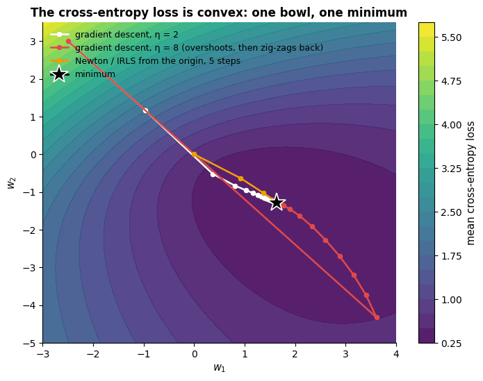

```text
minimum at w = [ 1.639 -1.282], loss = 0.2890
```

The contours form a single bowl. Gradient descent with a sensible step size walks straight
in; with too large a step it zig-zags across the valley (and with an even larger one it
would leave the picture entirely); Newton's method, which uses the curvature, is there in a
handful of steps.

> **Warning.** Newton's method is started at the origin here on purpose. Far from the
> optimum most $`p_i(1-p_i)`$ are nearly zero, the Hessian is close to singular, and the full
> Newton step can overshoot spectacularly — the method is only *locally* convergent.
> Production solvers damp it with a line search or a trust region; `lbfgs` and `newton-cg`
> both do.

### 2.3 Gradient descent from scratch

The algorithm, in full:

1. Initialise $\mathbf{w} = \mathbf{0}$, $b = 0$.
2. Repeat: compute $\mathbf{p} = \sigma(\mathbf{X}\mathbf{w} + b)$, the residual
   $\mathbf{r} = \mathbf{p} - \mathbf{y}$, then
   $\mathbf{w} \leftarrow \mathbf{w} - \eta\big(\tfrac{1}{n}\mathbf{X}^\top\mathbf{r} + \lambda\mathbf{w}\big)$
   and $`b \leftarrow b - \eta\,\bar{r}`$.
3. Stop when the gradient norm (or the change in loss) is below a tolerance.

The optional $`\lambda \|\mathbf{w}\|_2^2 / 2`$ term is the $`\ell_2`$ penalty of section 3;
the intercept is deliberately left unpenalised.

```python
def logistic_loss(X, y, w, b, lam=0.0):
    """Mean cross-entropy plus an L2 penalty on w (the intercept is not penalised).

    X is (n, d), y holds 0/1 labels, w is (d,), b is a number and lam the penalty strength λ. Returns a float.
    """
    z = X @ w + b                                     # the scores (log-odds), shape (n,)
    # log(1 + e^z) - y z is the per-sample loss of section 2.1; w @ w is the squared length ||w||^2
    return float(np.mean(np.logaddexp(0.0, z) - y * z) + 0.5 * lam * w @ w)

def fit_logistic_gd(X, y, lam=0.0, lr=1.0, n_iter=2000, tol=1e-9):
    """Batch gradient descent for binary logistic regression. Returns w, b, loss history.

    lam is the L2 penalty strength, lr the step size η and n_iter the maximum number of steps. Stops early once
    the loss changes by less than tol between two steps (tol=0.0 always runs all n_iter steps).
    """
    n, d = X.shape
    w, b = np.zeros(d), 0.0                           # start from all-zero parameters
    history = []
    for _ in range(n_iter):
        p = sigmoid(X @ w + b)                        # predicted probabilities for all n samples
        r = p - y                                     # the residual, exactly as in linear regression
        w -= lr * (X.T @ r / n + lam * w)             # gradient of the mean loss plus gradient of the penalty
        b -= lr * r.mean()
        history.append(logistic_loss(X, y, w, b, lam))
        if len(history) > 1 and abs(history[-2] - history[-1]) < tol:     # history[-1] is the newest loss
            break
    return w, b, np.array(history)
```

Feature scaling matters here exactly as it did in notebook 6, §2.3: the largest usable step
size is set by the largest curvature, i.e. by the largest eigenvalue of
$\mathbf{X}^\top\mathbf{S}\mathbf{X}/n$. Badly scaled features make that eigenvalue enormous
and force a tiny $\eta$.

```python
from sklearn.datasets import load_breast_cancer     # a real medical data set that ships with scikit-learn (section 11)
from sklearn.preprocessing import StandardScaler    # rescales every feature to mean 0 and standard deviation 1

cancer = load_breast_cancer()           # .data: a (569, 30) feature array; .target: 0 = malignant, 1 = benign
X_raw, y_bc = cancer.data, cancer.target
X_std = StandardScaler().fit_transform(X_raw)       # fit_transform: learn each column's mean and std, then standardise
# np.linalg.cond: the condition number (largest / smallest singular value); a large value means badly scaled columns
print(f"condition number: raw {np.linalg.cond(X_raw):.1e}   standardised {np.linalg.cond(X_std):.1e}")

fig, axes = plt.subplots(1, 2, figsize=(13, 4.4))
# left panel: the standardised data with four step sizes; tol=0.0 runs all 300 iterations
for lr, note in [(0.05, "too small: slow"), (0.25, ""), (1.0, "a good choice"), (100.0, "too large: unstable")]:
    _, _, hist = fit_logistic_gd(X_std, y_bc, lr=lr, n_iter=300, tol=0.0)     # _ discards w and b
    # {lr:g} prints the number in its shortest form; the note is appended only when it is not empty
    axes[0].plot(hist, lw=1.8, label=f"η = {lr:g}" + (f" ({note})" if note else ""))
axes[0].set_yscale("log")
axes[0].set_xlabel("iteration")
axes[0].set_ylabel("mean cross-entropy (log scale)")
axes[0].set_title("Standardised features: the step size trades speed for stability")
axes[0].legend(fontsize=9)

# right panel: standardised versus raw features, each with the step size it can tolerate
for X_used, lr, name in [(X_std, 1.0, "standardised, η = 1"),
                         (X_raw, 1e-5, "raw units, η = 1e-5 (largest usable)"),
                         (X_raw, 1e-3, "raw units, η = 1e-3 (unstable)")]:
    _, _, hist = fit_logistic_gd(X_used, y_bc, lr=lr, n_iter=300, tol=0.0)
    axes[1].plot(hist, lw=1.8, label=name)
axes[1].set_yscale("log")
axes[1].set_xlabel("iteration")
axes[1].set_ylabel("mean cross-entropy (log scale)")
axes[1].set_title("Unscaled features cost five orders of magnitude in step size")
axes[1].legend(fontsize=9)
plt.tight_layout()
plt.show()
```

```text
condition number: raw 1.5e+06   standardised 3.2e+02
```

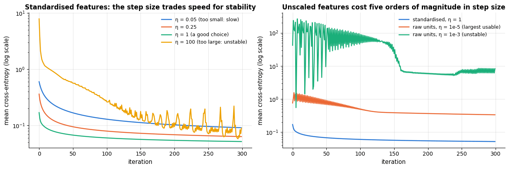

### 2.4 Newton's method, a.k.a. IRLS

Gradient descent uses only the slope. **Newton's method** uses the curvature too: it
minimises the local quadratic approximation of the loss, giving the update

```math
\boldsymbol{\theta} \leftarrow \boldsymbol{\theta} - \big(\nabla^2\mathcal{L}\big)^{-1}\nabla\mathcal{L}
\;=\; \boldsymbol{\theta} + \big(\mathbf{X}^\top\mathbf{S}\mathbf{X}\big)^{-1}\mathbf{X}^\top(\mathbf{y} - \mathbf{p}).
```

Rewriting it shows why statisticians call it **iteratively reweighted least squares**: each
step is a weighted least-squares fit of the *working response*
$`\tilde{y}_i = z_i + (y_i - p_i)/[p_i(1-p_i)]`$ with weights $`p_i(1-p_i)`$. This is how
`glm` in R and `statsmodels`' `Logit` fit the model. The price is the $O(nd^2 + d^3)$ cost
of forming and solving the Hessian each step, which is why scikit-learn's default solver
(`lbfgs`) uses a *low-rank approximation* of the inverse Hessian instead.

```python
def fit_logistic_newton(X, y, lam=0.0, n_iter=8):
    """Newton / IRLS for binary logistic regression (intercept appended as a column of ones).

    Runs exactly n_iter Newton steps with L2 penalty strength lam. Returns w, b and the loss after each step.
    """
    n, d = X.shape
    Xb = np.hstack([X, np.ones((n, 1))])                    # (n, d + 1): the extra column of ones carries the intercept
    theta = np.zeros(d + 1)                                 # all parameters in one vector: d weights, then intercept
    penalty = lam * np.eye(d + 1)                           # the penalty λ||w||²/2 has gradient λw and Hessian λI
    penalty[-1, -1] = 0.0                                   # do not penalise the intercept
    history = []
    for _ in range(n_iter):
        p = sigmoid(Xb @ theta)
        grad = Xb.T @ (p - y) / n + penalty @ theta
        S = p * (1 - p)                                     # the diagonal of S, as a vector of length n
        # Hessian X^T S X / n plus the penalty, plus a tiny ridge so the matrix is always invertible
        H = Xb.T @ (Xb * S[:, None]) / n + penalty + 1e-9 * np.eye(d + 1)
        theta -= np.linalg.solve(H, grad)                   # the Newton step
        history.append(logistic_loss(X, y, theta[:-1], theta[-1], lam))   # theta[:-1] = w, theta[-1] = b
    return theta[:-1], theta[-1], np.array(history)

lam_bc = 1.0 / (len(y_bc) * 1.0)                            # equivalent to scikit-learn's C = 1 (section 3.1)
w_gd, b_gd, hist_gd = fit_logistic_gd(X_std, y_bc, lam=lam_bc, lr=1.0, n_iter=6000, tol=0.0)
w_nt, b_nt, hist_nt = fit_logistic_newton(X_std, y_bc, lam=lam_bc, n_iter=8)
l_star = min(hist_gd[-1], hist_nt[-1])      # the lowest loss either method reached: our stand-in for the minimum L*

fig, ax = plt.subplots(figsize=(7.5, 4.4))
# iterations are numbered from 1 because log(0) does not exist; the + 1e-16 keeps a gap of exactly 0 plottable
ax.plot(np.arange(1, len(hist_gd) + 1), hist_gd - l_star + 1e-16, color=PALETTE[0], lw=2,
        label=f"gradient descent ({len(hist_gd)} iterations)")
ax.plot(np.arange(1, len(hist_nt) + 1), hist_nt - l_star + 1e-16, "-o", color=PALETTE[3], lw=2,
        label=f"Newton / IRLS ({len(hist_nt)} iterations)")
ax.set_xscale("log")
ax.set_yscale("log")
ax.set_xlabel("iteration (log scale)")
ax.set_ylabel(r"$\mathcal{L} - \mathcal{L}^\star$  (log scale)")
ax.set_title("Newton's method converges quadratically; gradient descent linearly")
ax.legend()
plt.show()
```

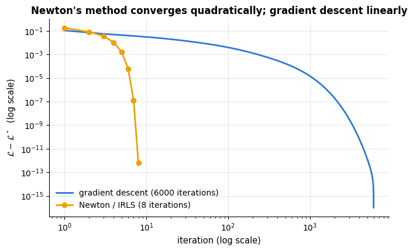

The Newton curve drops by several orders of magnitude *per step* near the optimum
(quadratic convergence), whereas gradient descent needs thousands of iterations to reach the
same accuracy. For $d$ in the hundreds, use a second-order method; for $d$ in the millions,
use first-order methods or `saga`.

### 2.5 Checking against scikit-learn

scikit-learn minimises a slightly different but equivalent objective — the *sum* of the
losses times $C$, plus $`\tfrac12\|\mathbf{w}\|^2`$ — so our $\lambda$ and its $C$ are related
by $\lambda = 1/(nC)$. With that mapping, all three implementations must agree.

```python
# C=1.0 corresponds to lam_bc above; the tiny tol and large max_iter let the solver converge fully
sk_lr = LogisticRegression(C=1.0, max_iter=5000, tol=1e-10).fit(X_std, y_bc)
# coef_ is (1, 30) for a binary problem, so [0] gives the 30 weights; :.2e is scientific notation with 2 decimals
print(f"gradient descent vs scikit-learn : max |Δw| = {np.abs(w_gd - sk_lr.coef_[0]).max():.2e}, "
      f"|Δb| = {abs(b_gd - sk_lr.intercept_[0]):.2e}")
print(f"Newton / IRLS    vs scikit-learn : max |Δw| = {np.abs(w_nt - sk_lr.coef_[0]).max():.2e}, "
      f"|Δb| = {abs(b_nt - sk_lr.intercept_[0]):.2e}")
# the same objective evaluated at our Newton solution and at scikit-learn's
print(f"loss  ours {logistic_loss(X_std, y_bc, w_nt, b_nt, lam_bc):.10f}   "
      f"scikit-learn {logistic_loss(X_std, y_bc, sk_lr.coef_[0], sk_lr.intercept_[0], lam_bc):.10f}")
```

```text
gradient descent vs scikit-learn : max |Δw| = 1.94e-06, |Δb| = 2.79e-07
Newton / IRLS    vs scikit-learn : max |Δw| = 3.53e-06, |Δb| = 1.97e-07
loss  ours 0.0663601862   scikit-learn 0.0663601862
```

Agreement to six decimal places: the library is doing exactly what the mathematics above
says, only faster and with better stopping rules.

## 3. Regularisation, penalties and solvers

### 3.1 The penalised objective and the parameter `C`

Because the loss is unbounded below in $`\|\mathbf{w}\|`$ when the classes are separable
(section 9.2), and because $d$ is often comparable to $n$, **logistic regression is
essentially always regularised**. scikit-learn minimises

```math
\underbrace{\tfrac{1-\rho}{2}\,\|\mathbf{w}\|_2^2 \;+\; \rho\,\|\mathbf{w}\|_1}_{\text{penalty}}
\;+\; C\sum_{i=1}^n \ell\big(y_i, \mathbf{w}^\top\mathbf{x}_i + b\big),
```

where $\rho$ is `l1_ratio` and $`C > 0`$ is the inverse regularisation strength
($C = 1/\lambda$ in the notation of notebook 6). **Small `C` = strong regularisation =
simpler model.** The default is `C=1.0` with `l1_ratio=0.0` (pure $`\ell_2`$).

> **Warning.** The penalty acts on the raw coefficients, so it is only meaningful if the
> features are on comparable scales. **Always standardise inside a pipeline** before a
> penalised logistic regression, exactly as for ridge and lasso (notebook 6, §7).

> **Note on the API — read this if your scikit-learn is older than 1.8.** Version 1.8
> deprecated the `penalty=` argument in favour of `l1_ratio`: `l1_ratio=0` is $`\ell_2`$,
> `l1_ratio=1` is $`\ell_1`$, anything strictly between is elastic net, and `C=np.inf` means no
> penalty at all. This notebook uses the new spelling throughout. On **scikit-learn ≤ 1.7**
> `l1_ratio` is read *only* when `penalty="elasticnet"`, so `LogisticRegression(l1_ratio=1)`
> would silently fit an $`\ell_2`$ model — a trap worth knowing about. The translation is
> mechanical:
>
> ```py
> LogisticRegression(l1_ratio=0)           # <= 1.7:  LogisticRegression(penalty="l2")
> LogisticRegression(l1_ratio=1, solver="saga")    # penalty="l1"
> LogisticRegression(l1_ratio=0.5, solver="saga")  # penalty="elasticnet", l1_ratio=0.5
> LogisticRegression(C=np.inf)             # <= 1.7:  LogisticRegression(penalty=None)
> ```

### 3.2 Coefficient paths: $`\ell_2`$, $`\ell_1`$ and elastic net

The three penalties do to logistic regression exactly what ridge, lasso and elastic net do
to linear regression (notebook 6, §7): $`\ell_2`$ shrinks all coefficients smoothly towards
zero, $`\ell_1`$ sets some of them exactly to zero (feature selection), and elastic net
interpolates while keeping groups of correlated features together. The **coefficient path**
— every coefficient as a function of $C$ — is the picture to have in mind.

```python
# make_pipeline(step1, step2, ...) chains preprocessing steps and a model into a single estimator
from sklearn.pipeline import make_pipeline

Cs_path = np.logspace(-3, 2, 25)        # 25 values of C from 10^-3 to 10^2, evenly spaced on a log scale
paths = {}                              # penalty label -> array of coefficients
for ratio, label in [(0.0, "ℓ2  (l1_ratio = 0)"), (1.0, "ℓ1  (l1_ratio = 1)"), (0.5, "elastic net  (l1_ratio = 0.5)")]:
    coefs = []
    for C in Cs_path:
        # standardise, then fit; saga supports every penalty, and the loose tol=1e-3 keeps the 75 fits fast
        m = make_pipeline(StandardScaler(),
                          LogisticRegression(C=C, l1_ratio=ratio, solver="saga", tol=1e-3,
                                             max_iter=10000, random_state=RANDOM_STATE)).fit(X_raw, y_bc)
        coefs.append(m[-1].coef_[0])          # m[-1] is the pipeline's last step: the fitted LogisticRegression
    paths[label] = np.array(coefs)            # shape (25, 30): one row per C, one column per feature

fig, axes = plt.subplots(1, 3, figsize=(16, 4.2), sharey=True)
for ax, (label, coefs) in zip(axes, paths.items()):
    for j in range(coefs.shape[1]):
        ax.plot(Cs_path, coefs[:, j], lw=1.2, alpha=0.8)      # one line per coefficient
    ax.set_xscale("log")
    ax.axhline(0, color="black", lw=0.8)
    # count the coefficients that are (numerically) zero at the C one third of the way along the grid
    n_zero = (np.abs(coefs[len(Cs_path) // 3]) < 1e-6).sum()
    ax.set_title(f"{label}\n{n_zero}/{coefs.shape[1]} coefficients zero at C = {Cs_path[len(Cs_path)//3]:.3f}")
    ax.set_xlabel("C  (inverse regularisation strength)")
axes[0].set_ylabel("coefficient value")
fig.suptitle("Coefficient paths on the breast cancer data (30 standardised features)", y=1.04)
plt.tight_layout()
plt.show()
```

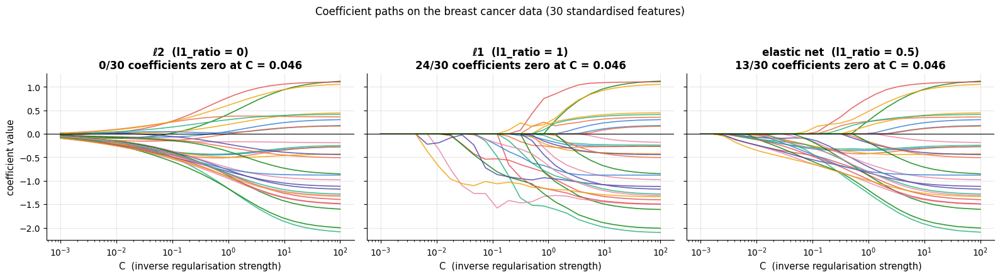

Reading the paths right to left (from weak to strong regularisation): under $`\ell_2`$ every
coefficient decays smoothly and none is ever exactly zero; under $`\ell_1`$ coefficients hit
zero one after another and stay there, so the path doubles as a feature-selection ranking;
elastic net behaves like $`\ell_1`$ but drops correlated features more gently.

### 3.3 Which solver?

The solver only affects *how* the (unique) optimum is reached, not *what* it is — but it
decides which penalties you may use and how long you wait.

| Solver | Penalties | Multi-class | Notes |
|---|---|---|---|
| `lbfgs` (default) | $`\ell_2`$, none | multinomial | quasi-Newton; robust, good default up to ~<span></span>$10^4$ features |
| `newton-cholesky` | $`\ell_2`$, none | multinomial | exact Newton; excellent when $n \gg d$ and $d$ is small |
| `liblinear` | $`\ell_1`$, $`\ell_2`$ | one-vs-rest only | coordinate descent; fast on small, sparse problems |
| `saga` | $`\ell_1`$, $`\ell_2`$, elastic net, none | multinomial | variance-reduced SGD; the only elastic-net option; scales to large $n$ |
| `sag` | $`\ell_2`$, none | multinomial | predecessor of `saga`; needs scaled features |
| `newton-cg` | $`\ell_2`$, none | multinomial | truncated Newton; rarely the best choice today |

A practical rule: **start with `lbfgs`; switch to `saga` when you want $`\ell_1`$ or elastic
net or when $n$ is large; use `liblinear` for small sparse text problems** (notebook 15).
Section 10.5 measures the trade-off.

## 4. More than two classes: softmax and one-vs-rest

### 4.1 The multinomial (softmax) model

With $K$ classes, give each class its own weight vector $`\mathbf{w}_k`$ and bias $`b_k`$, and
normalise the exponentiated scores:

```math
P(y = k \mid \mathbf{x}) \;=\; \frac{\exp(\mathbf{w}_k^\top\mathbf{x} + b_k)}{\sum_{m=1}^K \exp(\mathbf{w}_m^\top\mathbf{x} + b_m)} \;=:\; p_k(\mathbf{x}).
```

This is the **softmax** function; for $K=2$ it reduces to the sigmoid of the *difference*
of the two scores, so the binary model is a special case. The loss is the multi-class
cross-entropy, with $`y_{ik} = 1`$ if sample $i$ belongs to class $k$ and $0$ otherwise:

```math
\mathcal{L}(\mathbf{W}, \mathbf{b}) \;=\; -\frac{1}{n}\sum_{i=1}^n\sum_{k=1}^K y_{ik}\log p_k(\mathbf{x}_i),
\qquad
\nabla_{\mathbf{W}} \mathcal{L} = \frac{1}{n}\,\mathbf{X}^\top(\mathbf{P} - \mathbf{Y}),
```

where $\mathbf{P}, \mathbf{Y} \in \mathbb{R}^{n\times K}$ hold the predicted and one-hot
true probabilities. The gradient has the *same* "design matrix times residual" shape as in
the binary case — one of the reasons this model generalises so cleanly.

The alternative is **one-vs-rest (OvR)**: fit $K$ independent binary classifiers, each
separating one class from all the others, and predict the class with the largest score.
OvR is simpler and embarrassingly parallel, but its $K$ scores are not calibrated against
each other, so the probabilities must be renormalised by hand and regions of the input
space can end up claimed by no classifier or by several.

### 4.2 Softmax regression from scratch, checked against scikit-learn

```python
from sklearn.datasets import load_iris          # 150 iris flowers: 4 measurements each, 3 species

def softmax(Z):
    """Row-wise softmax, shifted for numerical stability.

    Z is an (n, K) array of scores; returns an (n, K) array whose rows are probabilities that sum to 1.
    """
    Z = Z - Z.max(axis=1, keepdims=True)      # subtract each row's max: same softmax, but exp cannot overflow
    E = np.exp(Z)
    return E / E.sum(axis=1, keepdims=True)   # keepdims=True keeps the sums as (n, 1), so they divide row by row

def fit_softmax_gd(X, y, n_classes, lam=0.0, lr=0.5, n_iter=4000):
    """Batch gradient descent for multinomial (softmax) logistic regression.

    X is (n, d), y holds integer labels 0 .. n_classes - 1, lam is the L2 penalty strength and lr the step size.
    Returns W of shape (d, n_classes), b of shape (n_classes,) and the loss after every step.
    """
    n, d = X.shape
    Y = np.eye(n_classes)[y]                                 # one-hot targets: row y_i of the identity, shape (n, K)
    W, b = np.zeros((d, n_classes)), np.zeros(n_classes)
    history = []
    for _ in range(n_iter):
        P = softmax(X @ W + b)                               # (n, K) predicted class probabilities
        R = (P - Y) / n                                      # the residual again
        W -= lr * (X.T @ R + lam * W)
        b -= lr * R.sum(axis=0)
        # loss = mean of -log(probability given to the true class): P[np.arange(n), y] picks P[i, y_i] in every
        # row i, and np.clip(..., 1e-12, None) sets a floor so the log never sees 0; then add the penalty
        history.append(-np.mean(np.log(np.clip(P[np.arange(n), y], 1e-12, None))) + 0.5 * lam * np.sum(W * W))
    return W, b, np.array(history)

iris = load_iris()
X_iris = StandardScaler().fit_transform(iris.data)          # (150, 4) standardised measurements
y_iris = iris.target                                        # species coded 0, 1, 2
lam_iris = 1.0 / (len(y_iris) * 1.0)                         # matches C = 1
W_s, b_s, hist_s = fit_softmax_gd(X_iris, y_iris, 3, lam=lam_iris, lr=0.5, n_iter=8000)
# with three classes LogisticRegression fits the multinomial (softmax) model
sk_soft = LogisticRegression(C=1.0, max_iter=5000, tol=1e-10).fit(X_iris, y_iris)

P_ours = softmax(X_iris @ W_s + b_s)
P_sk = sk_soft.predict_proba(X_iris)                        # (150, 3): one column per class
print(f"max |Δ predicted probability| = {np.abs(P_ours - P_sk).max():.2e}")
print(f"max |Δ coefficient|           = {np.abs(W_s.T - sk_soft.coef_).max():.2e}")   # sklearn's coef_ is (K, d)
# argmax(1): the column (class) with the highest probability in each row | .score(X, y): accuracy
print(f"training accuracy: ours {(P_ours.argmax(1) == y_iris).mean():.4f}, "
      f"scikit-learn {sk_soft.score(X_iris, y_iris):.4f}")
```

```text
max |Δ predicted probability| = 7.72e-08
max |Δ coefficient|           = 2.99e-07
training accuracy: ours 0.9733, scikit-learn 0.9733
```

### 4.3 One-vs-rest versus multinomial

`LogisticRegression` fits the multinomial model for $K \ge 3$ (recent scikit-learn versions
removed the old `multi_class` switch); wrap it in `OneVsRestClassifier` to get the OvR
behaviour. On two iris features the two reach the same training accuracy, but the boundaries
sit at visibly different angles: OvR fits each line against a different "rest" and the three
lines meet wherever they happen to, while the softmax model balances all three scores at
once.

```python
# OneVsRestClassifier(model) fits one copy of a binary classifier per class ("this class against the rest")
from sklearn.multiclass import OneVsRestClassifier

X_iris2 = X_iris[:, [2, 3]]                                   # petal length and width
fig, axes = plt.subplots(1, 2, figsize=(13.5, 4.8))
# C=10.0: a weaker penalty than the default C=1
for ax, (name, model) in zip(axes, [
        ("multinomial (softmax)", LogisticRegression(C=10.0, max_iter=2000)),
        ("one-vs-rest (3 binary fits)", OneVsRestClassifier(LogisticRegression(C=10.0, max_iter=2000)))]):
    model.fit(X_iris2, y_iris)
    plot_decision_boundary(model, X_iris2, y_iris, ax=ax,
                           title=f"{name}\ntraining accuracy {model.score(X_iris2, y_iris):.3f}",
                           feature_names=("petal length (standardised)", "petal width (standardised)"))
plt.tight_layout()
plt.show()
```

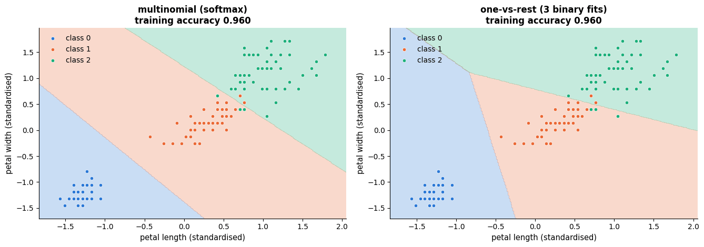

In practice the two rarely differ much in accuracy; the multinomial fit gives coherent
probabilities across classes and is the better default. OvR remains useful when you need
$K$ independent, individually thresholdable scores — for example in multi-label problems.

> **Real-life example.** A news site tags every article with any of 20 topics, and an article
> about a football club's finances is both "sport" and "business". Softmax probabilities add up
> to 1 across the topics and so force a single winner; one binary logistic regression per topic
> (one-vs-rest), each with its own threshold, lets an article carry several tags.

### 4.4 Ten classes: handwritten digits

```python
from sklearn.datasets import load_digits                   # 1797 handwritten digits, 8 x 8 images = 64 pixel features
from sklearn.model_selection import train_test_split       # splits arrays into random train and test parts
# ConfusionMatrixDisplay draws a confusion matrix; classification_report prints precision, recall and F1 per class
from sklearn.metrics import ConfusionMatrixDisplay, classification_report

digits = load_digits()
# hold out 30 % as a test set; stratify=... keeps the class proportions the same in both parts
Xd_tr, Xd_te, yd_tr, yd_te = train_test_split(digits.data, digits.target, test_size=0.3,
                                              stratify=digits.target, random_state=RANDOM_STATE)
digit_clf = make_pipeline(StandardScaler(), LogisticRegression(C=0.1, max_iter=2000,
                                                               random_state=RANDOM_STATE)).fit(Xd_tr, yd_tr)
print(f"test accuracy: {digit_clf.score(Xd_te, yd_te):.3f}")

fig, ax = plt.subplots(figsize=(6.4, 5.6))
# from_estimator predicts on the given data and draws the matrix (rows = true digit, columns = predicted digit);
# values_format="d" prints the counts as whole numbers
ConfusionMatrixDisplay.from_estimator(digit_clf, Xd_te, yd_te, cmap="Blues", colorbar=False,
                                      ax=ax, values_format="d")
ax.set_title("Multinomial logistic regression on digits: where the errors are")
ax.grid(False)
plt.show()
```

```text
test accuracy: 0.970
```

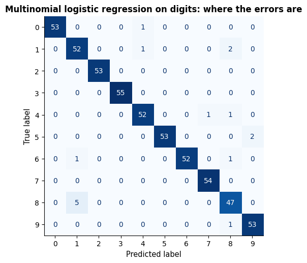

A 64-dimensional linear model classifies handwritten digits with about 97 % accuracy. The
confusion matrix shows that the errors are not spread evenly: they concentrate on the
digit pairs whose pixel patterns overlap — 8 mistaken for 1 most often of all. That
structure is invisible in the accuracy number — which brings us to metrics.

## 5. The confusion matrix and everything built on it

### 5.1 The running example: a churn model

We need a classifier with interesting errors. The bundled `load_churn()` data (5 000
customers, 33 % churn) is **simulated** — the generating process is known, which makes it
an excellent teaching set, but it is not a substitute for a real-data case study; section 11
supplies that with the breast cancer data. The preprocessing follows notebook 4: median
imputation and standardisation for the numeric columns, one-hot encoding for the
categorical ones, all inside a `Pipeline` so that nothing leaks (notebook 5, §7.1).

```python
from sklearn.compose import ColumnTransformer       # applies different preprocessing to different columns
from sklearn.impute import SimpleImputer            # fills in missing values
from sklearn.pipeline import Pipeline               # like make_pipeline, but you name every step yourself
from sklearn.preprocessing import OneHotEncoder     # turns a categorical column into 0/1 indicator columns

churn = load_churn()          # cleaned as in notebook 4; some missing values remain, the imputer below fills them
num_cols = ["tenure_months", "monthly_charges", "total_charges", "support_tickets",
            "senior_citizen", "has_partner", "tech_support", "streaming"]
cat_cols = ["region", "contract", "payment_method", "internet_service"]
X_ch, y_ch = churn[num_cols + cat_cols], churn["churned"].to_numpy()    # features as a DataFrame, labels as a 0/1 array

# ColumnTransformer([(name, transformer, columns), ...]) runs each transformer on its own columns
# and puts the results side by side
preprocess = ColumnTransformer([
    # numeric columns: fill gaps with the column median, then standardise
    ("num", Pipeline([("impute", SimpleImputer(strategy="median")), ("scale", StandardScaler())]), num_cols),
    # drop="first" leaves out each column's first category (implied when all the other indicators are 0);
    # handle_unknown="ignore" encodes a category not seen in training as all zeros instead of raising an error
    ("cat", OneHotEncoder(handle_unknown="ignore", drop="first"), cat_cols),
])
churn_clf = Pipeline([("prep", preprocess),
                      ("lr", LogisticRegression(max_iter=2000, random_state=RANDOM_STATE))])

# 75 % train / 25 % test, with the same churn rate in both parts
X_ch_tr, X_ch_te, y_ch_tr, y_ch_te = train_test_split(X_ch, y_ch, test_size=0.25, stratify=y_ch,
                                                      random_state=RANDOM_STATE)
churn_clf.fit(X_ch_tr, y_ch_tr)                     # fits the preprocessing on the training rows only, then the model
proba_ch = churn_clf.predict_proba(X_ch_te)[:, 1]   # P(churn) for every test customer
print(f"{len(y_ch)} customers, churn rate {y_ch.mean():.1%}")    # :.1% shows a fraction as a percentage
print(f"test accuracy {churn_clf.score(X_ch_te, y_ch_te):.3f}")
```

```text
5000 customers, churn rate 32.6%
test accuracy 0.781
```

### 5.2 The confusion matrix

Every hard prediction falls into one of four boxes. With the **positive class** = "churns"
(scikit-learn always treats the larger label, here `1`, as positive unless told otherwise):

| | predicted 0 | predicted 1 |
|---|---|---|
| **actual 0** | true negative (TN) | false positive (FP) — *type I error* |
| **actual 1** | false negative (FN) — *type II error* | true positive (TP) |

`confusion_matrix` returns exactly this layout, `[[TN, FP], [FN, TP]]`. Everything in this
section is a function of those four numbers, so it is worth staring at the matrix before
computing anything else.

```python
from sklearn.metrics import confusion_matrix

y_pred_ch = churn_clf.predict(X_ch_te)          # hard 0/1 predictions at the default threshold 0.5
cm = confusion_matrix(y_ch_te, y_pred_ch)       # 2 x 2 counts: rows = actual class, columns = predicted class
tn, fp, fn, tp = cm.ravel()                     # ravel reads [[TN, FP], [FN, TP]] row by row

fig, axes = plt.subplots(1, 2, figsize=(13, 4.6))
# ConfusionMatrixDisplay(matrix, display_labels=...) wraps a matrix we already have; .plot(...) draws it
ConfusionMatrixDisplay(cm, display_labels=["stays (0)", "churns (1)"]).plot(
    cmap="Blues", ax=axes[0], colorbar=False, values_format="d")
axes[0].set_title(f"Counts (n = {len(y_ch_te)})")
axes[0].grid(False)
# normalize="true" divides each row by its total, so every row sums to 1
ConfusionMatrixDisplay(confusion_matrix(y_ch_te, y_pred_ch, normalize="true"),
                       display_labels=["stays (0)", "churns (1)"]).plot(
    cmap="Blues", ax=axes[1], colorbar=False, values_format=".2f")
axes[1].set_title("Row-normalised: recall per class")
axes[1].grid(False)
fig.suptitle("The confusion matrix at the default threshold 0.5", y=1.03)
plt.tight_layout()
plt.show()
print(f"TN={tn}  FP={fp}  FN={fn}  TP={tp}")
```

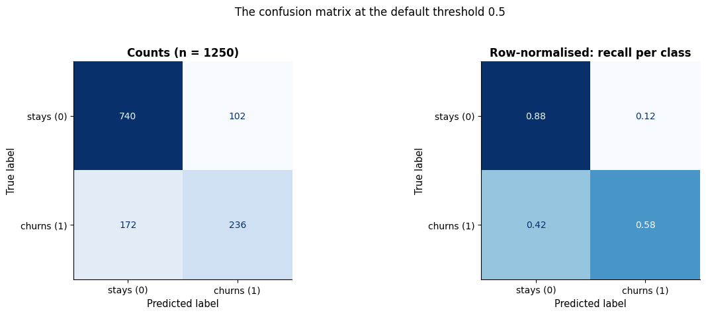

```text
TN=740  FP=102  FN=172  TP=236
```

Normalising by row (`normalize="true"`) gives the **recall of each class** and is usually
the most informative view; normalising by column gives the precision of each class.

### 5.3 Accuracy, and how it lies

```math
\text{accuracy} = \frac{TP + TN}{TP + TN + FP + FN}
```

is the fraction of correct predictions. It is the right metric when the classes are roughly
balanced *and* the two kinds of error cost the same — a combination that is rarer than it
sounds. Make the positive class rare and accuracy becomes uninformative: predicting "never
churns" scores 97 % on a 3 %-churn population while being worth nothing.

```python
from sklearn.base import clone       # clone(estimator): a new, unfitted estimator with the same settings
# DummyClassifier: trivial baselines; strategy="most_frequent" always predicts the majority class
from sklearn.dummy import DummyClassifier
# each metric takes (y_true, y_pred), except roc_auc_score and average_precision_score, which take (y_true, scores)
from sklearn.metrics import (accuracy_score, balanced_accuracy_score, f1_score,
                             matthews_corrcoef, roc_auc_score, average_precision_score)

# build a rare-event version of the churn data: keep all non-churners, 3 % churners
idx_neg = np.flatnonzero(y_ch == 0)             # np.flatnonzero(mask): the positions where mask is True
# n_pos churners drawn without replacement, with n_pos / (n_neg + n_pos) = 0.03, i.e. n_pos = 0.03 / 0.97 * n_neg
idx_pos = rng.choice(np.flatnonzero(y_ch == 1), size=int(0.03 / 0.97 * (y_ch == 0).sum()), replace=False)
idx_rare = np.concatenate([idx_neg, idx_pos])
X_rare, y_rare = X_ch.iloc[idx_rare], y_ch[idx_rare]       # .iloc selects DataFrame rows by position
Xr_tr, Xr_te, yr_tr, yr_te = train_test_split(X_rare, y_rare, test_size=0.3, stratify=y_rare,
                                              random_state=RANDOM_STATE)
print(f"rare-event data: {len(y_rare)} rows, prevalence {y_rare.mean():.1%}")

# clone(preprocess) gives this pipeline its own unfitted copy of the preprocessing: Pipeline.fit fits its steps
# in place, so reusing the preprocess object itself would silently refit churn_clf's preprocessing on this data
models = {"majority-class dummy": DummyClassifier(strategy="most_frequent"),
          "logistic regression": Pipeline([("prep", clone(preprocess)),
                                           ("lr", LogisticRegression(max_iter=2000, random_state=RANDOM_STATE))])}
rows = {}
for name, m in models.items():
    m.fit(Xr_tr, yr_tr)
    pred = m.predict(Xr_te)                     # hard labels, for the threshold-based metrics
    score = m.predict_proba(Xr_te)[:, 1]        # P(class 1), for the ranking metrics (the dummy's is a constant 0)
    # zero_division=0: return 0 instead of a warning when F1 is 0/0
    rows[name] = {"accuracy": accuracy_score(yr_te, pred), "balanced acc.": balanced_accuracy_score(yr_te, pred),
                  "F1": f1_score(yr_te, pred, zero_division=0), "MCC": matthews_corrcoef(yr_te, pred),
                  "ROC-AUC": roc_auc_score(yr_te, score), "avg. precision": average_precision_score(yr_te, score)}
metric_table = pd.DataFrame(rows).T      # a dict of dicts gives one column per model; .T makes it one row per model

fig, ax = plt.subplots(figsize=(9.5, 4.4))
# DataFrame.plot.bar: one group of bars per row (model), one bar per column (metric); rot=0 keeps the labels level
metric_table.plot.bar(ax=ax, rot=0, color=PALETTE[:6], width=0.78)
ax.set_ylabel("score")
ax.set_ylim(0, 1.3)
ax.set_title("At 3 % prevalence, accuracy cannot tell a useful model from a useless one")
ax.legend(ncol=6, fontsize=8.5, loc="upper center")         # ncol=6: all six legend entries in one row
plt.show()
metric_table.round(3)
```

```text
rare-event data: 3472 rows, prevalence 3.0%
```

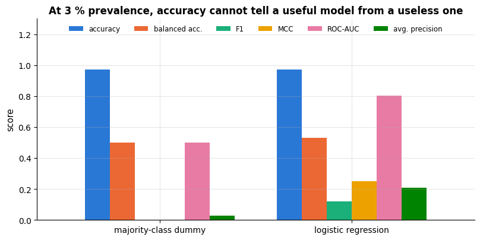

|  | accuracy | balanced acc. | F1 | MCC | ROC-AUC | avg. precision |
|---|---|---|---|---|---|---|
| majority-class dummy | 0.970 | 0.500 | 0.000 | 0.00 | 0.500 | 0.030 |
| logistic regression | 0.972 | 0.532 | 0.121 | 0.25 | 0.801 | 0.209 |

Read that figure carefully, because it contains two lessons rather than one. The dummy
reaches 97 % accuracy while scoring chance level on every prevalence-aware metric
(balanced accuracy 0.50, ROC-AUC 0.50, average precision = the prevalence, $`F_1`$ = MCC = 0).
And the *logistic regression* scores essentially the same accuracy — yet it is a genuinely
useful model, with an ROC-AUC around 0.80 and an average precision several times the
prevalence. Accuracy cannot separate the two; the ranking metrics can. Its default
threshold is the problem, not its scores — section 6 fixes that. **Never report accuracy
alone on imbalanced data.**

### 5.4 Precision, recall, $`F_1`$ and $`F_\beta`$

Two conditional probabilities carry most of the information:

```math
\text{precision} = \frac{TP}{TP + FP} = P(y = 1 \mid \hat{y} = 1),
\qquad
\text{recall} = \frac{TP}{TP + FN} = P(\hat{y} = 1 \mid y = 1).
```

Precision answers *"when the model raises the alarm, how often is it right?"*; recall (also
**sensitivity** or the **true positive rate**) answers *"of all the real positives, how many
did we catch?"*. They trade off: lowering the threshold raises recall and lowers precision.
Their harmonic mean is the $`F_1`$ score, and $`F_\beta`$ tilts the balance,

```math
F_\beta = (1+\beta^2)\,\frac{\text{precision}\cdot\text{recall}}{\beta^2\,\text{precision} + \text{recall}},
```

with $`\beta > 1`$ weighting recall more ($\beta = 2$ is common in medical screening) and
$`\beta < 1`$ weighting precision more. The harmonic mean is used because it is dominated by
the *smaller* of the two: a model with precision 1.0 and recall 0.01 has $`F_1 \approx 0.02`$,
not 0.5. Two more rates complete the picture:

```math
\text{specificity} = \frac{TN}{TN+FP} = 1 - \text{FPR}, \qquad
\text{NPV} = \frac{TN}{TN+FN}.
```

> **Real-life examples.**
> - *Precision first.* A spam filter: when it moves an e-mail to the spam folder it had better
>   be right, because one job offer lost there hurts more than ten spam mails in the inbox.
> - *Recall first.* Airport baggage screening: of all the bags that really contain a weapon, as
>   many as possible must be caught, and the price is many harmless bags opened by hand (low
>   precision).

Let us compute them all by hand from the four counts and check against scikit-learn.

```python
from sklearn.metrics import precision_score, recall_score, fbeta_score

# the formulas of section 5.4, straight from the four counts
precision_manual = tp / (tp + fp)
recall_manual = tp / (tp + fn)
specificity_manual = tn / (tn + fp)
f1_manual = 2 * precision_manual * recall_manual / (precision_manual + recall_manual)
# F2 is F_beta with beta = 2, so 1 + beta^2 = 5 and beta^2 = 4
f2_manual = 5 * precision_manual * recall_manual / (4 * precision_manual + recall_manual)

print(f"{'metric':14s} {'by hand':>9s} {'sklearn':>9s}")     # :14s pads to 14 characters, :>9s right-aligns in 9
for name, mine, theirs in [
        ("precision", precision_manual, precision_score(y_ch_te, y_pred_ch)),
        ("recall", recall_manual, recall_score(y_ch_te, y_pred_ch)),
        # specificity is the recall of class 0: pos_label=0 makes class 0 the "positive" class
        ("specificity", specificity_manual, recall_score(y_ch_te, y_pred_ch, pos_label=0)),
        ("F1", f1_manual, f1_score(y_ch_te, y_pred_ch)),
        ("F2", f2_manual, fbeta_score(y_ch_te, y_pred_ch, beta=2))]:
    print(f"{name:14s} {mine:9.4f} {theirs:9.4f}")
```

```text
metric           by hand   sklearn
precision         0.6982    0.6982
recall            0.5784    0.5784
specificity       0.8789    0.8789
F1                0.6327    0.6327
F2                0.5990    0.5990
```

> **Warning.** Precision and recall are defined *with respect to a chosen positive class*.
> `pos_label` decides which one; swapping it turns recall into specificity. In an imbalanced
> problem the interesting class is usually the rare one, and it is usually *not* the one
> scikit-learn picks by default — relabel your target so that $1$ means "the event", as we
> do in section 11.

### 5.5 Balanced accuracy, MCC, Cohen's $\kappa$ and the likelihood ratios

Four more numbers worth knowing, each fixing a specific weakness of the ones above:

| Metric | Definition | What it adds |
|---|---|---|
| **Balanced accuracy** | $\tfrac12(\text{recall} + \text{specificity})$ | accuracy that ignores prevalence; chance level is always 0.5 |
| **MCC** (Matthews) | $\dfrac{TP\cdot TN - FP\cdot FN}{\sqrt{(TP{+}FP)(TP{+}FN)(TN{+}FP)(TN{+}FN)}}$ | the correlation between truth and prediction; $`\in[-1,1]`$, and the only common metric that uses all four cells symmetrically |
| **Cohen's $\kappa$<span></span>** | $`\dfrac{p_o - p_e}{1 - p_e}`$ | agreement corrected for the agreement expected by chance |
| **Likelihood ratios** | $LR^+ = \dfrac{\text{recall}}{1-\text{specificity}}$, $LR^- = \dfrac{1-\text{recall}}{\text{specificity}}$ | prevalence-free; multiply the *pre-test odds* to get the post-test odds — the standard currency in diagnostics |

MCC is the metric to reach for when you want a *single* honest number on an imbalanced
binary problem (Chicco & Jurman, 2020): unlike $`F_1`$ it cannot be inflated by ignoring the
negative class.

> **Real-life examples.**
> - *Cohen's κ.* Two content moderators label the same 1 000 posts as acceptable or harmful and
>   agree on 90 % of them. If each calls 85 % of all posts acceptable, they would agree on about
>   75 % by pure chance, so κ is only about 0.6.
> - *Likelihood ratios.* A rapid test with LR+ = 10 is used on a patient whose symptoms give a
>   10 % pre-test probability (odds 1 to 9). A positive result multiplies the odds by 10, to 10
>   to 9: a post-test probability of about 53 % — far more likely, but not yet certain.

```python
# cohen_kappa_score: agreement corrected for chance | class_likelihood_ratios: returns the pair (LR+, LR-)
from sklearn.metrics import cohen_kappa_score, class_likelihood_ratios

# MCC from the table in section 5.5; float() turns the product of the four counts into a Python float
mcc_manual = (tp * tn - fp * fn) / np.sqrt(float((tp + fp) * (tp + fn) * (tn + fp) * (tn + fn)))
p_o = (tp + tn) / cm.sum()                     # observed agreement (the accuracy)
# agreement expected by chance: (rate of predicted 1s x rate of actual 1s) + (the same for 0s)
p_e = ((tp + fp) * (tp + fn) + (tn + fn) * (tn + fp)) / cm.sum() ** 2
kappa_manual = (p_o - p_e) / (1 - p_e)
lr_pos, lr_neg = class_likelihood_ratios(y_ch_te, y_pred_ch)
# balanced accuracy by hand: the mean of recall and specificity
print(f"balanced accuracy {balanced_accuracy_score(y_ch_te, y_pred_ch):.4f}"
      f"   (by hand {0.5 * (recall_manual + specificity_manual):.4f})")
print(f"MCC               {matthews_corrcoef(y_ch_te, y_pred_ch):.4f}   (by hand {mcc_manual:.4f})")
print(f"Cohen's kappa     {cohen_kappa_score(y_ch_te, y_pred_ch):.4f}   (by hand {kappa_manual:.4f})")
print(f"likelihood ratios LR+ = {lr_pos:.2f}, LR- = {lr_neg:.2f}")
```

```text
balanced accuracy 0.7286   (by hand 0.7286)
MCC               0.4828   (by hand 0.4828)
Cohen's kappa     0.4784   (by hand 0.4784)
likelihood ratios LR+ = 4.77, LR- = 0.48
```

### 5.6 Multi-class: micro, macro and weighted averaging

With $K$ classes every metric is computed per class (one-vs-rest) and then averaged. The
averaging scheme is a *choice about what you care about*:

- **micro** — pool all $TP$, $FP$, $FN$ across classes, then compute the metric. Every
  *sample* counts equally, so micro-<span></span>$`F_1`$ equals accuracy for single-label problems.
- **macro** — compute the metric per class and take the unweighted mean. Every *class*
  counts equally, so rare classes matter as much as frequent ones.
- **weighted** — like macro but weighting each class by its support. A compromise that is
  easy to misread.

> **Real-life example.** A customer-service team routes incoming tickets into three queues: 90 %
> billing, 9 % technical and 1 % legal complaints. Micro-F1 is dominated by the billing tickets
> and can look excellent even if every legal complaint lands in the wrong queue; macro-F1 gives
> the legal queue a third of the weight and drops sharply when it fails.

```python
from sklearn.metrics import f1_score as f1         # the same f1_score, imported under a shorter name

yd_pred = digit_clf.predict(Xd_te)
# average= decides how the ten per-class F1 scores are combined (section 5.6)
print(f"digits: micro-F1 {f1(yd_te, yd_pred, average='micro'):.4f}  "
      f"macro-F1 {f1(yd_te, yd_pred, average='macro'):.4f}  "
      f"weighted-F1 {f1(yd_te, yd_pred, average='weighted'):.4f}  "
      f"accuracy {accuracy_score(yd_te, yd_pred):.4f}")
print(classification_report(yd_te, yd_pred, digits=3))     # digits=3: three decimals
```

```text
digits: micro-F1 0.9704  macro-F1 0.9704  weighted-F1 0.9705  accuracy 0.9704
              precision    recall  f1-score   support

           0      1.000     0.981     0.991        54
           1      0.897     0.945     0.920        55
           2      1.000     1.000     1.000        53
           3      1.000     1.000     1.000        55
           4      0.963     0.963     0.963        54
           5      1.000     0.964     0.981        55
           6      1.000     0.963     0.981        54
           7      0.982     1.000     0.991        54
           8      0.904     0.904     0.904        52
           9      0.964     0.981     0.972        54

    accuracy                          0.970       540
   macro avg      0.971     0.970     0.970       540
weighted avg      0.971     0.970     0.971       540
```

`classification_report` prints per-class precision/recall/<span></span>$`F_1`$ with support and all three
averages: it should be the first thing you look at after fitting any classifier.

> **Key idea.** Choose the metric *before* you look at the results, from the decision the
> model will support. "Which errors cost more, and to whom?" is a question about the world,
> not about the data — and section 6.5 turns the answer into a threshold.

## 6. Thresholds, ROC curves and precision–recall curves

### 6.1 The threshold is a business decision

`predict()` applies $`\hat{y} = \mathbb{1}[\hat{p} \ge 0.5]`$. That default is only optimal
when false positives and false negatives cost the same *and* the probabilities are
calibrated. Change either assumption and the optimal threshold moves. Because the threshold
is applied *after* the model is fitted, it can be chosen (and re-chosen) without retraining
— it is a property of the *decision rule*, not of the model.

Sweeping the threshold from 1 to 0 traces out every achievable (FPR, TPR) pair — the ROC
curve — and every achievable (recall, precision) pair — the PR curve.

```python
# roc_curve and precision_recall_curve (used in the next cells) compute a curve's points for every threshold
from sklearn.metrics import precision_recall_curve, roc_curve

thresholds = np.linspace(0.02, 0.98, 97)        # 0.02, 0.03, ..., 0.98
prec_t, rec_t, f1_t, acc_t = [], [], [], []
for t in thresholds:
    pred_t = (proba_ch >= t).astype(int)        # hard labels at threshold t (True/False -> 1/0)
    prec_t.append(precision_score(y_ch_te, pred_t, zero_division=0))  # 0, not a warning, if nothing is predicted 1
    rec_t.append(recall_score(y_ch_te, pred_t))
    f1_t.append(f1_score(y_ch_te, pred_t, zero_division=0))
    acc_t.append(accuracy_score(y_ch_te, pred_t))

fig, ax = plt.subplots(figsize=(8.5, 4.6))
for values, name in [(prec_t, "precision"), (rec_t, "recall"), (f1_t, "$F_1$"), (acc_t, "accuracy")]:
    ax.plot(thresholds, values, lw=2, label=name)
best_f1_t = thresholds[int(np.argmax(f1_t))]    # the threshold with the highest F1
ax.axvline(0.5, color="gray", ls=":", lw=1.2)
ax.text(0.505, 0.03, "default 0.5", color="gray", fontsize=9)
ax.axvline(best_f1_t, color=PALETTE[2], ls="--", lw=1.2)
ax.text(best_f1_t + 0.005, 0.93, f"best $F_1$ at {best_f1_t:.2f}", color=PALETTE[2], fontsize=9)
ax.set_xlabel("decision threshold on P(churn)")
ax.set_ylabel("score")
ax.set_title("Every metric is a function of the threshold — 0.5 is just one column of this plot")
ax.legend(ncol=4, fontsize=9)
plt.show()
```

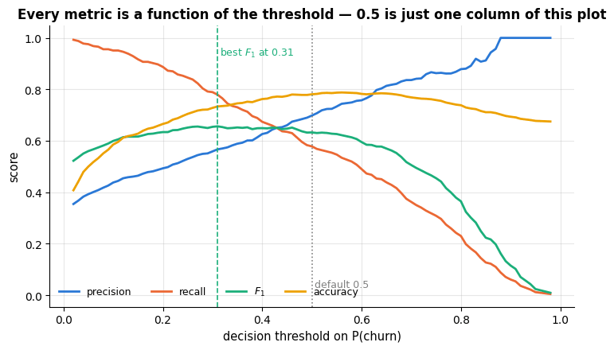

### 6.2 ROC and precision–recall curves side by side

The **ROC curve** plots the true positive rate (recall) against the false positive rate
$FPR = FP/(FP+TN) = 1 - \text{specificity}$ as the threshold varies. The diagonal is random
guessing; the top-left corner is perfection. Its summary, **ROC-AUC**, is the area
underneath (Fawcett, 2006).

The **precision–recall curve** plots precision against recall. Its baseline is *not* a
diagonal but the horizontal line at the prevalence $\pi = P(y=1)$, and its summary is
**average precision** $`AP = \sum_k (R_k - R_{k-1})P_k`$ — a threshold-free average of the
precision achieved at each recall level.

```python
from sklearn.metrics import PrecisionRecallDisplay, RocCurveDisplay

fig, axes = plt.subplots(1, 2, figsize=(13, 4.8))
# from_predictions(y_true, scores, ...) computes the curve and draws it; curve_kwargs styles the line
RocCurveDisplay.from_predictions(y_ch_te, proba_ch, ax=axes[0], name="logistic regression",
                                 curve_kwargs={"color": PALETTE[0]})
axes[0].plot([0, 1], [0, 1], "k--", lw=1, label="chance")       # "k--": a black dashed line
fpr, tpr, thr = roc_curve(y_ch_te, proba_ch)        # one (FPR, TPR) point per threshold; thr is decreasing
i50 = int(np.argmin(np.abs(thr - 0.5)))             # the index of the threshold closest to 0.5
axes[0].plot(fpr[i50], tpr[i50], "o", ms=10, color=PALETTE[1], label="operating point at t = 0.5")
axes[0].set_title(f"ROC curve — AUC = {roc_auc_score(y_ch_te, proba_ch):.3f}")
axes[0].legend(loc="lower right", fontsize=9)

PrecisionRecallDisplay.from_predictions(y_ch_te, proba_ch, ax=axes[1], color=PALETTE[0], name="logistic regression")
axes[1].axhline(y_ch_te.mean(), color="black", ls="--", lw=1, label=f"chance = prevalence {y_ch_te.mean():.2f}")
# returns precision and recall (each one element longer than the increasing thresholds thr_pr);
# p_c[j] and r_c[j] belong to the threshold thr_pr[j]
p_c, r_c, thr_pr = precision_recall_curve(y_ch_te, proba_ch)
j50 = int(np.argmin(np.abs(thr_pr - 0.5)))
axes[1].plot(r_c[j50], p_c[j50], "o", ms=10, color=PALETTE[1], label="operating point at t = 0.5")
axes[1].set_title(f"Precision–recall curve — AP = {average_precision_score(y_ch_te, proba_ch):.3f}")
axes[1].legend(loc="lower left", fontsize=9)
fig.suptitle("The same model, two views: each point is one threshold", y=1.03)
plt.tight_layout()
plt.show()
```

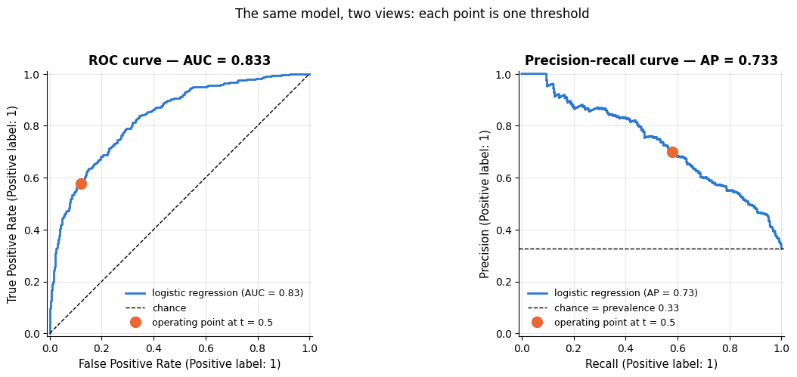

### 6.3 What AUC actually measures

ROC-AUC has an interpretation that makes it easy to reason about and impossible to
misunderstand:

```math
\text{AUC} \;=\; P\big(\hat{s}(\mathbf{x}^+) > \hat{s}(\mathbf{x}^-)\big) + \tfrac12 P\big(\hat{s}(\mathbf{x}^+) = \hat{s}(\mathbf{x}^-)\big),
```

for a randomly drawn positive $\mathbf{x}^+$ and negative $\mathbf{x}^-$. It is a measure of
**ranking quality** and nothing else: AUC is invariant to any monotone transformation of the
scores, so it says nothing about whether the probabilities are calibrated. It equals the
normalised Mann–Whitney $U$ statistic — which we can verify by brute force over all
positive–negative pairs.

```python
pos_scores = proba_ch[y_ch_te == 1]                    # scores of the customers who actually churned
neg_scores = proba_ch[y_ch_te == 0]                    # scores of those who stayed
comparisons = pos_scores[:, None] - neg_scores[None, :]     # (n_pos, n_neg) array of score differences
# the fraction of pairs in which the positive scores higher, with ties counting one half
auc_by_hand = (comparisons > 0).mean() + 0.5 * (comparisons == 0).mean()
print(f"pairs compared: {comparisons.size:,}")         # :, adds thousands separators
print(f"AUC by counting pairs : {auc_by_hand:.10f}")
print(f"roc_auc_score         : {roc_auc_score(y_ch_te, proba_ch):.10f}")
```

```text
pairs compared: 343,536
AUC by counting pairs : 0.8329723814
roc_auc_score         : 0.8329723814
```

> **Warning.** A high AUC does **not** mean the model is usable. AUC averages over *all*
> thresholds, including ones no-one would ever deploy, and it is insensitive to prevalence.
> Always report AUC together with the metric at the operating point you will actually use.

### 6.4 Why precision–recall is the better view under imbalance

Because FPR has $TN$ in its denominator, and $TN$ is huge when negatives dominate, the ROC
curve is almost unchanged when the positive class becomes rare. Precision, whose
denominator $TP + FP$ has no $TN$ in it, collapses. Davis & Goadrich (2006) and Saito &
Rehmsmeier (2015) make the argument formally; let us make it visually by subsampling the
positives of our test set to three different prevalences.

```python
def subsample_to_prevalence(scores, labels, prevalence, rng=rng):
    """Keep all negatives and as many random positives as the target prevalence allows.

    Returns the (scores, labels) of the subsample, whose share of positives is `prevalence`
    (or lower, if there are not enough positives to reach it).
    """
    neg = np.flatnonzero(labels == 0)
    n_pos = int(round(prevalence / (1 - prevalence) * len(neg)))    # solves n_pos / (n_neg + n_pos) = prevalence
    # min(...): we cannot keep more positives than there are
    pos = rng.choice(np.flatnonzero(labels == 1), size=min(n_pos, int((labels == 1).sum())), replace=False)
    keep = np.concatenate([neg, pos])
    return scores[keep], labels[keep]

fig, axes = plt.subplots(1, 2, figsize=(13, 4.8))
for prevalence, colour in zip([0.33, 0.10, 0.02], [PALETTE[0], PALETTE[1], PALETTE[4]]):
    s_sub, y_sub = subsample_to_prevalence(proba_ch, y_ch_te, prevalence)
    fpr_s, tpr_s, _ = roc_curve(y_sub, s_sub)                  # _ discards the thresholds
    prec_s, rec_s, _ = precision_recall_curve(y_sub, s_sub)
    axes[0].plot(fpr_s, tpr_s, lw=2, color=colour,
                 label=f"prevalence {y_sub.mean():.0%} — AUC {roc_auc_score(y_sub, s_sub):.3f}")
    axes[1].plot(rec_s, prec_s, lw=2, color=colour,
                 label=f"prevalence {y_sub.mean():.0%} — AP {average_precision_score(y_sub, s_sub):.3f}")
    axes[1].axhline(y_sub.mean(), color=colour, ls=":", lw=1)  # the chance level of a PR curve is the prevalence
axes[0].plot([0, 1], [0, 1], "k--", lw=1)
axes[0].set_xlabel("false positive rate")
axes[0].set_ylabel("true positive rate (recall)")
axes[0].set_title("ROC barely notices the prevalence change")
axes[0].legend(loc="lower right", fontsize=9)
axes[1].set_xlabel("recall")
axes[1].set_ylabel("precision")
axes[1].set_title("Precision–recall tracks it exactly")
axes[1].legend(loc="upper right", fontsize=9)
fig.suptitle("Same scores, same ranking — three prevalences", y=1.03)
plt.tight_layout()
plt.show()
```

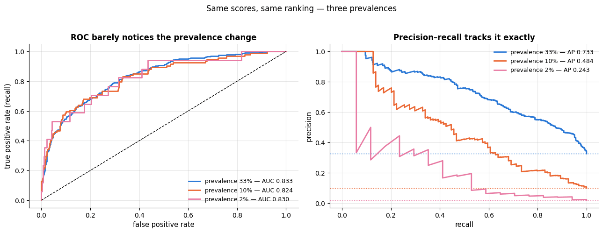

The three ROC curves lie almost on top of each other while the PR curves fall apart. If your
positives are rare and you care about the workload created by false alarms, report AP.

> **Real-life example.** A card issuer sees one fraudulent payment in 1 000. A model that catches
> every fraud at a false positive rate of 1 % looks superb on the ROC curve, yet it flags about
> ten genuine payments for each real fraud: a precision of about 9 %, and ten customers called
> for nothing per fraud caught. The PR curve shows that workload; the ROC curve hides it.

### 6.5 Choosing the threshold from a cost matrix

Suppose keeping a churning customer earns $`c_{FN} = 300`$ (the margin lost if we miss them)
and a retention offer to someone who would have stayed costs $`c_{FP} = 40`$. The expected
cost per customer at threshold $t$ is

```math
\text{cost}(t) \;=\; \frac{c_{FN}\,FN(t) + c_{FP}\,FP(t)}{n},
```

and the optimum for a *calibrated* model is at $`t^\star = c_{FP}/(c_{FP} + c_{FN})`$ — here
$40/340 \approx 0.12$, far from 0.5. (Derivation: act positively when the expected cost of
not acting, $`c_{FN}\,p`$, exceeds that of acting, $`c_{FP}(1-p)`$.) Rather than trusting the
formula, tune the threshold on **cross-validated** predictions with
`TunedThresholdClassifierCV`, which is the scikit-learn ≥ 1.5 tool for exactly this job and
avoids the optimism of tuning on the test set.

```python
from sklearn.metrics import make_scorer      # wraps a metric function as a scorer object that CV tools can call
# TunedThresholdClassifierCV picks the decision threshold that gives the best cross-validated score
from sklearn.model_selection import TunedThresholdClassifierCV

COST_FN, COST_FP = 300.0, 40.0          # cost of a missed churner, cost of an unnecessary retention offer

def expected_cost(y_true, y_pred):
    """Average cost per customer (lower is better).

    y_true and y_pred are 0/1 arrays; every false negative costs COST_FN and every false positive COST_FP.
    """
    # labels=[0, 1] guarantees a 2 x 2 matrix even when one class is missing from y_true and y_pred
    tn_, fp_, fn_, tp_ = confusion_matrix(y_true, y_pred, labels=[0, 1]).ravel()
    return (COST_FN * fn_ + COST_FP * fp_) / len(y_true)

# greater_is_better=False: scikit-learn always maximises, so the scorer returns minus the cost;
# response_method="predict": the metric receives hard 0/1 predictions
cost_scorer = make_scorer(expected_cost, greater_is_better=False, response_method="predict")
# cv=5: 5-fold cross-validation on the training data; thresholds=80: 80 evenly spaced candidates between the lowest
# and highest predicted probability; store_cv_results=True keeps the whole cost curve in cv_results_
# (random_state only matters when cv is a float, i.e. a single random validation split)
tuned = TunedThresholdClassifierCV(churn_clf, scoring=cost_scorer, cv=5, thresholds=80,
                                   store_cv_results=True, random_state=RANDOM_STATE).fit(X_ch_tr, y_ch_tr)

# the test-set cost at each threshold of the grid from section 6.1
cost_te = [expected_cost(y_ch_te, (proba_ch >= t).astype(int)) for t in thresholds]
fig, ax = plt.subplots(figsize=(8.5, 4.6))
# cv_results_["scores"] holds minus the cost (greater_is_better=False above), so we negate it back
ax.plot(tuned.cv_results_["thresholds"], -tuned.cv_results_["scores"], lw=2, color=PALETTE[0],
        label="cross-validated cost (training data)")
ax.plot(thresholds, cost_te, lw=2, ls="--", color=PALETTE[1], label="cost on the held-out test set")
ax.axvline(0.5, color="gray", ls=":", lw=1.2)
ax.axvline(tuned.best_threshold_, color=PALETTE[2], lw=1.6)              # best_threshold_: the threshold CV chose
ax.axvline(COST_FP / (COST_FP + COST_FN), color="black", ls="-.", lw=1.2)  # the theoretical optimum
ax.annotate(f"chosen by CV: {tuned.best_threshold_:.2f}", xy=(tuned.best_threshold_, np.min(cost_te)),
            xytext=(0.32, np.max(cost_te) * 0.75), fontsize=9,
            arrowprops=dict(arrowstyle="->", color=PALETTE[2]))
ax.text(COST_FP / (COST_FP + COST_FN) + 0.01, np.max(cost_te) * 0.45,
        "theory: $c_{FP}/(c_{FP}+c_{FN})$", fontsize=9)
ax.set_xlabel("decision threshold")
ax.set_ylabel("expected cost per customer (€)")
ax.set_title("Cost curve: the default threshold is an expensive habit")
ax.legend(fontsize=9)
plt.show()
print(f"cost at t = 0.50 : €{expected_cost(y_ch_te, churn_clf.predict(X_ch_te)):.2f} per customer")
# tuned.predict applies the chosen threshold to the model refitted on the whole training set
print(f"cost at t = {tuned.best_threshold_:.2f} : €{expected_cost(y_ch_te, tuned.predict(X_ch_te)):.2f} per customer")
```

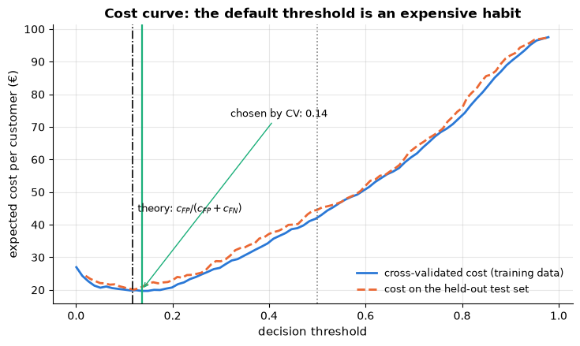

```text
cost at t = 0.50 : €44.54 per customer
cost at t = 0.14 : €20.75 per customer
```

Tuning the threshold — a single number, chosen after fitting, at zero modelling cost —
more than halves the expected cost. In most applied projects this is a far larger win than
switching model families.

> **Note.** `FixedThresholdClassifier(model, threshold=t)` wraps a fitted model so that
> `predict` uses your threshold, which keeps the rest of the pipeline (and every
> scikit-learn scorer) unaware that anything changed.

## 7. Probability calibration

### 7.1 Reliability diagrams, log loss and the Brier score

A model is **calibrated** if among the cases it gives probability $0.7$, about 70 % really
are positive. Calibration is what makes a probability usable in the expected-cost
calculation above; ranking metrics such as AUC are blind to it. The diagnostic is the
**reliability diagram**: bin the predictions by predicted probability and plot the observed
frequency against the mean prediction in each bin. Perfect calibration is the diagonal.

> **Real-life example.** A weather service is calibrated if, on all the days for which it
> forecast a 70 % chance of rain, it rained on about 70 % of them. Only then can an open-air
> festival weigh the forecast against the cost of renting tents. The Brier score below was
> invented for exactly this check of weather forecasts (Brier, 1950).

Two proper scoring rules summarise it in a number:

```math
\text{log loss} = -\frac{1}{n}\sum_i \big[y_i\log p_i + (1-y_i)\log(1-p_i)\big],
\qquad
\text{Brier} = \frac{1}{n}\sum_i (p_i - y_i)^2 .
```

Both are minimised only by the true probabilities ("proper"), and both mix *discrimination*
(is the ranking good?) with *calibration* (are the levels right?). The Brier score is bounded
in $`[0,1]`$ and forgiving of confident mistakes; log loss is unbounded and punishes them
brutally. Murphy's decomposition splits the Brier score into
$\text{reliability} - \text{resolution} + \text{uncertainty}$, where the first term is
exactly what the reliability diagram draws.

```python
# CalibrationDisplay draws a reliability diagram: observed frequency against mean predicted probability, per bin
from sklearn.calibration import CalibrationDisplay
from sklearn.metrics import brier_score_loss, log_loss      # the two proper scoring rules of this section
from sklearn.naive_bayes import GaussianNB                  # Gaussian naive Bayes (notebook 8), for comparison

# the same preprocessing as churn_clf, as this pipeline's own unfitted copy (clone, see section 5.3)
nb_pipe = Pipeline([("prep", clone(preprocess)), ("nb", GaussianNB())]).fit(X_ch_tr, y_ch_tr)
proba_nb = nb_pipe.predict_proba(X_ch_te)[:, 1]

fig, axes = plt.subplots(1, 2, figsize=(13, 4.8), gridspec_kw={"height_ratios": [1]})
for name, p_hat, colour, marker in [("logistic regression", proba_ch, PALETTE[0], "o"),
                                    ("Gaussian naive Bayes", proba_nb, PALETTE[1], "s")]:
    # n_bins=10 equal-width bins on [0, 1]; one point per non-empty bin
    CalibrationDisplay.from_predictions(y_ch_te, p_hat, n_bins=10, ax=axes[0], name=name,
                                        color=colour, marker=marker)
    axes[1].hist(p_hat, bins=25, alpha=0.55, color=colour, label=name)     # how the predicted probabilities are spread
axes[0].set_title("Reliability diagram (10 equal-width bins)")
axes[0].legend(loc="upper left", fontsize=9)
axes[1].set_xlabel("predicted P(churn)")
axes[1].set_ylabel("number of customers")
axes[1].set_title("Naive Bayes pushes its probabilities to the extremes")
axes[1].legend(fontsize=9)
plt.tight_layout()
plt.show()

for name, p_hat in [("logistic regression", proba_ch), ("Gaussian naive Bayes", proba_nb)]:
    print(f"{name:22s} log loss {log_loss(y_ch_te, p_hat):.4f}   Brier {brier_score_loss(y_ch_te, p_hat):.4f}   "
          f"ROC-AUC {roc_auc_score(y_ch_te, p_hat):.4f}")
```

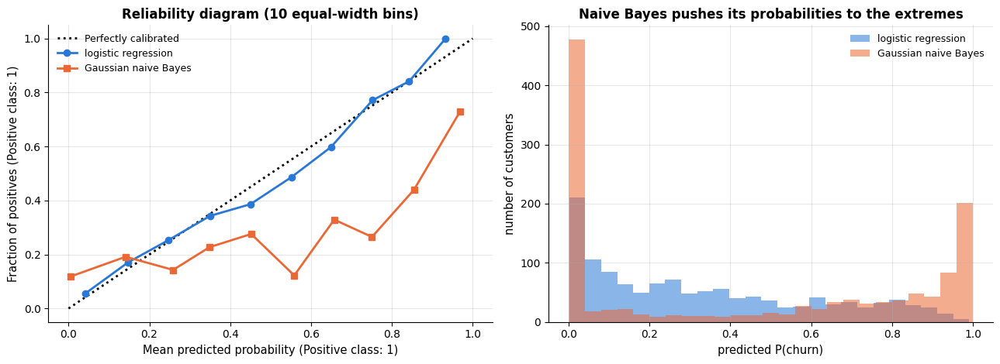

```text
logistic regression    log loss 0.4606   Brier 0.1500   ROC-AUC 0.8330
Gaussian naive Bayes   log loss 0.9303   Brier 0.2217   ROC-AUC 0.8139
```

Note the pattern: naive Bayes can have a respectable AUC (its *ranking* is fine) and a
terrible Brier score (its *levels* are not). That is the separation of discrimination from
calibration in one table. Notebook 8, §4.5 explains why the independence assumption causes
it.

> **Key idea.** Logistic regression fitted by maximum likelihood is calibrated *by
> construction* on the training distribution: the gradient condition
> $\mathbf{X}^\top(\mathbf{p}-\mathbf{y}) = \mathbf{0}$ says the predicted and observed
> counts match in every feature direction (with an intercept, the totals match exactly).
> This is a real and often overlooked advantage over margin-based and generative
> classifiers.

### 7.2 Repairing calibration: Platt scaling and isotonic regression

`CalibratedClassifierCV` fits a one-dimensional map from raw scores to calibrated
probabilities on held-out folds:

- **`method="sigmoid"`** — Platt scaling (Platt, 1999): fit $\sigma(as + b)$ by maximum
  likelihood. Two parameters, so it works with a few hundred samples, but it can only
  correct sigmoid-shaped distortion.
- **`method="isotonic"`** — fit a non-decreasing step function (pool-adjacent-violators).
  Non-parametric and far more flexible, but it needs roughly $\ge 1000$ calibration samples
  and can overfit below that.

```python
# CalibratedClassifierCV(model, method=..., cv=5): on each of 5 folds, fits the model on the other 4 and the
# calibration map on the held-out fold; predict_proba averages the five calibrated models
from sklearn.calibration import CalibratedClassifierCV

fig, ax = plt.subplots(figsize=(7.2, 5.4))
CalibrationDisplay.from_predictions(y_ch_te, proba_nb, n_bins=10, ax=ax,
                                    name="naive Bayes (uncalibrated)", color=PALETTE[1], marker="s")
# one dict per model; the list becomes the table at the end of the cell
calibration_rows = [{"model": "naive Bayes (uncalibrated)", "log loss": log_loss(y_ch_te, proba_nb),
                     "Brier": brier_score_loss(y_ch_te, proba_nb), "ROC-AUC": roc_auc_score(y_ch_te, proba_nb)}]
for method, colour in [("sigmoid", PALETTE[2]), ("isotonic", PALETTE[4])]:      # "sigmoid" is Platt scaling
    # clone(preprocess): an unfitted copy, as in section 5.3 (CalibratedClassifierCV would clone it anyway)
    cal = CalibratedClassifierCV(Pipeline([("prep", clone(preprocess)), ("nb", GaussianNB())]),
                                 method=method, cv=5).fit(X_ch_tr, y_ch_tr)
    p_cal = cal.predict_proba(X_ch_te)[:, 1]
    CalibrationDisplay.from_predictions(y_ch_te, p_cal, n_bins=10, ax=ax, name=f"calibrated ({method})",
                                        color=colour, marker="o")
    calibration_rows.append({"model": f"naive Bayes + {method}", "log loss": log_loss(y_ch_te, p_cal),
                             "Brier": brier_score_loss(y_ch_te, p_cal), "ROC-AUC": roc_auc_score(y_ch_te, p_cal)})
ax.set_title("Calibration repairs the levels without touching the ranking")
ax.legend(loc="upper left", fontsize=9)
plt.show()
pd.DataFrame(calibration_rows).set_index("model").round(4)      # set_index: use the "model" column as row labels
```

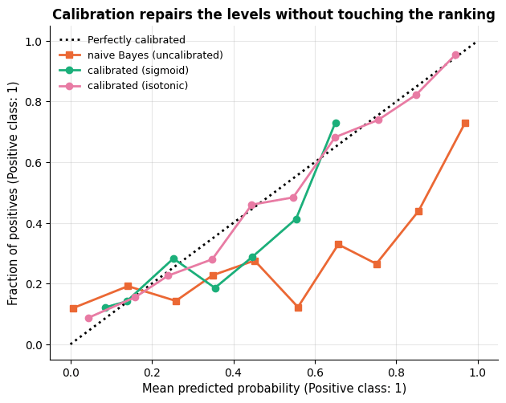

| model | log loss | Brier | ROC-AUC |
|---|---|---|---|
| naive Bayes (uncalibrated) | 0.9303 | 0.2217 | 0.8139 |
| naive Bayes + sigmoid | 0.5094 | 0.1660 | 0.8143 |
| naive Bayes + isotonic | 0.4747 | 0.1538 | 0.8139 |

The AUC barely moves (both maps are monotone, so the ranking is preserved) while log loss
and the Brier score improve substantially. Calibrate whenever a downstream decision uses the
probability as a number rather than as a rank.

> **Real-life example.** A parcel service adds up the predicted probabilities that each of
> tomorrow's 2 000 deliveries will need a second attempt, to decide how many drivers to
> schedule. If the model says 20 % where the true rate is 10 %, the plan has 400 repeat visits
> instead of about 200 — even if the model ranks the parcels perfectly.

## 8. Class imbalance

Three tools, in increasing order of how much they disturb the model:

1. **Move the threshold** (section 6.5). Cheapest, most transparent, and usually enough.
   Nothing about the fitted model changes.
2. **Re-weight the classes**: `class_weight="balanced"` multiplies each class's loss
   contribution by $`n/(K\,n_k)`$, which is equivalent to duplicating minority samples. It
   changes the fitted coefficients (and therefore also decalibrates the probabilities
   towards the minority class).
3. **Resample the data**: random over/under-sampling or SMOTE (Chawla et al., 2002).
   Resampling must happen *inside* the cross-validation folds, never before splitting —
   otherwise synthetic copies of validation points end up in training. `imbalanced-learn`
   provides pipeline-aware versions; plain scikit-learn does not.

> **Real-life example.** A quality lab has 80 cracked castings among 20 000 inspected parts and
> creates synthetic cracked parts with SMOTE *before* splitting. Synthetic parts interpolated
> from a validation casting then sit in the training data, and the validation score rewards
> recognising near-copies rather than cracks — an estimate that collapses on next month's
> production.

```python
# weights=[0.94, 0.06]: about 6 % of the points belong to class 1
# e.g. two measurements of 1 200 castings, 6 % of them cracked
X_imb, y_imb = make_classification(n_samples=1200, n_features=2, n_redundant=0, n_informative=2,
                                   n_clusters_per_class=1, weights=[0.94, 0.06], class_sep=1.0,
                                   flip_y=0.02, random_state=RANDOM_STATE)
fig, axes = plt.subplots(1, 2, figsize=(13.5, 4.8))
imb_rows = []
for ax, weight in zip(axes, [None, "balanced"]):
    # class_weight="balanced" weights each class's loss terms by n / (2 n_k), so both classes count equally in total
    m = LogisticRegression(class_weight=weight, max_iter=2000).fit(X_imb, y_imb)
    pred = m.predict(X_imb)              # scored on the training data itself: there is no split in this illustration
    # {weight!r} formats with repr(): None prints as None and "balanced" keeps its quotes
    plot_decision_boundary(m, X_imb, y_imb, ax=ax, feature_names=("$x_1$", "$x_2$"),
                           title=f"class_weight={weight!r}\nrecall {recall_score(y_imb, pred):.2f}, "
                                 f"precision {precision_score(y_imb, pred, zero_division=0):.2f}, "
                                 f"balanced acc. {balanced_accuracy_score(y_imb, pred):.2f}")
    imb_rows.append({"class_weight": str(weight), "accuracy": accuracy_score(y_imb, pred),
                     "recall": recall_score(y_imb, pred), "precision": precision_score(y_imb, pred, zero_division=0),
                     "balanced acc.": balanced_accuracy_score(y_imb, pred),
                     "Brier": brier_score_loss(y_imb, m.predict_proba(X_imb)[:, 1])})
fig.suptitle("Re-weighting pushes the boundary into the majority class", y=1.03)
plt.tight_layout()
plt.show()
pd.DataFrame(imb_rows).set_index("class_weight").round(3)
```

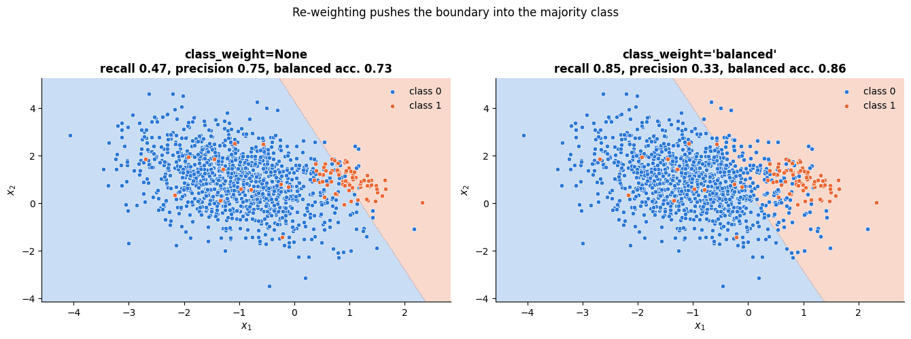

| class_weight | accuracy | recall | precision | balanced acc. | Brier |
|---|---|---|---|---|---|
| None | 0.951 | 0.465 | 0.755 | 0.727 | 0.036 |
| balanced | 0.868 | 0.849 | 0.335 | 0.859 | 0.104 |

Balancing buys recall and costs precision and calibration — the same trade the threshold
makes, but baked into the coefficients. Prefer thresholding when you need calibrated
probabilities; prefer `class_weight` when the minority class is so rare that the
unweighted fit barely separates it at all.

## 9. Strengths, weaknesses and when to use logistic regression

| | |
|---|---|
| **Assumptions / inductive bias** | the log-odds are a *linear* function of the features; observations are independent given $\mathbf{x}$; with a penalty, small coefficients are preferred |
| **Strengths** | convex objective → a unique optimum and reproducible fits; well-calibrated probabilities out of the box; coefficients readable as odds ratios; cheap to train and to serve; handles $`d > n`$ with regularisation; $`\ell_1`$ gives built-in feature selection; extends cleanly to $K$ classes and to the whole GLM family |
| **Weaknesses / failure modes** | cannot represent a non-linear boundary without explicit feature engineering; sensitive to feature scaling when penalised; the MLE does not exist for perfectly separable data (coefficients diverge); coefficients become unstable and uninterpretable under strong collinearity; assumes additive effects unless you add interaction terms; outliers in *feature* space still have leverage |
| **Data it suits** | any $n$; $d$ from a handful to millions (sparse text); numeric features (standardised) and one-hot categoricals; needs no missing values (impute first); noise-tolerant |
| **Complexity** | training $O(n d)$ per iteration for first-order solvers, $O(nd^2 + d^3)$ per Newton step; prediction $O(d)$; memory $O(d)$ — among the cheapest models to deploy |
| **Interpretability** | high: $`e^{w_j}`$ is the odds ratio per unit of $`x_j`$; the sign is the direction; standardised coefficients rank feature importance (with the collinearity caveat of notebook 6, §4.2) |
| **Use it when** | you need probabilities, an auditable model, a strong baseline, or $d \gg n$ with a mostly linear signal |
| **Avoid it when** | the boundary is strongly non-linear and you cannot engineer the features for it — reach for trees/ensembles (notebooks 9–10) or kernel SVMs (notebook 11) |

### 9.1 Demonstrated failure 1: a boundary that is not a line

The inductive bias is the whole story. On concentric classes the best possible *linear*
model is a coin flip; the same model with a degree-2 feature expansion — which makes
$`x_1^2 + x_2^2`$ available — solves the problem exactly, and so does a decision tree
(notebook 9) with no feature engineering at all.

> **Real-life example.** The risk from the blood potassium level is U-shaped: both too little and
> too much can cause dangerous heart rhythms. A logistic regression on the raw level can only say
> "the higher, the riskier" or "the lower, the riskier"; give it the squared (centred) level as
> an extra feature and it can describe the safe band in between — the one-dimensional version of
> the circles below.

```python
from sklearn.datasets import make_circles                  # two concentric rings of points, one per class
from sklearn.preprocessing import PolynomialFeatures       # adds powers and products of the features
from sklearn.tree import DecisionTreeClassifier

# noise: standard deviation of the noise added to the points; factor=0.45: inner ring radius / outer ring radius
# e.g. two standardised blood values per patient: inner ring = both in the normal range
X_circ, y_circ = make_circles(n_samples=400, noise=0.09, factor=0.45, random_state=RANDOM_STATE)
candidates = {
    "logistic regression (fails)": LogisticRegression(),
    # PolynomialFeatures(2) maps (x1, x2) to (1, x1, x2, x1², x1 x2, x2²), so x1² + x2² becomes a linear function
    "logistic regression + degree-2 features": make_pipeline(PolynomialFeatures(2), LogisticRegression(C=10.0, max_iter=2000)),
    "decision tree (notebook 9)": DecisionTreeClassifier(max_depth=6, random_state=RANDOM_STATE),
}
fig, axes = plt.subplots(1, 3, figsize=(16, 4.6))
for ax, (name, model) in zip(axes, candidates.items()):
    model.fit(X_circ, y_circ)
    # .score(X, y) on the data the model was fitted on: training accuracy
    plot_decision_boundary(model, X_circ, y_circ, ax=ax, feature_names=("$x_1$", "$x_2$"),
                           title=f"{name}\naccuracy {model.score(X_circ, y_circ):.3f}")
fig.suptitle("Failure mode 1: a linear model cannot draw a circle", y=1.04)
plt.tight_layout()
plt.show()
```

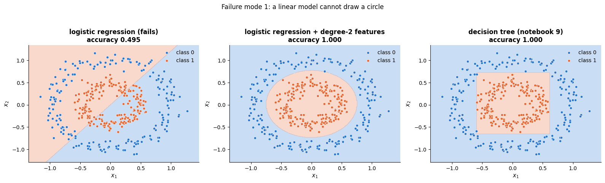

### 9.2 Demonstrated failure 2: perfect separation

If a hyperplane separates the training classes exactly, the likelihood can always be
increased by scaling $\mathbf{w}$ up: the sigmoid becomes a step function, every training
probability tends to 0 or 1, and the loss tends to 0 without ever attaining it. **The
maximum-likelihood estimate does not exist** (Albert & Anderson, 1984). In practice the
optimiser stops at whatever `max_iter` allows, standard errors explode, and the model is
absurdly over-confident. The symptom is easy to spot: coefficients that keep growing as you
weaken the penalty.

> **Real-life example.** In a small drug trial, all 6 patients on the highest dose had a side
> effect, and the dose enters the model as a "highest dose: yes/no" column. Nothing in the data
> limits that column's coefficient, so an unpenalised fit lets it grow without bound and claims
> certainty — a side-effect probability of 1.000 — from six people.

```python
from sklearn.datasets import make_blobs         # Gaussian clusters ("blobs") around the given centres

# two tight, distant clusters (perfectly separable) and two wide, close ones (overlapping); cluster_std is the spread
# e.g. length and weight of fish: two very different species (separable), two similar ones (overlapping)
X_sep, y_sep = make_blobs(n_samples=120, centers=[[-2.2, -2.2], [2.2, 2.2]], cluster_std=0.65,
                          random_state=RANDOM_STATE)
X_ovl, y_ovl = make_blobs(n_samples=120, centers=[[-1.0, -1.0], [1.0, 1.0]], cluster_std=1.5,
                          random_state=RANDOM_STATE)
Cs_sep = np.logspace(-2, 6, 25)
fig, axes = plt.subplots(1, 2, figsize=(13.5, 4.6))
for Xs_, ys_, name, colour in [(X_sep, y_sep, "separable classes", PALETTE[4]),
                               (X_ovl, y_ovl, "overlapping classes", PALETTE[0])]:
    # the length ||w|| of the fitted weight vector for every C (np.linalg.norm of the (1, 2) coef_ array)
    norms = [np.linalg.norm(LogisticRegression(C=C, max_iter=20000, tol=1e-8).fit(Xs_, ys_).coef_)
             for C in Cs_sep]
    axes[0].plot(Cs_sep, norms, "-o", ms=3.5, color=colour, label=name)
axes[0].set_xscale("log")
axes[0].set_yscale("log")
axes[0].set_xlabel("C  (weaker penalty to the right)")
axes[0].set_ylabel(r"$\|\mathbf{w}\|_2$")
axes[0].set_title("Separable data: the coefficients never stop growing")
axes[0].legend(fontsize=9)

sep_model = LogisticRegression(C=1e6, max_iter=20000, tol=1e-8).fit(X_sep, y_sep)     # C = 1e6: almost no penalty
plot_decision_boundary(sep_model, X_sep, y_sep, ax=axes[1], proba=True, feature_names=("$x_1$", "$x_2$"),
                       title="…and every prediction becomes 0 or 1")
plt.tight_layout()
plt.show()
# .max(axis=1) is each point's probability for its predicted class (on separable data, the correct class);
# .min() picks the least confident point
print(f"separable data, C = 1e6: ||w|| = {np.linalg.norm(sep_model.coef_):.1f}, "
      f"min P(correct class) = {sep_model.predict_proba(X_sep).max(axis=1).min():.6f}")
```

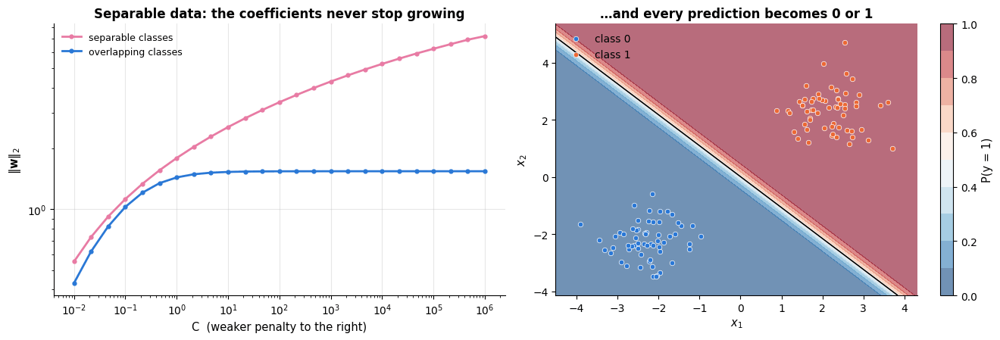

```text
separable data, C = 1e6: ||w|| = 7.2, min P(correct class) = 0.999999
```

On the overlapping data the coefficient norm plateaus — the optimum is finite. On the
separable data it grows without bound, roughly like $\log C$. **The fix is the penalty**:
keep `C` finite (the default `C=1.0` is already enough), and never fit an unpenalised
logistic regression to wide data. This is also why the perfectly-separating boundary chosen
by a large `C` is arbitrary among many separating lines — the maximum-*margin* choice is what
support vector machines add (notebook 11).

## 10. Tuning guide

| Hyper-parameter | Controls | Range / scale | Bias–variance | Default |
|---|---|---|---|---|
| `C` | inverse regularisation strength | $10^{-4}$ … $10^{4}$, **log** | ↑ `C` → ↓ bias, ↑ variance | `1.0` |
| `l1_ratio` | penalty shape: 0 = $`\ell_2`$, 1 = $`\ell_1`$, between = elastic net | 0 … 1, linear (try 0, 0.5, 1 first) | ↑ ratio → sparser, higher bias per feature kept | `0.0` |
| `class_weight` | per-class loss weight | `None` or `"balanced"` | shifts the boundary, not the capacity | `None` |
| `solver` | optimisation algorithm | categorical | none (same optimum) — a speed/penalty choice | `"lbfgs"` |
| `max_iter` | iteration budget | 100 … 5000 | none, if large enough | `100` (often too small) |
| **decision threshold** | the operating point | 0 … 1, linear | trades precision against recall | 0.5 |
| `fit_intercept` | free bias term | `True`/`False` | leave it `True` | `True` |

**Tune in this order.**

1. **`C`** — by far the most important. Search a log grid; look for a plateau rather than a
   spike.
2. **`l1_ratio`** — only if you want sparsity or have many irrelevant features. It
   *interacts strongly with `C`*, because both control how many coefficients survive: an
   $`\ell_1`$ model needs a larger `C` than an $`\ell_2`$ model to keep the same effective
   capacity. Search them jointly (section 10.2).
3. **`class_weight`** and the **threshold** — these address imbalance, not capacity. Tune
   them *after* `C`, against the metric you actually care about.
4. **`solver` / `max_iter`** — computational, not statistical. Choose by the penalty you
   need and the size of the problem; raise `max_iter` until the `ConvergenceWarning`
   disappears.

### 10.1 The regularisation strength `C`

We use a synthetic dataset with 5 informative features among 25 — a setting where the
penalty choice genuinely matters — and 5-fold stratified CV throughout.

```python
# StratifiedKFold: k-fold splits that keep the class proportions in every fold; cross_val_score returns one score
# per fold; cross_validate (section 11) can compute several metrics in one go
from sklearn.model_selection import StratifiedKFold, cross_val_score, cross_validate

# 25 features: 5 informative, 3 redundant (combinations of the informative ones) and 17 of pure noise
# e.g. 600 loan applications with 25 recorded attributes, of which only 5 carry signal about default
X_tune, y_tune = make_classification(n_samples=600, n_features=25, n_informative=5, n_redundant=3,
                                     class_sep=1.0, flip_y=0.05, random_state=RANDOM_STATE)
cv5 = StratifiedKFold(n_splits=5, shuffle=True, random_state=RANDOM_STATE)    # shuffle the rows before splitting

def cv_mean_se(model, X=X_tune, y=y_tune, scoring="roc_auc"):
    """CV mean and standard error of the mean.

    Scores `model` on the five folds of cv5 with the scikit-learn scorer named by `scoring`
    and returns (mean of the 5 scores, their standard error = sample std / sqrt(5)).
    """
    s = cross_val_score(model, X, y, cv=cv5, scoring=scoring)      # array of 5 fold scores
    return s.mean(), s.std(ddof=1) / np.sqrt(len(s))               # ddof=1: sample standard deviation (divide by n - 1)

Cs_tune = np.logspace(-4, 3, 15)
# shape (15, 2): one row per C; column 0 is the CV mean, column 1 its standard error
mean_l2 = np.array([cv_mean_se(make_pipeline(StandardScaler(), LogisticRegression(C=C, max_iter=5000)))
                    for C in Cs_tune])
fig, ax = plt.subplots(figsize=(8.2, 4.6))
ax.plot(Cs_tune, mean_l2[:, 0], "-o", color=PALETTE[0], label="5-fold CV ROC-AUC")
# fill_between(x, lower, upper) shades the band mean ± 1 standard error
ax.fill_between(Cs_tune, mean_l2[:, 0] - mean_l2[:, 1], mean_l2[:, 0] + mean_l2[:, 1],
                alpha=0.25, color=PALETTE[0], label="± 1 standard error")
best_i = int(np.argmax(mean_l2[:, 0]))
one_se_floor = mean_l2[best_i, 0] - mean_l2[best_i, 1]       # the best score minus one standard error
# np.flatnonzero(...)[0]: the first grid position that clears the floor, i.e. the smallest such C
simplest = Cs_tune[np.flatnonzero(mean_l2[:, 0] >= one_se_floor)[0]]     # smallest C within 1 SE = simplest model
ax.axvline(Cs_tune[best_i], color=PALETTE[1], ls="--", lw=1.4, label=f"best C = {Cs_tune[best_i]:.3g}")
ax.axvline(simplest, color=PALETTE[2], ls="-.", lw=1.4, label=f"1-SE rule → C = {simplest:.3g}")
ax.axhline(one_se_floor, color="gray", ls=":", lw=1)
ax.set_xscale("log")
ax.set_xlabel("C (log scale)")
ax.set_ylabel("CV ROC-AUC")
ax.set_title("Validation curve for C: a plateau, not a peak")
ax.legend(fontsize=9, loc="lower right")
plt.show()
```

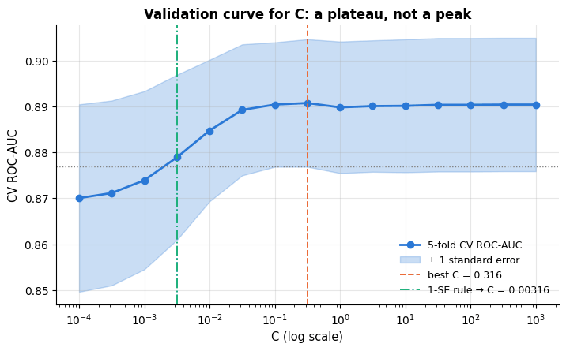

### 10.2 The penalty, and its interaction with `C`

Because `l1_ratio` and `C` both decide how much coefficient mass survives, the two must be
searched together. The same CV grid gives both the per-penalty validation curves and the
2-D heat-map.

```python
ratios = [0.0, 0.25, 0.5, 1.0]
Cs_grid = np.logspace(-3, 2, 7)
grid_scores = np.zeros((len(ratios), len(Cs_grid)))       # (4, 7): one row per l1_ratio, one column per C
for i, ratio in enumerate(ratios):
    for j, C in enumerate(Cs_grid):
        model = make_pipeline(StandardScaler(),
                              LogisticRegression(C=C, l1_ratio=ratio, solver="saga",
                                                 max_iter=8000, random_state=RANDOM_STATE))
        grid_scores[i, j] = cross_val_score(model, X_tune, y_tune, cv=cv5, scoring="roc_auc").mean()

fig, axes = plt.subplots(1, 2, figsize=(14.5, 4.8))
for i, ratio in enumerate(ratios):
    # a chained conditional: " (ℓ2)" when ratio is 0, " (ℓ1)" when it is 1, nothing otherwise
    axes[0].plot(Cs_grid, grid_scores[i], "-o", lw=2, color=PALETTE[i],
                 label=f"l1_ratio = {ratio}" + (" (ℓ2)" if ratio == 0 else " (ℓ1)" if ratio == 1 else ""))
axes[0].set_xscale("log")
axes[0].set_xlabel("C (log scale)")
axes[0].set_ylabel("CV ROC-AUC")
axes[0].set_title("Sparser penalties need a larger C")
axes[0].legend(fontsize=9, loc="lower right")

# sns.heatmap colours each cell of a 2-D array; annot=True writes the values in (fmt=".3f": 3 decimals),
# and xticklabels / yticklabels name the columns and rows
sns.heatmap(grid_scores, ax=axes[1], cmap="viridis", annot=True, fmt=".3f", annot_kws={"size": 8},
            xticklabels=[f"{c:.3g}" for c in Cs_grid], yticklabels=[str(r) for r in ratios],
            cbar_kws={"label": "CV ROC-AUC"})
# argmax() gives a position in the flattened array; np.unravel_index turns it into a (row, column) pair
i_best, j_best = np.unravel_index(grid_scores.argmax(), grid_scores.shape)
# heatmap cell (i, j) covers x from j to j + 1 and y from i to i + 1, so this rectangle outlines the best cell
axes[1].add_patch(plt.Rectangle((j_best, i_best), 1, 1, fill=False, edgecolor="red", lw=3))
axes[1].set_xlabel("C")
axes[1].set_ylabel("l1_ratio")
axes[1].set_title(f"CV heat-map — best: C = {Cs_grid[j_best]:.3g}, l1_ratio = {ratios[i_best]}")
plt.tight_layout()
plt.show()
```

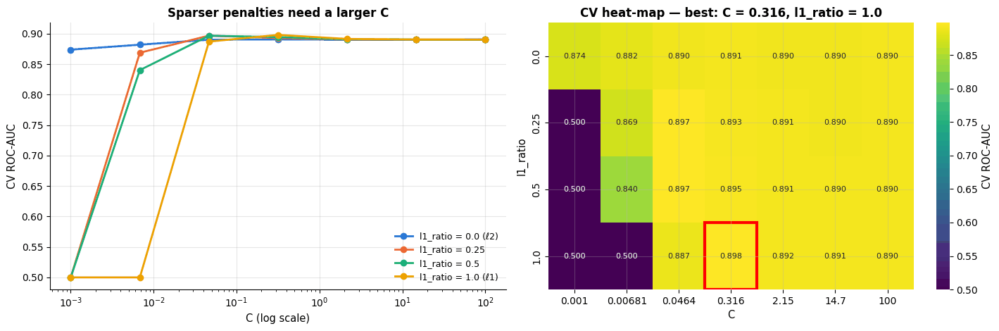

The staircase is the interaction: the good region starts at a small `C` for $`\ell_2`$ and
only at a larger `C` for $`\ell_1`$. The cells at exactly 0.500 are models whose coefficients
have all been shrunk to zero — an $`\ell_1`$ penalty that strong predicts the majority class
and nothing else. A one-dimensional search over `C` at `l1_ratio=1` with the grid tuned for
$`\ell_2`$ would have concluded that $`\ell_1`$ is useless, when it simply needed a different
`C`. Note also how flat the plateau is: every configuration to the right of the staircase is
within 0.01 AUC of the best.

### 10.3 What `C` does to the fitted function

With raw features a linear boundary changes only its slope as `C` varies, which is hard to
see. Expand the features to degree 5 on a problem that genuinely needs a curve (the two
moons) and the effect becomes obvious: `C` controls how much the boundary is allowed to
wiggle — exactly the role it plays for an SVM (notebook 11).

```python
from sklearn.datasets import make_moons         # two interleaving half-circles, one per class

# e.g. map positions of 300 houses, class = which bank of a winding river they stand on
X_wig, y_wig = make_moons(n_samples=300, noise=0.32, random_state=RANDOM_STATE)   # noise: std of the added noise
Cs_show = [0.001, 0.01, 0.1, 1.0, 100.0, 100000.0]
fig, axes = plt.subplots(2, 3, figsize=(15.5, 8.4))
for ax, C in zip(axes.ravel(), Cs_show):        # axes.ravel() flattens the 2 x 3 grid of panels into a list of 6
    # all powers and products of x1, x2 up to degree 5 (21 columns, counting the constant 1), standardised, then fitted
    model = make_pipeline(PolynomialFeatures(5), StandardScaler(),
                          LogisticRegression(C=C, max_iter=10000)).fit(X_wig, y_wig)
    cv_auc = cross_val_score(model, X_wig, y_wig, cv=cv5, scoring="roc_auc").mean()
    plot_decision_boundary(model, X_wig, y_wig, ax=ax, feature_names=("$x_1$", "$x_2$"),
                           title=f"C = {C:g}   CV AUC {cv_auc:.3f}")
    ax.legend().remove()                        # no legend in each of the six panels
fig.suptitle("Degree-5 logistic regression on two moons: C interpolates from a nearly straight "
             "boundary to one that chases single points", y=1.0)
plt.tight_layout()
plt.show()
```

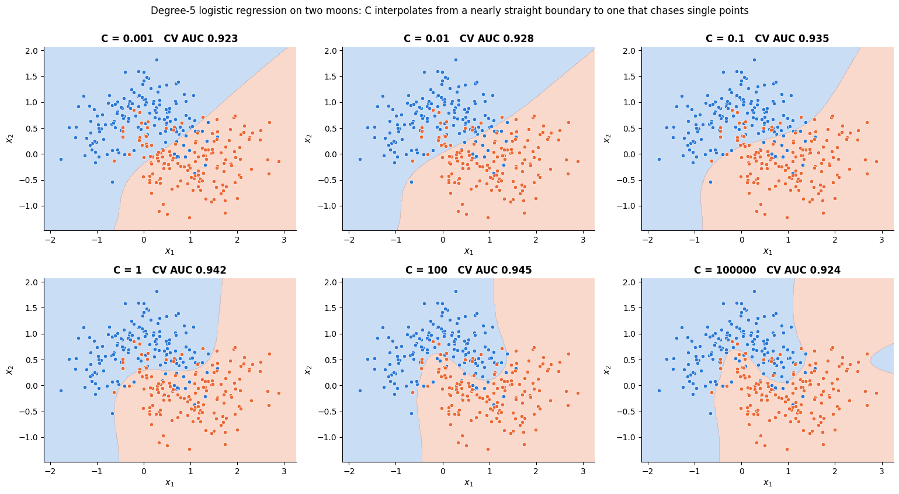

At `C = 0.001` the penalty has crushed the high-order terms and the boundary is almost
straight — it cuts through both moons. In the middle of the range it bends into the gap
between them. At `C = 10^5` it grows fingers and islands around individual noisy points, and
the cross-validated AUC — highest in the middle of the range — falls back at both ends.
That is the bias–variance trade-off of notebook 5, drawn.

### 10.4 `class_weight`

`class_weight` is not a capacity knob, so judge it with metrics that see the minority class.
On the imbalanced data of section 8, balanced weighting transforms the *threshold-dependent*
metrics and leaves the *ranking* metric almost untouched.

```python
Cs_cw = np.logspace(-4, 3, 8)                          # a coarser grid: eight fits per curve is enough
fig, axes = plt.subplots(1, 3, figsize=(16.5, 4.2))
for metric, ax in zip(["balanced_accuracy", "f1", "average_precision"], axes):    # scikit-learn scorer names
    for weight, colour in [(None, PALETTE[0]), ("balanced", PALETTE[1])]:
        # (8, 2) array of CV mean and standard error on the imbalanced data of section 8, one row per C
        res = np.array([cv_mean_se(LogisticRegression(C=C, class_weight=weight, max_iter=5000),
                                   X=X_imb, y=y_imb, scoring=metric) for C in Cs_cw])
        ax.plot(Cs_cw, res[:, 0], "-o", ms=3.5, color=colour, label=f"class_weight={weight!r}")
        ax.fill_between(Cs_cw, res[:, 0] - res[:, 1], res[:, 0] + res[:, 1], alpha=0.2, color=colour)
    ax.set_xscale("log")
    ax.set_xlabel("C (log scale)")
    ax.set_ylabel(f"CV {metric.replace('_', ' ')}")
    ax.set_title(f"{metric.replace('_', ' ')} (6 % positives)")
    ax.legend(fontsize=9)
fig.suptitle("Re-weighting changes the decision, not the ranking", y=1.03)
plt.tight_layout()
plt.show()
```

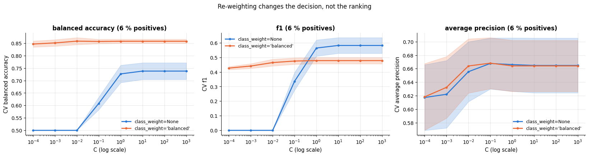

Read the three panels together. Balanced accuracy jumps from 0.74 to 0.86 — the model now
predicts the minority class at all. $`F_1`$ moves the *other* way, because the extra recall is
bought with false positives. Average precision, which is computed from the scores and is
therefore blind to where the threshold sits, hardly moves at all. That is the cleanest
evidence that `class_weight` and the threshold are two handles on the same lever: if you
only need a different operating point, move the threshold and keep your calibrated
probabilities.

### 10.5 The solver: same answer, different bill

```python
import time          # time.perf_counter() is a high-resolution clock for timing code

# e.g. 12 000 insurance claims with 60 recorded attributes, class = fraudulent or not
X_big, y_big = make_classification(n_samples=12000, n_features=60, n_informative=20,
                                   random_state=RANDOM_STATE)
X_big = StandardScaler().fit_transform(X_big)
solver_rows = []
for solver in ["lbfgs", "newton-cholesky", "liblinear", "sag", "saga"]:
    model = LogisticRegression(solver=solver, C=1.0, max_iter=5000, random_state=RANDOM_STATE)
    times = []
    for _ in range(2):                                    # best of 2: timings on a shared CPU are noisy
        t0 = time.perf_counter()
        model.fit(X_big, y_big)
        times.append(time.perf_counter() - t0)            # elapsed seconds
    # cv=3: a 3-fold stratified split (an integer cv does not shuffle)
    solver_rows.append({"solver": solver, "fit time (s)": min(times),
                        "CV ROC-AUC": cross_val_score(model, X_big, y_big, cv=3, scoring="roc_auc").mean()})
solver_df = pd.DataFrame(solver_rows).set_index("solver")

fig, axes = plt.subplots(1, 2, figsize=(13, 4.2))
solver_df["fit time (s)"].plot.barh(ax=axes[0], color=PALETTE[0])      # pandas' horizontal bar chart of one column
axes[0].set_xlabel("seconds to fit, best of 2 (n = 12 000, d = 60)")
axes[0].set_title("Solvers differ in speed…")
axes[1].barh(solver_df.index, solver_df["CV ROC-AUC"], color=PALETTE[2])
# zoom the x-axis to just around the scores, so that even tiny differences would show
axes[1].set_xlim(solver_df["CV ROC-AUC"].min() - 0.002, solver_df["CV ROC-AUC"].max() + 0.002)
axes[1].set_xlabel("3-fold CV ROC-AUC")
axes[1].set_title("…and not at all in the answer")
plt.tight_layout()
plt.show()
solver_df.round(4)
```

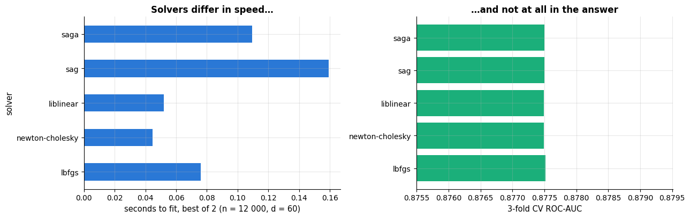

| solver | fit time (s) | CV ROC-AUC |
|---|---|---|
| lbfgs | 0.0761 | 0.8775 |
| newton-cholesky | 0.0447 | 0.8775 |
| liblinear | 0.0521 | 0.8775 |
| sag | 0.1591 | 0.8775 |
| saga | 0.1094 | 0.8775 |

All five solvers agree on the cross-validated AUC to four decimal places — they minimise the
same convex function — while the fit times do not agree at all, and the spread is easily
large enough to matter when a hyper-parameter search fits hundreds of models. Which one wins
depends on the shape of the problem, not on the solver being "better": `newton-cholesky`
pays $O(nd^2)$ per step to form the Hessian, so it wins when $d$ is small and $n$ huge and
loses as $d$ grows; `saga` pays little per step but needs many of them; `liblinear` is
built for small sparse problems. Use the compatibility table in §3.3 to narrow the choice,
then measure on *your* data. (Timings on a shared two-core machine are noisy — hence
best-of-two.)

### 10.6 The threshold, tuned by cross-validation

The threshold deserves the same treatment as any other hyper-parameter: a curve with error
bars, computed on data the model has not seen.

```python
thr_grid = np.linspace(0.05, 0.95, 46)                         # 0.05, 0.07, ..., 0.95
fold_scores = np.zeros((cv5.get_n_splits(), len(thr_grid)))    # (5 folds, 46 thresholds)
# cv5.split(X, y) yields, for each fold, the positions of its training rows and of its validation rows
for k, (tr_idx, va_idx) in enumerate(cv5.split(X_ch_tr, y_ch_tr)):
    # clone(preprocess): a fresh unfitted copy for every fold, so fitting a fold never touches churn_clf (section 5.3)
    fold_model = Pipeline([("prep", clone(preprocess)), ("lr", LogisticRegression(max_iter=2000,
                                                                                  random_state=RANDOM_STATE))])
    fold_model.fit(X_ch_tr.iloc[tr_idx], y_ch_tr[tr_idx])     # .iloc for the DataFrame, plain indexing for the array
    p_va = fold_model.predict_proba(X_ch_tr.iloc[va_idx])[:, 1]    # P(churn) for rows this fold's model has not seen
    for j, t in enumerate(thr_grid):
        fold_scores[k, j] = f1_score(y_ch_tr[va_idx], (p_va >= t).astype(int), zero_division=0)
mean_thr = fold_scores.mean(axis=0)                                        # one mean per threshold
se_thr = fold_scores.std(axis=0, ddof=1) / np.sqrt(fold_scores.shape[0])   # standard error over the 5 folds

fig, ax = plt.subplots(figsize=(8.2, 4.4))
ax.plot(thr_grid, mean_thr, "-o", ms=3.5, color=PALETTE[0], label="5-fold CV $F_1$")
ax.fill_between(thr_grid, mean_thr - se_thr, mean_thr + se_thr, alpha=0.25, color=PALETTE[0],
                label="± 1 standard error")
ax.axvline(thr_grid[int(np.argmax(mean_thr))], color=PALETTE[1], ls="--",
           label=f"best threshold {thr_grid[int(np.argmax(mean_thr))]:.2f}")
ax.axvline(0.5, color="gray", ls=":", label="default 0.5")
ax.set_xlabel("decision threshold")
ax.set_ylabel("CV $F_1$")
ax.set_title("Validation curve for the threshold (churn data)")
ax.legend(fontsize=9)
plt.show()
```

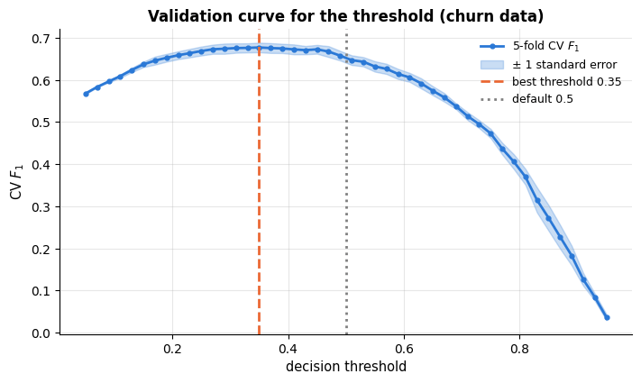

### 10.7 Practical notes

- **The best value sits at the edge of the grid** → extend the grid. If the best `C` is the
  largest you tried, your data may be separable (section 9.2) or the penalty may simply be
  unhelpful; if it is the smallest, the signal is weak and the model is being told to
  predict the prior.
- **The curve is flat** → apply the **one-standard-error rule** (Breiman et al., 1984): take
  the simplest model (smallest `C`) whose CV score is within one SE of the best. The plateau
  of the `C` curve above spans four orders of magnitude and the standard-error band is wider
  than the whole plateau; picking the peak is noise chasing.
- **Runtime.** `C` is free to tune (each fit is independent and fast); `l1_ratio` forces
  `saga`, which is several times slower; the threshold is essentially free because it needs
  no refitting — tune it with `TunedThresholdClassifierCV` or on stored CV predictions.
- **Not worth tuning:** `tol`, `intercept_scaling`, `fit_intercept`, `warm_start`, and the
  solver itself (beyond the compatibility table in §3.3). Spend the budget on features
  instead — for a linear model, feature engineering is where the wins are (notebook 4).
- Use `LogisticRegressionCV` for a quick built-in `C` search, or `GridSearchCV` when the
  search space also contains preprocessing choices (notebook 12).

## 11. Case study: breast cancer diagnosis

### 11.1 The data and the question

The **breast cancer Wisconsin** data (Street, Wolberg & Mangasarian, 1993) is real: 569
fine-needle aspirates of breast masses, 30 features computed from digitised images of the
cell nuclei (mean, standard error and worst value of ten shape and texture measurements),
and a biopsy-confirmed label — malignant or benign.

The clinical question is not "what fraction of cases do we get right?" but *"how many
malignancies do we miss?"*. A missed malignancy delays treatment; a false alarm costs an
additional biopsy, which is unpleasant and expensive but not dangerous. We therefore encode
**malignant = 1** (scikit-learn ships the opposite convention, which is a classic source of
sign errors) and will optimise recall on that class at an acceptable precision.

```python
X_bc_all = pd.DataFrame(cancer.data, columns=cancer.feature_names)    # the 30 features, with their names
y_bc_all = (cancer.target == 0).astype(int)                 # 1 = malignant (sklearn's 0), 0 = benign
# 75 / 25 split, stratified so both parts have the same share of malignant cases
Xbc_tr, Xbc_te, ybc_tr, ybc_te = train_test_split(X_bc_all, y_bc_all, test_size=0.25,
                                                  stratify=y_bc_all, random_state=RANDOM_STATE)
print(f"{len(y_bc_all)} biopsies, {y_bc_all.mean():.1%} malignant")
print(f"train {len(ybc_tr)} (malignant {ybc_tr.mean():.1%}) | test {len(ybc_te)} (malignant {ybc_te.mean():.1%})")
# describe() summarises the first six columns; .loc keeps four of its summary rows
X_bc_all.iloc[:, :6].describe().loc[["mean", "std", "min", "max"]].round(2)
```

```text
569 biopsies, 37.3% malignant
train 426 (malignant 37.3%) | test 143 (malignant 37.1%)
```

|  | mean radius | mean texture | mean perimeter | mean area | mean smoothness | mean compactness |
|---|---|---|---|---|---|---|
| mean | 14.13 | 19.29 | 91.97 | 654.89 | 0.10 | 0.10 |
| std | 3.52 | 4.30 | 24.30 | 351.91 | 0.01 | 0.05 |
| min | 6.98 | 9.71 | 43.79 | 143.50 | 0.05 | 0.02 |
| max | 28.11 | 39.28 | 188.50 | 2501.00 | 0.16 | 0.35 |

The feature scales differ by three orders of magnitude (`mean area` ~ 650 vs `mean smoothness`
~ 0.1), so standardisation inside the pipeline is mandatory before a penalised fit.

### 11.2 Baselines and a first model

```python
bc_pipe = make_pipeline(StandardScaler(), LogisticRegression(max_iter=5000, random_state=RANDOM_STATE))
# a scorer with zero_division=0: the majority-class dummy never predicts "malignant", so precision is undefined
# (the dict maps a name to a built-in scorer name or to a make_scorer(...) object)
scoring = {"accuracy": "accuracy", "balanced_accuracy": "balanced_accuracy", "recall": "recall",
           "precision": make_scorer(precision_score, zero_division=0),
           "roc_auc": "roc_auc", "average_precision": "average_precision"}
baseline_rows = []
for name, model in [("DummyClassifier(prior)", DummyClassifier(strategy="most_frequent")),
                    ("logistic regression (C=1)", bc_pipe)]:
    # cross_validate returns a dict holding one array of fold scores per metric, under the key "test_<name>"
    res = cross_validate(model, Xbc_tr, ybc_tr, cv=cv5, scoring=scoring)
    # ** unpacks the inner dict (metric name -> mean fold score) into the row next to "model"
    baseline_rows.append({"model": name, **{s: res[f"test_{s}"].mean() for s in scoring}})
pd.DataFrame(baseline_rows).set_index("model").round(3)
```

| model | accuracy | balanced_accuracy | recall | precision | roc_auc | average_precision |
|---|---|---|---|---|---|---|
| DummyClassifier(prior) | 0.627 | 0.500 | 0.000 | 0.000 | 0.500 | 0.373 |
| logistic regression (C=1) | 0.972 | 0.966 | 0.944 | 0.981 | 0.991 | 0.991 |

### 11.3 Tuning with the guide from section 10

`C` first, scored by **average precision** (we care about the malignant class and the data
are moderately imbalanced), then the penalty.

```python
# the validation curve for C again, now scored by average precision on the breast cancer training data; shape (15, 2)
bc_curve = np.array([cv_mean_se(make_pipeline(StandardScaler(), LogisticRegression(C=C, max_iter=5000)),
                                X=Xbc_tr, y=ybc_tr, scoring="average_precision") for C in Cs_tune])
best_bc = int(np.argmax(bc_curve[:, 0]))
one_se_bc = bc_curve[best_bc, 0] - bc_curve[best_bc, 1]
C_bc = float(Cs_tune[np.flatnonzero(bc_curve[:, 0] >= one_se_bc)[0]])    # the 1-SE choice, as a plain Python float

fig, ax = plt.subplots(figsize=(8.2, 4.4))
ax.plot(Cs_tune, bc_curve[:, 0], "-o", color=PALETTE[0], label="5-fold CV average precision")
ax.fill_between(Cs_tune, bc_curve[:, 0] - bc_curve[:, 1], bc_curve[:, 0] + bc_curve[:, 1],
                alpha=0.25, color=PALETTE[0], label="± 1 standard error")
ax.axvline(Cs_tune[best_bc], color=PALETTE[1], ls="--", label=f"best C = {Cs_tune[best_bc]:.3g}")
ax.axvline(C_bc, color=PALETTE[2], ls="-.", label=f"1-SE rule → C = {C_bc:.3g}")
ax.set_xscale("log")
ax.set_xlabel("C (log scale)")
ax.set_ylabel("CV average precision")
ax.set_title("Breast cancer: choosing C by cross-validation and the one-standard-error rule")
ax.legend(fontsize=9, loc="lower right")
plt.show()

# at the chosen C, compare the three penalty shapes
for ratio in [0.0, 0.5, 1.0]:
    m = make_pipeline(StandardScaler(), LogisticRegression(C=C_bc, l1_ratio=ratio, solver="saga",
                                                           max_iter=8000, random_state=RANDOM_STATE))
    mean, se = cv_mean_se(m, X=Xbc_tr, y=ybc_tr, scoring="average_precision")
    # .fit returns the fitted pipeline, so [-1] is its LogisticRegression; count the coefficients that are not ~0
    n_kept = np.sum(np.abs(m.fit(Xbc_tr, ybc_tr)[-1].coef_[0]) > 1e-6)
    # {ratio:<4} left-aligns the number in a 4-character field
    print(f"l1_ratio={ratio:<4} CV AP = {mean:.4f} ± {se:.4f}   non-zero coefficients: {n_kept}/30")
```

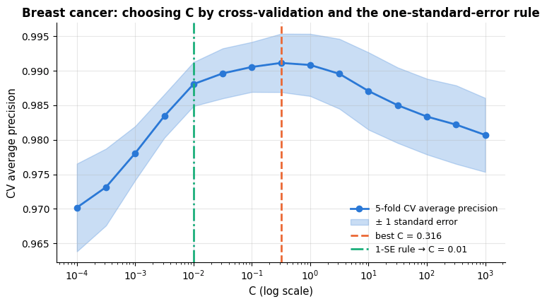

```text
l1_ratio=0.0  CV AP = 0.9881 ± 0.0032   non-zero coefficients: 30/30
l1_ratio=0.5  CV AP = 0.9788 ± 0.0039   non-zero coefficients: 11/30
l1_ratio=1.0  CV AP = 0.9753 ± 0.0044   non-zero coefficients: 3/30
```

The $`\ell_2`$ model scores highest, but the $`\ell_1`$ model gives up only about one point of
average precision while keeping a *tenth* of the 30 features — a gap of roughly two standard
errors. That is the trade worth discussing with a clinician: three measurements are easier to
collect, to audit and to explain than thirty correlated ones. We keep the $`\ell_2`$ model here because the full
feature set costs nothing to measure (all 30 come from the same image) and its probabilities
are the ones we will use for the cost calculation.

### 11.4 Honest evaluation on the untouched test set

```python
# the final model: the 1-SE value of C, refitted on the whole training set
bc_final = make_pipeline(StandardScaler(),
                         LogisticRegression(C=C_bc, max_iter=5000, random_state=RANDOM_STATE)).fit(Xbc_tr, ybc_tr)
proba_bc = bc_final.predict_proba(Xbc_te)[:, 1]        # P(malignant) for each test biopsy
pred_bc = bc_final.predict(Xbc_te)                     # hard labels at the default threshold 0.5

fig, axes = plt.subplots(1, 3, figsize=(16.5, 4.6))
ConfusionMatrixDisplay(confusion_matrix(ybc_te, pred_bc), display_labels=["benign", "malignant"]).plot(
    cmap="Blues", ax=axes[0], colorbar=False, values_format="d")
axes[0].set_title("Test confusion matrix at t = 0.5")
axes[0].grid(False)
RocCurveDisplay.from_predictions(ybc_te, proba_bc, ax=axes[1], name="logistic regression",
                                 curve_kwargs={"color": PALETTE[0]})
axes[1].plot([0, 1], [0, 1], "k--", lw=1)
axes[1].set_title(f"ROC — AUC {roc_auc_score(ybc_te, proba_bc):.3f}")
PrecisionRecallDisplay.from_predictions(ybc_te, proba_bc, ax=axes[2], color=PALETTE[0], name="logistic regression")
axes[2].axhline(ybc_te.mean(), color="black", ls="--", lw=1, label=f"prevalence {ybc_te.mean():.2f}")
axes[2].set_title(f"Precision–recall — AP {average_precision_score(ybc_te, proba_bc):.3f}")
axes[2].legend(loc="lower left", fontsize=9)
plt.tight_layout()
plt.show()
# target_names: the names printed for class 0 and class 1
print(classification_report(ybc_te, pred_bc, target_names=["benign", "malignant"], digits=3))
tn_b, fp_b, fn_b, tp_b = confusion_matrix(ybc_te, pred_bc, labels=[0, 1]).ravel()
sens_b, spec_b = tp_b / (tp_b + fn_b), tn_b / (tn_b + fp_b)      # sensitivity (= recall) and specificity
lr_p = np.inf if fp_b == 0 else sens_b / (1 - spec_b)          # LR+ is infinite when there are no false positives
lr_n = (1 - sens_b) / spec_b
print(f"sensitivity {sens_b:.3f}, specificity {spec_b:.3f}  ->  LR+ = {lr_p:.1f}, LR- = {lr_n:.3f}")
print("A positive prediction multiplies the pre-test odds of malignancy by LR+; a negative one by LR-.")
```

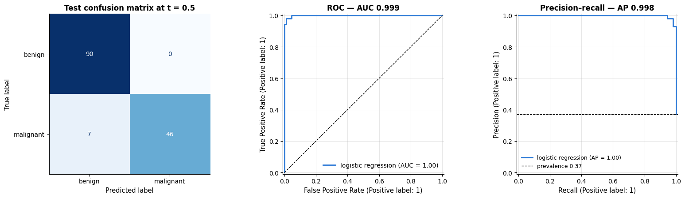

```text
              precision    recall  f1-score   support

      benign      0.928     1.000     0.963        90
   malignant      1.000     0.868     0.929        53

    accuracy                          0.951       143
   macro avg      0.964     0.934     0.946       143
weighted avg      0.955     0.951     0.950       143

sensitivity 0.868, specificity 1.000  ->  LR+ = inf, LR- = 0.132
A positive prediction multiplies the pre-test odds of malignancy by LR+; a negative one by LR-.
```

### 11.5 Choosing the operating point from the cost of a miss

Let a missed malignancy cost ten times an unnecessary biopsy — a conservative statement of
standard screening practice. The optimal threshold for a calibrated model is then
$1/(1+10) \approx 0.09$. We *choose* it by cross-validation on the training data with
`TunedThresholdClassifierCV` and only then look at the test set.

```python
COST_RATIO = 10.0               # one missed malignancy costs as much as 10 unnecessary biopsies

def clinical_cost(y_true, y_pred):
    """Average cost per case: COST_RATIO for each missed malignancy (FN) plus 1 for each false alarm (FP)."""
    _, fp_, fn_, _ = confusion_matrix(y_true, y_pred, labels=[0, 1]).ravel()     # _ discards TN and TP
    return (COST_RATIO * fn_ + 1.0 * fp_) / len(y_true)     # in units of "one unnecessary biopsy"

# the same threshold tuning as in section 6.5, with the clinical cost and 100 candidate thresholds
bc_tuned = TunedThresholdClassifierCV(
    bc_final, scoring=make_scorer(clinical_cost, greater_is_better=False, response_method="predict"),
    cv=5, thresholds=100, store_cv_results=True, random_state=RANDOM_STATE).fit(Xbc_tr, ybc_tr)

fig, ax = plt.subplots(figsize=(8.5, 4.6))
# minus the stored score is the cost again
ax.plot(bc_tuned.cv_results_["thresholds"], -bc_tuned.cv_results_["scores"], lw=2, color=PALETTE[0],
        label="cross-validated cost (training data)")
# the test-set cost at each threshold of thr_grid (0.05 ... 0.95, from section 10.6)
ax.plot(thr_grid, [clinical_cost(ybc_te, (proba_bc >= t).astype(int)) for t in thr_grid],
        lw=2, ls="--", color=PALETTE[1], label="cost on the test set")
ax.axvline(bc_tuned.best_threshold_, color=PALETTE[2], lw=1.6, label=f"chosen threshold {bc_tuned.best_threshold_:.3f}")
ax.axvline(0.5, color="gray", ls=":", lw=1.2, label="default 0.5")
ax.set_xlabel("decision threshold on P(malignant)")
ax.set_ylabel("expected cost (units of one unnecessary biopsy)")
ax.set_title("A missed malignancy costs 10× a false alarm — so the threshold belongs far below 0.5")
ax.legend(fontsize=9)
plt.show()
print(f"theoretical optimum for a calibrated model: 1/(1 + {COST_RATIO:.0f}) = {1 / (1 + COST_RATIO):.3f}")
print(f"chosen by 5-fold CV on the training data  : {bc_tuned.best_threshold_:.3f}")

# the test-set confusion counts and metrics at the two operating points
rows_ops = []
for label, pred in [("default t = 0.5", pred_bc), (f"cost-tuned t = {bc_tuned.best_threshold_:.3f}",
                                                   bc_tuned.predict(Xbc_te))]:
    tn_o, fp_o, fn_o, tp_o = confusion_matrix(ybc_te, pred, labels=[0, 1]).ravel()
    rows_ops.append({"operating point": label, "missed malignancies (FN)": fn_o, "false alarms (FP)": fp_o,
                     "recall": recall_score(ybc_te, pred), "precision": precision_score(ybc_te, pred),
                     "expected cost": clinical_cost(ybc_te, pred)})
pd.DataFrame(rows_ops).set_index("operating point").round(3)
```

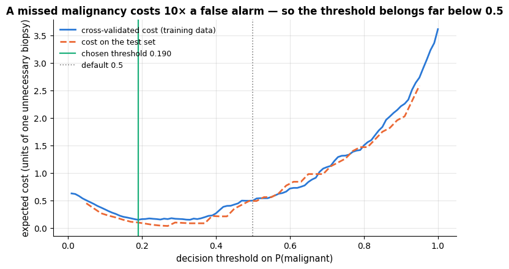

```text
theoretical optimum for a calibrated model: 1/(1 + 10) = 0.091
chosen by 5-fold CV on the training data  : 0.190
```

| operating point | missed malignancies (FN) | false alarms (FP) | recall | precision | expected cost |
|---|---|---|---|---|---|
| default t = 0.5 | 7 | 0 | 0.868 | 1.000 | 0.490 |
| cost-tuned t = 0.190 | 0 | 14 | 1.000 | 0.791 | 0.098 |

Cross-validation lands above the theoretical $1/(1+10) \approx 0.09$. Two reasons, and both
are worth knowing. The cost curve has a flat bottom, so anywhere in that valley the cost is
practically the same and the CV estimate has room to wobble. But there is also a systematic
reason, which §11.6 makes visible: the formula assumes **calibrated** probabilities, and this
heavily regularised model's probabilities are shrunk towards the base rate — so the threshold
that behaves like "0.09" on a calibrated model sits higher on this one. What matters here is
the *size* of the move — from 0.5 down into the low tenths — and its effect: the missed
malignancies disappear at the price of a few extra biopsies.

### 11.6 Are the probabilities trustworthy?

Section 7 claimed that maximum-likelihood logistic regression is calibrated by construction.
That claim has a condition attached — *unpenalised* maximum likelihood — and we have just
deployed a heavily penalised model. Let us check, against the same model fitted at the
CV-best `C` and against a Platt-recalibrated version of the deployed one.

```python
# the same model at the CV-best C, i.e. with a weaker penalty than the deployed 1-SE choice
bc_looser = make_pipeline(StandardScaler(),
                          LogisticRegression(C=float(Cs_tune[best_bc]), max_iter=5000,
                                             random_state=RANDOM_STATE)).fit(Xbc_tr, ybc_tr)
# the deployed model wrapped in Platt scaling (method="sigmoid"), calibrated over 5 cross-validation folds
bc_recal = CalibratedClassifierCV(make_pipeline(StandardScaler(),
                                                LogisticRegression(C=C_bc, max_iter=5000,
                                                                   random_state=RANDOM_STATE)),
                                  method="sigmoid", cv=5).fit(Xbc_tr, ybc_tr)
# (name, test-set probabilities, colour, marker) for each of the three versions
variants = [(f"deployed, C = {C_bc:.3g} (1-SE)", proba_bc, PALETTE[0], "o"),
            (f"looser penalty, C = {Cs_tune[best_bc]:.3g}", bc_looser.predict_proba(Xbc_te)[:, 1], PALETTE[1], "s"),
            (f"deployed + Platt scaling", bc_recal.predict_proba(Xbc_te)[:, 1], PALETTE[2], "^")]

fig, axes = plt.subplots(1, 2, figsize=(13.5, 4.8))
cal_rows = []
for name, p_hat, colour, marker in variants:
    # strategy="quantile": bins holding equal numbers of cases instead of bins of equal width
    CalibrationDisplay.from_predictions(ybc_te, p_hat, n_bins=5, strategy="quantile", ax=axes[0],
                                        name=name, color=colour, marker=marker)
    axes[1].hist(p_hat, bins=20, alpha=0.5, color=colour, label=name)
    # the last entry is the share of predictions below 0.05 or above 0.95 (| is element-wise "or")
    cal_rows.append({"model": name, "Brier": brier_score_loss(ybc_te, p_hat),
                     "log loss": log_loss(ybc_te, p_hat), "ROC-AUC": roc_auc_score(ybc_te, p_hat),
                     "share of |p−0.5| > 0.45": np.mean((p_hat < 0.05) | (p_hat > 0.95))})
axes[0].set_title("Reliability, 5 equal-count bins (≈ 29 cases each)")
axes[0].legend(loc="upper left", fontsize=8.5)
axes[1].set_xlabel("predicted P(malignant)")
axes[1].set_ylabel("number of test cases")
axes[1].set_title("Strong shrinkage pulls the probabilities towards the base rate")
axes[1].legend(fontsize=8.5)
plt.tight_layout()
plt.show()
pd.DataFrame(cal_rows).set_index("model").round(4)
```

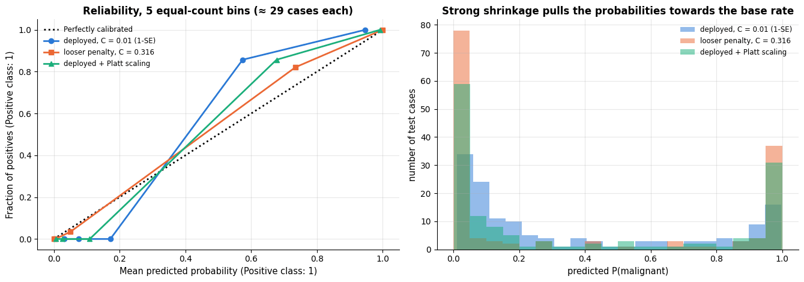

| model | Brier | log loss | ROC-AUC | share of \|p−0.5\| &gt; 0.45 |
|---|---|---|---|---|
| deployed, C = 0.01 (1-SE) | 0.0416 | 0.1729 | 0.9987 | 0.2937 |
| looser penalty, C = 0.316 | 0.0188 | 0.0731 | 0.9977 | 0.8042 |
| deployed + Platt scaling | 0.0259 | 0.1057 | 0.9985 | 0.6294 |

The deployed model is **under-confident**: its reliability curve sits above the diagonal in
the upper bins (it says "42 % malignant" for a group that is almost all malignant), and its
probability histogram is squeezed into the middle instead of piling up at 0 and 1. That is
the penalty at work — shrinking $\mathbf{w}$ shrinks every log-odds towards zero, and
$\sigma$ maps them towards the base rate. The ranking is untouched (the AUC is the highest of
the three), which is exactly why the one-standard-error rule, scored on *average precision*,
was happy to choose it.

Two fixes, both shown above: loosen the penalty, or keep the model and recalibrate it. Both
cut the Brier score and the log loss substantially — the looser penalty by more than half —
while leaving the AUC essentially alone. And this is the resolution of the puzzle at the end of
§11.5: a compressed probability scale is precisely why the cost-optimal threshold came out at
0.19 rather than the textbook 0.09.

> **Key idea.** Selecting a model by a *ranking* metric (AUC, average precision) tells you
> nothing about whether its probabilities are usable as numbers. If a downstream decision
> multiplies the probability by a cost, check calibration explicitly and either tune against
> a proper scoring rule (`scoring="neg_log_loss"` or `"neg_brier_score"`) or recalibrate.

### 11.7 What the model says: odds ratios

```python
# the deployed model's 30 coefficients, labelled with the feature names and sorted from most negative to most positive
coefs_bc = pd.Series(bc_final[-1].coef_[0], index=X_bc_all.columns).sort_values()
top = pd.concat([coefs_bc.head(6), coefs_bc.tail(6)])     # the 6 most negative and the 6 most positive, in one Series
fig, ax = plt.subplots(figsize=(8.6, 5.2))
colours = [PALETTE[0] if v < 0 else PALETTE[7] for v in top.to_numpy()]     # blue if negative, red if positive
# odds ratio = e^coefficient; each bar starts at 1 ("no effect", left=1.0) and has length (odds ratio - 1),
# so odds ratios below 1 point to the left
ax.barh(top.index, np.exp(top.to_numpy()) - 1.0, left=1.0, color=colours)
ax.axvline(1.0, color="black", lw=1.2)
ax.set_xlabel("odds ratio per +1 standard deviation")
ax.set_title("Which measurements move the odds of malignancy?\n(red raises the odds, blue lowers them)")
plt.show()
print("largest positive effects (odds ratio per +1 SD):")
# .tail(4): the four largest coefficients; .iloc[::-1] reverses them (largest first); .items() yields (name, value)
for name_f, value in coefs_bc.tail(4).iloc[::-1].items():
    print(f"  {name_f:26s} x{np.exp(value):.2f}")
print("largest protective effects:")
for name_f, value in coefs_bc.head(2).items():         # the two most negative coefficients
    print(f"  {name_f:26s} x{np.exp(value):.2f}")
```

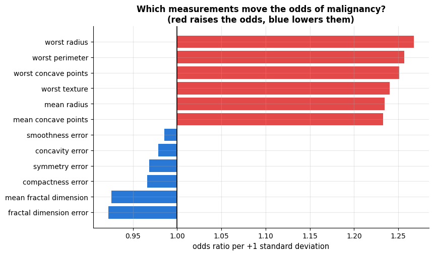

```text
largest positive effects (odds ratio per +1 SD):
  worst radius               x1.27
  worst perimeter            x1.26
  worst concave points       x1.25
  worst texture              x1.24
largest protective effects:
  fractal dimension error    x0.92
  mean fractal dimension     x0.93
```

Because the features were standardised, each bar is the multiplicative effect of a
one-standard-deviation increase, and the bars are comparable to one another. The features
with the largest positive effect are the "worst" (largest-nucleus) size and shape
measurements — radius, perimeter, concave points — which is exactly the criterion a
pathologist would name. The individual odds ratios look modest because the one-standard-error
rule chose a *strongly* regularised model that spreads the signal across all 30 highly
correlated features; the ensemble of small effects is what produces the 0.999 test AUC.
That is also the usual caveat from notebook 6, §4.2: with collinear features the individual
coefficients are unstable even when the predictions are not, so use permutation importance
(notebook 17) when you need a defensible ranking.

### 11.8 What to tell a non-technical stakeholder

> On 143 held-out biopsies, the model ranks malignant cases above benign ones almost
> perfectly (ROC-AUC 0.999). At the default threshold it misses 7 of the 53 malignancies and
> raises no false alarms; at the threshold chosen for a 10:1 cost of a miss over a false
> alarm it misses **none** of them, at the price of 14 benign cases sent for a biopsy they
> did not need. That is the trade-off to put in front of the clinical team — it is a choice
> about costs, not about the model. The model is a weighted score of 30 image measurements,
> and the weights are inspectable: the largest nucleus size and irregularity measurements
> drive the score, which matches clinical practice. **It is a triage aid, not a diagnosis**:
> it was fitted on 426 cases from one institution, its error bars at this sample size are
> wide, and it must be revalidated on the local population and monitored for drift
> (notebook 18) before it goes anywhere near a patient. The fairness questions — does it
> perform equally well across age groups and imaging devices? — are addressed in notebook 19.

## Summary

- Logistic regression models the **log-odds** as a linear function; $\sigma$ converts the
  score to a probability, and the decision boundary is a hyperplane.
- The **cross-entropy loss** comes from the Bernoulli likelihood. Its gradient is
  $\frac1n\mathbf{X}^\top(\mathbf{p}-\mathbf{y})$ and its Hessian
  $\frac1n\mathbf{X}^\top\mathbf{S}\mathbf{X} \succeq 0$: the problem is **convex**, so
  gradient descent, Newton/IRLS and scikit-learn all find the same optimum.
- **Always regularise** (`C`, `l1_ratio`) and always standardise first; on separable data
  the unpenalised MLE does not exist.
- For $`K>2`$ classes, the **softmax** model generalises everything; it is the default and is
  usually preferable to one-vs-rest.
- Every classification metric is a function of the **confusion matrix**. Accuracy is the
  wrong default under imbalance; use balanced accuracy, $`F_\beta`$, MCC or average precision,
  and read `classification_report` per class.
- **ROC-AUC** is $`P(\text{score}^+ > \text{score}^-)`$: a ranking measure, blind to
  calibration and to prevalence. **Average precision** is the right summary when the
  positives are rare.
- The **threshold is a decision, not a constant**: derive it from a cost matrix and tune it
  with `TunedThresholdClassifierCV` on cross-validated predictions.
- **Calibration** is what makes probabilities actionable; check it with a reliability
  diagram, summarise with Brier/log loss, and repair it with Platt scaling or isotonic
  regression.

| Situation | Reach for |
|---|---|
| Baseline classifier, need probabilities | `LogisticRegression` in a `StandardScaler` pipeline |
| Many irrelevant features | `l1_ratio=1` (or elastic net) with `solver="saga"`, `C` tuned jointly |
| Imbalanced classes | `class_weight="balanced"`, average precision / MCC, tuned threshold |
| Errors cost different amounts | cost matrix → `TunedThresholdClassifierCV` |
| Probabilities used as numbers | reliability diagram, Brier score, `CalibratedClassifierCV` |
| Multi-class report | `classification_report`, macro-<span></span>$`F_1`$, normalised confusion matrix |
| Non-linear boundary | feature expansion, or notebooks 9–11 |

**Next steps:** notebook 8 compares logistic regression with naive Bayes as a
generative–discriminative pair; notebook 9 (decision trees) and notebook 10 (ensembles)
supply the non-linear alternatives and reuse every metric defined here; notebook 11 replaces
the logistic loss with the hinge loss; notebook 12 automates the hyper-parameter search;
notebook 17 revisits coefficient interpretation with permutation importance and SHAP; and
notebook 19 asks whether a threshold that is optimal on average is fair to everyone.

## Exercises

### Exercise 1 — $`F_1`$ from the confusion matrix (easy)
Write a function `f_beta(cm, beta)` that takes a $2\times2$ confusion matrix in scikit-learn's
layout and returns $`F_\beta`$. Check it against `fbeta_score` for $`\beta \in \{0.5, 1, 2\}`$ on
the churn predictions. Which value of $\beta$ would you choose for a cancer screening test,
and why?

<details><summary>Solution sketch</summary>

```py
def f_beta(cm, beta):
    tn, fp, fn, tp = cm.ravel()
    p, r = tp / (tp + fp), tp / (tp + fn)
    return (1 + beta**2) * p * r / (beta**2 * p + r)
```
For screening choose $`\beta > 1`$ (e.g. 2): a missed cancer is much worse than a recall
appointment, so recall should dominate. Note that $`F_\beta`$ ignores $TN$ entirely — which is
why MCC is often the better single number.
</details>

### Exercise 2 — ROC by hand (easy)
Implement `roc_by_hand(y_true, scores)` that sorts the scores in decreasing order, sweeps the
threshold through every unique value, and returns the arrays of FPR and TPR. Plot it on top
of `RocCurveDisplay` for the churn model and check that the curves coincide and that the
trapezoidal area matches `roc_auc_score`.

<details><summary>Solution sketch</summary>

Sort by score descending; the cumulative sums of `y_true` and `1 - y_true` give TP and FP at
each cut; divide by the totals. `np.trapezoid(tpr, fpr)` reproduces `roc_auc_score` to
machine precision. Remember to prepend the point $(0,0)$.
</details>

### Exercise 3 — A cost matrix of your own (medium)
For the churn model, suppose the retention offer costs €40 but only works 60 % of the time,
so the expected saving from a correctly identified churner is $0.6 \times 300 - 40$. Write
the corresponding cost function, find the optimal threshold with
`TunedThresholdClassifierCV`, and compare the expected cost per customer with the default
threshold. How does the optimum move if the campaign's success rate drops to 30 %?

<details><summary>Solution sketch</summary>

The cost of a true positive is no longer zero: $`\text{cost} = c_{FN}FN + c_{FP}FP + c_{TP}TP`$
with $`c_{TP} = 40 - 0.6\cdot300 = -140`$ (a gain). Encode it with `make_scorer(...,
greater_is_better=False)` and let `TunedThresholdClassifierCV` search. A lower success rate
raises the effective cost of acting, so the optimal threshold rises towards 0.5.
</details>

### Exercise 4 — Calibrating a $k$-nearest-neighbours classifier (medium)
Fit `KNeighborsClassifier(n_neighbors=5)` on the churn training data (inside the pipeline)
and draw its reliability diagram. Why are its probabilities quantised to multiples of 0.2?
Calibrate it with both `method="sigmoid"` and `method="isotonic"` and compare log loss,
Brier score and ROC-AUC.

<details><summary>Solution sketch</summary>

With $k=5$ only six distinct probabilities can ever be produced (0/5, 1/5, …, 5/5), so the
reliability diagram has at most six points. Isotonic regression fits this staircase well and
usually wins on Brier; the AUC hardly changes because both maps are monotone. Increasing $k$
(notebook 8) is the other way to get a finer probability grid.
</details>

### Exercise 5 — Multinomial versus one-vs-rest on digits (medium)
Compare `LogisticRegression` (multinomial) with `OneVsRestClassifier(LogisticRegression())`
on the digits data: accuracy, macro-<span></span>$`F_1`$, log loss and fit time, with `C` tuned by 5-fold CV
for each. Where do the two disagree most — inspect the confusion matrices.

<details><summary>Solution sketch</summary>

Accuracy is usually within a fraction of a point; the multinomial model has the clearly
better log loss because its probabilities are normalised jointly rather than rescaled after
the fact. OvR disagreements concentrate on digits that are "second choice" for several binary
classifiers at once (4/9, 3/8).
</details>

### Exercise 6 — Separation in the wild (hard)
Take the breast cancer data and keep only the five features with the largest absolute
standardised coefficients. Fit `LogisticRegression(C=np.inf)` (no penalty) on the *training*
split and inspect $`\|\mathbf{w}\|`$ and `n_iter_`. Then add a single mislabelled point and
refit. Explain what changed, and show that the penalised fit is insensitive to it.

<details><summary>Solution sketch</summary>

On the reduced feature set the training data are (nearly) separable, so the unpenalised fit
runs to `max_iter` with a large $`\|\mathbf{w}\|`$ and probabilities pinned at 0 and 1. One
mislabelled point destroys separation: the MLE becomes finite and $`\|\mathbf{w}\|`$ drops by
an order of magnitude — a spectacular instability. With `C=1` the coefficient norm barely
moves in either case. This is the practical argument for always keeping a penalty.
</details>

## References and further reading

### Textbooks

- James, G., Witten, D., Hastie, T., Tibshirani, R., & Taylor, J. (2023). *An Introduction to Statistical Learning with Applications in Python*. Springer. (free at https://www.statlearning.com) — Chapter 4 covers logistic regression and classification at exactly this level.
- Hastie, T., Tibshirani, R., & Friedman, J. (2009). *The Elements of Statistical Learning* (2nd ed.). Springer. (free) — §4.4 derives logistic regression and IRLS; §9.2 the ROC analysis.
- Bishop, C. M. (2006). *Pattern Recognition and Machine Learning*. Springer. — §4.3 is the cleanest derivation of the logistic and softmax models and their Newton–Raphson fit.
- Murphy, K. P. (2022). *Probabilistic Machine Learning: An Introduction*. MIT Press. (free) — Chapter 10 (logistic regression) and chapter 5 (decision theory: how costs pick the threshold).
- Agresti, A. (2013). *Categorical Data Analysis* (3rd ed.). Wiley. — The statistician's reference on odds ratios, deviance and inference for binary regression.
- Hosmer, D. W., Lemeshow, S., & Sturdivant, R. X. (2013). *Applied Logistic Regression* (3rd ed.). Wiley. — Model building, diagnostics and interpretation in the applied sciences.
- Géron, A. (2022). *Hands-On Machine Learning with Scikit-Learn, Keras, and TensorFlow* (3rd ed.). O'Reilly. — Chapter 3 is a practical tour of classification metrics.

### Papers

- Cox, D. R. (1958). The regression analysis of binary sequences. *Journal of the Royal Statistical Society: Series B*, 20(2), 215–242. — The paper that introduced logistic regression as we use it.
- Albert, A., & Anderson, J. A. (1984). On the existence of maximum likelihood estimates in logistic regression models. *Biometrika*, 71(1), 1–10. — The separation problem demonstrated in §9.2.
- Fawcett, T. (2006). An introduction to ROC analysis. *Pattern Recognition Letters*, 27(8), 861–874. — The standard reference on ROC curves, AUC and its interpretation.
- Davis, J., & Goadrich, M. (2006). The relationship between precision-recall and ROC curves. *Proceedings of ICML 2006*, 233–240. — Proves the dominance relation between the two curves.
- Saito, T., & Rehmsmeier, M. (2015). The precision-recall plot is more informative than the ROC plot when evaluating binary classifiers on imbalanced datasets. *PLoS ONE*, 10(3), e0118432. — The experiment of §6.4, at scale.
- Sokolova, M., & Lapalme, G. (2009). A systematic analysis of performance measures for classification tasks. *Information Processing & Management*, 45(4), 427–437. — A taxonomy of what each metric is invariant to.
- Chicco, D., & Jurman, G. (2020). The advantages of the Matthews correlation coefficient (MCC) over F1 score and accuracy in binary classification evaluation. *BMC Genomics*, 21, 6. — The argument for MCC as the default single number.
- Platt, J. C. (1999). Probabilistic outputs for support vector machines and comparisons to regularized likelihood methods. In *Advances in Large Margin Classifiers*, MIT Press, 61–74. — Platt scaling.
- Niculescu-Mizil, A., & Caruana, R. (2005). Predicting good probabilities with supervised learning. *Proceedings of ICML 2005*, 625–632. — Which model families are calibrated, and which are not; isotonic vs. sigmoid.
- Guo, C., Pleiss, G., Sun, Y., & Weinberger, K. Q. (2017). On calibration of modern neural networks. *Proceedings of ICML 2017*. — Shows that bigger models are often *worse* calibrated; temperature scaling.
- Chawla, N. V., Bowyer, K. W., Hall, L. O., & Kegelmeyer, W. P. (2002). SMOTE: synthetic minority over-sampling technique. *Journal of Artificial Intelligence Research*, 16, 321–357. — The resampling option of §8.
- Brier, G. W. (1950). Verification of forecasts expressed in terms of probability. *Monthly Weather Review*, 78(1), 1–3. — The Brier score.
- Street, W. N., Wolberg, W. H., & Mangasarian, O. L. (1993). Nuclear feature extraction for breast tumor diagnosis. *Proceedings of SPIE 1905*, 861–870. — The case-study data.
- Pedregosa, F., et al. (2011). Scikit-learn: machine learning in Python. *Journal of Machine Learning Research*, 12, 2825–2830.

### Documentation and online resources

- scikit-learn user guide, *Logistic regression* — https://scikit-learn.org/stable/modules/linear_model.html
- scikit-learn user guide, *Metrics and scoring: quantifying the quality of predictions* — https://scikit-learn.org/stable/modules/model_evaluation.html — the definitive list of every metric and scorer name.
- scikit-learn user guide, *Tuning the decision threshold for class prediction* — https://scikit-learn.org/stable/modules/classification_threshold.html
- scikit-learn user guide, *Probability calibration* — https://scikit-learn.org/stable/modules/calibration.html
- Google, *Rules of Machine Learning* — https://developers.google.com/machine-learning/guides/rules-of-ml — rules 1–10 argue for exactly the kind of simple, well-understood baseline this notebook builds.

---

← [6. Linear regression and regularisation](06_linear_regression_and_regularization.md) · [all notebooks](README.md) · [8. k-nearest neighbours, naive Bayes and the curse of dimensionality](08_knn_naive_bayes_and_the_curse_of_dimensionality.md) →
